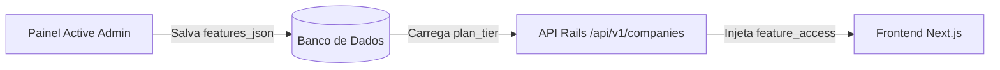

# ACTIVE ADMIN FEATURES MAP — Gestão Centralizada de Recursos

Este documento descreve como o painel administrativo **Active Admin** gerencia e distribui os recursos premium, comprovando a compatibilidade da nova visualização com a interface de controle do portal.

---

## 1. Configurações por Recursos no Active Admin

Os planos são cadastrados no painel administrativo e seus recursos/toggles são armazenados no campo `features_json` utilizando o catálogo central do `PlanFeatureCatalog`.

### 1.1 Configurações do Plano Pro (29 Recursos Ativos)
No painel do admin, o plano **Pro** possui 29 recursos mapeados e habilitados, incluindo:
- `verified_product`: Habilita o Selo de Empresa Verificada.
- `custom_ctas`: Habilita Botões de Orçamento customizados.
- `promo_banner`: Habilita o Banner Promocional da própria empresa.
- `faq_block`: Habilita o bloco de FAQ expansível.
- `media_gallery` & `media_upload`: Habilita galeria e upload autônomo com limite de 5 imagens.
- `financing_simulation`: Simulador de financiamento e bancos.
- `advanced_analytics`: Acesso ao painel avançado de visitas e origens.
- `sector_question_limit`: Limite de 10 perguntas setoriais respondidas.
- `show_alternatives`: Configurado como `false` para impedir a exibição de concorrentes em seu próprio perfil.

### 1.2 Configurações do Plano Essential (18 Recursos Ativos)
O plano **Essential** é configurado de forma otimizada para ser um degrau intermediário de conversão e prova social, sem dar acesso a inteligência ou CRM:
- Habilitados: `verified_product`, `highlight_badges`, `custom_ctas`, `social_proof`, `ideal_customer_block` e limite de 3 imagens por produto (`product_images_limit`).
- Desabilitados (para upsell): `promo_banner`, `pricing_table`, `special_offer`, `downloadable_materials`, `media_gallery`, `faq_block`, `advanced_analytics` e `financing_simulation`.

---

## 2. Garantia de Coexistência de Banners
O Active Admin gerencia o modelo global de `Banner` que permite injeção de anúncios corporativos em posições como `pricing_advertise_section` ou páginas de categoria.
- **Integração Visual:** O novo componente de banner respeitará os anúncios administrados globalmente. Se o perfil pertencer a uma empresa **Pro** ou **Enterprise**, os banners de concorrentes serão bloqueados via `show_competitor_banners = false`. Se for uma empresa **Free**, slots patrocinados normais serão injetados de forma limpa.
