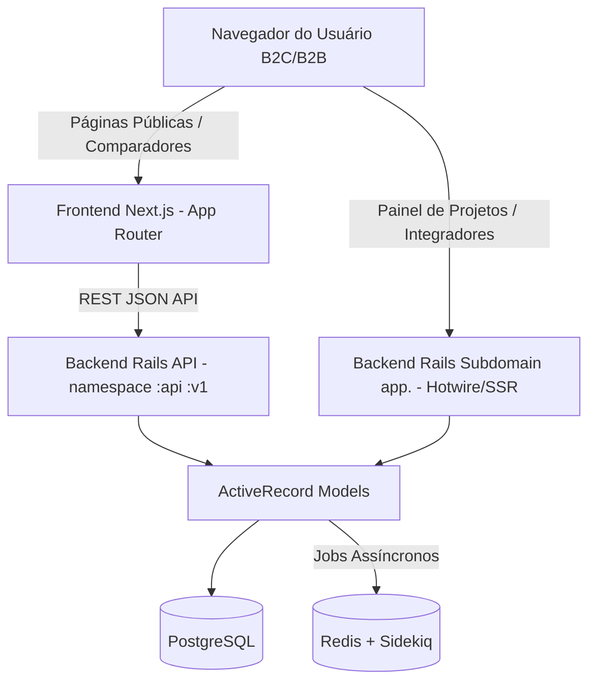

# Arquitetura do Sistema - Avalia Solar

Este documento descreve o padrão de design, as camadas de abstração, o fluxo de dados e os pontos de entrada do ecossistema **Avalia Solar**.

---

## 🏛️ Padrão Arquitetural Geral

O Avalia Solar adota uma arquitetura **híbrida desacoplada**:

Essa separação permite que o portal público (B2C) seja extremamente rápido, otimizado para SEO e renderizado de forma híbrida no Next.js (SSG/ISR), enquanto a plataforma interna de negócios B2B e orquestração de projetos seja altamente interativa, segura e renderizada diretamente pelo servidor no Rails usando Hotwire (Turbo e Stimulus).

---

## 💻 Camadas do Frontend Next.js (`AB0-1-front`)

O frontend Next.js é estruturado com base no **App Router**:

1.  **Roteamento e Páginas (`app/`):** Define a estrutura de caminhos da aplicação de forma declarativa. Cada pasta contendo um arquivo `page.tsx` vira uma rota pública.
    *   Exemplo de rota B2B/B2C: [app/companies/page.tsx](file:///c:/Users/Bobi/Desktop/AB0-1-main/AB0-1-front/app/companies/page.tsx) e [app/categories/page.tsx](file:///c:/Users/Bobi/Desktop/AB0-1-main/AB0-1-front/app/categories/page.tsx).
2.  **Componentes Compartilhados (`components/`):** Blocos reutilizáveis de interface UI (botões, cards, modais, etc.) estilizados com Tailwind CSS e Radix UI primitives.
3.  **Provedores e Contextos (`providers/`, `context/`):** Contextos globais do React para gerenciar estados cruzados (ex: autenticação, tema escuro/claro, carrinho de comparação).
4.  **Hooks Customizados (`hooks/`):** Encapsula lógica de consumo de dados com React Query (`@tanstack/react-query`) e interações client-side complexas.
5.  **Store (`store/`):** Estados de UI globais controlados de forma leve pelo `zustand`.

---

## ⚙️ Camadas do Backend Rails (`AB0-1-back`)

O backend Rails segue o clássico padrão **MVC** (Model-View-Controller) com adições modernas:

### 1. Controllers & Namespaces
*   **`Api::V1` (`app/controllers/api/v1/`):** Controladores puramente REST que respondem com payloads JSON para o Next.js.
*   **`App` (`app/controllers/app/`):** Controladores voltados para o subdomínio `app.avaliasolar.com.br`. Utilizam views do Rails com Turbo Frames e Stimulus controllers para interatividade instantânea (SPA-like) sem escrever muito Javascript customizado.
*   **`Admin` (`app/controllers/admin/`):** Controladores do ActiveAdmin para back-office e auditoria interna do ecossistema.

### 2. Camada de Dados & Negócio (Models & Active Record)
*   **Entidades Ricas (`app/models/`):** Encapsulam validações de integridade, associações complexas, escopos de busca e callbacks de lógica de negócio (ex: cálculo automático de pontuação de intenção de compra).
*   **FriendlyID:** Usado para gerar slugs elegantes (`/empresas/sol-forte` em vez de `/empresas/42`), melhorando o SEO do portal público Next.js.

### 3. Serializers (`app/serializers/`)
*   Usa `ActiveModel::Serializer` para modelar os payloads JSON entregues à API de forma performática e segura, evitando expor dados sensíveis ou colunas desnecessárias do banco.

### 4. Background Processing (Jobs)
*   **Sidekiq + Redis:** Filas de execução em segundo plano para tarefas pesadas ou não-bloqueantes.
    *   **Jobs típicos:** Sincronização de leads, disparo de e-mails/webhooks, processamento de imagens de banners e processamento em lote de auditorias.
    *   **Sidekiq-Scheduler:** Executa tarefas recorrentes cron-like (configuradas em [config/sidekiq_schedule.yml](file:///c:/Users/Bobi/Desktop/AB0-1-main/AB0-1-back/config/sidekiq_schedule.yml)).

---

## 🔄 Fluxo de Dados Críticos

### Fluxo de Geração e Atribuição de Leads (Lead Wizard)
1.  **Frontend:** O cliente acessa o assistente de leads na rota `/leads`. Preenche o formulário. O Next.js valida localmente via Zod e envia uma requisição `POST` para `/api/v1/leads/wizard_create`.
2.  **API Backend:** O `Api::V1::LeadsController` recebe o payload. Se o usuário precisa ser validado, o Rails gera um OTP (One-Time Password) e despacha via SMS/WhatsApp usando o Job de envio em lote.
3.  **Verificação:** O usuário digita o código no frontend Next.js, que envia a validação para o Rails (`POST /api/v1/leads/:id/verify_otp`).
4.  **Atribuição e Match:** Após verificado, a lógica de atribuição B2B avalia quais empresas/integradores de energia solar na região do lead são mais compatíveis. O lead é então disponibilizado no painel interno (`App::Painel::LeadsController`) das empresas selecionadas e notificações em tempo real são despachadas via ActionCable (`mount ActionCable.server => '/cable'`).
