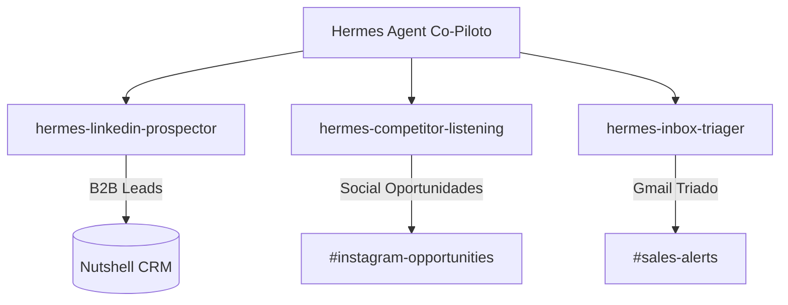

# 🤖 GSD Custom Growth Skills — Hermes Agent Edition

Este diretório contém a especificação de **GSD Custom Skills** inovadoras e integradas para o **Hermes Agent** no **Avalia Solar**. Adaptamos as automações mais promissoras da matriz de priorização estratégica e as transformamos em **workflows cognitivos executáveis**, seguindo exatamente a arquitetura e o padrão de alta fidelidade visual e estrutural do ecossistema GSD (Get-Shit-Done).

---

## 🛠️ Portfólio de Skills Criadas

Abaixo está o mapeamento das skills cognitivas criadas para capacitar o Hermes Agent como um operador autônomo de Growth e RevOps no Avalia Solar:

### 1. [hermes-linkedin-prospector](file:///c:/Users/Bobi/Desktop/AB0-1-main/.planning/skills/hermes-linkedin-prospector/SKILL.md)
- **Objetivo**: Prospecção B2B regional ativa no LinkedIn para donos de empresas solares.
- **Diferencial**: Enriquecimento de dados (CNPJ/Porte) em tempo real antes de formular o pitch customizado.

### 2. [hermes-competitor-listening](file:///c:/Users/Bobi/Desktop/AB0-1-main/.planning/skills/hermes-competitor-listening/SKILL.md)
- **Objetivo**: Social Listening autônomo e ético em canais de concorrentes.
- **Diferencial**: Identificação de gargalos de concorrentes para geração de abordagens consultivas de vendas.

### 3. [hermes-inbox-triager](file:///c:/Users/Bobi/Desktop/AB0-1-main/.planning/skills/hermes-inbox-triager/SKILL.md)
- **Objetivo**: Triagem e automação de respostas na caixa de entrada do Gmail comercial.
- **Diferencial**: Classificação semântica de e-mails em rascunhos automáticos, alertas P0 no Slack e sincronização de funil no CRM.

---

## 📈 Benefícios da Arquitetura de Skills GSD

1. **Repetibilidade**: Cada skill funciona como um script cognitivo fechado com entradas claras e saídas previsíveis.
2. **Segurança (LGPD)**: Limites e checagens de compliance estão embutidos no processo de execução de cada subagente.
3. **Revisão Humana Integrada**: Workflows críticos incluem gates de aprovação via Slack antes do envio final.
