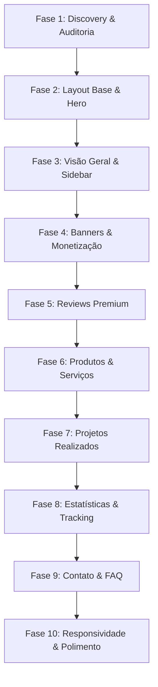

# ROADMAP — Refatoração Premium Leve do Perfil da Empresa

Nosso plano de refatoração é projetado em **10 fases incrementais** para mitigar riscos, isolar os componentes da interface e assegurar compatibilidade absoluta com o backend.

---

## Detalhamento das Fases

### **Fase 1: Discovery, Auditoria e Proteção do Backend**
- **Objetivo:** Mapear arquivos, rotas, dependências, serializers, permissões, entitlements e plano B2B. Garantir risco zero.
- **Entregas:** Pasta `.planning/` populada com os 17 relatórios técnicos de conformidade.

### **Fase 2: Layout Base, Shell e Hero Premium**
- **Objetivo:** Criar o novo invólucro visual (Shell) com Header responsivo, Breadcrumb estruturado, Hero dinâmico e o Card de Identidade da Empresa.
- **Entregas:** `CompanyProfileLayout`, `CompanyProfileShell`, `CompanyPremiumHero` e `CompanyProfileTabs`.

### **Fase 3: Visão Geral Premium e Sidebar**
- **Objetivo:** Reformular a aba principal para dar foco comercial, integrando diferenciais e o sidebar inteligente de conversão.
- **Entregas:** `OverviewTab`, `CompanyHighlightsGrid` e `SidebarPremium`.

### **Fase 4: Banners e Monetização**
- **Objetivo:** Implementar os slots de anúncios responsivos e dinâmicos controlados pelo Active Admin respeitando os planos.
- **Entregas:** Componente `AdSlot`, slots promocionais e fallbacks institucionais.

### **Fase 5: Reviews Premium (Aba Crítica)**
- **Objetivo:** Reformular o motor de avaliações, incluindo gráficos de barras por estrelas, filtros avançados e respostas administrativas.
- **Entregas:** `ReviewsTab`, `ReviewDistributionChart` e `ReviewCard`.

### **Fase 6: Produtos e Serviços**
- **Objetivo:** Criar catálogo dinâmico de produtos com filtros instantâneos, layouts em Grid/Lista e CTA de especialista.
- **Entregas:** `ProductsAndServicesTab`, `ProductFilters` e `ProductCard`.

### **Fase 7: Projetos Realizados**
- **Objetivo:** Apresentar prova social real através de uma galeria estruturada de projetos concluídos.
- **Entregas:** `ProjectsTab` e `ProjectCard`.

### **Fase 8: Estatísticas, Analytics e Tracking**
- **Objetivo:** Montar a visualização de estatísticas com teaser borrado de upgrade de plano e integrar tracking PostHog/GTM.
- **Entregas:** `StatisticsTab`, `ProAnalyticsPreview` e `EventTrackingService`.

### **Fase 9: Contato, FAQ e Formulário de Orçamento**
- **Objetivo:** Garantir a coleta de leads qualificados e centralizar respostas rápidas aos usuários.
- **Entregas:** `ContactTab`, `QuoteRequestForm` e `CompanyFAQBlock`.

### **Fase 10: Responsividade, QA, SEO e Polimento Final**
- **Objetivo:** Homologar acessibilidade, performance Lighthouse, compatibilidade e fallbacks em mobile.
- **Entregas:** Skeletons de carregamento, ajustes de performance e fechamento do marco.
