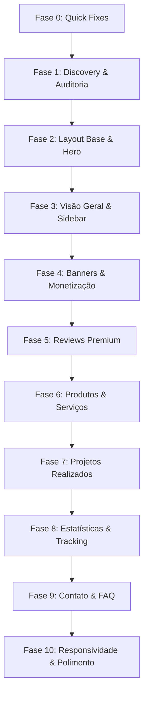

# ROADMAP — Refatoração Premium Leve do Perfil da Empresa

Nosso plano de refatoração é projetado em **10 fases incrementais** para mitigar riscos, isolar os componentes da interface e assegurar compatibilidade absoluta com o backend.

### Phase 0: Quick Fixes

**Goal:** Fix critical runtime errors and cookie domain issues.
**Requirements**: [FIX-01, FIX-02]
**Depends on:** None
**Plans:** 1 plan

Plans:
- [ ] 00-01-PLAN.md — Fix useCallback ReferenceError and Cookie Domain Rejection

### Phase 1: Implementar novos espacos de banners na pagina de empresa

**Goal:** [To be planned]
**Requirements**: TBD
**Depends on:** Phase 0
**Plans:** 0 plans

Plans:
- [ ] TBD (run /gsd-plan-phase 1 to break down)

### Phase 2: Implementar correções de segurança e integrações apontadas na auditoria (Feature Gating, Stripe e Analytics)

**Goal:** [To be planned]
**Requirements**: TBD
**Depends on:** Phase 1
**Plans:** 0 plans

Plans:
- [ ] TBD (run /gsd-plan-phase 2 to break down)

---

## Detalhamento das Fases

### **Fase 0: Quick Fixes**
- **Objetivo:** Corrigir erros críticos de execução (ReferenceError) e problemas de rejeição de cookies que afetam o analytics e a experiência do usuário.
- **Entregas:** Importação correta de hooks no ChatWidget e utilitário de cookies aprimorado.

### **Fase 1: Discovery, Auditoria e Proteção do Backend**
... (rest of the file)
