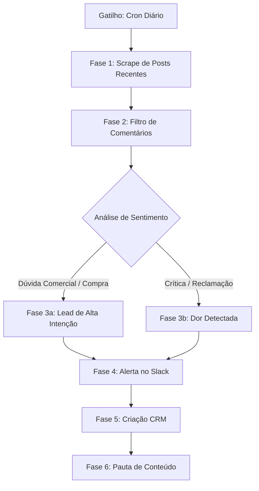

# Workflow: hermes-competitor-listening

Este workflow descreve o processo de varredura inteligente e detecção de oportunidades de negócio a partir do ecossistema de redes sociais de concorrentes diretos do Avalia Solar.

---

## 🗺️ Mapa de Execução Visual



---

## 🏗️ Detalhamento das Fases do Processo

### Fase 1: Coleta de Dados de Perfis Públicos
O Hermes Agent dispara um scraper de API seguro (ex: RapidAPI Instagram Scraper) para extrair os últimos posts e comentários do perfil indicado na flag `--competitor`.

1. **Limitação de Chamadas**: Para manter o fluxo seguro, o Hermes executa a varredura no máximo uma vez a cada 12 horas.
2. **Campos de Coleta**:
   - `post_url`, `conteúdo_post`, `data_postagem`.
   - `comentarios_array` (contendo `username`, `texto_comentario`, `data_comentario`).

---

### Fase 2: Análise e Classificação por LLM (Processamento Cognitivo)
Os comentários capturados são enviados em lote para o classificador semântico do Hermes (alimentado por GPT-4o-mini).

O classificador avalia cada comentário de acordo com três categorias cruciais:

```
[ Classificação de Comentários ] ───────────────────────┐
  ├── Alta Intenção Comercial: "Quanto custa o plano?"    ──► Lead B2B
  ├── Reclamação Operacional: "Suporte não responde!"    ──► Gatilho Dor
  └── Engajamento Comum: "Muito bom o post!"              ──► Ignorar
```

---

### Fase 3: Estruturação do Alerta e Ação Comercial

#### Cenário A: Lead de Alta Intenção Comercial
- **Definição**: Um integrador solar pergunta sobre como anunciar ou comparadores de preço no post do concorrente.
- **Ação do Hermes**:
  1. Cria o contato com @username no Nutshell CRM.
  2. Envia um alerta com link direto no Slack `#instagram-opportunities`:
     *"🔥 **Lead de Concorrente Capturado!** @username perguntou sobre preços no post do concorrente. Clique aqui para interagir com o lead."*

#### Cenário B: Reclamação Operacional de Integrador
- **Definição**: Um integrador ativo na plataforma concorrente reclama de taxas abusivas ou falta de suporte.
- **Ação do Hermes**:
  1. Cria oportunidade no pipeline comercial chamada: *"Conquista de Conta - Rival `[Nome]`"*.
  2. Formula uma sugestão de abordagem humana focada na dor detectada (ex: *"Olá, notamos que você está com dificuldades em suporte. No Avalia Solar, todos os membros Pro têm gerente de contas dedicado com SLA de 1 hora. Quer conhecer?"*).

---

### Fase 4: Inteligência de Conteúdo Comparativo (Geração de Pautas)
O Hermes Agent armazena todos os pontos de dor recorrentes dos concorrentes em um banco de dados analítico local. 

Toda sexta-feira, ele lê essa base e gera um relatório resumido no canal `#content-ideas` com temas para a equipe de marketing:
- *Tema sugerido*: *"Seu suporte comercial te deixa na mão no meio de um fechamento? Veja como o Avalia Solar Pro garante contato direto em minutos."*

---

## 🛡️ Diretrizes de Compliance e Ética
1. **Dados Públicos**: O Hermes Agent nunca acessa informações privadas dos perfis, apenas comentários expostos publicamente.
2. **Sem Interação Automática**: O Hermes nunca comenta diretamente nos posts do concorrente em nome do Avalia Solar (o que violaria os termos da Meta e geraria problemas de branding). A abordagem deve ser exclusivamente feita por DM privada por um SDR humano ou de forma assistida.
