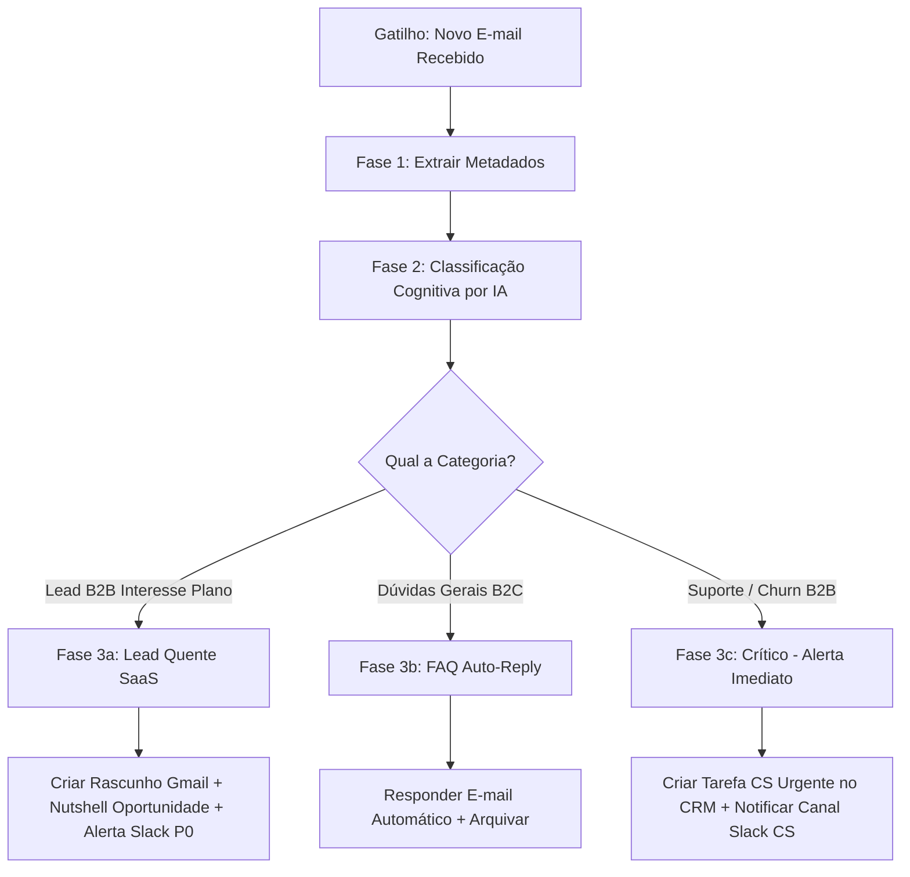

# Workflow: hermes-inbox-triager

Este workflow define as regras, lógica condicional e fluxos de integração do triador automático de e-mails comerciais (Gmail) com o Nutshell CRM e Slack.

---

## 🗺️ Mapa de Execução Visual

---

## 🏗️ Detalhamento das Fases do Processo

### Fase 1: Extração de Metadados e Contexto
O Hermes Agent lê os e-mails da caixa usando integração IMAP/API do Gmail.

1. **Metadados Coletados**:
   - `sender_email`, `sender_name`, `email_subject`, `email_body_clean`, `received_at`.
2. **Contexto de Relacionamento**:
   - O Hermes consulta a API do Nutshell CRM buscando se o `sender_email` já possui histórico de contato anterior, está no pipeline de vendas ou é um cliente ativo de algum plano SaaS.

---

### Fase 2: Classificação e Triagem Cognitiva (LLM)
O conteúdo do e-mail é analisado por um modelo de IA de alta performance para extrair a intenção real, categorizando em uma das classes abaixo:

| Categoria | Descrição / Exemplo | Nível de Autonomia | Ação no CRM |
| :--- | :--- | :--- | :--- |
| **SaaS B2B Lead** | Integrador demonstrando interesse no plano Pro ou Enterprise. | Semiautomático (Rascunho) | Abre Oportunidade |
| **FAQ B2C** | Consumidor perguntando como enviar review ou achar instalador. | 100% Automático (Envio) | Log de Interação |
| **Parceria / Mídia** | Agências propondo compra de espaço de banner publicitário. | Semiautomático (Rascunho) | Cria contato |
| **Crítico (Crítica/Cancelamento)** | Cliente Pro relatando bug ou querendo cancelar plano. | Apenas Alerta Humano | Cria Tarefa CS Urgente |
| **Spam / Ruído** | E-mails promocionais genéricos de terceiros. | 100% Automático | Arquivar/Lixeira |

---

### Fase 3: Execução Operacional de Ações

#### Fluxo 1: Lead B2B de Alta Receita (Plano Pro ou Enterprise)
1. **Geração do Rascunho**: O Hermes formula uma proposta de resposta com base no catálogo comercial `/pricing`, indicando o plano ideal e oferecendo o link de agendamento do SDR.
2. **Criação do Rascunho no Gmail**: O script salva a resposta como `DRAFT` na caixa do vendedor responsável.
3. **Nutshell**: Cria a oportunidade na etapa `2. Lead Qualificado`.
4. **Slack**: Envia alerta em `#sales-alerts`:
   *"📥 **Novo Lead B2B no Gmail!** `[Nome]` (`[Empresa]`) solicitou orçamento para o plano Enterprise. Rascunho de resposta gerado no Gmail e atribuído no CRM!"*

#### Fluxo 2: Resposta Automática a FAQ
1. **Geração**: O Hermes lê o FAQ corporativo e redige a resposta.
2. **Envio**: Dispara o e-mail diretamente ao remetente com a tag `[Suporte Automático - Avalia Solar]`.
3. **Arquivamento**: Marca o e-mail como lido e o remove da caixa de entrada principal.

#### Fluxo 3: Crítico (CS / Churn)
1. **Ação Rápida**: O Hermes Agent não dispara respostas robóticas automáticas.
2. **SLA Zero**: Cria imediatamente um Alerta Vermelho de alta prioridade no canal `#sales-alerts` marcando o gerente de contas com as informações e o texto do e-mail.
3. **Nutshell**: Abre uma tarefa de suporte atribuída ao tomador humano com SLA máximo de **30 minutos**.

---

## 🛡️ Controle de Qualidade e Segurança de Dados
- **Prevenção de Loops**: O Hermes Agent ignora e-mails enviados por endereços com domínios `no-reply@` ou de serviços automatizados de marketing para evitar loops infinitos de auto-replies.
- **Auditoria e Logs**: Toda ação de classificação e os rascunhos criados ficam documentados no histórico do contato no Nutshell CRM para total transparência.
