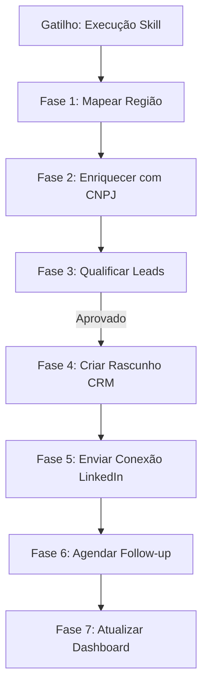

# Workflow: hermes-linkedin-prospector

Este workflow define as fases cognitivas e a lógica de execução para a prospecção ativa de decisores do mercado de energia solar no LinkedIn.

---

## 🗺️ Mapa de Execução Visual



---

## 🏗️ Detalhamento das Fases do Processo

### Fase 1: Mapeamento de Alvos e Scrape Inicial
O Hermes Agent conecta-se à API de scraping de LinkedIn (ou Sales Navigator) e executa a busca com base nos filtros da flag `--region`.

1. **Filtro de Busca**:
   - Palavras-chave de cargo: `Dono`, `Diretor Comercial`, `Sócio`, `Fundador`, `Ceo`.
   - Palavras-chave do setor: `Energia Solar`, `Instalação Solar`, `Solar Integrador`.
   - Região: `--region` (ex: `Estado de São Paulo, Brasil`).
2. **Dados Extraídos**:
   - `linkedin_id`, `nome_completo`, `cargo_atual`, `empresa_atual`, `link_perfil`, `cidade_estado`.

---

### Fase 2: Enriquecimento de Dados Cadastrais corporativos
Antes de qualquer abordagem, o Hermes Agent extrai o CNPJ da empresa de forma autônoma para garantir a qualidade do lead.

1. **Varredura Web**: O subagente pesquisa no Google e no portal do Avalia Solar pelo site da empresa (ex: `site:empresa.com.br`).
2. **Consulta de API CNPJ**:
   - Extrai o CNPJ visível no rodapé do site da empresa.
   - Consulta a API da Receita Federal (ou serviços similares de enriquecimento) para obter:
     - `capital_social`, `data_abertura`, `situacao_cadastral`, `natureza_juridica`.
3. **Mapeamento de Reputação**: O Hermes checa se a empresa já possui cadastro gratuito no Avalia Solar e qual é a nota média de reviews dela.

---

### Fase 3: Qualificação e Pontuação (Lead Scoring)
O Hermes Agent calcula um score cognitivo de fit comercial de 0 a 100 com base na seguinte tabela de pesos:

```
[ Pontuação de Lead Scoring ] ─────────────────────────┐
  ├── Empresa Ativa (Situação Cadastral)     ──► +20 pts
  ├── CNPJ com mais de 2 anos de fundação    ──► +15 pts
  ├── Cidade alvo da campanha comercial      ──► +15 pts
  ├── Perfil do tomador de decisão completo  ──► +15 pts
  ├── Sem cadastro no Avalia Solar           ──► +20 pts (Oportunidade Grátis)
  └── Avaliações baixas em rivais locais     ──► +15 pts (Gatilho de dor)
```

- **Score >= 70**: Qualificado como **Lead Quente**. Segue para prospecção imediata.
- **Score 40-69**: Qualificado como **Lead Morno**. Registra no CRM e aguarda nutrição por e-mail.
- **Score < 40**: Desqualificado. Arquiva para evitar spam.

---

### Fase 4: Sincronização e Criação no Nutshell CRM
Para cada lead quente identificado:
1. **Deduplicação**: O Hermes verifica pelo CNPJ se o integrador já existe no CRM.
2. **Criação**: Cria a Conta da Empresa e o Tomador de Decisão associado no Nutshell.
3. **Pipeline**: Insere o lead na etapa `1. Lead Capturado` com os metadados coletados e o Score atribuído.

---

### Fase 5: Geração de Abordagem Hiper-Personalizada e Envio
O Hermes Agent formula o pedido de conexão no LinkedIn. Ele adapta o pitch com base nas informações coletadas na Fase 2.

*Exemplo de Prompts de Geração de Mensagem (Claude 3.5 Sonnet)*:
> *"Crie uma mensagem de conexão de no máximo 300 caracteres para `[Nome]`, dono da `[Empresa]`. Mencione que você viu a excelente atuação deles em `[Cidade]` e que o Avalia Solar está lançando um destaque de visibilidade na região esta semana."*

- **Gate de Aprovação**:
  - Se `--auto` for desativado, o Hermes salva a mensagem de abordagem no CRM e alerta no Slack do SDR para revisão e envio manual rápido.
  - Se `--auto` for ativado, o Hermes envia o convite diretamente respeitando o limite seguro.

---

### Fase 6: Agendamento e Régua de Follow-up
Após o envio do convite, o Hermes agenda uma tarefa automática no CRM para verificar se a conexão foi aceita em 3 dias.
- **Se Aceito**: Dispara automaticamente a sequência de e-mails/DMs de nutrição predefinidas comercialmente.
- **Se Não Respondido em 7 dias**: Cancela o convite pendente para limpar a reputação da conta no LinkedIn.

---

## 🛡️ Gates de Segurança e Limites de Execução
- **Delay Humano**: O Hermes insere atrasos aleatórios entre 45 a 120 segundos entre cada ação no LinkedIn para simular comportamento humano real.
- **Opt-Out Legal (LGPD)**: Toda resposta enviada ao lead deve dar a opção de não receber novas abordagens comerciais do portal.
