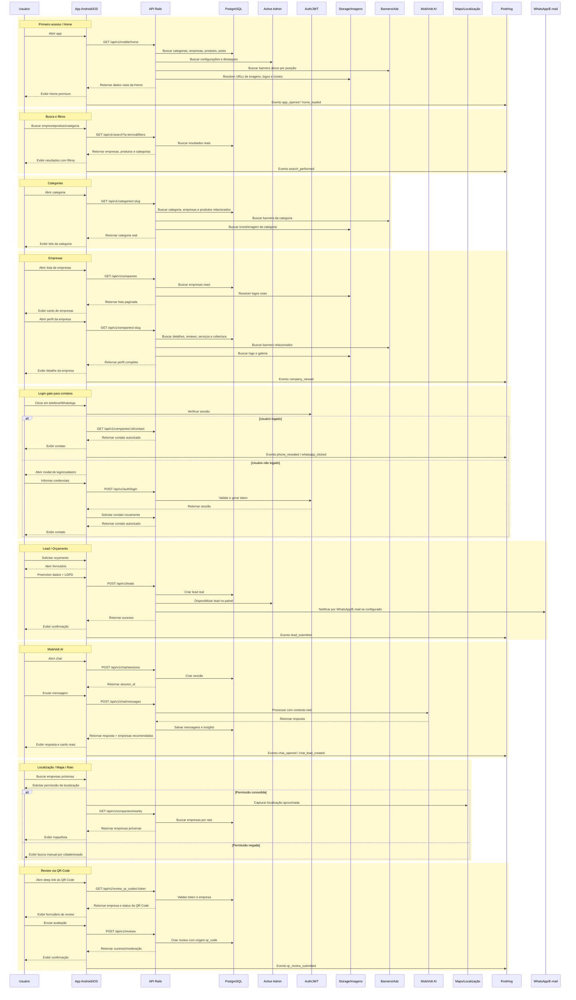

# Avalia Solar Mobile App - PRD, Blueprint de Produto, UX/UI, Design System, Arquitetura e Backlog

## 1. Visão Geral

O Avalia Solar Mobile App é o aplicativo oficial do Avalia Solar para Android e iOS, desenvolvido em Expo/React Native e conectado ao backend Rails/API existente.

O app não deve ser uma versão demonstrativa, mockada ou paralela ao web app. Ele deve consumir a mesma base real do Avalia Solar: empresas, produtos, categorias, reviews, banners, blog, leads, chats, imagens, logos, ícones, planos, usuários e regras de negócio.

O objetivo é transformar o app mobile em um marketplace confiável para descoberta, comparação, avaliação, orçamento e relacionamento entre consumidores e empresas de Energia Solar e Mobilidade Elétrica.

## 2. Objetivo Principal

Criar a melhor experiência mobile do Avalia Solar, com foco em:

- descoberta de empresas confiáveis;
- busca local por cidade, estado, raio e mapa;
- comparação de empresas e produtos;
- solicitação de orçamento;
- reviews reais;
- QR Code para facilitar avaliações;
- chat P2P entre cliente e empresa;
- MobiVolt AI como assistente de recomendação;
- calculadora de economia solar;
- scanner/OCR de conta de luz;
- dashboard mobile para empresas;
- consumo integral dos dados reais do backend.

## 3. Princípios Obrigatórios

### 3.1. Fonte da Verdade

A fonte da verdade é o backend Rails/API, PostgreSQL, Active Admin e storage de imagens. O app mobile não deve duplicar regras de negócio, dados comerciais ou entidades já existentes no web app.

### 3.2. Proibição de Mocks em Produção

Nenhuma tela final de produção pode exibir:

- empresas fake;
- produtos fake;
- reviews fake;
- categorias hardcoded;
- banners fake;
- logos fake;
- ícones temporários;
- imagens placeholder simulando dados reais;
- conversas fake;
- scanner simulando OCR real;
- preços fictícios;
- ratings fictícios;
- cidades hardcoded como se fossem dados reais.

Mocks só podem permanecer em testes, Storybook, fixtures ou ambiente de desenvolvimento claramente isolado.

### 3.3. Mobile Oficial

A estratégia oficial é Expo/React Native. PWA pode ser citado apenas como contexto histórico, mas o produto mobile oficial é o app nativo com Expo.

### 3.4. Integrações Obrigatórias

- Assets reais devem vir da API/storage.
- QR Codes de review devem ser validados pelo backend.
- MobiVolt AI deve ser sempre mediado pelo backend; o app nunca chama IA diretamente nem expõe API keys.
- Chat oficial deve usar `conversationsApi` e ActionCable.
- Auth, login gate, LGPD, permissões e regras de contato devem seguir o backend e o web app.

## 4. Personas

### 4.1. Consumidor Residencial

Pessoa física que quer instalar energia solar em casa, comparar empresas, entender economia e solicitar orçamento.

Necessidades:

- encontrar empresas confiáveis próximas;
- ver avaliações reais;
- comparar opções;
- calcular economia;
- enviar conta de luz;
- falar com empresa;
- deixar review após atendimento.

### 4.2. Consumidor Empresarial Pequeno

Comércio, condomínio, indústria pequena ou produtor rural que busca solução solar.

Necessidades:

- fornecedores por região;
- empresas verificadas;
- projetos semelhantes;
- orçamento rápido;
- contato com empresas;
- comparação técnica;
- reputação e confiança.

### 4.3. Empresa Instaladora ou Distribuidora

Empresa cadastrada no Avalia Solar que quer receber leads, responder clientes, gerar QR Code de avaliação, acompanhar métricas e melhorar reputação.

Necessidades:

- receber solicitações de orçamento;
- responder chats;
- visualizar leads;
- gerar QR Code para reviews;
- compartilhar link de avaliação;
- acompanhar reviews recebidos;
- ver métricas básicas;
- melhorar perfil público.

### 4.4. Administrador ou Moderador

Equipe Avalia Solar que gerencia empresas, banners, categorias, reviews, leads, planos e qualidade da plataforma.

Necessidades:

- visualizar dados reais;
- moderar reviews;
- acompanhar leads;
- acompanhar uso do QR Code;
- verificar banners ativos;
- monitorar eventos e erros;
- identificar empresas com maior demanda.

## 5. KPIs do Produto

### 5.1. Marketplace

- buscas realizadas;
- empresas visualizadas;
- produtos visualizados;
- cliques em orçamento;
- leads enviados;
- conversão busca para perfil;
- conversão perfil para lead;
- conversão perfil para WhatsApp;
- conversão MobiVolt AI para lead.

### 5.2. Reviews e QR Code

- QR Codes gerados por empresa;
- QR Codes escaneados por clientes;
- reviews iniciados via QR Code;
- reviews concluídos;
- taxa de abandono do formulário de review;
- média de nota por empresa;
- quantidade de reviews por empresa;
- tempo entre atendimento e review.

### 5.3. Chat

- conversas iniciadas;
- mensagens enviadas;
- tempo até primeira resposta da empresa;
- leads gerados por chat;
- taxa de resposta da empresa;
- conversas sem resposta.

### 5.4. Scanner/OCR e Calculadora

- contas de luz escaneadas;
- OCR concluído com sucesso;
- correções manuais feitas pelo usuário;
- simulações concluídas;
- conversão simulação para lead;
- erro de OCR.

### 5.5. Performance e Qualidade

- tempo de carregamento da Home;
- taxa de erro de API;
- crashes;
- sessões expiradas;
- falhas de imagem;
- falhas de envio de lead;
- falhas de chat;
- reconexão ActionCable.

## 6. Jornadas Principais

### 6.1. Buscar Empresa e Solicitar Orçamento

1. Usuário abre o app.
2. Home carrega dados reais.
3. Usuário busca por serviço, cidade, categoria ou empresa.
4. App exibe empresas reais.
5. Usuário aplica filtros.
6. Usuário abre perfil da empresa.
7. Usuário vê reviews, nota, localização, serviços, produtos e banners.
8. Usuário clica em "Solicitar orçamento".
9. App abre formulário curto.
10. Usuário informa dados e aceita LGPD.
11. App envia lead real para o backend.
12. Lead aparece no Active Admin/dashboard.
13. Evento é enviado ao PostHog.

### 6.2. Comparar Empresas

1. Usuário encontra empresas na busca.
- `[ ]` **Geolocalização**:
  - `[/]` Implementar `expo-location` para pegar coordenadas reais.
  - `[/]` Reverse geocoding para atualizar `selectedCity` e `selectedState` na Home.
- `[ ]` **Filtros Avançados**:
  - `[/]` Criar Modal/Bottom Sheet na Home para filtros.
  - `[/]` Adicionar opções (Verificados, Raio de Distância, etc).
  - `[/]` Ao aplicar, redirecionar para `/explore` com os parâmetros.
6. Comparação mostra nota média, número de reviews, cidade/estado, verificação, patrocínio, categorias, serviços, produtos, certificações, formas de pagamento, tecnologias e diferenciais.
7. Usuário escolhe uma ou mais empresas.
8. Usuário solicita orçamento.

### 6.3. Avaliar Empresa via QR Code

#### Fluxo do Cliente

1. Cliente recebe ou vê um QR Code da empresa.
2. Cliente escaneia o QR Code com a câmera do celular.
3. O QR Code abre deep link para o app instalado ou fallback web.
4. A tela abre com a empresa correta.
5. Cliente informa nota, comentário e dados mínimos.
6. Cliente envia review.
7. Backend registra empresa, origem `qr_code`, identificador do QR Code, campanha opcional, data/hora, dispositivo e usuário ou visitante identificado.
8. App mostra confirmação.
9. Empresa vê o review no dashboard.
10. Admin pode moderar se necessário.

#### Fluxo da Empresa

1. Empresa acessa dashboard mobile.
2. Clica em "Meu QR Code de avaliações".
3. App mostra QR Code exclusivo da empresa.
4. Empresa pode baixar imagem, compartilhar no WhatsApp, copiar link, imprimir, gerar QR Code por campanha/local/atendimento e ver métricas.
5. Cliente escaneia e deixa review.

#### Dados do QR Code

Cada QR Code deve conter ou resolver para:

- `company_id`;
- `company_slug`;
- `review_source = qr_code`;
- `qr_code_id`;
- `campaign_id` opcional;
- `location_id` opcional;
- `attendant_id` opcional;
- validade opcional;
- UTM/source;
- fallback web URL.

#### Tela Review via QR Code

Componentes:

- logo da empresa;
- nome da empresa;
- selo verificado, se houver;
- pergunta "Como foi sua experiência com esta empresa?";
- nota de 1 a 5 estrelas;
- campo de comentário;
- tags rápidas de atendimento, prazo, qualidade, preço, instalação e pós-venda;
- nome do avaliador;
- cidade/estado;
- consentimento LGPD;
- botão "Enviar avaliação".

Regras:

- não permitir review sem empresa vinculada;
- não usar empresa mockada;
- não aceitar QR Code inválido sem mensagem clara;
- QR Code expirado deve mostrar estado específico;
- review pode exigir moderação, conforme regra do backend;
- rastrear `review_started`, `review_submitted` e `qr_code_scanned`.

### 6.4. Empresa Acompanha Dashboard Mobile

1. Empresa faz login.
2. App identifica perfil como empresa.
3. Empresa acessa Dashboard.
4. Visualiza leads, chats, reviews, nota média, visualizações do perfil, cliques em WhatsApp, QR Codes escaneados, reviews via QR Code, banners ativos e plano atual.
5. Empresa responde mensagens.
6. Empresa acompanha status dos leads.
7. Empresa acessa QR Code de avaliações.
8. Empresa compartilha link/QR Code com clientes.

## 7. Estrutura de Navegação

### 7.1. Tabs Principais

- Home;
- Explorar;
- Calculadora;
- Mensagens;
- Perfil.

### 7.2. Telas Secundárias

- Splash;
- Onboarding;
- Login;
- Cadastro;
- Recuperar senha;
- Resultado de busca;
- Mapa;
- Categorias;
- Detalhe da categoria;
- Lista de empresas;
- Detalhe da empresa;
- Lista de produtos;
- Detalhe do produto;
- Comparação;
- Solicitar orçamento;
- Review via QR Code;
- Gerar QR Code de review;
- Scanner/OCR;
- Blog;
- Detalhe do post;
- Notificações;
- Favoritos;
- Dashboard da empresa;
- Leads da empresa;
- Conversas da empresa;
- Reviews da empresa;
- Métricas da empresa;
- Configurações.

## 8. UX/UI e Design System

### 8.1. Identidade Visual

Cores principais:

- Azul principal: `#208AEF`;
- Azul institucional escuro: `#0F172A`;
- Fundo claro: `#F8FAFC`;
- Branco: `#FFFFFF`;
- Texto principal: `#111827`;
- Texto secundário: `#64748B`;
- Borda: `#E2E8F0`;
- Sucesso: `#16A34A`;
- Alerta: `#F59E0B`;
- Erro: `#DC2626`;
- Destaque/Premium: `#FACC15`.

Regras visuais:

- interface clara, moderna e confiável;
- cards brancos com bordas suaves;
- sombra leve;
- botões primários em azul;
- badges pequenas e elegantes;
- ícones consistentes;
- layout seguro para notch/safe area;
- dark mode sem quebrar legibilidade.

### 8.2. Tipografia

- Título principal: 24-28px, bold;
- Título de seção: 18-20px, semibold;
- Texto de card: 14-16px;
- Texto auxiliar: 12-13px;
- Botões: 14-16px, semibold.

### 8.3. Componentes Globais

- `AppHeader`;
- `SearchBar`;
- `CategoryChip`;
- `FilterChip`;
- `CompanyCard`;
- `ProductCard`;
- `ReviewCard`;
- `BannerSlot`;
- `BlogCard`;
- `LeadForm`;
- `RatingStars`;
- `VerifiedBadge`;
- `SponsoredBadge`;
- `EmptyState`;
- `ErrorState`;
- `SkeletonLoader`;
- `BottomTabs`;
- `FloatingCTA`;
- `QRCodeCard`;
- `QRCodeScanner`;
- `QRReviewForm`;
- `DashboardMetricCard`;
- `ChatMessageBubble`.

### 8.4. Alvos de Toque

Todos os botões e áreas clicáveis devem ter no mínimo 44-48px de área de toque.

### 8.5. Estados Obrigatórios

Toda tela crítica deve possuir:

- loading;
- skeleton;
- empty state;
- error state;
- retry;
- offline;
- unauthorized;
- forbidden;
- not found;
- sessão expirada.

## 9. Requisitos Funcionais

### 9.1. Home

A Home deve consumir dados reais.

Componentes:

- header com logo;
- busca principal;
- categorias reais;
- banners reais;
- empresas em destaque;
- empresas verificadas;
- produtos em destaque;
- blog;
- CTA orçamento;
- CTA MobiVolt AI;
- CTA calculadora;
- CTA escanear conta de luz.

Endpoints sugeridos:

```txt
GET /api/v1/mobile/home
GET /api/v1/banners?placement=home
GET /api/v1/categories
GET /api/v1/companies?featured=true
GET /api/v1/products?featured=true
GET /api/v1/blog/posts
```

### 9.2. Busca e Filtros

Funcionalidades:

- busca por texto, empresa, produto, categoria, cidade e estado;
- filtro por raio e mapa;
- filtro por empresa verificada e patrocinada;
- filtro por avaliação, aplicação e categoria;
- ordenação;
- paginação;
- infinite scroll;
- pull to refresh.

### 9.3. Mapa e Raio

Funcionalidades:

- solicitar permissão de localização com explicação clara;
- detectar localização aproximada;
- buscar empresas próximas;
- alterar raio;
- alternar mapa/lista;
- fallback manual por cidade/estado.

Endpoint sugerido:

```txt
GET /api/v1/companies/nearby?lat=:lat&lng=:lng&radius=:radius
```

### 9.4. Empresas

Lista de empresas:

- logo real;
- nome;
- cidade/estado;
- nota média;
- total de reviews;
- selo verificado;
- badge patrocinado;
- categorias atendidas;
- CTA Ver perfil;
- CTA Solicitar orçamento;
- CTA Comparar.

Detalhe da empresa:

- capa real;
- logo real;
- nome;
- selo verificado;
- patrocinada/destaque;
- nota média;
- total de reviews;
- cidade/estado;
- sobre;
- serviços;
- categorias;
- área de cobertura;
- produtos vinculados;
- galeria;
- reviews;
- banners relacionados;
- empresas semelhantes;
- CTAs para orçamento, WhatsApp, telefone, mensagem, comparação, favorito e avaliação.

### 9.5. Reviews

Funcionalidades:

- listar reviews reais;
- exibir média;
- exibir quantidade;
- criar review;
- criar review via QR Code;
- identificar origem do review;
- permitir moderação pelo backend/admin;
- exibir estado vazio;
- bloquear spam;
- rastrear eventos.

Eventos:

```txt
review_started
review_submitted
review_failed
qr_code_scanned
qr_review_started
qr_review_submitted
```

### 9.6. QR Code para Reviews

Funcionalidades para empresa:

- gerar QR Code único;
- visualizar QR Code;
- compartilhar QR Code;
- baixar QR Code;
- copiar link de avaliação;
- gerar QR Code por campanha;
- acompanhar métricas;
- ver reviews gerados via QR Code.

Funcionalidades para cliente:

- abrir avaliação por deep link;
- avaliar empresa correta;
- enviar review;
- receber confirmação.

Deep links oficiais:

```txt
avaliasolar://review/company/:companySlug?source=qr_code&token=:token
https://www.avaliasolar.com.br/review/:token
```

Regras:

- QR Code precisa resolver no backend;
- token deve ser validado;
- QR inválido deve mostrar tela amigável;
- QR expirado deve mostrar tela específica;
- sem app instalado deve abrir fallback web;
- o review deve carregar empresa real;
- não permitir review em empresa inexistente.

### 9.7. Produtos

Funcionalidades:

- listar produtos reais;
- buscar por nome, marca e modelo;
- filtrar por categoria;
- filtrar por marca/fornecedor;
- filtrar por preço;
- filtros técnicos avançados recolhidos;
- detalhe do produto;
- produtos relacionados;
- empresas que trabalham com o produto.

Card de produto:

- imagem real;
- marca;
- nome;
- categoria;
- aplicação;
- preço ou "Consultar preço";
- badge;
- avaliação, se existir;
- CTA Ver detalhes;
- CTA Solicitar orçamento.

### 9.8. Leads e Orçamento

Fluxo:

1. Usuário clica em Solicitar orçamento.
2. App abre formulário.
3. Usuário informa nome, WhatsApp, e-mail, cidade, estado, tipo de projeto, empresa/produto/categoria de interesse, mensagem e consentimento LGPD.
4. App envia para API.
5. Backend cria lead.
6. Lead aparece no Active Admin/dashboard.
7. App mostra confirmação.

Endpoint:

```txt
POST /api/v1/leads
```

Origem:

```txt
source = mobile_app
source_detail = company_profile | product_detail | chat | calculator | qr_code | search
```

### 9.9. Chat P2P

O chat oficial deve ser o fluxo real com conversas e ActionCable.

Regras:

- unificar `/chat` e `/p2p_chat`;
- remover chat mockado;
- usar `conversationsApi`;
- usar ActionCable para mensagens em tempo real;
- reconectar após perda de rede;
- exibir status de envio;
- exibir mensagens lidas, se backend suportar;
- permitir empresa responder pelo dashboard mobile.

Funcionalidades:

- criar conversa;
- listar conversas;
- abrir conversa;
- enviar mensagem;
- receber mensagem em tempo real;
- enviar lead vinculado;
- notificar usuário.

### 9.10. MobiVolt AI

O MobiVolt AI deve passar sempre pelo backend.

Regras:

- app não chama IA diretamente;
- app não expõe API key;
- cards de recomendação devem usar empresas reais;
- respostas devem respeitar contexto real;
- lead vindo do chat deve preservar origem.

Funcionalidades:

- abrir sessão;
- enviar mensagem;
- receber resposta;
- exibir empresas recomendadas;
- botão Ver perfil;
- botão Solicitar orçamento;
- botão WhatsApp;
- botão Comparar.

### 9.11. Calculadora Solar

Funcionalidades:

- inserir consumo mensal;
- inserir valor da conta;
- selecionar estado/cidade;
- estimar economia;
- estimar payback;
- gerar CTA de orçamento;
- usar parâmetros configuráveis pelo backend;
- permitir preencher dados via OCR da conta de luz.

Dados importantes:

- consumo kWh;
- valor médio;
- tarifa;
- estado;
- tipo de projeto;
- perfil de consumo.

### 9.12. Scanner/OCR de Conta de Luz

A experiência atual pode ser mantida visualmente, mas a simulação precisa virar integração real.

Fluxo:

1. Usuário abre Scanner.
2. App explica finalidade.
3. Usuário tira foto ou envia PDF/imagem.
4. App faz upload.
5. Backend ou serviço OCR processa.
6. OCR retorna consumo kWh, valor da conta, distribuidora, unidade consumidora quando seguro e mês de referência.
7. Usuário revisa e corrige.
8. App preenche calculadora.
9. Usuário solicita orçamento.

Regras:

- não simular OCR como se fosse real;
- sempre permitir correção manual;
- não salvar dados sensíveis sem necessidade;
- aplicar LGPD.

Endpoints sugeridos:

```txt
POST /api/v1/utility_bill_scans
GET /api/v1/utility_bill_scans/:id
```

### 9.13. Blog

Funcionalidades:

- listar posts reais;
- detalhe do post;
- posts relacionados;
- posts por categoria;
- imagem real;
- autor;
- data;
- conteúdo.

### 9.14. Favoritos

Funcionalidades:

- favoritar empresa;
- favoritar produto;
- listar favoritos;
- remover favorito;
- exigir login;
- persistir no backend.

### 9.15. Dashboard da Empresa

MVP do dashboard:

- Visão geral;
- Leads;
- Conversas;
- Reviews;
- QR Code de avaliações;
- Métricas;
- Perfil da empresa;
- Plano atual.

Métricas:

- leads recebidos;
- leads novos;
- leads respondidos;
- conversas abertas;
- mensagens pendentes;
- reviews recebidos;
- média de avaliação;
- QR Codes escaneados;
- reviews via QR Code;
- visualizações do perfil;
- cliques em WhatsApp;
- cliques em telefone;
- cliques em site.

Ações:

- responder chat;
- alterar status do lead;
- visualizar dados do lead;
- compartilhar QR Code;
- copiar link de avaliação;
- ver reviews;
- solicitar atualização do perfil;
- acessar plano.

### 9.16. Admin/Operação

O admin principal continua no web/Active Admin, mas o app pode consumir dados operacionais quando o usuário for administrador.

Funcionalidades futuras:

- ver leads;
- ver reviews pendentes;
- ver empresas;
- aprovar/moderar reviews;
- verificar banners ativos;
- acompanhar erros;
- acompanhar eventos.

Não é prioridade do MVP consumidor.

## 10. Assets Reais, Banners, Ícones e Imagens

Esta seção é normativa. O app Android/iOS não pode parecer uma versão demonstrativa.

### 10.1. Devem Vir da API, Backend ou Storage

- banners;
- logos de empresas;
- capas de empresas;
- imagens de produtos;
- imagens do blog;
- ícones de categorias;
- avatar do MobiVolt AI;
- selos;
- badges;
- imagens de cards;
- ilustrações oficiais.

### 10.2. Banners Reais

Procurar e remover qualquer banner fixo, fake ou hardcoded usado no app.

Padrões de busca:

- `mockBanners`;
- `bannersMock`;
- `fakeBanners`;
- `demoBanners`;
- `sampleBanners`;
- `hardcoded banners`;
- `banner placeholder`;
- imagens locais usadas como banner real;
- arrays fixos de banners;
- banners definidos diretamente em componentes.

Regras:

- nenhum banner exibido ao usuário pode ser fake;
- banners devem vir do backend/Active Admin;
- respeitar posição, página, status ativo/inativo, datas de início/fim, plano, segmentação e prioridade, se existirem;
- se não houver banner ativo, esconder o slot ou exibir estado neutro sem quebrar layout;
- não usar banner genérico inventado para preencher tela.

Posições de banner a considerar:

- Home;
- Categorias;
- Empresas;
- Detalhe da empresa;
- Produtos;
- Detalhe do produto;
- Blog;
- Cidades;
- Estados;
- Busca;
- Chat/MobiVolt AI, se existir posição comercial;
- Comparação, se existir posição comercial.

Tipos:

- hero;
- horizontal;
- carrossel;
- quadrado;
- patrocinado;
- sidebar/ad slot;
- regional;
- por categoria;
- por cidade/estado;
- empresa patrocinada;
- produto patrocinado.

### 10.3. Ícones Reais e Padronizados

Remover ícones temporários, genéricos, inconsistentes ou hardcoded quando representarem categorias, serviços, produtos ou funcionalidades que já possuem padrão visual no web app.

Padrões de busca:

- `mockIcons`;
- `categoryIcons` hardcoded;
- fake icons;
- emoji icons;
- ícones aleatórios por categoria;
- imagens locais provisórias;
- placeholders;
- URLs fixas dentro dos componentes.

Regras:

- ícones de categorias devem vir do backend, se já houver campo de imagem/ícone;
- se o web app já possui ícones oficiais, reutilizar o mesmo padrão no app;
- se o backend ainda não entregar ícones, criar contrato mínimo com `icon_url`, `icon_name`, `icon_alt`, `active` e `category_id`;
- não usar emoji como ícone final;
- não misturar estilos diferentes de ícones;
- ícones devem funcionar em tema claro e escuro;
- ícones devem ter tamanho consistente.

Tamanhos sugeridos:

- categorias na Home: 40x40;
- chips/filtros: 20x20 ou 24x24;
- cards: 28x28 ou 32x32;
- navegação inferior: 22x22 a 26x26;
- serviços: 36x36;
- empresas/produtos: usar logo ou imagem real, não ícone genérico.

### 10.4. Logos de Empresas

Todos os logos de empresas devem vir do backend.

Campos esperados:

- `logo_url`;
- `name`;
- `verified`;
- `sponsored`;
- `rating`;
- `city`;
- `state`.

Regras:

- não usar logo fake;
- não usar iniciais fixas como substituto principal quando houver logo real;
- se empresa não tiver logo, usar fallback visual neutro e padronizado;
- fallback deve mostrar inicial/nome da empresa de forma limpa, sem parecer empresa fictícia;
- respeitar imagem enviada no cadastro/admin;
- usar cache e lazy loading;
- tratar erro de imagem quebrada.

### 10.5. Imagens de Produtos

Todos os produtos devem usar imagens reais vindas da API/backend.

Campos esperados:

- `image_url`;
- `gallery_urls`;
- `brand`;
- `supplier`;
- `name`;
- `category`;
- `price`;
- `technical_specs`.

Regras:

- remover imagens locais falsas de inversores, placas, baterias e produtos;
- não usar produto genérico se o produto possui imagem cadastrada;
- se produto não tiver imagem, usar fallback neutro "Imagem indisponível";
- não exibir imagem de outro produto como se fosse real;
- não usar preço, marca ou imagem fictícia.

### 10.6. Imagens do Blog

Posts do blog devem usar imagem real do backend/CMS/admin.

Campos esperados:

- `title`;
- `slug`;
- `cover_image_url`;
- `excerpt`;
- `author`;
- `published_at`;
- `category`.

Regras:

- remover imagens fake de posts;
- não usar thumbnail genérica hardcoded;
- se não houver imagem, usar card textual com fallback elegante;
- manter título, resumo, autor, data e categoria reais.

### 10.7. Assets do MobiVolt AI

Regras:

- usar o avatar oficial do MobiVolt AI, se existir no projeto;
- se o avatar estiver no web app, reutilizar no mobile;
- se backend/admin entregar assets do assistente, consumir da API;
- não usar robô genérico de biblioteca como versão final;
- não usar avatar diferente do padrão da marca;
- cards de empresas recomendadas pelo chat devem usar logos reais, notas reais e dados reais.

### 10.8. Categorias Visuais

As categorias do app devem usar:

- nome real;
- slug real;
- ícone real;
- imagem real, se existir;
- ordem real definida no admin;
- status ativo/inativo real;
- vertical real: Energia Solar ou Mobilidade Elétrica.

Não hardcodar categorias como Energia Solar, Mobilidade Elétrica, Inversores, Baterias, Carregadores ou Off-grid. Elas só podem aparecer se vierem do backend ou de constante oficial compartilhada/documentada.

### 10.9. Fallbacks Permitidos e Proibidos

Fallbacks permitidos:

- empresa sem logo: card com inicial da empresa e fundo neutro;
- produto sem imagem: bloco "Imagem indisponível";
- banner ausente: ocultar slot;
- categoria sem ícone: ícone neutro padronizado da biblioteca oficial, não emoji;
- blog sem imagem: card textual com fundo suave.

Fallbacks proibidos:

- empresa fake;
- produto fake;
- banner fake;
- imagem baixada aleatoriamente;
- placeholder com lorem ipsum em produção;
- imagem de outra marca/produto;
- ícone emoji em tela final.

### 10.10. Auditoria de Assets

Antes de implementar, gerar auditoria com:

- lista de banners mockados encontrados;
- lista de ícones hardcoded;
- lista de imagens locais usadas como dado real;
- lista de logos fake;
- lista de thumbnails fake;
- lista de produtos com imagens mockadas;
- lista de categorias com ícones mockados;
- lista de telas afetadas.

Depois da implementação, entregar:

- quais mocks foram removidos;
- quais banners agora vêm da API;
- quais ícones agora vêm da API;
- quais imagens/logos agora vêm da API;
- quais fallbacks foram criados;
- quais endpoints foram usados;
- quais endpoints ainda precisam ser criados no backend.

## 11. Interfaces e Contratos de API

### 11.1. Endpoints Mínimos Sugeridos

```txt
GET /api/v1/mobile/home
GET /api/v1/banners?placement=...
GET /api/v1/banners?placement=category&category_id=:id
GET /api/v1/categories
GET /api/v1/categories/:id
GET /api/v1/categories/:slug
GET /api/v1/companies
GET /api/v1/companies/:id
GET /api/v1/companies/:slug
GET /api/v1/companies/nearby?lat=:lat&lng=:lng&radius=:radius
GET /api/v1/companies/:id/contact
GET /api/v1/products
GET /api/v1/products/:id
GET /api/v1/products/:slug
GET /api/v1/blog/posts
GET /api/v1/mobile/assets
POST /api/v1/leads
GET /api/v1/reviews?company_id=:id
POST /api/v1/reviews
GET /api/v1/companies/:id/review_qr_code
POST /api/v1/companies/:id/review_qr_codes
GET /api/v1/review_qr_codes/:token
GET /api/v1/company_dashboard/reviews
GET /api/v1/company_dashboard/review_qr_codes
GET /api/v1/conversations
POST /api/v1/conversations
GET /api/v1/conversations/:id/direct_messages
POST /api/v1/conversations/:id/direct_messages
POST /api/v1/chat/sessions
POST /api/v1/chat/messages
GET /api/v1/compare?ids[]=...
POST /api/v1/favorites
GET /api/v1/me
POST /api/v1/utility_bill_scans
GET /api/v1/utility_bill_scans/:id
```

### 11.2. Deep Links Oficiais

```txt
avaliasolar://company/:companySlug
avaliasolar://product/:productSlug
avaliasolar://category/:categorySlug
avaliasolar://review/company/:companySlug?source=qr_code&token=:token
avaliasolar://chat/:conversationId
avaliasolar://lead/:leadId
avaliasolar://blog/:postSlug
https://www.avaliasolar.com.br/review/:token
```

## 12. Arquitetura Mobile

### 12.1. Stack

- Expo;
- React Native;
- Expo Router;
- TypeScript;
- React Query/TanStack Query;
- SecureStore;
- ActionCable;
- PostHog;
- REST API;
- GraphQL/Apollo apenas se já estiver consolidado;
- Expo Image;
- Expo Camera;
- Expo Notifications;
- Expo Linking;
- Expo Location.

### 12.2. Estrutura Sugerida

```txt
src/
  app/
  components/
  features/
    home/
    search/
    companies/
    products/
    categories/
    reviews/
    reviewQrCode/
    leads/
    chat/
    calculator/
    scanner/
    dashboard/
    profile/
    blog/
  services/
    api/
    auth/
    analytics/
    storage/
    realtime/
    deepLinks/
  design-system/
    tokens/
    components/
  hooks/
  stores/
  types/
  utils/
```

### 12.3. Services Obrigatórios

```txt
api/client.ts
api/home.ts
api/companies.ts
api/products.ts
api/categories.ts
api/reviews.ts
api/reviewQrCodes.ts
api/leads.ts
api/chat.ts
api/conversations.ts
api/banners.ts
api/blog.ts
api/auth.ts
api/dashboard.ts
api/calculator.ts
api/scanner.ts
analytics/posthog.ts
realtime/actionCable.ts
deepLinks/linking.ts
```

## 13. Segurança e LGPD

Requisitos:

- não expor secrets;
- não expor API key de IA;
- não salvar senha;
- token em SecureStore;
- consentimento LGPD em leads e reviews;
- cuidado com dados de conta de luz;
- não logar dados sensíveis;
- login gate para contatos;
- sessão expirada tratada;
- rate limit no backend;
- validação de inputs;
- QR Code com token seguro;
- QR Code não deve permitir manipular `company_id` livremente sem validação.

## 14. Analytics

Eventos obrigatórios:

```txt
app_opened
home_loaded
search_performed
category_opened
company_viewed
product_viewed
quote_requested
lead_submitted
whatsapp_clicked
phone_revealed
favorite_added
compare_added
chat_opened
message_sent
chat_lead_created
calculator_started
calculator_completed
scanner_started
scanner_completed
scanner_failed
qr_code_scanned
qr_review_started
qr_review_submitted
company_dashboard_opened
company_qr_shared
banner_clicked
api_error
```

## 15. Backlog Priorizado

### P0 - Fundação de Produção

#### Task P0.1 - Auditoria Total de Mocks

Descrição: mapear todos os mocks, fallbacks falsos, hardcoded data e assets fake.

Critérios de aceite:

- listar arquivos com mocks;
- listar telas impactadas;
- separar mocks permitidos em testes;
- remover mocks de telas finais;
- build não pode exibir empresa, produto, review ou banner fake.

#### Task P0.2 - Camada Única de API

Descrição: criar camada única para consumir backend real.

Critérios de aceite:

- `EXPO_PUBLIC_API_URL` ou variável equivalente documentada;
- timeout configurado;
- tratamento de erro padronizado;
- tipagem das respostas;
- interceptação de auth;
- nenhuma URL hardcoded em componentes.

#### Task P0.3 - Autenticação Real

Descrição: implementar login, cadastro, logout, sessão persistente e recuperação do usuário.

Critérios de aceite:

- token seguro em SecureStore;
- sessão expirada tratada;
- login gate funcionando;
- usuário fake removido.

#### Task P0.4 - Home Real

Descrição: conectar Home ao backend.

Critérios de aceite:

- categorias reais;
- banners reais;
- empresas reais;
- produtos reais;
- blog real;
- skeleton;
- empty;
- error;
- retry.

#### Task P0.5 - Busca e Marketplace Core

Descrição: finalizar busca real por texto, categoria, cidade, estado, raio e filtros.

Critérios de aceite:

- resultados reais;
- paginação;
- mapa/lista;
- filtros funcionais;
- sem mocks.

#### Task P0.6 - Perfil da Empresa Real

Descrição: completar tela de detalhe da empresa.

Critérios de aceite:

- logo real;
- capa real;
- reviews reais;
- serviços reais;
- CTAs;
- login gate;
- orçamento;
- chat;
- comparação;
- favorito.

#### Task P0.7 - Leads Reais

Descrição: conectar formulário de orçamento ao backend.

Critérios de aceite:

- lead criado no backend;
- origem `mobile_app`;
- consentimento LGPD;
- confirmação;
- evento PostHog.

### P1 - Confiança, Reviews e Relacionamento

#### Task P1.1 - QR Code para Reviews

Descrição: implementar fluxo completo de review via QR Code.

Critérios de aceite:

- empresa gera QR Code;
- cliente escaneia;
- deep link abre empresa correta;
- review é criado com origem `qr_code`;
- dashboard mostra métricas;
- fallback web funciona.

#### Task P1.2 - Chat P2P Oficial

Descrição: unificar chat mockado e chat real.

Critérios de aceite:

- remover `/chat` mockado;
- usar `conversationsApi`;
- ActionCable funcionando;
- mensagens em tempo real;
- empresa responde pelo dashboard.

#### Task P1.3 - Reviews Reais

Descrição: criar e listar reviews reais.

Critérios de aceite:

- nota média atualizada;
- review enviado;
- origem rastreada;
- moderação respeitada;
- estado vazio.

#### Task P1.4 - Notificações

Descrição: implementar notificações para mensagens, leads e reviews.

Critérios de aceite:

- push notification;
- permissão clara;
- deep link para tela correta;
- opt-out.

### P2 - Scanner, Calculadora e Dashboard Empresa

#### Task P2.1 - Scanner/OCR Real

Descrição: substituir simulação por OCR real.

Critérios de aceite:

- captura/upload;
- processamento;
- retorno de kWh/valor;
- revisão manual;
- preencher calculadora;
- tratar falha.

#### Task P2.2 - Calculadora Melhorada

Descrição: tornar calculadora mais confiável e integrada.

Critérios de aceite:

- parâmetros configuráveis;
- resultado claro;
- CTA orçamento;
- evento analytics;
- integração com OCR.

#### Task P2.3 - Dashboard da Empresa MVP

Descrição: criar área mobile da empresa.

Critérios de aceite:

- visão geral;
- leads;
- chats;
- reviews;
- QR Code;
- métricas básicas;
- plano atual.

### P3 - Escala e Monetização

#### Task P3.1 - Planos no Mobile

Descrição: exibir plano atual, benefícios e upgrade.

#### Task P3.2 - Banners Patrocinados Mobile

Descrição: renderizar anúncios e banners segmentados no app.

#### Task P3.3 - Ranking e Reputação

Descrição: melhorar ranking de empresas por reviews, verificação, resposta e qualidade.

## 16. Test Plan

### 16.1. Testes Manuais Obrigatórios

- abrir app;
- carregar Home;
- buscar empresa;
- filtrar por cidade;
- abrir mapa;
- abrir empresa;
- solicitar orçamento;
- fazer login;
- fazer logout;
- ver contato com login gate;
- enviar review;
- escanear QR Code;
- criar review via QR;
- abrir chat;
- enviar mensagem;
- receber mensagem;
- abrir dashboard empresa;
- gerar QR Code;
- compartilhar QR Code;
- abrir calculadora;
- usar scanner;
- testar offline;
- testar sessão expirada.

### 16.2. Testes Técnicos

- lint;
- typecheck;
- testes unitários;
- smoke tests das rotas;
- contratos de API;
- ActionCable;
- deep links;
- push notification;
- build Android;
- build iOS, quando aplicável.

## 17. Critérios de Aceite Final

A entrega só será aceita quando:

1. O app não exibir mocks em telas finais.
2. Home consumir dados reais.
3. Busca consumir dados reais.
4. Empresas consumirem dados reais.
5. Produtos consumirem dados reais.
6. Banners, logos, ícones e imagens vierem da API/storage.
7. Login real funcionar.
8. Contatos respeitarem login gate.
9. Lead for criado no backend.
10. Reviews reais funcionarem.
11. QR Code de review funcionar.
12. Deep link abrir a tela correta.
13. Chat oficial usar dados reais e ActionCable.
14. Scanner não simular OCR como real.
15. Dashboard da empresa exibir dados reais.
16. Analytics rastrear eventos principais.
17. App estiver em PT-BR.
18. Layout estiver premium e mobile-first.
19. Build Android passar.
20. Código estiver organizado e tipado.

## 18. Alterações Adicionais Recomendadas

### 18.1. Deep Links como Infraestrutura Central

Deep links devem suportar empresa, produto, categoria, review via QR Code, chat, lead, blog, campanha e banner.

### 18.2. Modo Empresa e Modo Consumidor

O app deve identificar o tipo de usuário: consumidor, empresa ou admin. A navegação deve mudar conforme o perfil.

### 18.3. Inbox Unificada

Criar central de mensagens/notificações para mensagens de chat, status de lead, respostas de empresa, reviews recebidos e alertas do sistema.

### 18.4. Score de Confiança

Criar indicador visual no perfil da empresa com verificação, número de reviews, tempo de resposta, completude do perfil, presença de projetos e nota média.

### 18.5. Pós-lead

Após enviar orçamento, o usuário deve acompanhar empresas contatadas, status, mensagens, próximos passos e opção de avaliar atendimento.

### 18.6. Campanhas de Review

Empresas devem poder gerar QR Codes diferentes para loja física, técnico, evento, instalação, pós-venda e campanha promocional.

### 18.7. Anti-fraude de Reviews

Adicionar rate limit, validação de token, detecção de múltiplos reviews iguais, moderação, flag de review suspeito e origem identificada.

### 18.8. Offline Limitado

Permitir visualizar últimos dados carregados, salvar rascunho de review, salvar rascunho de lead e reenviar automaticamente quando a internet voltar.

### 18.9. Central de Qualidade de Dados

Criar auditoria para empresa sem logo, empresa sem cidade, empresa sem categoria, produto sem imagem, banner quebrado, review sem vínculo e categoria sem ícone.

### 18.10. Admin de Assets

Garantir que banners, ícones, logos e imagens estejam bem modelados no backend para o mobile consumir sem soluções manuais.

## 19. Fluxos Sistêmicos e Integrações

### 19.1. Home e Primeiro Acesso

O app abre, busca `GET /api/v1/mobile/home`, recebe categorias, empresas, produtos, posts, flags e banners ativos, resolve URLs de imagens/storage, renderiza Home real e envia `app_opened` e `home_loaded`.

### 19.2. Busca, Categorias e Marketplace

Busca geral deve consultar dados reais por texto e filtros. Categorias devem carregar por slug/id, respeitando status, ordem, ícone, imagem, vertical e banners definidos no admin.

### 19.3. Empresas, Contatos e Leads

Listas e perfis de empresas devem carregar dados reais, logos e galerias do storage. Contatos sensíveis devem respeitar login gate. Solicitações de orçamento criam leads reais, com origem `mobile_app`, e notificam admin/dashboard/canais configurados.

### 19.4. Produtos e Blog

Produtos e posts devem ser carregados do backend/CMS/admin, com imagem real ou fallback permitido. Nenhum produto, preço, marca ou thumbnail fake pode aparecer como conteúdo final.

### 19.5. Chat, MobiVolt AI e Comparação

Chat P2P usa conversas reais e ActionCable. MobiVolt AI usa sessões e mensagens no backend. Comparação busca dados reais pelo backend e não deve comparar objetos mockados.

### 19.6. Localização, Favoritos e Perfil

Localização deve pedir permissão com contexto claro e cair para busca manual se negada. Favoritos exigem login e persistem no backend. Perfil deve buscar usuário real, favoritos e orçamentos.

## 20. Resultado Esperado

O Avalia Solar Mobile App deve sair do estágio de protótipo mockado e se tornar o aplicativo oficial do ecossistema Avalia Solar.

A primeira versão deve entregar com qualidade:

- marketplace real;
- busca real;
- empresas reais;
- produtos reais;
- reviews reais;
- leads reais;
- chat real;
- QR Code de review;
- dashboard básico para empresas;
- assets reais;
- analytics;
- design premium;
- performance mobile;
- segurança;
- LGPD;
- base pronta para escala nacional.

## Apêndice A - Diagrama de Sequência


