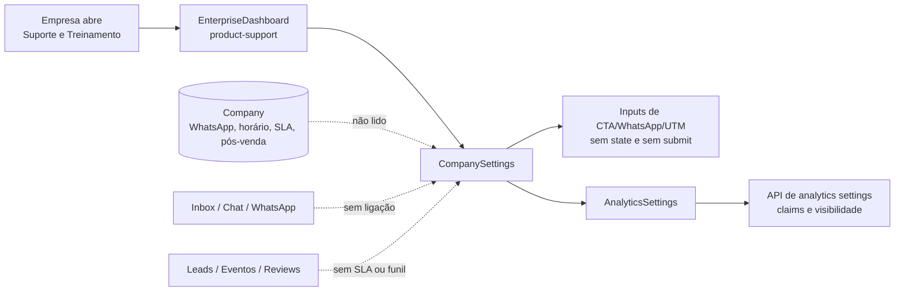
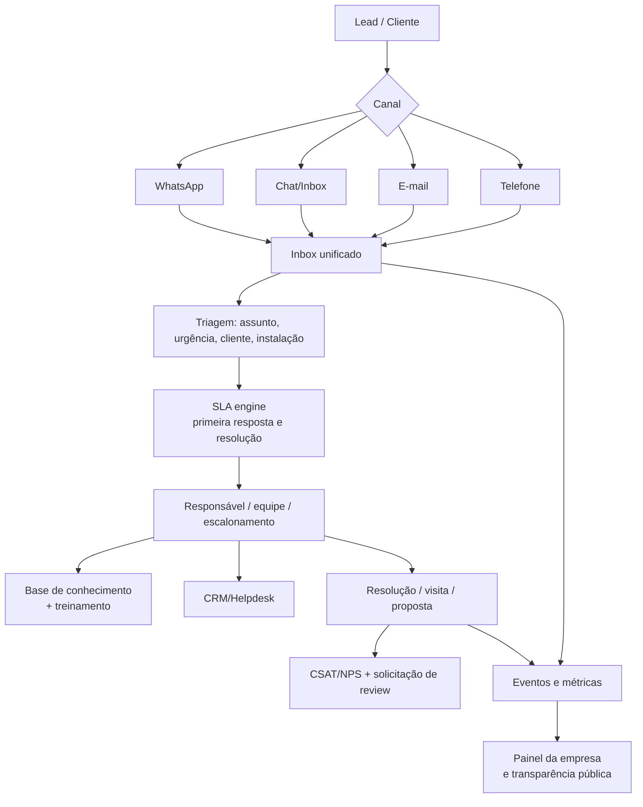

# Auditoria A+++ — Suporte e Treinamento

**Escopo:** `https://www.avaliasolar.com.br/dashboard?tab=product-support`, com inspeção estática do frontend e backend em 23/07/2026. Achados descritos como **confirmados** são sustentados pelo código; dados de produção, volume e comportamento de usuários exigem telemetria e teste autenticado.

## Veredito executivo

A aba tem um rótulo e uma promessa corretos — “Configure canais e informações de suporte para seus clientes” — mas **não implementa essa promessa**. Ela renderiza exatamente o mesmo componente de `Planos e preços` (`CompanySettings`), focado em CTAs, UTMs e configurações analíticas. Esse componente contém inputs sem estado e sem persistência; o botão “Sincronizar Configurações” não possui ação.

Em termos de produto, hoje a aba é uma **fachada de configuração**. O domínio de suporte existe parcialmente no modelo de empresa (WhatsApp, horário, SLA, pós-venda, canais), nos canais de Inbox/Chat e nas métricas de clique, mas esses ativos não são apresentados, configurados ou conectados aqui.

| Dimensão | Nota | Diagnóstico |
|---|---:|---|
| Utilidade atual para empresa | 2/10 | tela não configura suporte real |
| UX/UI | 4/10 | visual elaborado, sem semântica ou feedback verificável |
| Backend/dados | 5/10 | dados-base existem, mas não são orquestrados |
| Integrações | 3/10 | Inbox/WhatsApp/eventos existem isoladamente |
| Governança/operação | 2/10 | sem tickets, SLA, filas, auditoria ou ownership |
| Potencial de valor | 9/10 | suporte é alavanca direta de confiança, conversão e retenção |

## O que a aba deveria fazer

Para uma empresa solar/EV, “Suporte e treinamento” deve ser o centro de operação pós-venda e pré-venda:

- informar ao comprador **como e quando** será atendido;
- transformar lead, conversa ou instalação em caso rastreável;
- classificar urgência: orçamento, instalação, garantia, manutenção, monitoramento, financeiro;
- manter SLA de primeira resposta e resolução;
- disponibilizar treinamento/certificações, base de conhecimento e materiais;
- consolidar WhatsApp, chat, telefone, e-mail e CRM;
- mostrar à empresa impacto comercial: resposta → reunião → venda → NPS/review.

## Estado atual confirmado

### Roteamento de interface

`EnterpriseDashboard` contém uma aba `product-support`, mas ela renderiza `CompanySettings`, idêntico à aba `product-pricing`.

```text
product-pricing ─┐
                 ├── CompanySettings(companyId)
product-support ─┘
```

### Campos exibidos versus comportamento

| Elemento mostrado | Estado/Persistência | Problema |
|---|---|---|
| Vetor Primário/Secundário | placeholders somente | não lê nem salva CTA |
| Mensagem WhatsApp | placeholder somente | não salva template |
| Matriz UTM | placeholders somente | não salva nem valida parâmetros |
| “Sincronizar Configurações” | sem `onClick` | botão decorativo |
| Métricas “4”, “Ativo”, “98%” | constantes | pode induzir decisão incorreta |
| AnalyticsSettings abaixo | tem API própria | trata claims/analytics, não suporte |

### Capacidades existentes, mas desconectadas

| Ativo existente | Onde está | Como deveria ser usado |
|---|---|---|
| WhatsApp, URL, CTA e template | `Company` + `company_dashboard#update_ctas` | canal, template, opt-in, horário e tracking |
| Horário comercial | `Company#working_hours` | roteamento e mensagem fora do horário |
| SLA de resposta | `Company#response_time_sla` | promessa pública e alerta operacional |
| Pós-venda/capacidade | `post_sales_support`, `post_sales_capacity` | elegibilidade, cobertura e especialidades |
| Inbox ao vivo | `CompanyInboxChannel`, Chat Sessions | filas, dono do caso e mensagens |
| Eventos de clique WhatsApp | `company_daily_stats`, Analytics | funil e tempo de resposta |
| Webhooks | CompanyWebhook | CRM/helpdesk, eventos de status |

## Mapa do fluxo atual e da lacuna



## Fluxo-alvo recomendado



## Arquitetura e dados recomendados

### Entidades mínimas

- `support_channels`: canal, endereço, status, horário, consentimento, responsável.
- `support_cases`: empresa, contato/lead, origem, categoria, prioridade, status, SLA, responsável, timestamps.
- `support_case_events`: evento imutável de criação, mensagem, atribuição, mudança de status, escalonamento, resolução.
- `support_sla_policies`: por plano, categoria, horário e prioridade.
- `knowledge_articles`: artigo, audiência, categoria, versão, aprovação, efetividade.
- `training_modules` e `training_enrollments`: curso, conclusão, certificação e expiração.
- `support_integrations`: CRM/helpdesk/WhatsApp, credenciais criptografadas, mapeamento, health e última sincronização.

Todos os registros precisam de `company_id`, auditoria de ator, idempotência de webhooks, retenção LGPD e separação entre dado público, operacional e sensível.

### Contrato de API sugerido

```text
GET  /company_dashboard/support/settings
PATCH /company_dashboard/support/settings
GET  /company_dashboard/support/overview?range=30d
GET  /company_dashboard/support/cases?status=open&priority=high
POST /company_dashboard/support/cases
PATCH /company_dashboard/support/cases/:id
GET  /company_dashboard/support/knowledge
POST /company_dashboard/support/integrations/:provider/connect
POST /webhooks/support/:provider
```

## UI/UX A++ proposta

### Cabeçalho operacional

`Suporte ao cliente · 3 casos abertos · 92% dentro do SLA · atualizado há 2 min`

Exibir período, timezone, cobertura da métrica e estado da integração. Não usar números sem fonte ou cards decorativos.

### Organização em cinco áreas

1. **Visão geral:** volume, primeira resposta mediana/P90, resolução, backlog, CSAT e risco de SLA.
2. **Canais:** WhatsApp, chat, telefone e e-mail; horário, owner, template, teste de canal e estado de conexão.
3. **Fila de atendimento:** tabela/kanban por prioridade e SLA, com filtros de status, assunto, responsável e período.
4. **Base e treinamento:** artigos, onboarding de equipe, certificações e lacunas de conhecimento por motivo de contato.
5. **Integrações e governança:** CRM/helpdesk, webhooks, consentimento, histórico de mudanças e exportação.

### Ações de alto valor

- “Configurar WhatsApp” com validação de número, template e teste real.
- “Definir horário e SLA” com preview público da promessa ao cliente.
- “Criar automação” para fora do horário, urgência de instalação e escalonamento.
- “Importar do CRM” com reconciliação e deduplicação.
- “Pedir avaliação após resolução” somente após consentimento e janela adequada.

## Gaps priorizados

| Prioridade | Gap | Impacto | Correção |
|---|---|---|---|
| P0 | Aba de suporte reusa tela errada | promessa não entregue | criar `SupportTrainingDashboard` próprio |
| P0 | Inputs e botão de sincronização não persistem | risco de falsa configuração | remover ou implementar read/write com estados de loading/erro |
| P0 | Sem case/ticket/SLA | nenhuma operação de suporte mensurável | modelo `support_cases` + política SLA + fila |
| P0 | Métricas estáticas | confiança e decisões erradas | dados reais, período, fonte e empty state |
| P1 | WhatsApp/Inbox não conectados à aba | contexto se perde | inbox unificado, routing e eventos |
| P1 | Sem RBAC operacional | risco de acesso excessivo | owner/manager/agent/viewer e escopos por empresa |
| P1 | Sem auditoria de mudança ou consentimento | risco LGPD e suporte | audit log e consent ledger |
| P2 | Sem knowledge base/training | custo de suporte escala linearmente | artigos versionados e módulos de treinamento |
| P2 | Sem feedback loop de CSAT/reviews | perde alavanca de reputação | evento resolução → pesquisa/review com regras |

## Integrações que agregam valor

| Integração | Valor | Condição técnica |
|---|---|---|
| WhatsApp Business API | canal dominante e SLA | opt-in, templates aprovados, webhook idempotente |
| HubSpot / Pipedrive / RD Station | lead→venda e histórico comercial | mapeamento de IDs, DLQ e reconciliação |
| Zendesk / Freshdesk / Intercom | tickets e base de conhecimento | ownership de fonte e sync incremental |
| Google Calendar | agendamento de visita técnica | disponibilidade, timezone e cancelamento |
| GA4/PostHog | impacto de canal e autoatendimento | eventos padronizados, sem PII desnecessária |

## Métricas e SLOs

- Primeiro atendimento: mediana e P90 por canal/assunto.
- SLA compliance: % de casos dentro do objetivo; alertar antes da violação.
- Backlog: casos abertos, envelhecimento e sem responsável.
- Resolução: tempo, reabertura e motivo raiz.
- Valor: atendimento→reunião, reunião→venda, retenção e review pós-resolução.
- Base de conhecimento: deflexão, busca sem resultado e artigo desatualizado.
- SLO: ingestão de eventos P95 < 60 s; API de fila P95 < 300 ms; nenhuma perda silenciosa de webhook.

## Roadmap

| Horizonte | Entrega |
|---|---|
| 0–2 semanas | remover a falsa configuração; criar leitura/edição real de canais, horário, WhatsApp, SLA e pós-venda |
| 2–6 semanas | casos, fila, owner, SLA e eventos auditáveis; dashboard de métricas reais |
| 6–12 semanas | Inbox/WhatsApp/CRM, automações e base de conhecimento |
| Próximo trimestre | treinamento, CSAT, recomendações e benchmarking por categoria |

## Critérios de aceite

1. Nenhum campo interativo é decorativo: todo valor tem fonte, persistência e feedback.
2. Cada caso possui canal, status, prioridade, responsável, SLA e trilha de auditoria.
3. A empresa vê somente seus dados; roles limitam ações e exportações.
4. Métricas mostram período, timezone, origem, cobertura e estado “sem dados”.
5. Integrações têm health check, retry, DLQ, idempotência e reconciliação.
6. Fluxos de WhatsApp e CRM respeitam consentimento, retenção e LGPD.

## Evidências técnicas

- Aba e reutilização: `AB0-1-front/app/dashboard/components/EnterpriseDashboard.tsx`
- Componente atualmente exibido: `AB0-1-front/app/dashboard/components/CompanySettings.tsx`
- Analytics distinto: `AB0-1-front/app/dashboard/components/AnalyticsSettings.tsx`
- Atualização de empresa/CTA: `AB0-1-back/app/controllers/api/v1/company_dashboard_controller.rb`
- Campos existentes: `AB0-1-back/app/models/company.rb` e `db/schema.rb`
