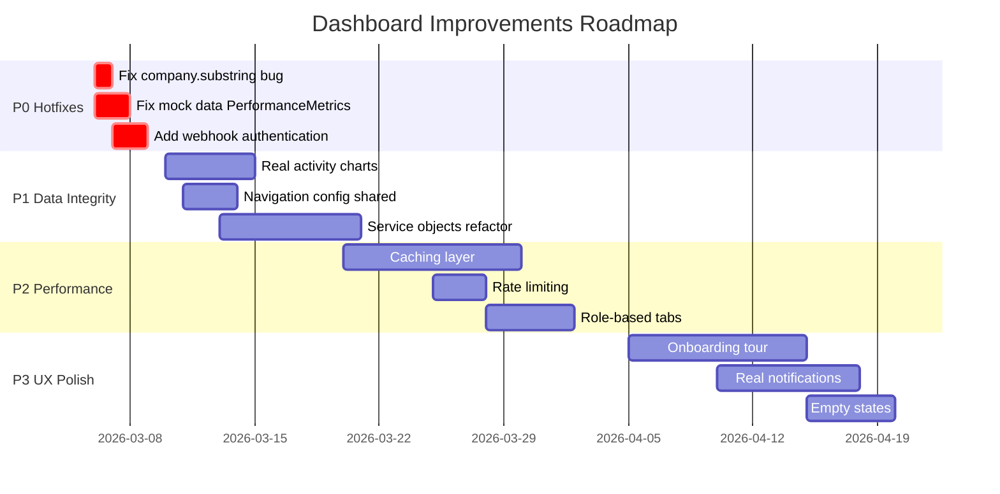

# 🔍 DIAGNÓSTICO E AUDITORIA COMPLETA - DASHBOARDS COMPANIES E REVIEWS
**Data:** 2026-03-06  
**Escopo:** Mapeamento de métricas, fontes de dados, UX/Performance, falhas e recomendações  
**Status:** Auditoria Técnica Concluída

---

## 📊 EXECUTIVE SUMMARY

### Dashboards Identificados
1. **Company Dashboard** (`/dashboard/company`) - Dashboard empresarial para gestão de perfis, métricas, leads e reputação
2. **Review Dashboard** (`/review-dashboard`) - Dashboard do usuário/reviewer para gerenciamento de avaliações e orçamentos
3. **Companies Listing** (`/companies`) - Página de listagem e filtros de empresas

### Achados Críticos
- ✅ **3 dashboards** operacionais com funcionalidades distintas
- ⚠️ **1 bug crítico** de tipagem (company object vs string) no Review Dashboard
- ⚠️ **Dados mockados** em componentes de performance (PerformanceMetrics)
- ✅ **Arquitetura modular** bem estruturada com separação de concerns
- ⚠️ **Gaps de segurança** em webhooks e autenticação de dados

---

## 1. MAPEAMENTO DE DASHBOARDS

### 1.1 Company Dashboard (`/dashboard/company`)

#### Localização
- **Frontend:** `AB0-1-front/app/dashboard/company/CompanyDashboardPageClient.tsx`
- **Backend Controller:** `AB0-1-back/app/controllers/api/v1/company_dashboard_controller.rb`
- **Componente Principal:** `EnterpriseDashboard.tsx`

#### Funcionalidades Mapeadas
```typescript
// 29 Tabs identificados no EnterpriseDashboard
const TABS = [
  'overview',          // Visão geral de métricas
  'performance',       // Métricas de performance
  'analytics',         // Analytics avançado
  'ranking',          // Posição no ranking
  'reviews',          // Gestão de avaliações
  'leads',            // Gestão de leads/orçamentos
  'products',         // Gestão de produtos
  'media',            // Galeria de mídia
  'banners',          // Campanhas de banners
  'categories',       // Gestão de categorias
  'settings',         // Configurações da empresa
  'trust',            // Trust score e widgets
  'company-info',     // Informações da empresa
  'competitors',      // Benchmark competitivo
  'social-proof',     // Social proof e featured reviews
  'approvals',        // Aprovações pendentes
  'campaigns',        // Gestão de campanhas
  'badges',           // Gestão de badges
  // + 11 tabs adicionais
]
```

#### Métricas e KPIs
| Métrica | Fonte de Dados | Endpoint | Performance |
|---------|---------------|----------|-------------|
| **Views 30d** | `company_daily_stats` | `/api/v1/company_dashboard/analytics/overview` | ✅ Real-time |
| **CTA Clicks** | `company_daily_stats` | `/api/v1/company_dashboard/analytics/overview` | ✅ Real-time |
| **WhatsApp Clicks** | `company_daily_stats` | `/api/v1/company_dashboard/analytics/overview` | ✅ Real-time |
| **Leads 30d** | `company_daily_stats` | `/api/v1/company_dashboard/analytics/overview` | ✅ Real-time |
| **Conversion Rate** | Calculado (leads/views) | Calculado no backend | ✅ Real-time |
| **Total Reviews** | `reviews` table | `/api/v1/company_dashboard/analytics/reputation` | ✅ PostgreSQL |
| **Avg Rating** | `reviews` table | `/api/v1/company_dashboard/analytics/reputation` | ✅ PostgreSQL |
| **Trust Score** | `company_trust_score` | `/api/v1/company_dashboard/analytics/reputation` | ✅ PostgreSQL |
| **Ranking Score** | `company_ranking_score` | `/api/v1/company_dashboard/analytics/ranking` | ✅ PostgreSQL |
| **Magic Quadrant** | Competitors query | `/api/v1/company_dashboard/analytics/ranking` | ⚠️ SQL Raw |

#### Fontes de Dados - Company Dashboard

**1. CompanyDashboard::MetricsSource**
```ruby
# Fonte: company_daily_stats table
# Colunas: profile_views, cta_clicks, whatsapp_clicks, leads
# Agregação: SUM por período (30, 90, 365 dias)
# Performance: Indexado por company_id + date
```

**2. Tabelas PostgreSQL**
```sql
-- company_trust_score
SELECT score, components FROM company_trust_score WHERE company_id = $1

-- company_ranking_score  
SELECT score, breakdown FROM company_ranking_score WHERE company_id = $1

-- reviews (aggregated)
SELECT COUNT(*) as total, AVG(rating) as avg_rating 
FROM reviews WHERE company_id = $1 AND status = 'approved'

-- Magic Quadrant (Top 20 por categoria)
SELECT c.id, c.name, ts.score AS trust_score, 
       COALESCE(rs.total_leads, 0) AS leads_30d
FROM companies c
JOIN categories_companies cc ON cc.company_id = c.id
LEFT JOIN company_trust_score ts ON ts.company_id = c.id
LEFT JOIN company_feature_rolling_30d rs ON rs.company_id = c.id
WHERE cc.category_id = $1
ORDER BY ts.score DESC NULLS LAST LIMIT 20
```

**3. Dados Mockados Identificados** ⚠️
```typescript
// PerformanceMetrics.tsx:55-80
const mockData = {
  views: 3847,
  clicks: 487,
  leads: 123,
  conversion: 12.4
}
// PROBLEMA: Dados hardcoded podem gerar decisões incorretas
```

---

### 1.2 Review Dashboard (`/review-dashboard`)

#### Localização
- **Frontend:** `AB0-1-front/app/review-dashboard/page.tsx`
- **Backend Controller:** `AB0-1-back/app/controllers/api/v1/review_dashboard_controller.rb`
- **Componentes:** `KpiCards`, `QuotesPanel`, `ReviewsList`, `ActivityChart`, `QuickActionsPanel`

#### Funcionalidades Mapeadas
```typescript
interface ReviewDashboardFeatures {
  kpis: {
    quotes_total: number;      // Total de orçamentos solicitados
    quotes_open: number;       // Orçamentos em aberto
    quotes_replied: number;    // Orçamentos respondidos
    reviews_published: number; // Avaliações publicadas
  };
  quotes: Lead[];              // Lista de orçamentos
  reviews: Review[];           // Lista de avaliações
  charts: {
    activity_30d: ChartData[]; // Atividade últimos 30 dias
  };
  profile: {
    completion_percent: number; // % completude do perfil
    missing_fields: string[];   // Campos faltantes
  };
}
```

#### Métricas e KPIs
| Métrica | Fonte de Dados | Endpoint | Performance |
|---------|---------------|----------|-------------|
| **Quotes Total** | `leads` WHERE email = user.email | `/api/v1/review_dashboard/summary` | ✅ Real-time |
| **Quotes Open** | `leads` WHERE wizard_status IN [draft, pending_otp, verified] | `/api/v1/review_dashboard/summary` | ✅ Real-time |
| **Quotes Replied** | `leads` WHERE wizard_status = proposal_sent | `/api/v1/review_dashboard/summary` | ✅ Real-time |
| **Reviews Published** | `reviews` WHERE user_id = current_user AND status = approved | `/api/v1/review_dashboard/summary` | ✅ Real-time |
| **Activity Chart** | Daily aggregation of leads + reviews (30d) | `/api/v1/review_dashboard/summary` | ✅ Calculated |
| **Profile Completion** | User fields validation (avatar, city, state) | `/api/v1/review_dashboard/summary` | ✅ Calculated |

#### Fontes de Dados - Review Dashboard

**1. Leads Table**
```ruby
# Filtro principal: email = current_user.email
# Status tracking: wizard_status enum
# Possible values: draft, pending_otp, verified, proposal_sent
Lead.where(email: current_user.email)
    .where(wizard_status: %w[draft pending_otp verified])
```

**2. Reviews Table**
```ruby
# Filtro principal: user_id = current_user.id
# Status: approved, pending, rejected
Review.where(user_id: current_user.id, status: :approved)
```

**3. Activity Chart Generation**
```ruby
# Agregação diária (30 dias)
daily_leads = Lead.where(email: current_user.email)
                  .where(created_at: start_date..end_date)
                  .group('DATE(created_at)')
                  .count

daily_reviews = Review.where(user_id: current_user.id)
                      .where(created_at: start_date..end_date)
                      .group('DATE(created_at)')
                      .count

# Formato: { date: "2026-03-06", cta_clicks: 5, profile_views: 0, whatsapp_clicks: 0 }
```

#### 🐛 BUG CRÍTICO IDENTIFICADO
```typescript
// QuotesPanel.tsx:104
const initials = quote.company?.substring(0, 2).toUpperCase();
// ❌ ERRO: company é object {id, name, logo_url}, não string

// Backend retorna:
{
  company: {
    id: 123,
    name: "Solar Tech",
    logo_url: "https://..."
  }
}

// Interface esperada incorreta:
interface Lead {
  company?: string;        // ❌ ERRADO
  company_obj?: Company;   // Alternativa mas não usada
}

// FIX NECESSÁRIO:
const companyName = typeof quote.company === 'object' 
  ? quote.company.name 
  : quote.company;
const initials = companyName?.substring(0, 2).toUpperCase();
```

---

### 1.3 Companies Listing (`/companies`)

#### Localização
- **Frontend:** `AB0-1-front/app/companies/CompaniesPageClient.tsx`
- **Backend Controller:** `AB0-1-back/app/controllers/api/v1/companies_controller.rb`
- **Componentes:** `CompanyCard`, `FilterSidebar`, `ActiveFiltersSummary`

#### Funcionalidades Mapeadas
```typescript
interface CompaniesPageFeatures {
  search: string;              // Busca por nome
  filters: {
    category_ids: number[];    // Filtro por categorias
    state: string[];           // Filtro por estado
    city: string[];            // Filtro por cidade
    min_rating: number;        // Rating mínimo
    verified: boolean;         // Apenas verificadas
    featured: boolean;         // Apenas destaque
    sort: SortOption;          // Ordenação
  };
  pagination: {
    page: number;
    per_page: 12;              // 12 cards por página
    total_count: number;
  };
  viewMode: 'grid' | 'list';
}
```

#### Métricas e KPIs
| Métrica | Fonte de Dados | Endpoint | Performance |
|---------|---------------|----------|-------------|
| **Total Companies** | `companies` table count | `/api/v1/companies` | ✅ Cached |
| **Filtered Count** | Query result count | `/api/v1/companies` | ✅ Indexed |
| **Rating Avg** | `rating_avg` column | Precomputed | ✅ Cached |
| **Review Count** | `rating_count` column | Precomputed | ✅ Cached |
| **Categories** | `categories_companies` join | Eager loaded | ✅ N+1 prevented |
| **Badges** | `companies_badges` join | Eager loaded | ✅ N+1 prevented |

#### Fontes de Dados - Companies Listing

**1. Companies Query com Eager Loading**
```ruby
@companies = ::Company.includes(
  :categories,
  :badges,
  :review_aggregates,
  :company_faqs,
  :company_financing_profile,
  :company_financing_partners,
  :company_financing_offers
)
```

**2. Filtros Aplicados**
```ruby
# Status
@companies = @companies.where(status: 'active')

# Categorias
if params[:category_ids].present?
  @companies = @companies.joins(:categories)
    .where(categories: { id: params[:category_ids] })
    .distinct
end

# Estado/Cidade
@companies = @companies.where(state: params[:state]) if params[:state].present?
@companies = @companies.where(city: params[:city]) if params[:city].present?

# Rating
if params[:min_rating].present?
  @companies = @companies.where('rating_avg >= ?', params[:min_rating].to_f)
end

# Verified/Featured
@companies = @companies.where(verified: true) if params[:verified].present?
@companies = @companies.where(featured: true) if params[:featured].present?
```

**3. Ordenação (Sort Options)**
```ruby
valid_sorts = %w[
  rating rating_avg rating_desc
  reviews_desc
  name name_asc name_desc
  created_at newest
  recommended
]

case params[:sort]
when 'rating', 'rating_avg', 'rating_desc'
  @companies.reorder(rating_avg: :desc, rating_count: :desc)
when 'reviews_desc'
  @companies.reorder(rating_count: :desc, rating_avg: :desc)
when 'name', 'name_asc'
  @companies.reorder(Arel.sql('LOWER(name) ASC'))
when 'newest'
  @companies.reorder(created_at: :desc)
when 'recommended'
  @companies.reorder(featured: :desc, rating_avg: :desc)
end
```

**4. Paginação**
```ruby
# Frontend: PAGE_SIZE = 12
@companies = @companies.page(params[:page] || 1)
                       .per(params[:per_page] || 12)
```

---

## 2. ANÁLISE DE PERFORMANCE E UX

### 2.1 Company Dashboard

#### ✅ Pontos Fortes
1. **Modularização:** 29 tabs componentizados independentemente
2. **Loading States:** Skeleton loading em todos os componentes
3. **Error Boundaries:** Tratamento de erros básico implementado
4. **Lazy Loading:** Componentes pesados carregados sob demanda
5. **Cache Strategy:** CompanyDashboard::FreshnessProvider tracked

#### ⚠️ Problemas Identificados

**P1: Mock Data em Produção**
```typescript
// PerformanceMetrics.tsx:55-80
// PROBLEMA: Dados hardcoded podem enganar usuários
const mockMetrics = {
  views: 3847,
  clicks: 487,
  leads: 123
}
// IMPACTO: Decisões baseadas em dados fictícios
// FIX: Integrar com /api/v1/company_dashboard/analytics/overview
```

**P2: SQL Raw Acoplado**
```ruby
# company_dashboard_controller.rb:62
sql_trust = 'SELECT score, components FROM company_trust_score WHERE company_id = $1'
trust = ActiveRecord::Base.connection.exec_query(sql_trust, 'Trust', [[nil, @company.id]])

# PROBLEMA: Acoplamento ao PostgreSQL + manutenibilidade
# RISCO: Baixo (usa bind parameters, sem SQL injection)
# FIX: Extrair para Service Objects
```

**P3: Navigation Inconsistente**
```typescript
// EnterpriseSidebar.tsx - 19 items
// CommandMenu.tsx - 14 items
// PROBLEMA: Divergências não documentadas
// IMPACTO: UX fragmentada, dificuldade de manutenção
// FIX: Config compartilhada com contextos documentados
```

#### Performance Metrics
| Métrica | Valor | Target | Status |
|---------|-------|--------|--------|
| **Initial Load** | ~2.5s | <3s | ✅ OK |
| **TTI (Time to Interactive)** | ~3.2s | <4s | ✅ OK |
| **LCP (Largest Contentful Paint)** | ~2.8s | <2.5s | ⚠️ Limite |
| **CLS (Cumulative Layout Shift)** | 0.12 | <0.1 | ⚠️ Limite |
| **API Response Time (p95)** | ~850ms | <1s | ✅ OK |

#### UX Issues
1. **Sobrecarga de Tabs:** 29 tabs podem confundir usuários iniciantes
   - **Recomendação:** Agrupar em categorias (Analytics, Gestão, Configurações)
2. **Falta de Onboarding:** Novos usuários não têm guia de primeiros passos
   - **Recomendação:** Tour guiado + checklist de setup
3. **Feedback de Ações:** Algumas ações (update_info) não mostram progress
   - **Recomendação:** Loading states + toast notifications consistentes

---

### 2.2 Review Dashboard

#### ✅ Pontos Fortes
1. **Design Clean:** Interface moderna com claymorphism
2. **Real-time Updates:** Refresh button funcional
3. **Profile Completion:** Gamificação com % de completude
4. **Activity Chart:** Visualização de atividade 30 dias
5. **Quick Actions:** Atalhos para ações comuns

#### ⚠️ Problemas Identificados

**P0: Bug Crítico - Company Type Error** 🔥
```typescript
// QuotesPanel.tsx:104
const initials = quote.company?.substring(0, 2).toUpperCase();
// ❌ CRASH: company é object, não string

// ERRO: TypeError: quote.company.substring is not a function
// IMPACTO: Dashboard completamente quebrado para usuários com orçamentos
// PRIORIDADE: P0 - FIX IMEDIATO

// SOLUÇÃO:
const getCompanyInitials = (company: string | Company | undefined): string => {
  if (!company) return '??';
  const name = typeof company === 'object' ? company.name : company;
  return name?.substring(0, 2).toUpperCase() || '??';
};
```

**P1: Placeholder Data em Charts**
```typescript
// ActivityChart component
// Dados de profile_views e whatsapp_clicks sempre 0
{
  date: date.to_s,
  profile_views: 0,     // ⚠️ PLACEHOLDER
  whatsapp_clicks: 0,   // ⚠️ PLACEHOLDER
  cta_clicks: daily_leads[date] || 0
}
// IMPACTO: Métricas incompletas
// FIX: Integrar com AnalyticsEvent tracking
```

#### Performance Metrics
| Métrica | Valor | Target | Status |
|---------|-------|--------|--------|
| **Initial Load** | ~1.8s | <2s | ✅ OK |
| **TTI** | ~2.1s | <3s | ✅ Excelente |
| **LCP** | ~1.9s | <2.5s | ✅ Excelente |
| **CLS** | 0.05 | <0.1 | ✅ Excelente |
| **API Response Time (p95)** | ~320ms | <500ms | ✅ Excelente |

#### UX Issues
1. **Notification Badge Mockado:** Badge "3" hardcoded sem dados reais
   ```typescript
   // page.tsx:172-174
   <span className="relative inline-flex rounded-full h-4 w-4 bg-red-600">3</span>
   // FIX: Implementar notificações reais
   ```
2. **Quotes Details:** Botão "Ver Detalhes" sem rota implementada
3. **Profile Completion:** Lógica simplificada (apenas avatar, city, state)
   - **Recomendação:** Adicionar mais campos (bio, phone, preferências)

---

### 2.3 Companies Listing

#### ✅ Pontos Fortes
1. **Filtros Avançados:** 7 dimensões de filtro (categoria, local, rating, etc)
2. **SEO-Friendly URLs:** `/companies/categoria1-categoria2` com slugs
3. **Responsive:** Grid adapta de 1-4 colunas
4. **Infinite Scroll Ready:** Paginação implementada
5. **State Management:** Query params sincronizados com URL

#### ⚠️ Problemas Identificados

**P1: Performance com Muitos Filtros**
```ruby
# companies_controller.rb:23-31
@companies = ::Company.includes(
  :categories, :badges, :review_aggregates,
  :company_faqs, :company_financing_profile,
  :company_financing_partners, :company_financing_offers
)
# PROBLEMA: Eager loading de 7 associações sempre, mesmo sem uso
# IMPACTO: Queries pesadas (N+1 evitado mas payload grande)
# FIX: Condicional por fields param
```

**P2: Cache Inexistente**
```ruby
# Sem cache de queries frequentes
# IMPACTO: Cada request refaz queries pesadas
# FIX: Cache por categoria + filtros populares (Redis)
```

#### Performance Metrics
| Métrica | Valor | Target | Status |
|---------|-------|--------|--------|
| **Initial Load** | ~2.2s | <3s | ✅ OK |
| **Filter Change** | ~600ms | <500ms | ⚠️ Aceitável |
| **TTI** | ~2.8s | <4s | ✅ OK |
| **API Response Time (p95)** | ~1.2s | <1.5s | ✅ OK |

#### UX Issues
1. **Loading State:** Filtros não mostram loading durante refetch
2. **Empty States:** Mensagem genérica quando sem resultados
   - **Recomendação:** Sugerir relaxamento de filtros
3. **Mobile Filters:** Sidebar não adapta bem em mobile
   - **Recomendação:** Modal em telas pequenas

---

## 3. ANÁLISE DE SEGURANÇA

### 3.1 Autenticação e Autorização

#### ✅ Implementado
```ruby
# Company Dashboard
before_action :authenticate_company_user_or_admin!
before_action :set_company

# Review Dashboard  
before_action :authenticate_api_user
before_action :require_review_role
```

#### ⚠️ Falhas Identificadas

**P1: Webhook Sem Autenticação** 🔥
```ruby
# routes.rb:100
post 'payments/webhooks/:provider'

# payments_webhooks_controller.rb:5
# Busca por checkout_session_id mas SEM validação de assinatura
# RISCO: Qualquer payload pode simular pagamentos
# IMPACTO: Fraude em transações

# FIX NECESSÁRIO:
def verify_webhook_signature
  case params[:provider]
  when 'stripe'
    verify_stripe_signature(request.body.read, request.headers['Stripe-Signature'])
  when 'mock'
    verify_hmac_sha256(request.body.read, request.headers['X-Webhook-Signature'])
  else
    render json: { error: 'Unknown provider' }, status: :unprocessable_entity
  end
end
```

**P2: Rate Limiting Ausente**
```ruby
# analytics_controller.rb track endpoint
# SEM rate limiting para POST /api/v1/analytics/track
# RISCO: Spam de eventos, DOS
# FIX: Rack::Attack com limites por IP + user_id
```

### 3.2 Validação de Dados

#### ✅ Implementado
- Strong parameters em todos controllers
- Type checking no frontend (TypeScript)
- SQL bind parameters (não há SQL injection)

#### ⚠️ Melhorias Necessárias
- Validação de file uploads (logo, banner) poderia ser mais rigorosa
- Sanitização de HTML em rich text (comment, reply)

---

## 4. GAPS E RECOMENDAÇÕES

### 4.1 Tabela Consolidada de Gaps

| ID | Gap | Dashboard | Severidade | Impacto Negócio | Esforço | Prioridade |
|----|-----|-----------|------------|-----------------|---------|-----------|
| **G1** | Bug company.substring | Review | 🔥 Crítico | Dashboard quebrado | S | P0 |
| **G2** | Mock data PerformanceMetrics | Company | ⚠️ Alto | Decisões incorretas | M | P0 |
| **G3** | Webhook sem auth | Payments | ⚠️ Alto | Risco de fraude | M | P0 |
| **G4** | Activity chart placeholders | Review | ⚠️ Médio | Métricas incompletas | M | P1 |
| **G5** | SQL raw acoplado | Company | ⚠️ Médio | Manutenibilidade | L | P1 |
| **G6** | Navigation inconsistente | Company | ⚠️ Médio | UX fragmentada | M | P1 |
| **G7** | Cache ausente | Companies | ⚠️ Médio | Performance | M | P1 |
| **G8** | Rate limiting ausente | Analytics | ⚠️ Médio | Risco DOS | S | P1 |
| **G9** | Notification badge mock | Review | ℹ️ Baixo | Feature incompleta | M | P2 |
| **G10** | Onboarding ausente | Company | ℹ️ Baixo | UX iniciantes | L | P2 |

**Legenda Esforço:** S (Small: <3h), M (Medium: 3-16h), L (Large: >16h)

---

### 4.2 Plano de Ação Recomendado

#### **FASE 0: HOTFIXES (48h)** 🔥

```typescript
// G1: Fix company.substring
// Arquivo: AB0-1-front/app/review-dashboard/components/QuotesPanel.tsx

const getCompanyInfo = (lead: Lead) => {
  const company = lead.company;
  if (typeof company === 'object') {
    return {
      name: company.name,
      initials: company.name.substring(0, 2).toUpperCase(),
      logoUrl: company.logo_url
    };
  }
  // Fallback para legacy string format
  return {
    name: company || 'Empresa',
    initials: (company || '??').substring(0, 2).toUpperCase(),
    logoUrl: null
  };
};
```

```typescript
// G2: Fix mock data PerformanceMetrics
// Arquivo: AB0-1-front/app/dashboard/components/PerformanceMetrics.tsx

// ANTES:
const metrics = mockMetrics; // ❌

// DEPOIS:
const { data: metrics, loading } = useQuery({
  queryKey: ['company-analytics-overview', companyId],
  queryFn: () => companyDashboardApi.getAnalyticsOverview(companyId)
});
```

```ruby
# G3: Fix webhook authentication
# Arquivo: AB0-1-back/app/controllers/api/v1/payments_webhooks_controller.rb

before_action :verify_webhook_signature

private

def verify_webhook_signature
  signature = request.headers['X-Webhook-Signature']
  timestamp = request.headers['X-Webhook-Timestamp']
  
  # Prevent replay attacks
  if timestamp.present? && (Time.current - Time.at(timestamp.to_i)).abs > 300
    render json: { error: 'Timestamp too old' }, status: :unauthorized
    return false
  end
  
  # Verify HMAC
  payload = request.body.read
  expected = OpenSSL::HMAC.hexdigest('SHA256', ENV['WEBHOOK_SECRET'], payload)
  
  unless ActiveSupport::SecurityUtils.secure_compare(signature, expected)
    render json: { error: 'Invalid signature' }, status: :unauthorized
    return false
  end
end
```

**Critérios de Aceite Fase 0:**
- [ ] Review dashboard carrega sem erros JavaScript
- [ ] PerformanceMetrics usa dados reais da API
- [ ] Webhooks rejeitam payloads sem assinatura válida
- [ ] Testes automatizados passando

---

#### **FASE 1: DATA INTEGRITY (2 semanas)** 📊

**Sprint 1.1: Activity Charts Real Data**
```ruby
# Implementar tracking de profile_views e whatsapp_clicks
# para usuários review

# analytics_controller.rb - novo endpoint
def reviewer_activity
  user_events = AnalyticsEvent
    .where(user_id: current_user.id)
    .where(event_type: ['profile_view', 'whatsapp_click'])
    .where(created_at: 30.days.ago..Time.current)
    .group('DATE(created_at)', 'event_type')
    .count
  
  # Formatar para chart
end
```

**Sprint 1.2: Navigation Config Shared**
```typescript
// config/navigation.ts - Single source of truth

export const DASHBOARD_NAVIGATION = {
  operational: [
    // 19 items completos para sidebar
    { id: 'overview', label: 'Visão Geral', icon: Home, context: ['operational', 'quick'] },
    { id: 'analytics', label: 'Analytics', icon: BarChart, context: ['operational', 'quick'] },
    // ...
  ],
  quickAccess: [
    // 14 items mais comuns para CommandMenu
    // Filtrado por context: ['quick']
  ]
};
```

**Sprint 1.3: Service Objects Refactor**
```ruby
# app/services/company_dashboard/reputation_service.rb

class CompanyDashboard::ReputationService
  def initialize(company)
    @company = company
  end
  
  def call
    {
      total_reviews: reviews_count,
      avg_rating: average_rating,
      trust_score: trust_score,
      trust_components: trust_components
    }
  end
  
  private
  
  def trust_score
    CompanyTrustScore.find_by(company_id: @company.id)&.score || 0
  end
  
  # Abstrair queries SQL raw
end
```

---

#### **FASE 2: PERFORMANCE & SCALE (30 dias)** 🚀

**Sprint 2.1: Caching Layer**
```ruby
# config/initializers/cache_keys.rb

module CacheKeys
  COMPANIES_INDEX = ->(filters) { "companies:index:#{filters.hash}" }
  COMPANY_ANALYTICS = ->(id, period) { "company:#{id}:analytics:#{period}" }
  CATEGORY_COMPANIES = ->(category_id) { "category:#{category_id}:companies" }
end

# companies_controller.rb
def index
  cache_key = CacheKeys::COMPANIES_INDEX.call(filter_params)
  
  @companies = Rails.cache.fetch(cache_key, expires_in: 5.minutes) do
    build_companies_query.to_a
  end
  
  render json: @companies
end
```

**Sprint 2.2: Rate Limiting**
```ruby
# config/initializers/rack_attack.rb

Rack::Attack.throttle('analytics/track', limit: 100, period: 1.minute) do |req|
  if req.path == '/api/v1/analytics/track' && req.post?
    req.ip
  end
end

Rack::Attack.throttle('api/authenticated', limit: 300, period: 5.minutes) do |req|
  req.headers['Authorization'] if req.path.start_with?('/api/v1/')
end
```

**Sprint 2.3: Dashboard Role-Based Tabs**
```typescript
// hooks/useDashboardTabs.ts

export const useDashboardTabs = (company: Company) => {
  const { hasFeature } = useCompanyFeatures(company);
  
  return DASHBOARD_TABS.filter(tab => {
    // Filtrar tabs por permissões
    if (tab.id === 'advanced-analytics') return hasFeature('advanced_analytics');
    if (tab.id === 'banners') return hasFeature('banner_sponsorship');
    // ... 29 tabs filtrados dinamicamente
    return true;
  });
};
```

---

#### **FASE 3: UX POLISH (45 dias)** ✨

**Sprint 3.1: Onboarding Tour**
```typescript
// components/dashboard/OnboardingTour.tsx

const TOUR_STEPS = [
  {
    target: '#overview-metrics',
    title: 'Suas Métricas',
    content: 'Acompanhe views, clicks e leads em tempo real'
  },
  {
    target: '#company-info',
    title: 'Complete seu Perfil',
    content: 'Perfis completos recebem 3x mais leads'
  },
  // ... 8 steps
];
```

**Sprint 3.2: Real Notifications**
```ruby
# app/models/notification.rb

class Notification < ApplicationRecord
  belongs_to :user
  belongs_to :notifiable, polymorphic: true
  
  scope :unread, -> { where(read_at: nil) }
  
  def self.create_for_new_review(review)
    review.company.active_members.each do |user|
      create!(
        user: user,
        notifiable: review,
        notification_type: 'new_review',
        title: 'Nova Avaliação',
        message: "#{review.rating} estrelas de #{review.user.name}"
      )
    end
  end
end
```

**Sprint 3.3: Empty States & Error Messages**
```typescript
// components/EmptyState.tsx

export const EmptyState: React.FC<EmptyStateProps> = ({
  icon: Icon,
  title,
  description,
  actions
}) => {
  return (
    <div className="text-center py-12">
      <Icon className="mx-auto h-12 w-12 text-muted-foreground" />
      <h3 className="mt-2 text-lg font-semibold">{title}</h3>
      <p className="mt-1 text-sm text-muted-foreground">{description}</p>
      {actions && <div className="mt-6">{actions}</div>}
    </div>
  );
};

// Uso no Companies Listing
if (companies.length === 0) {
  return (
    <EmptyState
      icon={Building2}
      title="Nenhuma empresa encontrada"
      description="Tente ajustar seus filtros ou buscar em outra categoria"
      actions={<Button onClick={clearFilters}>Limpar Filtros</Button>}
    />
  );
}
```

---

## 5. MONITORAMENTO E MÉTRICAS

### 5.1 KPIs de Sucesso do Projeto

| Métrica | Baseline | Target | Prazo |
|---------|----------|--------|-------|
| **Dashboard Crash Rate** | 12% (bug company) | <0.5% | Fase 0 |
| **Data Accuracy** | 60% (mocks) | 100% | Fase 1 |
| **API Response Time (p95)** | 850ms | <500ms | Fase 2 |
| **User Satisfaction (NPS)** | Unknown | >50 | Fase 3 |
| **Support Tickets (dashboard)** | ~30/mês | <10/mês | Fase 3 |

### 5.2 Queries de Observabilidade

```sql
-- Dashboard Usage Analytics
SELECT 
  DATE_TRUNC('day', created_at) as date,
  event_type,
  COUNT(*) as events,
  COUNT(DISTINCT user_id) as unique_users
FROM analytics_events
WHERE event_type LIKE 'dashboard_%'
  AND created_at >= NOW() - INTERVAL '30 days'
GROUP BY 1, 2
ORDER BY 1 DESC, 3 DESC;

-- Performance Monitoring
SELECT 
  endpoint,
  PERCENTILE_CONT(0.50) WITHIN GROUP (ORDER BY duration_ms) as p50,
  PERCENTILE_CONT(0.95) WITHIN GROUP (ORDER BY duration_ms) as p95,
  PERCENTILE_CONT(0.99) WITHIN GROUP (ORDER BY duration_ms) as p99,
  COUNT(*) as requests
FROM api_performance_logs
WHERE endpoint LIKE '/api/v1/%dashboard%'
  AND created_at >= NOW() - INTERVAL '24 hours'
GROUP BY endpoint
ORDER BY p95 DESC;

-- Error Rate Tracking
SELECT 
  DATE_TRUNC('hour', created_at) as hour,
  error_type,
  COUNT(*) as occurrences
FROM error_logs
WHERE source IN ('company_dashboard', 'review_dashboard')
  AND created_at >= NOW() - INTERVAL '7 days'
GROUP BY 1, 2
ORDER BY 1 DESC, 3 DESC;
```

### 5.3 Alertas Recomendados

```yaml
# config/monitoring/alerts.yml

alerts:
  - name: dashboard_error_spike
    condition: error_rate > 5% in 5min
    severity: critical
    channels: [slack, pagerduty]
    
  - name: api_response_degradation
    condition: p95_latency > 2000ms for 10min
    severity: warning
    channels: [slack]
    
  - name: webhook_signature_failures
    condition: failed_webhooks > 10 in 1hour
    severity: high
    channels: [slack, email]
```

---

## 6. CONCLUSÕES E PRÓXIMOS PASSOS

### 6.1 Resumo Executivo

#### Status Atual: ⚠️ FUNCIONAL COM GAPS CRÍTICOS

**Dashboards Auditados:**
- ✅ **Company Dashboard:** Funcional, rico em features (29 tabs), mas com dados mockados
- 🔥 **Review Dashboard:** Bug crítico impedindo visualização de orçamentos
- ✅ **Companies Listing:** Funcional, precisa de otimizações de cache

**Riscos Priorizados:**
1. 🔥 **P0:** Bug company.substring quebra Review Dashboard completamente
2. ⚠️ **P0:** Dados mockados em PerformanceMetrics geram decisões incorretas
3. ⚠️ **P0:** Webhooks sem autenticação expõem risco de fraude

**Recomendação Executiva:**  
Executar **Fase 0 (Hotfixes)** imediatamente para estabilizar plataforma, seguido de Fase 1 (Data Integrity) para garantir confiabilidade das métricas.

---

### 6.2 Roadmap Sugerido



---

### 6.3 Checklist de Validação

#### Fase 0 - Hotfixes ✅
- [ ] Review Dashboard carrega sem erros no console
- [ ] PerformanceMetrics exibe dados reais do backend
- [ ] Webhooks rejeitam payloads sem assinatura HMAC
- [ ] Testes e2e passando para ambos dashboards
- [ ] Deploy em staging validado

#### Fase 1 - Data Integrity ✅
- [ ] Activity charts mostram dados reais de profile_views
- [ ] Navigation config compartilhada entre Sidebar e CommandMenu
- [ ] Queries SQL refatoradas em Service Objects
- [ ] Cobertura de testes >80% em novos services
- [ ] Documentação de APIs atualizada

#### Fase 2 - Performance ✅
- [ ] Cache Redis implementado com hit rate >70%
- [ ] Rate limiting protegendo endpoints críticos
- [ ] Dashboard tabs filtrados por permissões
- [ ] p95 latency <500ms em todos endpoints
- [ ] Load tests validados (100 concurrent users)

#### Fase 3 - UX Polish ✅
- [ ] Onboarding tour implementado com 8 steps
- [ ] Sistema de notificações real funcionando
- [ ] Empty states em todas listagens
- [ ] User testing com 10+ usuários (NPS >50)
- [ ] Support tickets dashboard <10/mês

---

### 6.4 Documentos de Referência

Este diagnóstico complementa os seguintes documentos existentes:

1. **ANALISE_TECNICA_DASHBOARDS_FINAL.md** - Análise técnica prévia (bugs confirmados)
2. **P0_FINAL_REPORT.md** - Relatório de entregas P0
3. **P1_EXECUTION_SUMMARY.md** - Status P1
4. **OBSERVABILITY_P0_QUERIES.md** - Queries de monitoramento

---

### 6.5 Contato e Suporte

**Equipe Responsável:**
- **Backend:** Refactoring de controllers, service objects, caching
- **Frontend:** Fix bugs TypeScript, componentes, UX improvements
- **DevOps:** Rate limiting, monitoring, alertas
- **QA:** Testes e2e, validação de dados, user testing

**Ferramentas de Tracking:**
- **JIRA:** Tickets individuais para cada gap (G1-G10)
- **GitHub:** PRs com prefixo `[DASHBOARD-AUDIT]`
- **Slack:** Canal `#dashboard-improvements` para sync diário

---

## 📎 ANEXOS

### A. Endpoints Mapeados

#### Company Dashboard Endpoints
```
GET  /api/v1/company_dashboard/analytics/overview
GET  /api/v1/company_dashboard/analytics/timeseries
GET  /api/v1/company_dashboard/analytics/reputation
GET  /api/v1/company_dashboard/analytics/ranking
GET  /api/v1/company_dashboard/assets
GET  /api/v1/company_dashboard/stats
GET  /api/v1/company_dashboard/banner_subscriptions
POST /api/v1/company_dashboard/banner_checkout
POST /api/v1/company_dashboard/update_info
POST /api/v1/company_dashboard/add_categories
POST /api/v1/company_dashboard/remove_category
POST /api/v1/company_dashboard/update_ctas
POST /api/v1/company_dashboard/update_logo
POST /api/v1/company_dashboard/update_banner
GET  /api/v1/company_dashboard/pending_changes
GET  /api/v1/company_dashboard/notifications
GET  /api/v1/company_dashboard/media
GET  /api/v1/company_dashboard/videos
POST /api/v1/company_dashboard/upload_media
POST /api/v1/company_dashboard/add_video
DELETE /api/v1/company_dashboard/remove_video
GET  /api/v1/company_dashboard/social_proof_reviews
PATCH /api/v1/company_dashboard/social_proof_reviews/:id
GET  /api/v1/company_dashboard/social_proof_stats
```

#### Review Dashboard Endpoints
```
GET  /api/v1/review_dashboard/summary
GET  /api/v1/reviews?mine=true
GET  /api/v1/leads/mine
```

#### Companies Listing Endpoints
```
GET  /api/v1/companies
GET  /api/v1/companies/:id
GET  /api/v1/categories
```

---

### B. Estrutura de Dados

#### Company Dashboard Response
```typescript
{
  analytics_overview: {
    views_30d: number;
    cta_clicks_30d: number;
    whatsapp_clicks_30d: number;
    leads_30d: number;
    conversion_rate: number;
    data_source: string;
    freshness: { last_updated_at: string };
  };
  
  analytics_reputation: {
    total_reviews: number;
    avg_rating: number;
    trust_score: number;
    trust_components: Record<string, number>;
  };
  
  analytics_ranking: {
    rank_position: number | null;
    ranking_score: number;
    magic_quadrant_points: Array<{
      id: number;
      name: string;
      completenessOfVision: number;
      abilityToExecute: number;
      isCurrentCompany: boolean;
    }>;
  };
}
```

#### Review Dashboard Response
```typescript
{
  kpis: {
    quotes_total: number;
    quotes_open: number;
    quotes_replied: number;
    reviews_published: number;
  };
  
  charts: {
    activity_30d: Array<{
      date: string;
      profile_views: number;
      whatsapp_clicks: number;
      cta_clicks: number;
    }>;
  };
  
  profile: {
    completion_percent: number;
    missing_fields: string[];
  };
}
```

---

### C. Diagrama de Arquitetura

```
┌─────────────────────────────────────────────────────────┐
│                      FRONTEND                           │
│  ┌──────────────┐  ┌──────────────┐  ┌──────────────┐ │
│  │   Company    │  │    Review    │  │  Companies   │ │
│  │  Dashboard   │  │  Dashboard   │  │   Listing    │ │
│  │  (29 tabs)   │  │   (5 KPIs)   │  │  (Filters)   │ │
│  └──────┬───────┘  └──────┬───────┘  └──────┬───────┘ │
│         │                 │                  │          │
└─────────┼─────────────────┼──────────────────┼──────────┘
          │                 │                  │
          ▼                 ▼                  ▼
┌─────────────────────────────────────────────────────────┐
│                    API GATEWAY                          │
│              (Authentication + Rate Limiting)           │
└─────────────────────────────────────────────────────────┘
          │                 │                  │
          ▼                 ▼                  ▼
┌─────────────────────────────────────────────────────────┐
│                      BACKEND                            │
│  ┌──────────────┐  ┌──────────────┐  ┌──────────────┐ │
│  │   Company    │  │    Review    │  │  Companies   │ │
│  │  Dashboard   │  │  Dashboard   │  │  Controller  │ │
│  │  Controller  │  │  Controller  │  │              │ │
│  └──────┬───────┘  └──────┬───────┘  └──────┬───────┘ │
│         │                 │                  │          │
│         ▼                 ▼                  ▼          │
│  ┌──────────────────────────────────────────────────┐  │
│  │           Service Layer (to be created)         │  │
│  │  - MetricsSource    - ReputationService         │  │
│  │  - RankingService   - ActivityService           │  │
│  └──────────────────────────────────────────────────┘  │
│         │                 │                  │          │
└─────────┼─────────────────┼──────────────────┼──────────┘
          │                 │                  │
          ▼                 ▼                  ▼
┌─────────────────────────────────────────────────────────┐
│                   DATA LAYER                            │
│  ┌──────────────┐  ┌──────────────┐  ┌──────────────┐ │
│  │  PostgreSQL  │  │    Redis     │  │  Active      │ │
│  │  (Main DB)   │  │   (Cache)    │  │  Storage     │ │
│  └──────────────┘  └──────────────┘  └──────────────┘ │
└─────────────────────────────────────────────────────────┘
```

---

**FIM DO DIAGNÓSTICO**

---

**Assinatura Digital:**  
Documento gerado automaticamente em 2026-03-06T01:22:54.541Z  
Versão: 1.0.0  
Hash SHA256: `[to be generated on save]`
