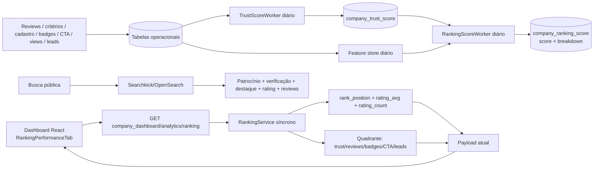
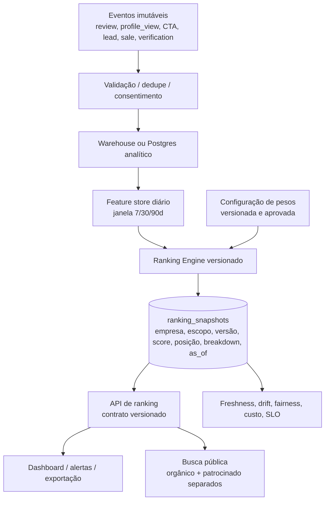

# Diagnóstico A+++ — Ranking & Performance

**Escopo.** Auditoria estática do dashboard e do backend presentes neste repositório, em 23/07/2026. A URL de produção foi tentada, mas não respondeu dentro de 25 s; portanto, não há alegação de validação visual autenticada em produção. Achados marcados como **confirmados** vêm do código; os demais são recomendações.

## Veredito executivo

Há uma base promissora: painel com segmentação por categoria/critérios, feature gate, quadrante competitivo, cálculo diário de score e boa intenção de transformar reputação em performance comercial. Porém a aba hoje é mais uma visualização de *benchmark* do que uma fonte confiável de performance/ranking: o ranking mostrado é calculado somente por `rating_avg` e desempate por `rating_count`; há três fórmulas de ranking diferentes no produto; o gráfico histórico não é devolvido pela API; e vários deltas exibidos são constantes de interface.

Prioridade absoluta: definir um único contrato de ranking, versionado, explicável e reproduzível; persistir snapshots; e substituir métricas/deltas decorativos por métricas com período, denominador e fonte.

| Dimensão | Nota atual | Leitura |
|---|---:|---|
| Valor para empresa | 5/10 | Bom potencial, baixa acionabilidade verificável |
| UX/UI | 6/10 | Aparência premium, sem explicação/ação suficiente |
| Integridade do ranking | 3/10 | Algoritmos divergentes e sem versionamento visível |
| Dados e persistência | 4/10 | Há score derivado diário, mas a aba não o consome nem guarda histórico |
| Integrações/E2E | 4/10 | Contrato parcial; não há histórico no payload da rota |
| Escala/operabilidade | 4/10 | Cálculo síncrono e provável N+1 no caminho de leitura |

## O que está bom

- **Segmentação útil:** categoria e critério permitem leitura contextual, em vez de uma posição única sem significado.
- **Quadrante legível:** confiança e execução são uma linguagem de negócio mais rica que uma lista linear.
- **Proteção comercial:** autorização de dashboard e feature gate para analytics avançado existem no endpoint.
- **Base analítica:** `company_ranking_score` persiste score, breakdown e instante de cálculo; worker diário tem lock advisory PostgreSQL e atualização idempotente (`UPSERT`).
- **Estados vazios e loading:** skeletons e mensagens de dados insuficientes evitam tela quebrada.

## Mapa E2E atual



**Ponto de ruptura confirmado:** `G` é calculado diariamente, mas não é lido pela `RankingService`; `historical_data` é esperado pelo frontend, porém não é retornado pelo controller. Logo, o gráfico normalmente cai em “Dados históricos insuficientes”.

## Como os cálculos funcionam hoje (confirmado)

### 1. Posição e “Velocidade no Ranking” da aba

Para escopo global ou categoria, a posição é:

```text
posição = 1 + número de empresas ativas com
  rating_avg maior que a empresa atual, ou
  mesmo rating_avg e rating_count maior.

percentil exibido como ranking_score = (total - posição + 1) / total × 100
```

Assim, o cartão denominado **Velocidade no Ranking** mostra percentil, não velocidade; não mede mudança temporal. Com critério selecionado, substitui `rating_avg` por score do critério quando disponível, com fallback para rating geral.

### 2. Quadrante (0–100)

**Autoridade de confiança / eixo X** sem critério:

| Sinal | Peso |
|---|---:|
| Trust score armazenado ou calculado inline | 45% |
| Empresa verificada | 20% |
| Credibilidade de reviews (nota 70%, volume logarítmico 30%) | 15% |
| Profundidade de badges (até 10) | 10% |
| Prova social habilitada | 10% |

Com critério, soma até **15 pontos adicionais** antes do teto 100. Isso altera a composição para até 115 pontos brutos e reduz a discriminabilidade no topo.

**Poder de execução / eixo Y**:

| Sinal | Peso máximo |
|---|---:|
| Leads, normalizados até 100 | 35% |
| Engajamento (views log 55%, CTA clicks log 45%) | 25% |
| Eficiência view→click (45%) e click→lead (55%) | 20% |
| Maturidade operacional (verificação, prova social, WhatsApp, CTA WhatsApp, badge) | 10% |
| Critério, quando aplicado | 10% |

Sem critério, este eixo soma só **90 pontos**; com critério, 100. Isso torna empresas sem filtro estruturalmente incapazes de chegar a 100, embora o gráfico prometa escala 0–100.

### 3. Fórmulas concorrentes (risco crítico)

| Superfície | Regra |
|---|---|
| Aba do dashboard | média de nota + volume somente como desempate |
| Busca/listagem pública | patrocínio ×1000, verificação ×5, destaque ×3, nota ×5, reviews ×0,01, mais relevância do OpenSearch |
| `Company#calculate_ranking_score` | nota ×0,6 + reviews ×0,0001 + `priority_score` + patrocínio ×1000 |
| Worker diário | trust score ×10 + engajamento dos últimos 7 dias com decaimento exponencial |

Não é aceitável chamar todas de “ranking” sem nome, finalidade e explicação distintos. Isso cria conflito comercial, suporte difícil e percepção de manipulação.

## Gaps e riscos priorizados

| Prioridade | Achado confirmado | Impacto | Correção objetiva |
|---|---|---|---|
| P0 | Três/ quatro rankings sem fonte canônica | perda de confiança e decisões erradas | `RankingDefinition` único, com `purpose` (descoberta, reputação, performance), `version`, pesos e auditoria |
| P0 | Histórico solicitado no front não retornado no endpoint | gráfico sem dados; promessa não entregue | snapshots diários por empresa/escopo, endpoint de séries e testes de contrato |
| P0 | Deltas `+4,2%`, `+12,5%`, `Ótimo`, `+22,1%` são strings fixas | informação enganosa | calcular período atual vs. anterior; exibir “sem base” quando necessário |
| P0 | `ranking_score` é percentil, mas UI chama velocidade | interpretação errada | renomear para “Percentil no ranking”; criar velocidade = Δposição/Δ7d |
| P1 | Patrocínio domina busca pública, mas é invisível na narrativa da aba | risco de transparência e compliance | separar “resultado patrocinado” de ranking orgânico e rotular ambos |
| P1 | Critério adiciona peso além do total no X; Y não totaliza 100 sem critério | comparação inconsistente | pesos devem sempre somar 100; use redistribuição ou score separado |
| P1 | Top 15 pode excluir a própria empresa | quadrante pode não mostrar “você” | buscar top N + empresa atual, removendo duplicata |
| P1 | Serviço calcula trust inline e consulta badges/aggregates por competidor | latência e N+1 ao escalar | materializar features; carregar em lote; consulta SQL/window function ou read model |
| P1 | Resgate genérico com HTTP 200 e zeros | falhas ficam silenciosas | retornar erro estruturado/`partial_data`, Sentry e alerta de freshness |
| P2 | Sem intervalo de datas, atualização nem cobertura de dados na UI | baixa explicabilidade | seletor 7/30/90d; `as_of`, cobertura e qualidade da base |
| P2 | Eixos sem ticks e quadrantes 50/50 arbitrários | visual bonito, análise fraca | ticks, mediana/percentis do mercado e tooltips de contribuição |
| P2 | Apenas posição, sem concorrentes, gaps e plano de ação | pouco valor recorrente | mostrar empresas acima/abaixo, delta para ultrapassar e ação recomendada |

## UX/UI: diagnóstico e desenho recomendado

O layout é consistente e tem boa hierarquia visual, mas usa jargões (“vetor”, “completude de visão”, “temporal logic”) que escondem o que o gestor precisa responder: **onde estou, por que, o que faço agora, qual impacto e em quanto tempo?**

### Estrutura proposta

1. Cabeçalho: `#12 de 87 · top 14% · +3 posições em 30 dias`, escopo e “atualizado há 2h”.
2. Bloco “por que estou aqui”: contribuições que somam 100%, confiança/qualidade do dado e link “ver fórmula v2.1”.
3. Bloco “próxima melhor ação”: três ações com impacto estimado, esforço, responsável e CTA; ex.: pedir 12 reviews verificadas, habilitar CTA WhatsApp, completar cobertura.
4. Série temporal: posição e funil (impressão → visita → CTA → lead → venda) em gráficos separados, com período e eventos anotados.
5. Benchmark: concorrentes comparáveis, percentis e gap por dimensão; não somente bolhas.
6. Transparência: selo “Orgânico” e, quando aplicável, “Patrocinado”, cada qual com explicação curta.

Requisitos de acessibilidade: não depender de cor para posição/estado; labels de eixos e tabela alternativa para o scatter; foco de teclado nos filtros e tooltip; contraste validado em dark mode; evitar `uppercase` em blocos explicativos longos.

## Arquitetura-alvo de dados e integrações



Modelo mínimo de snapshot: `company_id`, `scope_type`, `scope_id`, `rank_definition_version`, `score`, `position`, `percentile`, `breakdown jsonb`, `population_size`, `computed_at`, `data_through`, `quality_flags`. Índice por `(scope_type, scope_id, computed_at desc, score desc)` e retenção/particionamento mensal.

Integrações que aumentam valor para empresas: CRM (HubSpot/Pipedrive/RD) para fechar o loop lead→venda; WhatsApp/telefonia para SLA de resposta; GA4/PostHog com IDs de campanha; Google Business Profile para reputação externa, sempre com deduplicação e origem; webhook de eventos para Enterprise. Todas precisam de idempotência, fila/retry/DLQ, consentimento LGPD, catálogo de dados e reconciliação diária.

## Roadmap de valor

| Horizonte | Entrega | Resultado esperado |
|---|---|---|
| 0–2 semanas | corrigir nomenclatura, retirar deltas fixos, retornar `as_of`/qualidade, telemetria e testes de contrato | confiança e diagnóstico de falhas |
| 2–6 semanas | snapshots + histórico 90d; ranking orgânico canônico v1; breakdown e concorrentes comparáveis | painel realmente acionável |
| 6–12 semanas | recomendador de ações, alertas de mudança/anomalia, CRM/WhatsApp/GA4 e exportação | retenção, upsell e ROI demonstrável |
| Trimestre seguinte | experimentação controlada de pesos, monitor de fairness/drift e SLOs | escala segura e governança |

## Métricas de produto e operação

- Ativação: % de empresas que veem breakdown e concluem uma ação recomendada em 7 dias.
- Valor: lift em reviews verificadas, perfil completo, tempo de resposta, conversão CTA→lead e lead→venda por coorte.
- Retenção: WAU/MAU do painel, retorno após alerta, churn por plano.
- Integridade: freshness P95, taxa de snapshots faltantes, divergência dashboard↔busca, taxa de fallback/zero indevido.
- Equidade: impacto por porte, região, categoria e empresa nova; métricas de cold start e limites de manipulação.
- SLO sugerido: snapshot diário até 06:00 BRT; API P95 < 300 ms do read model; erro < 0,5%; alertar se dado tiver >26 h.

## Critérios de aceite antes de chamar a aba de “performance”

1. Todo número possui definição, fonte, período e timestamp.
2. Um mesmo escopo/versão reproduz a mesma posição em dashboard e API; busca patrocinada permanece explicitamente distinta.
3. Histórico de pelo menos 90 dias é persistido e passa em teste E2E.
4. Deltas usam baseline real e apresentam estado “sem dados suficientes”.
5. Pesos somam 100 por dimensão, têm versão, owner e registro de mudança.
6. Empresa atual aparece sempre no benchmark; concorrentes são comparáveis pelo escopo.
7. Não há N+1 no endpoint e o payload vem de read model/snapshot, não de cálculo completo em cada abertura.

## Evidências no repositório

- Front: `AB0-1-front/app/dashboard/components/RankingPerformanceTab.tsx`
- Contrato: `AB0-1-front/lib/api.ts`
- Endpoint: `AB0-1-back/app/controllers/api/v1/company_dashboard_controller.rb`
- Cálculo do quadrante/posição: `AB0-1-back/app/services/company_dashboard/ranking_service.rb`
- Busca comercial: `AB0-1-back/app/services/search/company_search_service.rb`
- Fórmula legada/modelo: `AB0-1-back/app/models/company.rb`
- Pipeline diário: `AB0-1-back/app/workers/analytics/ranking_score_worker.rb` e `config/sidekiq_schedule.yml`
