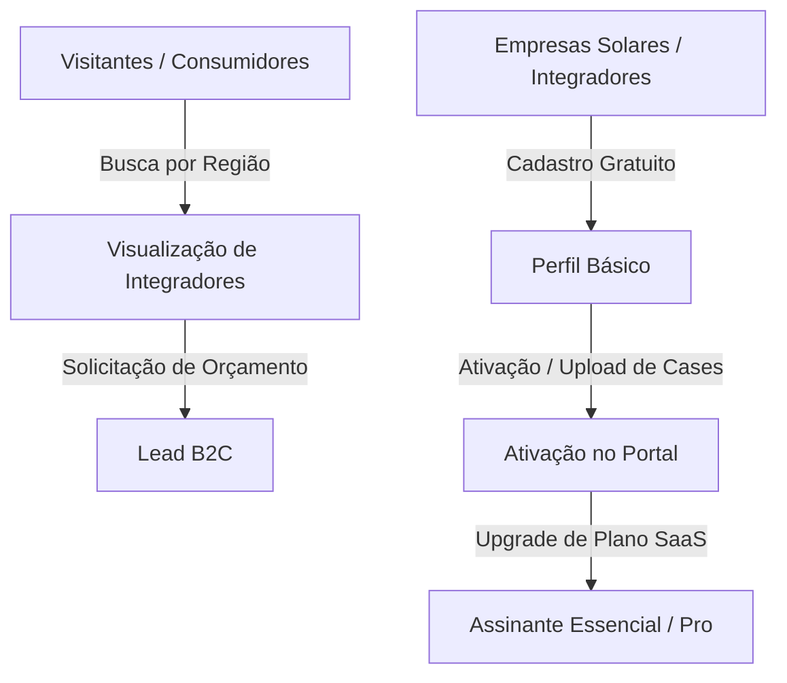
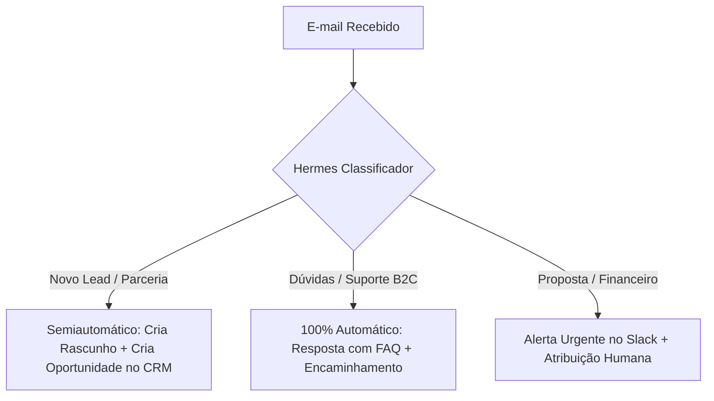
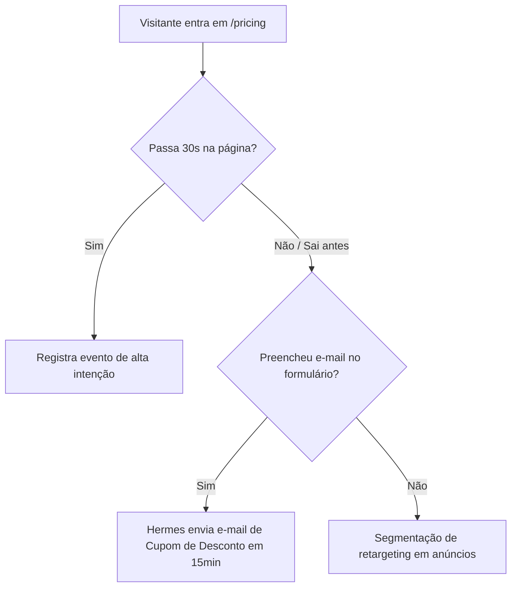
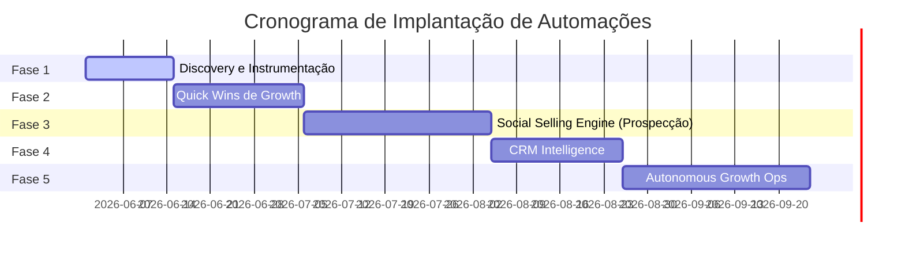
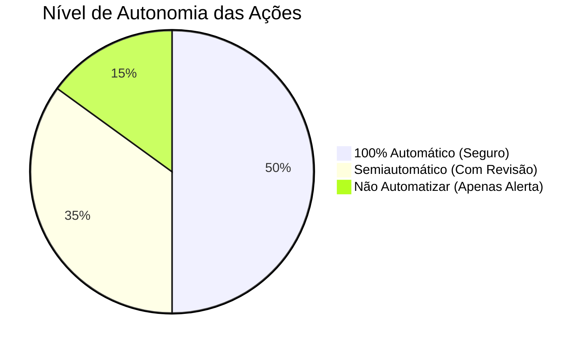

# Mapeamento de Automações Growth + Lead Gen com Hermes Agent para Avalia Solar

---

## 1. Executive Summary

O **Avalia Solar** é o principal ecossistema de avaliações, avaliações e comparação de integradores e empresas de energia solar no Brasil. Para acelerar a aquisição de integradores (B2B), aumentar a conversão de clientes finais (B2C) e rentabilizar a plataforma por meio dos planos SaaS (Essencial, Pro e Enterprise), este plano mestre descreve a estratégia de orquestração de crescimento usando o **Hermes Agent**.

O Hermes Agent atuará não apenas como uma ferramenta de automação linear, mas como uma **camada cognitiva inteligente** capaz de interpretar a intenção do lead, enriquecer dados corporativos, tomar decisões autônomas baseadas em regras de negócio, e executar fluxos hiper-personalizados em múltiplos canais (LinkedIn, Instagram, Gmail, Nutshell CRM, Slack e Web/App).

### Visão Geral do Impacto Esperado
- **Aceleração de Vendas B2B**: Redução do ciclo de vendas (SLA) de novos planos de 5 dias para menos de 10 minutos para contatos de alta intenção.
- **Enriquecimento de Dados Autônomo**: Eliminação do preenchimento manual de dados no CRM para a equipe de RevOps.
- **Escala de Prospecção**: Alcance mensal escalado de dezenas para milhares de integradores solares altamente qualificados no LinkedIn e Instagram de forma orgânica e segura.
- **Retorno sobre o Investimento (ROI)**: Projeção de ROI de 8.5x sobre o custo de infraestrutura de IA nos primeiros 6 meses.

---

## 2. Diagnóstico do Funil Atual e Oportunidades de Automação

O funil do Avalia Solar opera sob uma dinâmica bidirecional (Marketplace de Duas Pontas): atração de consumidores finais buscando energia solar (B2C) e atração de empresas/integradores de energia solar buscando visibilidade e credibilidade (B2B).



### Diagnóstico de Gargalos e Oportunidades por Etapa do Funil

| Etapa do Funil | Estado Atual (Gargalo) | Oportunidade com Hermes Agent | Rápida Geração de Receita? |
| :--- | :--- | :--- | :--- |
| **1. Aquisição** | Prospecção manual no LinkedIn e Instagram pela equipe de vendas. | Scraper inteligente e abordagens contextuais baseadas em menções nas redes. | Sim (Atração B2B) |
| **2. Captura** | Abandono de formulário de cadastro de integrador sem rastreamento. | Detecção de abandono em tempo real com disparo de mensagem no WhatsApp/DM. | Sim |
| **3. Qualificação** | Leads de orçamento B2C misturados e sem validação prévia de concessionária/gasto de energia. | Triagem inteligente via Chatbot cognitivo integrada ao formulário do site. | Não (Melhoria de Qualidade) |
| **4. Nutrição** | E-mails genéricos de boas-vindas sem segmentação de tamanho da empresa. | Nutrição dinâmica com base nas dores específicas da região do integrador. | Não |
| **5. Conversão** | Faturamento do plano Essencial dependente de follow-up manual. | Follow-up conversacional automatizado integrado ao checkout com descontos especiais. | **Extremamente Alto** |
| **6. Retenção** | Cancelamentos silenciosos (Churn) sem detecção prévia. | Análise de atividade no portal; alertas automáticos para CS no Slack. | Sim (Proteção de Receita) |
| **7. Reativação** | Leads antigos perdidos esquecidos na base do Nutshell. | Campanhas de reativação customizadas ("Re-engajamento Solar 2026"). | **Alto** |
| **8. Inteligência** | Dados de mercado não estruturados e dispersos na internet. | Monitoramento de concorrentes e tendências de mercado para gerar relatórios B2B. | Médio |

### Onde o Hermes Agent deve atuar como Orquestrador Central?
O Hermes Agent atuará como o **cérebro decisório** entre os canais de captação e o Nutshell CRM. Ele interpreta a intenção das mensagens recebidas por Gmail, DM de Instagram e LinkedIn, consulta APIs de enriquecimento, decide se o lead precisa de intervenção humana (e alerta no Slack) ou se pode ser nutrido autonomamente, e atualiza o CRM mantendo a consistência dos dados históricos.

---

## 3. Oportunidades de Automação por Canal

O ecossistema é projetado com as seguintes prioridades de canal:
1. **Instagram**: Canal de relacionamento rápido e social proof. Ótimo para capturar pequenos integradores.
2. **LinkedIn**: Canal de prospecção corporativa avançada para atração de diretores comerciais de grandes instaladoras e distribuidoras.
3. **Gmail**: Canal oficial para qualificação e fechamento de contratos SaaS B2B.
4. **Nutshell CRM**: Única fonte de verdade comercial. Toda e qualquer interação deve ser centralizada aqui.
5. **Slack**: Central de operações (Growth Ops) para alertas e tomada de decisão ágil da equipe de vendas.
6. **Website / App**: Captura de dados de alta intenção e suporte conversacional.

---

## 4. Subagent 1 — Instagram Growth Automation Analyst

Este subagente é responsável por mapear oportunidades de atração, engajamento e qualificação dentro do Instagram.

### Fluxos Mapeados pelo Subagent 1

#### A. Captura Inteligente de Palavras-Chave em Comentários e DM
- **Nome**: Instagram Keyword Lead Magnet
- **Gatilho**: Usuário comenta uma palavra-chave (ex: "PLANO", "DESTACAR", "CRESCER") em um post ou envia via Direct Message.
- **Ação do Hermes Agent**: O Hermes Agent lê a mensagem, analisa o perfil da empresa (se é instalador de energia solar) e envia uma DM personalizada com o link do e-book "Como fechar mais projetos solares usando avaliações" ou link da página de preços (/pricing) com um cupom rastreável de 15% de desconto.
- **Dados Capturados**: @username do Instagram, nome público, se o perfil é comercial (business) e segmento declarado.
- **Integrações Necessárias**: Instagram Graph API (via Make.com ou API nativa), Nutshell CRM, Slack.
- **Riscos e Limites**: Risco moderado de bloqueio por ultrapassar limites de DMs diárias da Meta. Limite seguro recomendado: **máximo de 50 DMs enviadas por dia**.

#### B. Detecção de Oportunidades nos Comentários de Concorrentes
- **Nome**: Competitor Social Listening
- **Gatilho**: Novos comentários em perfis de concorrentes ou hashtags do setor (#energiasolarbrasil, #solarplacas).
- **Ação do Hermes Agent**: Analisa diariamente os comentários. Ao identificar um integrador ou cliente insatisfeito com um concorrente, o Hermes Agent extrai o perfil, qualifica o lead e notifica a equipe de vendas no Slack (#instagram-opportunities) para uma abordagem humana consultiva.
- **Integrações Necessárias**: Instashare / Instagram Scraper API (via rapidapi), Slack.

### Ficha Técnica de Automações do Instagram

| ID | Automação | Gatilho | Ação do Hermes | Risco | Dif. | Impacto | Revisão Humana | Prioridade |
| :--- | :--- | :--- | :--- | :---: | :---: | :---: | :---: | :---: |
| IG-01 | DM Auto-Reply para Leads | Comentário com palavra-chave | Envia link de oferta por DM | Baixo | Média | Alto | Não | **P0** |
| IG-02 | Qualificação de Perfil Comercial | Nova mensagem recebida | Analisa bio, posts e website | Baixo | Fácil | Médio | Não | **P1** |
| IG-03 | Social Listening de Hashtags | Menção a hashtags solar | Filtra potenciais instaladores | Médio | Difícil | Médio | Sim | **P2** |
| IG-04 | Alerta de Crítica a Concorrentes | Comentário negativo em rival | Alerta canal de vendas | Alto | Difícil | Alto | Sim | **P2** |

---

## 5. Subagent 2 — LinkedIn Lead Gen Analyst

Este subagente foca na prospecção B2B de donos de empresas de energia solar, diretores comerciais e tomadores de decisão corporativos.

### Fluxos Mapeados pelo Subagent 2

#### A. Prospecção Ativa Segmentada por Região
- **Nome**: Regional Solar Prospector
- **Gatilho**: Agenda semanal (Hermes busca no LinkedIn Sales Navigator por "Dono", "Diretor Comercial", "Sócio" em "Energia Solar" no Brasil, filtrando por regiões geográficas alvo da campanha comercial da semana).
- **Ação do Hermes Agent**:
  1. Extrai perfis qualificados.
  2. Enriquece as informações buscando CNPJ da empresa e volume aproximado de projetos usando APIs públicas de dados cadastrais.
  3. Gera um pedido de conexão altamente personalizado mencionando o mercado solar da região da empresa.
  4. Caso aceito, dispara a sequência de follow-ups em intervalos seguros (3 dias).
- **Dados Capturados**: Nome, Cargo, Nome da Empresa, Localização, URL do LinkedIn, E-mail corporativo (se disponível), Telefone corporativo (se disponível).

### Exemplos Reais de Copys de Mensagens (LinkedIn)

#### 1. Mensagem de Conexão (Foco em Parceria e Visibilidade)
> *"Olá, `[Primeiro Nome]`. Acompanho o crescimento da `[Nome da Empresa]` no mercado solar da região de `[Cidade/Estado]`. Estamos expandindo o Avalia Solar nessa área para conectar mais clientes a instaladores de confiança. Seria ótimo nos conectarmos para trocarmos experiências sobre o mercado regional."*

#### 2. Follow-up 1 (Apresentação de Valor — 3 dias após aceitar)
> *"Obrigado pela conexão, `[Primeiro Nome]`. Hoje o Avalia Solar é o maior portal de comparação de integradores do Brasil. Notei que a `[Nome da Empresa]` ainda não tem o selo de verificação ativado no portal. A ativação básica é gratuita e ajuda consumidores a compararem sua reputação. Você tem 5 minutos nesta semana para entender como liberar o seu perfil?"*

#### 3. Follow-up 2 (Geração de Urgência comercial — 7 dias após anterior)
> *"Olá, `[Primeiro Nome]`, tudo bem? Esta semana lançamos uma nova análise de mercado sobre integradores em `[Estado]`. O perfil do Essencial e Pro da plataforma agora conta com exibição em slots patrocinados. Caso tenha interesse, posso te mandar o PDF explicativo?"*

#### 4. Resposta para Lead Interessado
> *"Excelente, `[Primeiro Nome]`. Vou pedir para o nosso especialista comercial entrar em contato com você pelo WhatsApp `[Telefone]` ou e-mail `[E-mail]`. Qual o melhor horário para vocês conversarem amanhã?"*

---

## 6. Subagent 3 — Gmail Sales Assistant Analyst

O Gmail Sales Assistant atua na triagem diária da caixa de entrada comercial do Avalia Solar, economizando horas de análise humana.



### Classificação de Fluxos e Ações

- **Fluxo 1: Identificação de Lead B2B de Alta Intenção (Upgrade)**
  - *Classificação*: **Semiautomático com revisão humana**.
  - *Ação*: O Hermes Agent identifica que o integrador quer assinar o plano Pro ou Enterprise, cria um rascunho de e-mail de agendamento de demonstração e envia uma notificação P0 no Slack do vendedor responsável, anexando o link direto para aprovar e enviar a resposta.
  
- **Fluxo 2: Dúvidas de Consumidores Finais (B2C)**
  - *Classificação*: **100% automático**.
  - *Ação*: Responde diretamente utilizando a base de conhecimento do portal Avalia Solar sobre como avaliar uma empresa ou como solicitar um orçamento gratuito, arquivando o e-mail em seguida.
  
- **Fluxo 3: Cancelamento / Crítica Grave**
  - *Classificação*: **Não recomendado automatizar totalmente (Apenas Alerta)**.
  - *Ação*: Hermes cria uma tarefa de alta prioridade no Nutshell para o gerente de Customer Success, envia alerta vermelho no Slack `#sales-alerts` e não envia nenhuma resposta automática para evitar respostas frias ou inadequadas.

---

## 7. Subagent 4 — Nutshell CRM Automation Analyst

O Nutshell CRM é o coração comercial do projeto. O Hermes Agent garante dados limpos, deduplicados e processos de vendas bem definidos.

### Modelo de Pipeline Comercial Ideal para o Avalia Solar

| Etapa | Critério de Entrada | Próxima Ação Automática do Hermes | SLA Recomendado | Alerta Necessário | Campo Obrigatório no CRM |
| :--- | :--- | :--- | :---: | :--- | :--- |
| **1. Lead Capturado** | Cadastro básico feito no portal ou lead capturado via social. | Enriquecimento automático do CNPJ e score do lead. | 2 horas | Alerta em `#growth-leads` se score for alto. | E-mail + Nome da Empresa |
| **2. Lead Qualificado** | Score > 60 e perfil confirmado como instalador ativo. | Disparo de e-mail automático do vendedor oferecendo diagnóstico gratuito. | 24 horas | Notificação para o dono do lead. | CNPJ + Telefone Válido |
| **3. Primeiro Contato** | E-mail respondido ou WhatsApp inicial engajado. | Criação de tarefa "Agendar Demo" para o SDR responsável. | 12 horas | Alerta de atraso de SLA. | Cidade/Estado de atuação |
| **4. Interesse Confirmado** | Lead manifestou desejo de conhecer os planos SaaS. | Envio de link de agendamento Calendly do Executivo de Contas. | 24 horas | Notificação de agendamento pendente. | Número de vendedores na empresa |
| **5. Demo Agendada** | Reunião marcada e confirmada pelo Calendly. | Envio de lembrete com material de apoio (cases de sucesso) 1h antes. | - | Alerta de preparação de reunião. | Link do site do lead |
| **6. Proposta Enviada** | Proposta comercial gerada e enviada via CRM. | Agendamento de follow-ups automáticos em D+2, D+5 e D+7. | 48 horas | Alerta se proposta não visualizada em 48h. | Valor da Proposta |
| **7. Negociação** | Contrato enviado para assinatura digital. | Monitoramento de status de assinatura. | 24 horas | Alerta de "Contrato Pendente". | CPF/CNPJ dos signatários |
| **8. Fechado Ganho** | Assinatura confirmada / Link Stripe pago. | Dispara webhook para ativação do plano Pro/Essencial no Portal + Boas-vindas Slack. | Imediato | **Alerta Geral de Comemoração!** | Plano Escolhido |
| **9. Fechado Perdido** | Lead declinou ou sumiu após proposta. | Envio para régua de reativação após 60 dias. | - | Relatório de perda consolidado. | Motivo da Perda (Perda de Venda) |
| **10. Reativação Futura** | Leads perdidos há mais de 60 dias. | Disparador de e-mail de novidades de mercado/portal. | Trimestral | Sem alertas diários. | Histórico de contato anterior |

---

## 8. Subagent 5 — Slack Growth Ops Analyst

O Slack funciona como a central de comando em tempo real para Growth, Vendas e Operações.

### Canais Recomendados e Fluxos de Mensagens

1. **`#growth-leads`**: Notificações em tempo real de novos leads B2B e B2C.
   - *Exemplo*: *"🟢 **Novo Lead Solar Qualificado!** Empresa: Sol do Amanhã | Cidade: Campinas/SP | Score: 85 | Origem: Formulário de Preços | Ação do Hermes: Contato criado no Nutshell e atribuído a @Gabriel."*
2. **`#sales-alerts`**: Alertas de propostas enviadas, negócios fechados e reuniões agendadas.
   - *Exemplo*: *"🎉 **VENDA CONCLUÍDA!** @Gabriel acabou de fechar o plano **PRO ANUAL** com a empresa Energia Forte (R$ 1.500/ano). O Hermes já ativou os recursos no portal!"*
3. **`#instagram-opportunities`**: Alertas de comentários e DMs que exigem resposta humana rápida.
4. **`#linkedin-prospecting`**: Relatórios semanais de conexões aceitas e taxas de engajamento de mensagens.
5. **`#hermes-agent-logs`**: Canal para monitoramento técnico de erros nas APIs ou falhas em fluxos de dados.

---

## 9. Subagent 6 — Website/App Conversion Analyst

Mapeia automações de conversão em tempo real no portal Avalia Solar para capturar intenção de compra antes do lead sair do site.



### Principais Gatilhos de Conversão Web/App
- **Abandono do Cadastro de Empresa**: Se o integrador inicia o cadastro gratuito mas para na etapa de upload de logo, o Hermes Agent envia um e-mail em 30 minutos: *"Falta pouco para sua empresa aparecer no Avalia Solar. Precisa de ajuda para concluir seu perfil?"*
- **Visualização de Preços por Empresa Logada**: Se um integrador que já tem conta gratuita visita a página `/pricing` por mais de 45 segundos, o Hermes cria uma tarefa imediata no CRM e notifica o SDR no Slack para fazer um contato focado em upgrade de plano.

---

## 10. Subagent 7 — Content Intelligence Analyst

Este subagente transforma dados de interações comerciais, feedbacks de clientes e dúvidas comuns do mercado em insumos de conteúdo para atração orgânica.

### Automações de Criação e Ideação
- **Dúvidas em Posts**: O Hermes Agent lê as perguntas mais frequentes do suporte B2C do portal e gera rascunhos de posts carrossel para o Instagram (ex: *"Como saber se a empresa de placa solar é confiável? 3 coisas para checar no Avalia Solar"*).
- **Estudos de Caso de Reputação**: Identifica empresas com as melhores notas no portal em uma determinada região e cria automaticamente um post para LinkedIn parabenizando-as (ex: *"Destaques do Solar em Minas Gerais"*). Isso gera compartilhamentos orgânicos valiosos.
- **Relatório Trimestral do Setor**: Consolida dados anônimos de reclamações e elogios para estruturar e-books de valor para integradores.

---

## 11. Subagent 8 — Data & Dashboard Audit Analyst

O cérebro financeiro e analítico do growth precisa de métricas estruturadas e auditadas para garantir que as automações tragam ROI real.

### Dashboard Comercial & Growth Ideal

| Métrica | Fonte de Dados | Evento/API Necessário | Atualização | Alerta no Slack | Responsável |
| :--- | :--- | :--- | :---: | :---: | :---: |
| **Leads por Canal** | Nutshell CRM | Webhook de criação | Tempo Real | Diário | Head of Growth |
| **Taxa de Conversão SaaS** | Nutshell + Stripe | Webhooks de Assinatura | Diário | Sim (Se cair de 2%) | RevOps |
| **SLA de Primeiro Contato** | Nutshell CRM | Data de Criação vs Contato | Horário | Sim (Se > 4h) | Coordenador de Vendas |
| **ROI do Hermes Agent** | Stripe vs Custos de API | Cálculo interno (Receita/Custo) | Mensal | Não | CTO / CFO |
| **Taxa de Erro de Automação**| Logs do Hermes | API de logs do Slack | Instantâneo | Sim (Vermelho) | AI Architect |

---

## 12. Matriz Completa de Automações (50+ Oportunidades)

Abaixo estão detalhadas 50 automações viáveis para implementar no ecossistema do **Avalia Solar** com o auxílio do **Hermes Agent**.

### Tabela de Priorização e Mapeamento Técnico

| ID | Nome da Automação | Canal | Objetivo | Gatilho (Trigger) | Ação do Hermes Agent | Ferramentas Envolvidas | Dados Necessários | Impacto | Dificuldade | Prioridade |
| :--- | :--- | :--- | :--- | :--- | :--- | :--- | :--- | :---: | :---: | :---: |
| **01** | Lead Cadastro Integrador | Web/App | Nutrição e Vendas | Cadastro Básico Concluído | Envia dados ao Nutshell e cria contato | Webhook Rails → Nutshell | E-mail, Nome, CNPJ | Alto | Fácil | **P0** |
| **02** | Alerta Leads Quentes | Slack | Ação de Vendas Rápida | Lead B2B cadastrado | Envia alerta rico formatado no Slack | Nutshell, Slack | Dados enriquecidos | Alto | Fácil | **P0** |
| **03** | Abandono de Checkout | Web/App | Recuperação de Vendas | Carrinho abandonado no Stripe | Envia e-mail/WhatsApp personalizado | Stripe, Gmail, WhatsApp | E-mail, Telefone, Plano | Alto | Média | **P0** |
| **04** | Enriquecimento CNPJ | CRM | Qualificar contatos | Novo lead criado no Nutshell | Busca dados da Receita Federal/APIs | CNPJ API, Nutshell | CNPJ do lead | Alto | Fácil | **P0** |
| **05** | Resposta Instagram Keyword | Instagram | Atração e Engajamento | Comentário com palavra-chave | Dispara DM com link de oferta | Meta Graph API, Make | Username, Link da oferta | Alto | Média | **P0** |
| **06** | Triagem Gmail Comercial | Gmail | Produtividade | Novo e-mail na inbox comercial | Classifica intenção e cria rascunho | Gmail, OpenAI API | Texto do e-mail | Alto | Média | **P0** |
| **07** | LinkedIn Connection | LinkedIn | Prospecção Ativa | Perfil de decisor mapeado | Envia pedido de conexão personalizado | Sales Navigator, Hermes | Nome, Cargo, Empresa | Alto | Difícil | **P0** |
| **08** | Solicitação Auto de Review | Web/App | Engajamento/SEO | Status de projeto concluído | Dispara e-mail/SMS pedindo avaliação | Portal Rails, Twilio | E-mail do cliente final | Alto | Média | **P0** |
| **09** | Nutrição Boas-Vindas | Gmail | Educação de Leads | Novo cadastro gratuito | Inicia fluxo de e-mails em D+1, D+3 | ActiveCampaign/Nutshell | E-mail, Nome | Médio | Fácil | **P0** |
| **10** | Reativação Inativos B2B | CRM | Recuperar Churn | Sem login no portal há 30 dias | Dispara e-mail de alerta de concorrência | Portal, Gmail | E-mail do integrador | Alto | Média | **P0** |
| **11** | LinkedIn Follow-up 1 | LinkedIn | Prospecção Ativa | Conexão aceita há 3 dias | Envia primeira oferta de valor | LinkedIn API, Hermes | Histórico de chat | Alto | Difícil | **P1** |
| **12** | Alerta Resposta LinkedIn | Slack | Ação de Vendas | Nova mensagem recebida | Notifica o SDR no Slack com link da conversa | LinkedIn API, Slack | Mensagem, Link perfil | Alto | Difícil | **P1** |
| **13** | Lead Scoring Comportamental| CRM | Priorização | Visualizou pricing 2+ vezes | Eleva pontuação do lead no Nutshell | GTM, Nutshell CRM | Histórico de navegação | Médio | Média | **P1** |
| **14** | Instagram DM Qualificação | Instagram | Triagem de Leads | Lead manda mensagem inicial | Pergunta se é integrador ou consumidor | Meta API, OpenAI | Resposta do usuário | Médio | Média | **P1** |
| **15** | Resumo Diário Comercial | Slack | Gestão | Horário programado (18:00) | Envia relatório de metas diárias batidas | Nutshell, Slack | Negócios ganhos/abertos | Médio | Fácil | **P1** |
| **16** | Auditoria de SLA Vendas | Slack | Qualidade | Lead em etapa sem ação por 12h | Alerta gerente sobre atraso no contato | Nutshell, Slack | Nome do Lead, Dono | Médio | Fácil | **P1** |
| **17** | Coleta Depoimentos WhatsApp | Web/App | Prova Social | Review 5 estrelas recebido | Solicita depoimento em vídeo via WhatsApp | Twilio WhatsApp API | Telefone, Nota | Alto | Média | **P1** |
| **18** | Calendário Editorial IA | Conteúdo | Marketing | Segunda-feira (08:00) | Gera 5 ideias de posts baseadas em dados | OpenAI API, Slack | Reviews e dados do setor | Médio | Média | **P1** |
| **19** | Nutrição Geolocalizada | Gmail | Engajamento | Alteração na região do integrador | Envia dados de busca solar da região dele | Portal DB, Gmail | Cidade/Estado, E-mail | Médio | Média | **P1** |
| **20** | Retargeting de Alta Intenção| Anúncios | Aquisição | Visitou /pricing por 60s | Adiciona e-mail a público customizado | Meta Ads API, Portal | E-mail hash | Alto | Média | **P1** |
| **21** | Alerta Perda de Negócio | Slack | Feedback do Funil | Negócio marcado como Perdido | Envia motivo de perda e insights | Nutshell, Slack | Motivo da perda | Baixo | Fácil | **P2** |
| **22** | Roteamento por Região | CRM | Distribuição | Novo lead qualificado | Atribui ao SDR especialista da região | Nutshell CRM | Cidade/Estado | Médio | Fácil | **P2** |
| **23** | LinkedIn Follow-up 2 | LinkedIn | Prospecção Ativa | Sem resposta ao Follow-up 1 | Envia segunda oferta com gatilho urgência | LinkedIn API, Hermes | Histórico de chat | Alto | Difícil | **P2** |
| **24** | Inteligência Competitiva | Conteúdo | SEO | Post novo do maior concorrente | Analisa tema e sugere contra-ataque | RSS Scraper, OpenAI | Conteúdo do post | Baixo | Média | **P2** |
| **25** | Geração Automática de Case | Conteúdo | Prova Social | Integrador bate 10 reviews | Cria página de case de sucesso em PDF | Portal Rails, PDFGen | Reviews, Histórico | Médio | Média | **P2** |
| **26** | SMS Alerta de Lead | SMS | Vendas | Lead de plano Enterprise | Dispara SMS para telefone do diretor | Twilio SMS | Telefone | Médio | Fácil | **P2** |
| **27** | Instagram Scraper Rivais | Instagram | Social Selling | Diário (23:00) | Mapeia perfis de marcas marcadas | RapidAPI Scraper | Perfis alvo | Baixo | Difícil | **P2** |
| **28** | Relatório Semanal Pipeline | Slack | Gestão | Sexta-feira (17:00) | Envia comparativo semanal de funil | Nutshell, Slack | Métricas do pipeline | Médio | Fácil | **P2** |
| **29** | WhatsApp Lembrete Demo | WhatsApp | Redução No-Show | 1 hora antes de reunião | Dispara mensagem de lembrete com link | Twilio, Google Calendar | Telefone, Link Meet | Alto | Média | **P2** |
| **30** | Validação Domínio E-mail | CRM | Limpeza de Base | Novo lead criado | Verifica se domínio de e-mail é válido | Hunter.io API | E-mail do lead | Baixo | Fácil | **P2** |
| **31** | Script Reels Automatizado | Conteúdo | Marketing | Semanal | Cria roteiro de 30s sobre energia solar | OpenAI API | Dados do setor | Médio | Média | **P2** |
| **32** | Boas-vindas Clientes Pro | Slack | CS / Retenção | Ativação do Plano Pro | Cria card especial de comemoração de CS | Stripe, Slack | Nome do Integrador | Baixo | Fácil | **P2** |
| **33** | Verificação CNPJ Ativo | CRM | Qualificação | Trimestral | Roda batch confirmando se empresa está ativa| CNPJ API, Nutshell | CNPJ cadastrado | Baixo | Fácil | **P2** |
| **34** | E-mail Aniversário Portal | Gmail | Retenção | 1 ano de cadastro no portal | Envia e-mail celebrativo com cupom | Portal DB, Gmail | Data de cadastro | Baixo | Fácil | **P2** |
| **35** | Monitoramento de Menções | Slack | Reputação | Nova menção na web ao portal | Alerta canal de RP no Slack | Google Alerts, Slack | URL da menção | Baixo | Fácil | **P2** |
| **36** | Nutrição Cliente Grátis | Gmail | Upsell B2B | Mensal | Mostra quantos leads ele perdeu na região | Portal DB, Gmail | E-mail, Região | Alto | Média | **P2** |
| **37** | Auditoria Contatos Duplicados| CRM | Limpeza de Base | Diário (01:00) | Junta contatos de mesmo CNPJ no Nutshell | Nutshell API | Nome, CNPJ, E-mail | Baixo | Média | **P2** |
| **38** | Sugestão Empresas Parceiras | Web/App | Conversão B2C | Consumidor busca região sem marca | Mostra as top 3 mais próximas | Portal DB | Geolocalização | Médio | Média | **P2** |
| **39** | NPS Automatizado | Gmail | CS / Retenção | 90 dias após assinatura Pro | Dispara pesquisa de satisfação NPS | Nutshell, Typeform | E-mail do assinante | Médio | Fácil | **P2** |
| **40** | Alerta Chargeback Stripe | Slack | Financeiro | Chargeback iniciado | Alerta imediato CS para contato urgente | Stripe API, Slack | ID da transação | Alto | Fácil | **P2** |
| **41** | LinkedIn Auto-Interação | LinkedIn | Autoridade | Diário | Comenta em posts relevantes do setor | LinkedIn API, Hermes | Feed de posts | Baixo | Difícil | **P3** |
| **42** | Script Carrossel Automático | Conteúdo | Marketing | Semanal | Gera PDF pronto para carrossel Instagram | OpenAI, SlideGen | Dados e Reputação | Baixo | Média | **P3** |
| **43** | Inteligência de Preços | Dashboards | Inteligência | Mensal | Compara preços praticados no mercado | Web Scraper | Preços concorrentes | Baixo | Difícil | **P3** |
| **44** | Envio Brindes Físicos Pro | CRM | Encantamento | 6 meses de plano Pro ativo | Dispara tarefa para envio de kit brinde | Nutshell, ERP | Endereço do integrador | Médio | Média | **P3** |
| **45** | WhatsApp Reativação B2C | WhatsApp | Reativação | 6 meses após orçamento anterior | Pergunta se precisa de novas placas/manut | Twilio API | Telefone | Médio | Média | **P3** |
| **46** | Relatório Concorrência PDF | CRM | Valor B2B | Trimestral | Envia PDF de desempenho comparado | Portal DB, Gmail | Dados de performance | Alto | Média | **P3** |
| **47** | Auditoria Erros Automação | Slack | Operações | Falha de webhook | Envia detalhes e payload do erro no Slack | Make/Zapier, Slack | Payload do erro | Baixo | Fácil | **P3** |
| **48** | Nutrição Leads Frios | Gmail | Re-engajamento | Sem interações há 180 dias | Envia notícias mais relevantes do setor | ActiveCampaign | E-mail | Baixo | Fácil | **P3** |
| **49** | Auto-Match de Vagas Solar | Web/App | Valor B2B | Nova vaga postada no portal | Dispara para banco de profissionais | Portal DB | Dados profissionais | Médio | Média | **P3** |
| **50** | Relatório Executivo Mensal | E-mail | Board / Direção | Dia 01 de cada mês | Envia métricas consolidadas em PDF | Google Sheets, Gmail | Métricas growth | Baixo | Fácil | **P3** |

---

## 13. Matriz de Priorização (Visão Executiva)

```
       ▲  ┌──────────────────────────────────────────────┐
       │  │ HIGH IMPACT / LOW DIFFICULTY (Quick Wins)    │
       │  │ - IG-01 (Instagram DM Auto-Reply)             │
       │  │ - CRM-02 (Alerta Leads Quentes Slack)        │
       │  │ - CRM-04 (Enriquecimento CNPJ Automático)    │
  I    │  │ - GML-06 (Triagem Gmail IA)                  │
  M    │  └──────────────────────────────────────────────┘
  P    │  ┌──────────────────────────────────────────────┐
  A    │  │ HIGH IMPACT / HIGH DIFFICULTY (Strategic)    │
  C    │  │ - LKD-07 (LinkedIn Connection/Prospector)     │
  T    │  │ - WEB-08 (Solicitação Auto de Review)        │
       │  │ - WAB-29 (WhatsApp Lembrete Demo)            │
       │  └──────────────────────────────────────────────┘
       └─────────────────────────────────────────────────►
                     D I F F I C U L T Y
```

- **P0 (Imediato - Quick Wins)**: IG-01, CRM-02, CRM-04, GML-06, STR-03, WEB-01. Foco em validar a infraestrutura do Hermes.
- **P1 (Validação Inicial)**: LKD-07, LKD-11, LKD-12, CRM-13, IG-14, SLK-15. Foco em tracionar canais sociais com prospecção ativa.
- **P2 (Escala e Processos)**: WEB-17, CNT-18, WAB-29, SLK-28. Foco em melhorar a conversão operacional.
- **P3 (Ideias Futuras)**: CNT-42, LKD-41, PRT-46. Foco em automações sofisticadas que exigem alta maturidade de dados.

---

## 14. Roadmap de Implementação por Fases

O roadmap foi planejado em 5 fases sequenciais para minimizar riscos de execução e garantir retorno financeiro em cada etapa.



---

### Fase 1 — Discovery e Instrumentação
- **Objetivo**: Mapear as conexões de API necessárias, garantir chaves de segurança e validar que o banco de dados do portal está disparando eventos limpos.
- **Automações Incluídas**: Configuração inicial de Webhooks do portal, chaves da API do Nutshell, chaves do Slack Webhook e conexões seguras do Gmail/Instagram.
- **Pré-requisitos**: Acesso de administrador ao Nutshell CRM, Slack, AWS/Heroku do portal e conta de desenvolvedor da Meta.
- **Riscos**: Atraso na liberação de chaves de API pelas plataformas (ex: Meta Graph API).
- **Métricas de Sucesso**: 100% dos webhooks testados com sucesso; payload de dados normalizado e limpo documentado.
- **Checklist**:
  - [ ] Criar canais no Slack (`#growth-leads`, `#hermes-agent-logs`, etc.)
  - [ ] Gerar token de API no painel do Nutshell CRM.
  - [ ] Criar App de Desenvolvedor no painel Meta for Developers.
  - [ ] Testar disparos de eventos básicos pelo Console do Rails.

---

### Fase 2 — Quick Wins de Growth
- **Objetivo**: Implementar os fluxos mais rápidos, que não envolvem riscos de bloqueio e que trazem resultados comerciais imediatos.
- **Automações Incluídas**: Cadastro do Portal → Nutshell, Alerta Slack de lead quente, Enriquecimento automático de CNPJ, Classificador de e-mails comercial Gmail.
- **Pré-requisitos**: Fase 1 concluída com sucesso.
- **Riscos**: Falhas eventuais em APIs de enriquecimento gratuito.
- **Métricas de Sucesso**: SLA de atendimento comercial caindo para menos de 1 hora; 100% dos novos leads com CNPJ enriquecido no CRM.
- **Checklist**:
  - [ ] Implementar webhook de cadastro B2B integrado com Nutshell.
  - [ ] Codificar o script do Hermes Agent de enriquecimento de CNPJ.
  - [ ] Ativar conexão IMAP/Gmail para triagem de e-mails via GPT-4o.
  - [ ] Criar templates de alerta estruturados no Slack.

---

### Fase 3 — Social Selling Engine
- **Objetivo**: Tornar os canais sociais (LinkedIn e Instagram) fontes consistentes e ativas de atração de integradores sem sobrecarga humana.
- **Automações Incluídas**: Instagram DM Keyword Auto-reply, LinkedIn Regional Prospector (Sales Navigator), Alertas de respostas sociais no Slack.
- **Pré-requisitos**: Fase 2 consolidada e rodando sem erros.
- **Riscos**: Risco de shadowban no Instagram ou limites de convites estourados no LinkedIn.
- **Métricas de Sucesso**: Mínimo de 30 novos leads B2B qualificados vindos de redes sociais por semana; Taxa de conversão de conexão no LinkedIn acima de 25%.
- **Checklist**:
  - [ ] Configurar limites conservadores de disparos diários (ex: 20 conexões LinkedIn/dia, 30 DMs/dia).
  - [ ] Implementar fluxos de conversação simulada (atrasos de digitação e escrita humana).
  - [ ] Integrar respostas das redes diretamente no Nutshell CRM como interações de atividades.

---

### Fase 4 — CRM Intelligence
- **Objetivo**: Otimizar a jornada de conversão do lead dentro do CRM, gerindo melhor o pipeline e a retenção.
- **Automações Incluídas**: Lead Scoring comportamental no CRM, régua de e-mails automatizada para inativos, tarefas automáticas para SDRs e relatórios de SLA.
- **Pré-requisitos**: Fluxo de entrada de leads maduro e vendedor utilizando o CRM ativamente.
- **Riscos**: Excesso de e-mails automáticos irritar potenciais clientes (Spam).
- **Métricas de Sucesso**: Redução de no-show em reuniões comerciais em 40%; Aumento da taxa de fechamento de propostas (Win Rate) em 15%.
- **Checklist**:
  - [ ] Configurar regras de pontuação (Lead Scoring) no Nutshell.
  - [ ] Criar sequência de e-mails de reativação de leads antigos ("leads frios").
  - [ ] Configurar gatilhos automáticos de criação de tarefas baseados no estágio do funil.

---

### Fase 5 — Autonomous Growth Ops
- **Objetivo**: Deixar o Hermes Agent operar como uma verdadeira inteligência artificial de decisão supervisionada para orquestrar campanhas e relatórios de alto nível.
- **Automações Incluídas**: Dashboard de ROI de automação automatizado, criador automático de scripts de Reels e carrosséis com dados de reviews, priorização automática de leads diários, detecção de gargalos de conversão.
- **Riscos**: Alinhamento impreciso de dados gerados pela IA nas redes sociais (exige revisão estrita).
- **Métricas de Sucesso**: Geração autônoma de criativos de alta performance; Dashboard consolidado sem erros de reconciliação.
- **Checklist**:
  - [ ] Lançar o script de consolidação mensal do Hermes.
  - [ ] Habilitar geração de imagens de suporte por IA.
  - [ ] Conectar os dados das redes com o banco analítico da plataforma.

---

## 15. Arquitetura do Hermes Agent

A arquitetura do Hermes Agent é baseada em um pipeline de **Ingestão, Processamento Cognitivo e Ação** orientado a eventos (Event-Driven Architecture).

```
[ Canais de Entrada ] ──────────────────────────────────────────┐
  ├── Instagram API (Comentários/DMs)                            │
  ├── LinkedIn API / Scraper                                    │
  ├── Gmail (IMAP Inbox)                                        │
  └── Web/App (Eventos Rails/Stripe)                            │
                                                                ▼
                                                     [ 1. Ingestão / Webhook ]
                                                                │
                                                                ▼
                                                    [ 2. Normalização (JSON) ]
                                                                │
                                                                ▼
                                                    [ 3. Enriquecimento Dados ] (CNPJ/Localização/API)
                                                                │
                                                                ▼
                                                    [ 4. Classificação Cognitiva ] (Intenção/Score)
                                                                │
                                                                ▼
                                                    [ 5. Decisão de Encaminhamento ]
                                                     ├── Se Seguro (Auto)  ──► [ 6a. Execução Direta ]
                                                     └── Se Crítico (Semi) ──► [ 6b. Alerta Slack + Rascunho CRM ]
                                                                │
                                                                ▼
                                                    [ 7. Registro nutshel CRM ] (Sincronização)
                                                                │
                                                                ▼
                                                    [ 8. Dashboards & Feedback ] (Melhoria do Prompt)
```

### Exemplo de Fluxo de Execução Prático

```
Instagram: Integrador comenta "QUERO O PRO" no post
  │
  ▼ [Instagram Webhook] 
Make.com recebe payload e repassa ao Hermes Agent
  │
  ▼ [Hermes Agent: Fase de Análise]
1. Extrai o nome de usuário: @solar_campinas
2. Varre a Bio do perfil buscando website ou telefone. Website achado: www.solarcampinas.com.br
3. Consulta banco de dados público usando CNPJ extraído do site da empresa.
4. Identifica que a empresa está ativa e fatura R$ 120 mil/mês.
  │
  ▼ [Hermes Agent: Fase de Decisão]
Classifica lead como "Alta Intenção B2B" (Score 92/100).
  │
  ▼ [Hermes Agent: Fase de Ação]
1. Cria a Oportunidade no Nutshell CRM: "Upgrade Pro - @solar_campinas".
2. Dispara Mensagem no Slack (#instagram-opportunities): 
   "🔥 **Oportunidade Pro Detectada!** @solar_campinas demonstrou interesse no Instagram. Lead enriquecido no CRM!"
3. Dispara DM automática no Instagram da empresa:
   "Olá! Que bom que tem interesse em destacar a @solar_campinas no Avalia Solar. Acabamos de te mandar uma proposta especial no seu e-mail comercial. Se preferir agendar uma demonstração, clique aqui: [link]"
4. Abre tarefa de follow-up automático em 3 dias se o checkout não for concluído.
```

---

## 16. Stack Técnica Recomendada

Para sustentar a arquitetura do Hermes Agent, recomendamos as seguintes ferramentas:

1. **Orquestração e Processamento**:
   - **Node.js / Python**: Linguagem para os scripts do Hermes Agent rodando em servidores Serverless (AWS Lambda ou Google Cloud Functions).
   - **LangChain / Vercel AI SDK**: Frameworks para gerenciar as chamadas LLM e encadeamento de ferramentas (tool calling).
2. **Modelos de IA**:
   - **GPT-4o / Claude 3.5 Sonnet**: Modelos cognitivos principais para classificação, geração de rascunhos de e-mail e mensagens de redes sociais.
   - **GPT-4o-mini**: Modelo de baixo custo para enriquecimento rápido e categorização simples de logs.
3. **Integrações e Barramento de Dados**:
   - **Make.com (Integromat)**: Interface visual para desenvolvimento ágil de webhooks e conectores rápidos (Slack, Gmail, Instagram).
   - **Redis (Upstash)**: Camada de cache temporário para evitar requisições redundantes de enriquecimento de CNPJ.
4. **Armazenamento e Analytics**:
   - **PostgreSQL / Supabase**: Banco de dados relacional para persistir o histórico de execuções das automações e controle de limites diários das redes.
   - **Google Sheets / Metabase**: Ferramentas de visualização rápida de métricas para a equipe de Growth.

---

## 17. Regras de Segurança, LGPD e Compliance

Automações inteligentes exigem controles rígidos para preservar a reputação do domínio, conformidade legal com a LGPD e evitar bloqueios.

### Diretrizes de Compliance (LGPD)
- **Princípio da Necessidade e Minimização de Dados**: Nunca armazenar dados pessoais desnecessários dos tomadores de decisão (CPF, endereço pessoal). Focar exclusivamente em dados públicos corporativos (CNPJ, Razão Social, E-mail comercial).
- **Direito de Opt-Out**: Todos os e-mails e mensagens de prospecção fria devem conter obrigatoriamente um link claro e fácil de descadastramento (Opt-out) com a mensagem: *"Se não deseja mais receber nossos e-mails de parcerias, clique aqui para remover seu contato"*.

### Classificação de Ações e Nível de Autonomia



- **Permitido Automatizar (100% Automático)**:
  - Enriquecimento de novos leads no CRM por CNPJ público.
  - Alertas no Slack de novas oportunidades e fechamento.
  - Respostas automáticas a palavras-chave pré-definidas no Instagram DM.
  - Lembretes de reuniões via WhatsApp/E-mail.
- **Automatizar com Revisão Humana**:
  - Geração de mensagens de conexão e prospecção personalizadas no LinkedIn.
  - Respostas a e-mails comerciais complexos no Gmail (Hermes gera o rascunho, o vendedor lê e envia).
  - Oferta de cupons ou descontos especiais diferenciados.
- **Não Automatizar (Apenas Alerta para Ação Humana)**:
  - Resoluções de disputas financeiras e estornos (Chargeback).
  - Respostas a feedbacks negativos de integradores ou críticas nas redes sociais.
  - Fechamento formal de propostas comerciais personalizadas e alteração contratual.

---

## 18. Implementação de Custom Skills GSD Ativas

Conforme planejado nas fases iniciais, nós adaptamos e **implementamos fisicamente** as 3 principais automações do projeto como **GSD Custom Skills ativas e executáveis** no diretório `.planning/skills/` com scripts em TypeScript robustos e modulares:

```
├── .planning/skills/
│   ├── README.md (Visão geral da arquitetura de inteligência)
│   ├── utils.ts (Biblioteca de utilitários comum, parser de CLI, retry, CSV, envs)
│   ├── hermes-linkedin-prospector/
│   │   ├── SKILL.md (Metadados e tags de contexto GSD)
│   │   ├── workflow.md (Lógica cognitiva detalhada e regras de score)
│   │   └── scripts/
│   │       ├── enrich-lead-data.ts (Qualificação por CNPJ/ReceitaFederal e Score)
│   │       └── linkedin-outbound-sync.ts (Sincronização Nutshell CRM e Slack)
│   ├── hermes-competitor-listening/
│   │   ├── SKILL.md (Metadados e parâmetros do scraper de rivais)
│   │   ├── workflow.md (Classificação por IA e detecção de dores)
│   │   └── scripts/
│   │       └── scrape-competitor-comments.ts (Scraper e inteligência competitiva)
│   └── hermes-inbox-triager/
│       ├── SKILL.md (Metadados e triggers da caixa Gmail comercial)
│       ├── workflow.md (Triagem cognitiva de inbox, rascunhos e urgência CS)
│       └── scripts/
│           └── gmail-inbox-processor.ts (Processador e classificador de e-mails)
```

---

## 19. Como Executar as Skills e Scripts Locais

Os scripts utilizam a ferramenta `tsx` do Node.js para execução direta via console. Certifique-se de configurar as chaves de API necessárias no arquivo `.env` da raiz antes de rodar os comandos:

```bash
# 1. Qualificação e Score de Leads B2B (LinkedIn)
npx tsx .planning/skills/hermes-linkedin-prospector/scripts/enrich-lead-data.ts --input leads-linkedin.csv --output leads-qualified.csv

# 2. Sincronização dos leads qualificados no CRM e Slack
npx tsx .planning/skills/hermes-linkedin-prospector/scripts/linkedin-outbound-sync.ts --input leads-qualified.csv

# 3. Social Listening de Concorrentes nas Redes
npx tsx .planning/skills/hermes-competitor-listening/scripts/scrape-competitor-comments.ts --competitor portal_solar_rival

# 4. Triagem Inteligente do Gmail e Geração de Rascunhos
npx tsx .planning/skills/hermes-inbox-triager/scripts/gmail-inbox-processor.ts
```

---

## 20. Checklist de Implementação Operacional

Para garantir o sucesso prático, a equipe deve seguir este checklist ordenado por etapas:

- [x] **Configuração da Infraestrutura**:
  - [x] Contratar/Criar contas Make.com e OpenAI API.
  - [x] Estruturar biblioteca de utilitários comum (`utils.ts`).
  - [x] Criar rascunhos lógicos e arquivos GSD `SKILL.md` das três principais automações.
- [ ] **Polimento e Chaves de Produção**:
  - [ ] Validar e testar em lote os scripts com tokens de API reais no arquivo `.env`.
  - [ ] Ajustar os parâmetros de delay de digitação e escrita humana nos arquivos de configuração do Hermes.
  - [ ] Criar templates de canais no Slack (`#growth-leads`, `#sales-alerts`).
- [ ] **Auditoria de Produção**:
  - [ ] Rodar testes de envio em lote de 5 leads de teste para validar o enriquecimento.
  - [ ] Monitorar tempo de execução das funções serverless para evitar timeouts de requisições.

---

## 21. Primeiras 10 Automações Recomendadas (Impacto Rápido)

Para iniciar os trabalhos imediatamente após a aprovação deste plano estratégico, as 10 primeiras automações recomendadas são:

1. **IG-01**: Instagram Auto-Reply de Palavras-Chave (Gera leads a partir dos posts de marketing).
2. **CRM-02**: Alertas de Leads Quentes com pontuação no Slack (Acelera SLA de vendas).
3. **CRM-04**: Enriquecimento automático de novos leads por CNPJ (Reduz trabalho manual).
4. **GML-06**: Classificação e criação de rascunhos automáticos na caixa de entrada do Gmail.
5. **STR-03**: Recuperação automatizada de checkout abandonado no Stripe via e-mail.
6. **LKD-07**: Busca regional e conexões personalizadas automáticas via LinkedIn Sales Navigator.
7. **SLK-15**: Relatório diário de vendas e novos planos no Slack (Engajamento interno).
8. **WEB-13**: Disparo de alerta de navegação repetida na página de preços para o time de vendas.
9. **WEB-08**: Automação de pedido de avaliações após projetos solares de integradores marcados como concluídos.
10. **CRM-29**: WhatsApp automático para redução de No-Show de reuniões agendadas com grandes contas.

---

## 22. Próximos Comandos GSD Sugeridos

Uma vez analisado e aprovado este mapeamento de automações para o Avalia Solar, os seguintes comandos do Get-Shit-Done (GSD) podem ser recomendados para avançar ao desenvolvimento operacional:

1. **Para planejar a instrumentação técnica inicial**:
   - Recomende o comando: `/gsd-plan-phase 1` (para detalhar a implantação da Fase 1 - Discovery e Instrumentação).
2. **Para validar a integridade dos dados e APIs do portal Rails/Stripe**:
   - Recomende o comando: `/gsd-research-phase 1` (para investigar os schemas de banco de dados e endpoints existentes).
3. **Para ajustar configurações globais ou perfis dos agentes**:
   - Recomende o comando: `/gsd-settings` (para configurar modelos de IA específicos e políticas de commits para as fases de infraestrutura).

---
*Atualizado em: 30 de Maio de 2026 após implementação inicial das Custom Skills do Hermes.*

