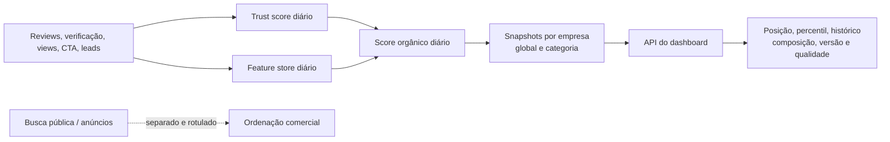

# Ranking transparente e auditável — implementação

## Contrato adotado

O dashboard passa a consumir **Ranking Orgânico de Performance** (`organic-performance-v1`). Ele não inclui patrocínio, prioridade comercial nem destaque pago. Busca pública e anúncios continuam podendo ter ordenação própria, mas não podem ser apresentados como este ranking.

## Persistência e auditoria

`company_ranking_snapshots` é append-only por intenção: cada linha guarda a empresa, escopo, versão, score, posição, população, percentil, composição, flags de qualidade, `data_through` e `computed_at`. Não se sobrescreve o passado; isso permite reproduzir o que uma empresa viu em uma data.

O worker `Analytics::RankingScoreWorker` calcula o score e então materializa snapshots global e por categoria. A API devolve apenas a última versão definida e até 90 dias de histórico daquele escopo.

## Regras e transparência exibidas

- Fórmula v1: `trust_score × 10 + engajamento ponderado dos últimos 7 dias`.
- Desempate determinístico: `company_id ASC`.
- Patrocínio não afeta o ranking orgânico.
- O payload contém versão, finalidade, escopo, fórmula, instante de processamento, dados até, composição e flags de qualidade.
- Sem snapshot, a API devolve `snapshot_unavailable`; a interface não inventa delta ou velocidade.

## Operação

1. Executar a migration.
2. Rodar `Analytics::TrustScoreWorker` e `Analytics::RankingScoreWorker` para backfill inicial.
3. Verificar a tabela por escopo, versão e data antes de liberar o dashboard.
4. Alertar se não houver snapshot nas últimas 26 horas ou se houver flag de qualidade.

## Próxima evolução recomendada

- Persistir snapshots por critério de avaliação, caso o filtro de critério precise alterar posição (hoje ele altera o quadrante, não o ranking canônico).
- Separar eventos brutos e métricas agregadas por janela 7/30/90 dias.
- Implementar controle administrativo versionado de pesos, aprovação dupla e changelog de fórmula.
- Criar testes de integração para worker, snapshots e autorização por plano.
