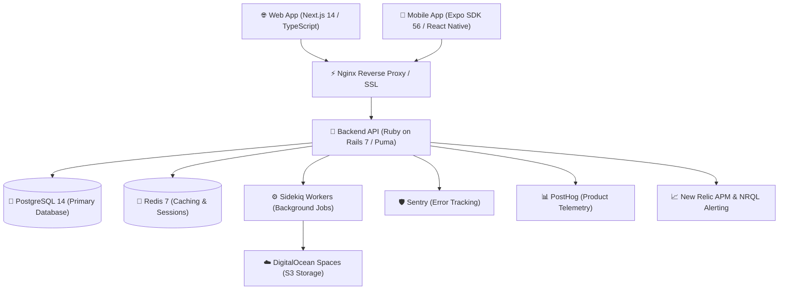

<div align="center">
  <p>
    <b>🌐 Language:</b> 
    <b>🇺🇸 English</b> | 
    <a href="README.pt-BR.md">🇧🇷 Português</a>
  </p>
  
  <h1>☀️ Avalia Solar 2026</h1>
  <p><b>Multi-tier SaaS Platform for Solar Energy Intelligence & Technical Consulting</b></p>

  <p>
    <a href="https://www.avaliasolar.com.br"></a>
    <a href="https://github.com/MrGr33n98/Avalia-Solar-2026/actions/workflows/deploy-v1.yml"></a>
    <a href="https://github.com/MrGr33n98/Avalia-Solar-2026/blob/main/LICENSE"></a>
  </p>

  <p>
    
    
    
    
    
    
    
    
  </p>
</div>

---

## 📌 Overview & Value Proposition

**Avalia Solar 2026** is a professional SaaS platform designed for evaluation, comparison, and technical consulting of solar energy solutions in Brazil.

Engineered under a **Scalable Monorepo** architecture, the platform integrates high-performance REST/GraphQL APIs, an optimized web frontend (PWA-first with Next.js 14 App Router), a native mobile application (Expo SDK 56), and complete infrastructure automation (CI/CD, Docker, DevSecOps, and Observability).

---

## 🏗️ System Architecture



---

## 📦 Monorepo Modules & Components

| Module | Stack | Description |
| :--- | :--- | :--- |
| **Backend (`AB0-1-back/`)** | Ruby 3.2, Rails 7, ActiveAdmin, GraphQL, RSpec | RESTful & GraphQL API, ActiveAdmin management dashboard, JWT authentication, Sidekiq background jobs, and Pundit authorization policies. |
| **Frontend (`AB0-1-front/`)** | Next.js 14 (App Router), React 18, TypeScript, Tailwind CSS | PWA-first Web application, React Server Components, ISR caching, SEO/AEO/GEO optimizations, and Claymorphism design system. |
| **Mobile (`AB0-1-mobile/`)** | Expo SDK 56, React Native 0.85, expo-router, Zustand | Native mobile application (iOS/Android) with file-based tab routing, offline caching, and safe-area support. |
| **Hermes Agent (`hermes-agent/`)** | Node.js, TypeScript, n8n integration | Autonomous growth automation agent for outbound prospecting, lead enrichment, and integration workflows. |
| **Videos (`videos/`)** | Remotion 4, React | Programmatic video rendering compositions for dynamic marketing video assets. |
| **Infrastructure (`infra/`)** | Docker, Docker Compose, Nginx, GitHub Actions | Production container orchestration, SSL/TLS reverse proxy, and automated CI/CD workflows. |

---

## ⚡ Quickstart Guide

### Prerequisites
- Docker & Docker Compose
- Node.js 20+ & Ruby 3.2+ (for local development outside Docker)

### 1. Clone & Spin up Stack
```bash
git clone https://github.com/MrGr33n98/Avalia-Solar-2026.git
cd Avalia-Solar-2026

# Start full application stack via Docker Compose
docker compose up -d
```

### 2. Run Database Migrations & Seeds
```bash
docker compose exec backend bundle exec rails db:migrate db:seed
```

### 3. Local Application URLs
- 🌐 **Web Frontend:** `http://localhost:3000`
- 🚀 **Backend API:** `http://localhost:3001`
- 🏥 **Healthcheck Endpoint:** `http://localhost:3001/health/liveness`

---

## 🧪 Test Suite & Code Quality

The repository enforces strict quality gates with automated testing across all architecture layers:

### Backend (Ruby on Rails)
```bash
cd AB0-1-back
bundle exec rspec           # Unit and integration test suite
bundle exec rubocop         # Static code analysis & Ruby linting
bundle exec brakeman -q     # SAST security vulnerability scanner
```

### Frontend (Next.js)
```bash
cd AB0-1-front
npm run test                # Unit tests with Jest
npm run typecheck           # TypeScript compilation & type checking
npm run test:e2e            # End-to-End tests with Playwright
```

### Mobile (Expo)
```bash
cd AB0-1-mobile
npm run test                # Unit tests with Jest
npm run ui-audit            # Hardcoded color audit & UI token validation
```

---

## 🔒 DevSecOps & Site Reliability (SRE)

- **Static & Dynamic Code Analysis (SAST/DAST):** CodeQL, StackHawk, Brakeman, RuboCop.
- **Dependency Security:** Dependabot, `bundler-audit`, and `npm audit` integrated into CI/CD pipelines.
- **Secret Protection:** Pre-commit secret scanning powered by Gitleaks.
- **CI/CD Pipelines:** `.github/workflows/deploy-v1.yml` orchestrates automated builds, test execution, image publishing to GitHub Container Registry (GHCR), and production deployment with zero-downtime healthcheck rollbacks.

---

## 📖 Technical Documentation & Architecture

Detailed technical documentation is available in the [`docs/`](./docs/) folder:
- 📘 [Documentation Overview](./docs/00_LEIA-ME_PRIMEIRO.md)
- 🏗️ [Architectural Decision Records (MADR)](./docs/architecture/)
- 📊 [Audit & Quality Reports](./docs/reports/)
- 🔒 [Security & Compliance Guides](./docs/security/)

---

## 👤 Author

**Felipe Henrique Morais Almeida**  
DevOps Engineer | Site Reliability Engineer (SRE) | Full Stack Engineer  
- 💼 **LinkedIn:** [linkedin.com/in/felipe-almeida](https://linkedin.com/in/felipe-almeida)  
- 🐙 **GitHub:** [@MrGr33n98](https://github.com/MrGr33n98)  
- 🌐 **Production SaaS:** [avaliasolar.com.br](https://www.avaliasolar.com.br)  
- ✉️ **Email:** [felipehhenriquee@gmail.com](mailto:felipehhenriquee@gmail.com)

---
<div align="center">
  <sub>Licensed under the MIT License. Developed with AI-First Engineering & SRE Culture ⚡</sub>
</div>
