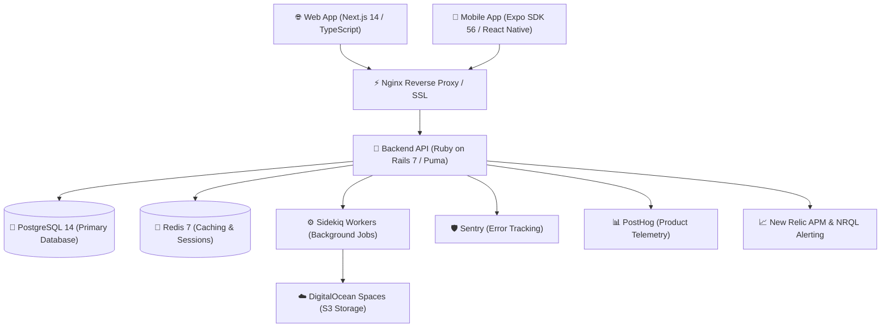

<div align="center">
  <p>
    <b>🌐 Language:</b> 
    <a href="README.md">🇺🇸 English</a> | 
    <b>🇧🇷 Português</b>
  </p>
  
  <h1>☀️ Avalia Solar 2026</h1>
  <p><b>Plataforma SaaS Multi-tier de Inteligência e Consultoria de Energia Solar</b></p>

  <p>
    <a href="https://www.avaliasolar.com.br"></a>
    <a href="https://github.com/MrGr33n98/Avalia-Solar-2026/actions/workflows/deploy-v1.yml"></a>
    <a href="https://github.com/MrGr33n98/Avalia-Solar-2026/blob/main/LICENSE"></a>
  </p>

  <p>
    
    
    
    
    
    
    
    
  </p>
</div>

---

## 📌 Visão Geral & Proposta de Valor

O **Avalia Solar 2026** é uma plataforma SaaS profissional projetada para avaliação, comparação e consultoria de soluções em energia solar no Brasil. 

Construída sob uma arquitetura de **Monorepo Escalável**, a plataforma integra APIs REST/GraphQL de alta performance, frontend web otimizado (PWA-first com Next.js 14 App Router), aplicativo mobile nativo (Expo SDK 56) e automação completa de infraestrutura (CI/CD, Docker, DevSecOps e Observabilidade).

---

## 🏗️ Arquitetura do Sistema



---

## 📦 Componentes do Monorepo

| Módulo | Tecnologias | Descrição |
| :--- | :--- | :--- |
| **Backend (`AB0-1-back/`)** | Ruby 3.2, Rails 7, ActiveAdmin, GraphQL, RSpec | API RESTful & GraphQL, painel administrativo ActiveAdmin, autenticação JWT, Sidekiq queues e Pundit authorization. |
| **Frontend (`AB0-1-front/`)** | Next.js 14 (App Router), React 18, TypeScript, Tailwind CSS | Interface Web PWA-first, Server Components, ISR caching, otimização de SEO/AEO/GEO e design system Claymorphism. |
| **Mobile (`AB0-1-mobile/`)** | Expo SDK 56, React Native 0.85, expo-router, Zustand | Aplicativo móvel nativo iOS/Android com navegação por tabs, offline caching e suporte safe-area. |
| **Hermes Agent (`hermes-agent/`)** | Node.js, TypeScript, n8n integration | Agente autônomo de automação de growth, prospecção e integrações outbound. |
| **Vídeos (`videos/`)** | Remotion 4, React | Composições dinâmicas de vídeo renderizadas programaticamente para marketing. |
| **Infraestrutura (`infra/`)** | Docker, Docker Compose, Nginx, GitHub Actions | Orquestração de containers em produção, SSL/TLS, reverse proxy e workflows CI/CD. |

---

## ⚡ Guia de Inicialização Rápida (Quickstart)

### Pré-requisitos
- Docker & Docker Compose
- Node.js 20+ & Ruby 3.2+ (para desenvolvimento local fora do Docker)

### 1. Clonar e Subir os Containers
```bash
git clone https://github.com/MrGr33n98/Avalia-Solar-2026.git
cd Avalia-Solar-2026

# Subir a stack completa via Docker Compose
docker compose up -d
```

### 2. Rodar as Migrations do Banco de Dados
```bash
docker compose exec backend bundle exec rails db:migrate db:seed
```

### 3. Endereços Locais
- 🌐 **Frontend Web:** `http://localhost:3000`
- 🚀 **Backend API:** `http://localhost:3001`
- 🏥 **Healthcheck API:** `http://localhost:3001/health/liveness`

---

## 🧪 Suíte de Testes & Qualidade de Código

O repositório possui garantia rigorosa de qualidade com testes automatizados em todas as camadas:

### Backend (Ruby on Rails)
```bash
cd AB0-1-back
bundle exec rspec           # Suíte de testes unitários e de integração
bundle exec rubocop         # Análise estática de código Ruby
bundle exec brakeman -q     # Auditoria de segurança de código SAST
```

### Frontend (Next.js)
```bash
cd AB0-1-front
npm run test                # Testes unitários com Jest
npm run typecheck           # Checagem de tipos TypeScript
npm run test:e2e            # Testes End-to-End com Playwright
```

### Mobile (Expo)
```bash
cd AB0-1-mobile
npm run test                # Testes unitários Jest
npm run ui-audit            # Verificação de tokens de cor e UI audit
```

---

## 🔒 DevSecOps & Confiabilidade (SRE)

- **Análise Estática & Dinâmica (SAST/DAST):** CodeQL, StackHawk, Brakeman, RuboCop.
- **Gerenciamento de Dependências:** Dependabot, `bundler-audit` e `npm audit` ativos no CI/CD.
- **Proteção de Segredos:** Secret scanning ativo com Gitleaks em pre-commit.
- **Pipelines CI/CD:** `.github/workflows/deploy-v1.yml` realiza build, execução de testes, publicação de imagens no GitHub Container Registry (GHCR) e deploy automatizado com rollback em caso de falha de healthcheck.

---

## 📖 Documentação Técnica & Arquitetura

A documentação detalhada do projeto está disponível no diretório [`docs/`](./docs/):
- 📘 [Introdução à Documentação](./docs/00_LEIA-ME_PRIMEIRO.md)
- 🏗️ [Decisões Arquiteturais (MADR)](./docs/architecture/)
- 📊 [Relatórios de Auditoria e Qualidade](./docs/reports/)
- 🔒 [Guias de Segurança & Compliance](./docs/security/)

---

## 👤 Autor

**Felipe Henrique Morais Almeida**  
DevOps Engineer | Site Reliability Engineer (SRE) | Full Stack Engineer  
- 💼 **LinkedIn:** [linkedin.com/in/felipe-almeida](https://linkedin.com/in/felipe-almeida)  
- 🐙 **GitHub:** [@MrGr33n98](https://github.com/MrGr33n98)  
- 🌐 **Plataforma em Produção:** [avaliasolar.com.br](https://www.avaliasolar.com.br)  
- ✉️ **E-mail:** [felipehhenriquee@gmail.com](mailto:felipehhenriquee@gmail.com)

---
<div align="center">
  <sub>Licensed under the MIT License. Developed with AI-First Engineering & SRE Culture ⚡</sub>
</div>
