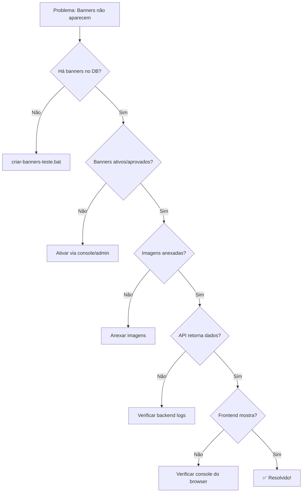

# 🔧 SOLUÇÃO COMPLETA: Banners Não Renderizam em Mobile/Desktop

## 📊 Problema Identificado

**Logs do Console:**
```javascript
[API] Response data: Array []  // ← API retorna array vazio
[API] Request -> GET https://api.avaliasolar.com.br/api/v1/banners?position=categories_top
```

**Erros de Imagem:**
```
NS_BINDING_ABORTED - Imagens do Active Storage não carregam
```

## 🎯 Causas Raiz

1. **API retorna array vazio** → Não há banners cadastrados ou aprovados
2. **Imagens não carregam** → Active Storage URLs expiradas ou arquivos deletados
3. **Frontend não mostra placeholder** → Quando não há banners, espaço fica vazio

## ✅ Soluções Implementadas

### 1. Frontend - Melhorias no Hook `useBanners`

**Arquivo:** `AB0-1-front/hooks/useBanners.ts`

**O que mudou:**
- ✅ Suporte para parâmetros `position` e `limit`
- ✅ Melhor logging para debug
- ✅ Tratamento robusto de erros
- ✅ Validação de dados

**Uso:**
```typescript
// Com filtro por posição
const { banners, loading, error } = useBanners({ position: 'categories_top' });

// Com limite
const { banners, loading, error } = useBanners({ position: 'navbar', limit: 3 });

// Sem filtros (todos os banners)
const { banners, loading, error } = useBanners();
```

### 2. Frontend - Placeholder quando não há banners

**Arquivo:** `AB0-1-front/components/BannerPlaceholder.tsx` (NOVO)

Agora quando não há banners, mostra um espaço amigável ao invés de vazio:

```tsx
<BannerPlaceholder message="Nenhum banner disponível" />
```

### 3. Frontend - Atualização do CategoriesIndexWithSidebar

**Arquivo:** `AB0-1-front/components/CategoriesIndexWithSidebar.tsx`

**Melhorias:**
- ✅ Loading skeleton enquanto carrega
- ✅ Placeholder quando não há banners
- ✅ Tratamento de erro de carregamento de imagem
- ✅ Sempre mostra a seção de banners (não oculta mais)

### 4. Backend - Scripts de Criação de Banners

**Arquivos criados:**
- `AB0-1-back/create_test_banners.rb` - Cria banners de teste
- `criar-banners-teste.bat` - Executa o script no Windows

## 🚀 Como Resolver AGORA

### Opção 1: Criar Banners Automaticamente (RECOMENDADO)

```bash
# No diretório raiz do projeto
criar-banners-teste.bat
```

Este script vai:
1. ✅ Criar 5 banners de teste
2. ✅ Baixar imagens placeholder automaticamente
3. ✅ Configurar como ativos e aprovados
4. ✅ Testar a API

### Opção 2: Criar Banners via Rails Console

```bash
cd AB0-1-back
bundle exec rails console
```

```ruby
# 1. Verificar banners existentes
Banner.currently_active.where(position: 'categories_top').count

# 2. Criar banner de teste
category = Category.first

banner = Banner.create!(
  title: "Energia Solar - Soluções",
  banner_type: "rectangular_large",
  position: "categories_top",
  link: "https://avaliasolar.com.br",
  active: true,
  moderation_status: 'approved',
  category_id: category&.id,
  sponsored: false
)

# 3. Anexar imagem
# Você precisa ter uma imagem. Opções:

# A) Do disco local:
banner.image.attach(
  io: File.open('caminho/para/imagem.jpg'),
  filename: 'banner.jpg',
  content_type: 'image/jpeg'
)

# B) De uma URL:
require 'open-uri'
banner.image.attach(
  io: URI.open('https://via.placeholder.com/1200x400'),
  filename: 'banner.png',
  content_type: 'image/png'
)

# 4. Verificar
banner.image.attached?  # deve retornar true
banner.image_url        # deve retornar a URL
```

### Opção 3: Criar Banners via Admin Panel

1. **Acesse:** `https://api.avaliasolar.com.br/admin/banners`

2. **Clique:** New Banner

3. **Preencha:**
   - **Title:** "Promoção Energia Solar"
   - **Banner Type:** rectangular_large
   - **Position:** categories_top
   - **Link:** https://avaliasolar.com.br
   - **Active:** ✅ true
   - **Moderation Status:** approved
   - **Image:** Faça upload (1200x400px)

4. **Salve**

## 🎨 Imagens Recomendadas

### Dimensões por Posição:

| Posição | Dimensões | Aspect Ratio | Uso |
|---------|-----------|--------------|-----|
| `categories_top` | 1200x400px | 3:1 | Topo da página de categorias |
| `navbar` | 1920x200px | 9.6:1 | Navbar (topo do site) |
| `sidebar` | 300x250px | 1.2:1 | Barra lateral |

### Onde Encontrar Imagens:

**Gratuitas:**
- [Unsplash - Solar Energy](https://unsplash.com/s/photos/solar-energy)
- [Pexels - Solar Panels](https://www.pexels.com/search/solar-panels/)

**Criar Online:**
- [Canva](https://www.canva.com) - Templates prontos
- [Figma](https://www.figma.com) - Design personalizado

**Placeholders:**
- [via.placeholder.com](https://via.placeholder.com/1200x400) - Para testes

## 🧪 Testar Após Criar Banners

### 1. Teste da API (Backend)

```bash
# Teste direto
curl "https://api.avaliasolar.com.br/api/v1/banners?position=categories_top"
```

**Resposta esperada:**
```json
[
  {
    "id": 1,
    "title": "Banner Teste",
    "link": "https://avaliasolar.com.br",
    "active": true,
    "position": "categories_top",
    "sponsored": false,
    "banner_type": "rectangular_large",
    "image_url": "https://api.avaliasolar.com.br/rails/active_storage/...",
    "link_url": "https://avaliasolar.com.br"
  }
]
```

### 2. Teste do Frontend

1. Acesse: `https://avaliasolar.com.br/categories`
2. Abra o DevTools (F12)
3. Console deve mostrar:
   ```
   [useBanners] Fetching: /banners?position=categories_top
   [useBanners] Received: 3 banners
   ```

### 3. Teste Responsivo (Mobile/Desktop)

**Desktop:**
- Banner deve ter aspect ratio 3:1 (largo)
- Carrossel com setas de navegação

**Mobile:**
- Banner deve ter aspect ratio 16:9 (mais quadrado)
- Carrossel com swipe

**Como testar:**
1. F12 → Toggle device toolbar
2. Selecione iPhone/iPad
3. Recarregue a página
4. Verifique se banner aparece

## 🐛 Problemas Comuns

### 1. Banners não aparecem mesmo após criar

**Checklist:**
- [ ] `active: true`?
- [ ] `moderation_status: 'approved'`?
- [ ] `position` correto?
- [ ] Imagem anexada?
- [ ] Dentro do período (start_date/end_date)?

**Debug:**
```ruby
# Rails console
banner = Banner.find(1)

# Verificar cada campo
puts "Active: #{banner.active}"
puts "Status: #{banner.moderation_status}"
puts "Position: #{banner.position}"
puts "Image attached: #{banner.image.attached?}"
puts "Image URL: #{banner.image_url}"

# Verificar scope
Banner.currently_active.where(position: 'categories_top').to_sql
```

### 2. Imagens retornam 404 (Active Storage)

**Causas:**
1. Imagem não foi anexada
2. Active Storage não configurado
3. Arquivo foi deletado

**Solução:**
```ruby
banner = Banner.find(1)

# Verificar se está anexada
banner.image.attached?  # false = problema

# Anexar novamente
require 'open-uri'
banner.image.attach(
  io: URI.open('https://via.placeholder.com/1200x400'),
  filename: 'banner.png',
  content_type: 'image/png'
)
```

### 3. NS_BINDING_ABORTED

**Causa:** Requisição cancelada pelo browser (pode ser normal em alguns casos)

**Soluções:**
1. Adicionar `unoptimized` no Next.js Image:
   ```tsx
   <Image src={url} unoptimized />
   ```

2. Usar `` nativo ao invés de Next.js Image

3. Verificar CORS no backend

## 📝 Arquivos Modificados/Criados

### Frontend (AB0-1-front)

**Modificados:**
- ✅ `hooks/useBanners.ts` - Suporte a filtros
- ✅ `components/BannerByLocation.tsx` - Melhor tratamento de erros
- ✅ `components/CategoriesIndexWithSidebar.tsx` - Placeholder quando vazio

**Criados:**
- ✅ `components/BannerPlaceholder.tsx` - Componente de fallback

### Backend (AB0-1-back)

**Criados:**
- ✅ `create_test_banners.rb` - Script de criação automática
- ✅ `criar-banners-teste.bat` - Executável Windows

**Mantidos:**
- ✅ `check_and_create_banners.rb` - Script de diagnóstico

## 🎯 Fluxo Recomendado



## 🆘 Ainda com Problemas?

1. **Verifique os logs:**
   ```bash
   # Backend
   tail -f AB0-1-back/log/development.log
   
   # Frontend (console do browser)
   F12 → Console
   ```

2. **Execute os testes:**
   ```bash
   # Backend
   cd AB0-1-back
   bundle exec ruby create_test_banners.rb
   
   # API
   curl "https://api.avaliasolar.com.br/api/v1/banners?position=categories_top"
   ```

3. **Verifique configurações:**
   - Active Storage configurado?
   - CORS habilitado?
   - Postgres rodando?
   - Redis rodando?

---

**Data:** 2026-01-07
**Status:** Solução completa implementada ✅
**Ação:** Execute `criar-banners-teste.bat` para criar banners automaticamente
