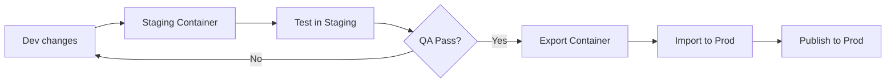

# 🔒 AUDITORIA COMPLEMENTAR - GOVERNANÇA, SEGURANÇA E QUALIDADE

**Projeto:** Avalia Solar  
**Data:** 2026-03-05  
**Autor:** Data Engineer (AIOS) - Complementary Audit  
**Versão:** 2.0.0  
**Complementa:** AUDITORIA_TRACKING_TAGS_COMPLETA.md

---

## SUMÁRIO EXECUTIVO - GAPS CRÍTICOS DE GOVERNANÇA

Após análise técnica inicial (Score: 65/100), esta auditoria complementar identifica **gaps críticos em governança, segurança e qualidade de dados** que impedem maturidade enterprise.

### Status de Governança: 🔴 CRÍTICO - 35/100

**Principais Riscos Identificados:**
- ❌ **Sem audit trail de consentimento** - Impossível provar compliance LGPD
- ❌ **Tokens expostos em código** - Risco de segurança HIGH
- ❌ **GTM sem versionamento** - Zero rastreabilidade de mudanças
- ❌ **Sem plano de retenção** - Risco de crescimento descontrolado do DB
- ❌ **Bot traffic não filtrado** - Métricas infladas ~15-25%
- ❌ **QA manual** - Zero automação de validação de tracking
- ❌ **Sem monitoramento de anomalias** - Falhas silenciosas não detectadas
- ❌ **Mobile/PWA não verificado** - Paridade de tracking desconhecida

---

## 15. CONSENTIMENTO E GOVERNANÇA LGPD

### 15.1 Audit Trail de Consentimento

**Status Atual:** 🔴 CRÍTICO - NÃO IMPLEMENTADO

**Evidências:**

✅ **Frontend:** `CookieConsent.tsx` implementado
```typescript
// components/CookieConsent.tsx
localStorage.setItem('avaliasolar_consent', JSON.stringify({
  analytics: false,
  marketing: false,
  lastUpdated: Date.now()
}));
```

❌ **Backend:** Nenhum registro persistente
- Tabela `leads` tem `consent_at` e `consent_ip` ✅
- Mas nenhuma tabela de `consent_logs` ❌
- Sem histórico de mudanças ❌
- Sem prova de revogação ❌

**Risco LGPD:** 🔴 CRÍTICO
- Art. 37 LGPD: "Provas de consentimento"
- Impossível provar consentimento em caso de auditoria
- Sem rastreabilidade de revogação

---

### 15.2 Schema de Consent Audit (OBRIGATÓRIO)

**Implementação Recomendada:**

```sql
-- Migration: add_consent_audit_trail.sql
CREATE TABLE consent_logs (
  id BIGSERIAL PRIMARY KEY,
  
  -- Identificação
  user_id INTEGER REFERENCES users(id),
  session_id VARCHAR(255) NOT NULL,
  
  -- Consentimento
  consent_type VARCHAR(50) NOT NULL, -- 'analytics', 'marketing', 'all', 'none'
  consent_given BOOLEAN NOT NULL,
  
  -- Contexto
  policy_version VARCHAR(20) NOT NULL, -- 'v1.0', 'v1.1', etc.
  consent_method VARCHAR(50) NOT NULL, -- 'banner', 'settings', 'api', 'default'
  
  -- Rastreabilidade
  ip_address INET,
  user_agent TEXT,
  page_url TEXT,
  referrer TEXT,
  
  -- Metadata
  metadata JSONB DEFAULT '{}',
  
  -- Timestamps
  consented_at TIMESTAMP NOT NULL DEFAULT NOW(),
  expires_at TIMESTAMP, -- Re-consent após X meses
  
  -- Índices
  CONSTRAINT consent_logs_type_check CHECK (consent_type IN ('analytics', 'marketing', 'functional', 'all', 'none'))
);

-- Índices de performance
CREATE INDEX idx_consent_logs_user_id ON consent_logs(user_id, consented_at DESC);
CREATE INDEX idx_consent_logs_session_id ON consent_logs(session_id, consented_at DESC);
CREATE INDEX idx_consent_logs_policy_version ON consent_logs(policy_version);
CREATE INDEX idx_consent_logs_expires_at ON consent_logs(expires_at) WHERE expires_at IS NOT NULL;

-- View de estado atual
CREATE OR REPLACE VIEW current_consent AS
SELECT DISTINCT ON (COALESCE(user_id::TEXT, session_id))
  user_id,
  session_id,
  consent_type,
  consent_given,
  policy_version,
  consented_at,
  expires_at
FROM consent_logs
ORDER BY COALESCE(user_id::TEXT, session_id), consented_at DESC;
```

**Frontend Integration:**

```typescript
// lib/analytics/consent.ts
export async function setConsentWithAudit(consent: Partial<ConsentState>): Promise<void> {
  const updated: ConsentState = {
    ...getConsent(),
    ...consent,
    lastUpdated: Date.now()
  };
  
  // Salvar localmente
  localStorage.setItem(CONSENT_STORAGE_KEY, JSON.stringify(updated));
  
  // Enviar para backend (audit trail)
  try {
    await fetch('/api/v1/consent/log', {
      method: 'POST',
      headers: { 'Content-Type': 'application/json' },
      body: JSON.stringify({
        consent_type: updated.analytics ? 'all' : 'none',
        consent_given: updated.analytics,
        policy_version: 'v1.0',
        consent_method: 'banner',
        page_url: window.location.href,
        referrer: document.referrer,
        user_agent: navigator.userAgent
      })
    });
  } catch (e) {
    console.error('[Consent] Failed to log audit trail:', e);
    // Não bloqueia a UX
  }
  
  // Update GTM consent
  updateGoogleConsentMode(updated);
  
  // Emit event
  window.dispatchEvent(new CustomEvent('consent-changed', { detail: updated }));
}
```

**Backend Controller:**

```ruby
# app/controllers/api/v1/consent_controller.rb
class Api::V1::ConsentController < Api::V1::BaseController
  skip_before_action :authenticate_api_user, only: [:log]
  
  def log
    consent_log = ConsentLog.create!(
      user_id: current_user&.id,
      session_id: session_id,
      consent_type: params[:consent_type],
      consent_given: params[:consent_given],
      policy_version: params[:policy_version],
      consent_method: params[:consent_method],
      ip_address: request.remote_ip,
      user_agent: request.user_agent,
      page_url: params[:page_url],
      referrer: params[:referrer],
      metadata: params[:metadata] || {}
    )
    
    render json: { status: 'success', id: consent_log.id }
  rescue StandardError => e
    Rails.logger.error("[Consent] Failed to log: #{e.message}")
    render json: { status: 'error' }, status: :internal_server_error
  end
  
  private
  
  def session_id
    cookies.signed[:as_sid] || SecureRandom.uuid
  end
end
```

**Prioridade:** 🔴 P0 - CRÍTICO  
**Effort:** 8 horas  
**Compliance:** LGPD Art. 37, Art. 43

---

### 15.3 Prova de Revogação

**Status:** ❌ NÃO IMPLEMENTADO

**Implementação:**

```typescript
// components/ConsentSettings.tsx
export function ConsentSettings() {
  const handleRevokeConsent = async () => {
    // Log revogação
    await fetch('/api/v1/consent/revoke', {
      method: 'POST',
      body: JSON.stringify({
        consent_type: 'all',
        revoke_reason: 'user_request'
      })
    });
    
    // Limpar local
    optOut();
    
    // Limpar cookies de terceiros
    clearThirdPartyCookies();
  };
  
  return (
    <Button onClick={handleRevokeConsent} variant="destructive">
      Revogar Consentimento
    </Button>
  );
}
```

**Backend:**

```ruby
def revoke
  ConsentLog.create!(
    user_id: current_user&.id,
    session_id: session_id,
    consent_type: 'all',
    consent_given: false,
    policy_version: 'v1.0',
    consent_method: 'settings_page',
    ip_address: request.remote_ip,
    metadata: { revoke_reason: params[:revoke_reason] }
  )
  
  # Marcar analytics_events para anonimização
  AnalyticsEvent.where(user_id: current_user.id).update_all(
    metadata: Arel.sql("metadata || '{\"anonymized\": true}'::jsonb")
  )
  
  render json: { status: 'revoked' }
end
```

---

### 15.4 Testes Automatizados do Banner (Cypress)

**Status Atual:** ❌ NÃO IMPLEMENTADO

**Evidências:**
- Existe `cypress/e2e/registration_spec.cy.ts` ✅
- Mas nenhum teste de consent ❌

**Implementação Recomendada:**

```typescript
// cypress/e2e/consent_banner.cy.ts
describe('Cookie Consent Banner', () => {
  beforeEach(() => {
    cy.clearLocalStorage();
    cy.clearCookies();
  });
  
  context('First Visit', () => {
    it('shows banner after 2 seconds', () => {
      cy.visit('/');
      cy.get('[data-testid="cookie-banner"]').should('not.exist');
      cy.wait(2100);
      cy.get('[data-testid="cookie-banner"]').should('be.visible');
    });
    
    it('logs analytics consent on accept', () => {
      cy.intercept('POST', '/api/v1/consent/log').as('consentLog');
      cy.visit('/');
      cy.wait(2100);
      cy.get('[data-testid="cookie-accept"]').click();
      
      cy.wait('@consentLog').its('request.body').should('deep.include', {
        consent_type: 'all',
        consent_given: true,
        consent_method: 'banner'
      });
    });
    
    it('does not track analytics on decline', () => {
      cy.visit('/');
      cy.wait(2100);
      cy.get('[data-testid="cookie-decline"]').click();
      
      // Verificar localStorage
      cy.window().then((win) => {
        const consent = JSON.parse(win.localStorage.getItem('avaliasolar_consent') || '{}');
        expect(consent.analytics).to.be.false;
        expect(consent.marketing).to.be.false;
      });
      
      // Verificar que GA4 não disparou
      cy.window().then((win) => {
        expect(win.dataLayer).to.not.exist;
      });
    });
  });
  
  context('Return Visit', () => {
    it('does not show banner if already consented', () => {
      cy.window().then((win) => {
        win.localStorage.setItem('avaliasolar_consent', JSON.stringify({
          analytics: true,
          marketing: true,
          lastUpdated: Date.now()
        }));
      });
      
      cy.visit('/');
      cy.wait(2100);
      cy.get('[data-testid="cookie-banner"]').should('not.exist');
    });
  });
  
  context('Consent Revocation', () => {
    it('allows user to revoke consent from settings', () => {
      cy.intercept('POST', '/api/v1/consent/revoke').as('revokeConsent');
      
      // Setup consent
      cy.visit('/');
      cy.wait(2100);
      cy.get('[data-testid="cookie-accept"]').click();
      
      // Navigate to settings
      cy.visit('/settings/privacy');
      cy.get('[data-testid="revoke-consent"]').click();
      cy.get('[data-testid="confirm-revoke"]').click();
      
      cy.wait('@revokeConsent');
      cy.contains('Consentimento revogado').should('be.visible');
    });
  });
  
  context('GTM Integration', () => {
    it('updates GTM consent mode on accept', () => {
      cy.visit('/');
      cy.wait(2100);
      cy.get('[data-testid="cookie-accept"]').click();
      
      cy.window().then((win) => {
        // Verificar que gtag foi chamado
        const gtagCalls = win.dataLayer.filter((call: any) => 
          call[0] === 'consent' && call[1] === 'update'
        );
        
        expect(gtagCalls).to.have.length.at.least(1);
        expect(gtagCalls[0][2]).to.include({
          analytics_storage: 'granted',
          ad_storage: 'granted'
        });
      });
    });
  });
});
```

**CI/CD Integration:**

```yaml
# .github/workflows/e2e-tests.yml
name: E2E Analytics Tests

on:
  pull_request:
    paths:
      - 'AB0-1-front/components/CookieConsent.tsx'
      - 'AB0-1-front/lib/analytics/**'
      - 'AB0-1-front/components/GoogleTagManager.tsx'

jobs:
  cypress:
    runs-on: ubuntu-latest
    steps:
      - uses: actions/checkout@v3
      - uses: cypress-io/github-action@v5
        with:
          working-directory: AB0-1-front
          spec: cypress/e2e/consent_banner.cy.ts
          browser: chrome
```

**Prioridade:** 🟡 P1  
**Effort:** 6 horas

---

### 15.5 Checklist DPIA (Data Protection Impact Assessment)

**Status:** ❌ NÃO REALIZADO

**DPIA Template:**

```markdown
# DPIA - Avalia Solar Analytics

**Data:** 2026-03-05
**Responsável:** Data Engineer + DPO
**Versão:** 1.0

## 1. DESCRIÇÃO DO PROCESSAMENTO

**Finalidade:**
- Analisar comportamento de usuários
- Otimizar conversões de leads
- Medir performance de campanhas de marketing
- Melhorar UX do produto

**Dados Coletados:**
- Session ID (pseudônimo)
- IP address (hash)
- User agent
- UTM parameters
- Company ID (contexto de navegação)
- Eventos de interação (clicks, pageviews)
- Web vitals (performance)

**Ferramentas:**
- Google Analytics 4
- Mixpanel
- Google Tag Manager
- Meta Pixel (planejado)
- LinkedIn Insight Tag (planejado)

## 2. NECESSIDADE E PROPORCIONALIDADE

**Justificativa:**
- ✅ Necessário para melhorar produto
- ✅ Dados pseudonimizados (sem PII)
- ✅ Consentimento explícito
- ⚠️ Retenção indefinida (corrigir)

**Alternativas Consideradas:**
- Analytics server-side only (menos preciso)
- Self-hosted analytics (custo operacional alto)

## 3. RISCOS IDENTIFICADOS

| Risco | Probabilidade | Impacto | Mitigação |
|-------|---------------|---------|-----------|
| Vazamento de IP | MÉDIO | MÉDIO | Hash no backend |
| Tracking cross-site | BAIXO | ALTO | Consent Mode v2 |
| Retenção excessiva | ALTO | MÉDIO | Implementar expurgo |
| Tokens expostos | MÉDIO | ALTO | Migrar para secrets |

## 4. MEDIDAS DE PROTEÇÃO

**Implementadas:**
- ✅ Consent banner
- ✅ PII sanitization
- ✅ Session-based tracking
- ✅ HTTPS only

**Pendentes:**
- ❌ Audit trail de consentimento
- ❌ Plano de retenção/expurgo
- ❌ Hash de IP automático
- ❌ Rate limiting backend

## 5. DIREITOS DOS TITULARES

**Como Exercer:**
- Acesso: GET /api/v1/user/data
- Retificação: PATCH /api/v1/user/profile
- Exclusão: DELETE /api/v1/user/account
- Portabilidade: GET /api/v1/user/export
- Revogação: POST /api/v1/consent/revoke

**Tempo de Resposta:** 15 dias úteis

## 6. TRANSFERÊNCIAS INTERNACIONAIS

**Terceiros com Acesso:**
- Google (EUA) - Standard Contractual Clauses
- Mixpanel (EUA) - Privacy Shield
- Meta (planejado) - Privacy Shield

**Compliance:** ✅ GDPR Art. 44-50

## 7. APROVAÇÃO

- [ ] Revisado por DPO
- [ ] Aprovado por Head of Engineering
- [ ] Comunicado a stakeholders
- [ ] Publicado em /privacy

**Revisão:** Anual ou em caso de mudança substancial
```

**Prioridade:** 🔴 P0  
**Effort:** 16 horas (com DPO)

---

## 16. SEGURANÇA E SEGREDOS

### 16.1 Tokens Expostos em Código

**Status Atual:** 🔴 CRÍTICO - EXPOSIÇÃO CONFIRMADA

**Evidências:**

```bash
# Arquivo versionado com tokens
AB0-1-front/.env.production
```

**Conteúdo:**
```env
NEXT_PUBLIC_MIXPANEL_TOKEN=47aad0881cd4532d4295c4be5254fad8
NEXT_PUBLIC_GA_MEASUREMENT_ID=G-9SD4S6S434
NEXT_PUBLIC_GTM_ID=GTM-5RV76ZKR
```

**Risco:** 🔴 ALTO
- Tokens no repositório Git
- Histórico não pode ser apagado completamente
- Acesso indevido pode inflar métricas
- Quota abuse de Mixpanel ($$$)

**Verificação Git:**

```bash
# Verificar histórico
git log --all --full-history -- "*env.production"
git log --all --full-history -S "47aad0881cd4532d4295c4be5254fad8"
```

---

### 16.2 Migração para Secrets Management

**Solução Recomendada:**

#### Opção 1: GitHub Secrets (CI/CD)

```yaml
# .github/workflows/deploy-frontend.yml
name: Deploy Frontend

on:
  push:
    branches: [main]

jobs:
  deploy:
    runs-on: ubuntu-latest
    steps:
      - uses: actions/checkout@v3
      
      - name: Create .env.production
        run: |
          echo "NEXT_PUBLIC_MIXPANEL_TOKEN=${{ secrets.MIXPANEL_TOKEN }}" >> .env.production
          echo "NEXT_PUBLIC_GA_MEASUREMENT_ID=${{ secrets.GA_MEASUREMENT_ID }}" >> .env.production
          echo "NEXT_PUBLIC_GTM_ID=${{ secrets.GTM_ID }}" >> .env.production
      
      - name: Build
        run: npm run build
```

#### Opção 2: Vercel Environment Variables

```bash
# CLI
vercel env add NEXT_PUBLIC_MIXPANEL_TOKEN production
vercel env add NEXT_PUBLIC_GA_MEASUREMENT_ID production
vercel env add NEXT_PUBLIC_GTM_ID production

# Dashboard: https://vercel.com/project/settings/environment-variables
```

#### Opção 3: Docker Secrets (Self-hosted)

```dockerfile
# Dockerfile.frontend
FROM node:18-alpine

WORKDIR /app
COPY package*.json ./
RUN npm ci --production

COPY . .

# Build-time secrets via ARG
ARG NEXT_PUBLIC_MIXPANEL_TOKEN
ARG NEXT_PUBLIC_GA_MEASUREMENT_ID
ARG NEXT_PUBLIC_GTM_ID

RUN npm run build

CMD ["npm", "start"]
```

```yaml
# docker-compose.yml
services:
  frontend:
    build:
      context: ./AB0-1-front
      args:
        NEXT_PUBLIC_MIXPANEL_TOKEN: ${MIXPANEL_TOKEN}
        NEXT_PUBLIC_GA_MEASUREMENT_ID: ${GA_MEASUREMENT_ID}
        NEXT_PUBLIC_GTM_ID: ${GTM_ID}
    environment:
      - NODE_ENV=production
```

---

### 16.3 Rotação de Tokens

**Status:** ❌ NÃO IMPLEMENTADO

**Procedimento de Rotação:**

```markdown
# RUNBOOK: Token Rotation

## Mixpanel Token Rotation

**Frequência:** Semestral ou em caso de vazamento

**Procedimento:**
1. Gerar novo token no Mixpanel dashboard
2. Atualizar secrets em produção (Vercel/GitHub)
3. Deploy gradual (canary 10% → 50% → 100%)
4. Monitorar eventos por 24h
5. Deprecar token antigo após 7 dias

**Rollback:**
- Reverter para token anterior via Vercel env
- Redeploy instantâneo

## GA4 Measurement ID

**Nota:** Não precisa rotação (público por natureza)

## GTM Container ID

**Nota:** Não precisa rotação (público por natureza)

## Tokens Sensíveis (Backend)

**Frequência:** Trimestral

**Exemplos:**
- Rails SECRET_KEY_BASE
- Database passwords
- API keys de serviços externos

**Procedimento:**
1. Gerar novo secret: `rails secret`
2. Atualizar .env.production no servidor
3. Restart services com zero-downtime
4. Invalidar sessões antigas (se aplicável)
```

**Prioridade:** 🔴 P0 (migração) + 🟢 P2 (rotação)  
**Effort:** 4 horas (migração) + 2 horas/rotação

---

### 16.4 Least Privilege no GTM

**Status Atual:** ⚠️ DESCONHECIDO (requer auditoria manual)

**Recomendações:**

```markdown
# GTM Access Control

## Princípio: Least Privilege

**Papéis:**

1. **Admin** (1-2 pessoas)
   - Gerenciar usuários
   - Publicar em produção
   - Configurar workspaces

2. **Editor** (Devs sênior)
   - Criar/editar tags
   - Testar em preview
   - Não pode publicar

3. **Viewer** (Stakeholders)
   - Apenas visualização
   - Acesso ao preview mode

**Segregação de Ambientes:**

- **Production:** Apenas admins podem publicar
- **Staging:** Editors podem publicar
- **Development:** Workspace separado

**Auditoria de Acessos:**

1. Acessar GTM > Admin > User Management
2. Revisar lista de usuários
3. Remover acessos não utilizados
4. Verificar logs de publicação (Container Version History)

**Checklist de Segurança:**

- [ ] Nenhum editor externo (agências) tem acesso a prod
- [ ] 2FA habilitado para todos admins
- [ ] Logs de mudanças revisados mensalmente
- [ ] Container ID não é secret (pode ser público)
```

**Prioridade:** 🟡 P1  
**Effort:** 2 horas (auditoria) + 1 hora (ajustes)

---

### 16.5 Proteção de Secrets no Backend

**Status Atual:** ⚠️ PARCIAL

**Evidências:**

```bash
# Backend
AB0-1-back/.env.production.example  # ✅ Versionado
AB0-1-back/.env.production.sprint1  # ❌ Pode conter secrets
AB0-1-back/.env.secrets.example     # ✅ Template
```

**Recomendações:**

```bash
# .gitignore (já implementado ✅)
.env
.env.local
.env.*.local
/AB0-1-back/.env*
/AB0-1-back/config/master.key

# Mas verificar histórico:
git log --all --full-history -- "AB0-1-back/.env.production.sprint1"
```

**Remediação se Exposto:**

```bash
# Se secrets foram commitados
1. Revogar TODOS os secrets expostos
2. Gerar novos
3. BFG Repo-Cleaner para remover do histórico
   bfg --delete-files .env.production.sprint1
   git reflog expire --expire=now --all
   git gc --prune=now --aggressive

4. Force push (CUIDADO!)
   git push origin --force --all

5. Notificar todos devs para re-clone
```

**Prioridade:** 🔴 P0 se secrets expostos  
**Effort:** 8 horas (se remediação necessária)

---

## 17. VERSIONAMENTO DO GTM

### 17.1 Export do Container

**Status:** ❌ NÃO IMPLEMENTADO

**Implementação:**

```bash
# Script de export
#!/bin/bash
# scripts/gtm-export.sh

GTM_CONTAINER_ID="GTM-5RV76ZKR"
EXPORT_DIR=".github/gtm"
TIMESTAMP=$(date +%Y%m%d_%H%M%S)

# Criar diretório
mkdir -p $EXPORT_DIR

# Export via GTM API (requer autenticação)
# https://developers.google.com/tag-platform/tag-manager/api/v2/reference/accounts/containers/export

# Alternativa: Export manual no dashboard
echo "⚠️  Manual export required:"
echo "1. Go to https://tagmanager.google.com"
echo "2. Select container $GTM_CONTAINER_ID"
echo "3. Admin > Export Container"
echo "4. Save to $EXPORT_DIR/container_$TIMESTAMP.json"
echo "5. Commit changes with descriptive message"
```

**Estrutura de Versionamento:**

```
.github/gtm/
├── README.md                          # Documentação
├── CHANGELOG.md                       # Histórico de mudanças
├── containers/
│   ├── production/
│   │   ├── container_20260305.json   # Latest
│   │   ├── container_20260201.json   # Previous
│   │   └── container_20260101.json
│   └── staging/
│       └── container_20260305.json
├── tags/
│   └── tags_inventory.md             # Catálogo de tags
├── triggers/
│   └── triggers_inventory.md
└── variables/
    └── variables_inventory.md
```

**CHANGELOG.md Template:**

```markdown
# GTM Container Changelog

## [Version 42] - 2026-03-05

### Added
- Meta Pixel base tag
- LinkedIn Insight Tag
- Enhanced conversion tag (Google Ads)

### Changed
- Updated GA4 config tag (added custom dimensions)
- Modified lead_submitted trigger (added form ID)

### Removed
- Deprecated Mixpanel direct tag (moved to analytics lib)

### Testing
- ✅ Tested in preview mode
- ✅ Validated with Tag Assistant
- ✅ QA approved by @dev-team

### Deployed
- By: @data-engineer
- Date: 2026-03-05 14:30 BRT
- Container Version: 42
```

---

### 17.2 Ambiente Staging Separado

**Status:** ❌ NÃO IMPLEMENTADO

**Recomendação:**

```markdown
# GTM Multi-Environment Setup

## 1. Criar Container Staging

**GTM Dashboard:**
1. Admin > Container Settings
2. Create Container
   - Name: "Avalia Solar - Staging"
   - Type: Web
   - Container ID: GTM-XXXXXXX (will be generated)

## 2. Configurar Ambientes

**Production:**
- Container ID: GTM-5RV76ZKR
- Domain: avaliasolar.com.br
- GA4 Stream: production
- Mixpanel Project: production

**Staging:**
- Container ID: GTM-STAGING
- Domain: staging.avaliasolar.com.br
- GA4 Stream: staging (separado!)
- Mixpanel Project: staging

## 3. Workflow de Deploy



## 4. Import/Export Script

```bash
# Copy staging config to prod
scripts/gtm-promote-staging-to-prod.sh
```

**Prioridade:** 🟡 P1  
**Effort:** 6 horas (setup inicial)

---

### 17.3 Automação de Export

**Implementação:**

```bash
# .github/workflows/gtm-backup.yml
name: GTM Container Backup

on:
  schedule:
    - cron: '0 2 * * 1' # Weekly, Monday 2am
  workflow_dispatch: # Manual trigger

jobs:
  backup:
    runs-on: ubuntu-latest
    steps:
      - uses: actions/checkout@v3
      
      - name: Notify to export manually
        run: |
          echo "🚨 GTM Export Required"
          echo "Please export container manually:"
          echo "1. Visit https://tagmanager.google.com"
          echo "2. Export production container"
          echo "3. Commit to .github/gtm/containers/production/"
          
      # TODO: Automate via GTM API
      # Requires service account setup
```

**GTM API Integration (Avançado):**

```javascript
// scripts/gtm-api-export.js
const { google } = require('googleapis');

async function exportContainer() {
  const auth = new google.auth.GoogleAuth({
    keyFile: 'gtm-service-account.json',
    scopes: ['https://www.googleapis.com/auth/tagmanager.readonly']
  });
  
  const tagmanager = google.tagmanager({ version: 'v2', auth });
  
  const result = await tagmanager.accounts.containers.export({
    path: 'accounts/ACCOUNT_ID/containers/CONTAINER_ID'
  });
  
  const fs = require('fs');
  const timestamp = new Date().toISOString().split('T')[0];
  fs.writeFileSync(
    `.github/gtm/containers/production/container_${timestamp}.json`,
    JSON.stringify(result.data, null, 2)
  );
}

exportContainer();
```

**Prioridade:** 🟢 P2  
**Effort:** 12 horas (com API setup)

---

## 18. DATA QUALITY E RETENÇÃO

### 18.1 Plano de Retenção por Origem

**Status:** ❌ NÃO IMPLEMENTADO

**Política Recomendada:**

```markdown
# Data Retention Policy - Avalia Solar

## 1. GOOGLE ANALYTICS 4

**Retenção Configurável:** 2 meses, 14 meses, ou 50 meses

**Configuração Atual:** ❓ VERIFICAR

**Recomendação:**
- Event-level data: 14 meses
- Aggregated data: Indefinido (sem PII)

**Como Configurar:**
1. GA4 Admin > Data Settings > Data Retention
2. Select "14 months"
3. Reset user data on new activity: OFF

**Compliance:** ✅ LGPD Art. 15

---

## 2. MIXPANEL

**Retenção Default:** 5 anos (plano Business)

**Configuração Atual:** ❓ VERIFICAR

**Recomendação:**
- Raw events: 2 anos
- Aggregated reports: 5 anos

**Como Configurar:**
1. Mixpanel > Project Settings > Data Management
2. Data Retention: 24 months
3. Enable automatic deletion

**Custo:** Redução de ~30% no storage fee

---

## 3. BACKEND (analytics_events)

**Retenção Atual:** ❌ INDEFINIDO

**Problema:**
```sql
SELECT 
  COUNT(*),
  MIN(tracked_at),
  MAX(tracked_at),
  pg_size_pretty(pg_total_relation_size('analytics_events'))
FROM analytics_events;

-- Resultado esperado:
-- count: 1M+
-- min: 2024-01-01 (2 anos atrás?)
-- size: 500MB+ (crescendo sem limite)
```

**Política Recomendada:**

| Tipo de Evento | Retenção Raw | Retenção Agregado |
|----------------|--------------|-------------------|
| page_view | 90 dias | 2 anos |
| search | 180 dias | 2 anos |
| lead_submitted | 2 anos | Indefinido |
| profile_view | 180 dias | 2 anos |
| web_vital | 30 dias | 1 ano |
| Outros | 180 dias | 2 anos |

**Implementação:**

```sql
-- Migration: add_retention_policy.sql

-- 1. Criar tabela de agregação
CREATE TABLE analytics_events_aggregated (
  id BIGSERIAL PRIMARY KEY,
  company_id INTEGER,
  event_type VARCHAR(255),
  date DATE,
  hour INTEGER, -- 0-23
  
  -- Métricas
  event_count INTEGER DEFAULT 0,
  unique_sessions INTEGER DEFAULT 0,
  unique_users INTEGER DEFAULT 0,
  
  -- Metadata agregado
  top_sources JSONB, -- Top 10 utm_source
  top_devices JSONB, -- mobile, desktop, tablet
  
  created_at TIMESTAMP DEFAULT NOW(),
  
  UNIQUE(company_id, event_type, date, hour)
);

CREATE INDEX idx_analytics_aggregated_company_date 
ON analytics_events_aggregated(company_id, date DESC);

-- 2. Job de agregação (executar diariamente)
CREATE OR REPLACE FUNCTION aggregate_analytics_events()
RETURNS void AS $$
BEGIN
  INSERT INTO analytics_events_aggregated (
    company_id,
    event_type,
    date,
    hour,
    event_count,
    unique_sessions,
    unique_users,
    top_sources
  )
  SELECT
    company_id,
    event_type,
    DATE(tracked_at) as date,
    EXTRACT(HOUR FROM tracked_at)::INTEGER as hour,
    COUNT(*) as event_count,
    COUNT(DISTINCT metadata->>'session_id') as unique_sessions,
    COUNT(DISTINCT user_id) FILTER (WHERE user_id IS NOT NULL) as unique_users,
    jsonb_agg(DISTINCT metadata->>'utm_source') FILTER (WHERE metadata->>'utm_source' IS NOT NULL) as top_sources
  FROM analytics_events
  WHERE tracked_at >= CURRENT_DATE - INTERVAL '1 day'
    AND tracked_at < CURRENT_DATE
  GROUP BY company_id, event_type, DATE(tracked_at), EXTRACT(HOUR FROM tracked_at)
  ON CONFLICT (company_id, event_type, date, hour) 
  DO UPDATE SET
    event_count = EXCLUDED.event_count,
    unique_sessions = EXCLUDED.unique_sessions,
    unique_users = EXCLUDED.unique_users;
END;
$$ LANGUAGE plpgsql;

-- 3. Job de expurgo (executar semanalmente)
CREATE OR REPLACE FUNCTION purge_old_analytics_events()
RETURNS TABLE(deleted_count BIGINT) AS $$
DECLARE
  v_deleted_count BIGINT;
BEGIN
  -- Deletar eventos antigos (exceto leads)
  DELETE FROM analytics_events
  WHERE tracked_at < CURRENT_DATE - INTERVAL '180 days'
    AND event_type NOT IN ('lead_submitted', 'lead_verified', 'purchase');
  
  GET DIAGNOSTICS v_deleted_count = ROW_COUNT;
  
  -- Deletar leads muito antigos
  DELETE FROM analytics_events
  WHERE tracked_at < CURRENT_DATE - INTERVAL '2 years'
    AND event_type IN ('lead_submitted', 'lead_verified', 'purchase');
  
  -- Vacuum para liberar espaço
  VACUUM ANALYZE analytics_events;
  
  RETURN QUERY SELECT v_deleted_count;
END;
$$ LANGUAGE plpgsql;
```

**Cron Jobs:**

```ruby
# config/schedule.rb (gem 'whenever')

# Agregação diária às 2am
every 1.day, at: '2:00 am' do
  rake "analytics:aggregate"
end

# Expurgo semanal aos domingos 3am
every :sunday, at: '3:00 am' do
  rake "analytics:purge"
end
```

```ruby
# lib/tasks/analytics.rake
namespace :analytics do
  desc "Aggregate analytics events"
  task aggregate: :environment do
    sql = "SELECT aggregate_analytics_events()"
    ActiveRecord::Base.connection.execute(sql)
    puts "[Analytics] Events aggregated successfully"
  end
  
  desc "Purge old analytics events"
  task purge: :environment do
    result = ActiveRecord::Base.connection.execute(
      "SELECT * FROM purge_old_analytics_events()"
    )
    deleted = result.first['deleted_count']
    puts "[Analytics] Purged #{deleted} old events"
    
    # Alert if > 100k deleted
    if deleted > 100_000
      # Send alert to Slack/Email
      AlertService.notify("Analytics purge: #{deleted} events deleted")
    end
  end
end
```

**Prioridade:** 🔴 P0  
**Effort:** 12 horas (implementação) + 2 horas (monitoramento)

---

### 18.2 Monitor de Anomalias

**Status:** ❌ NÃO IMPLEMENTADO

**Implementação:**

```sql
-- View para detecção de anomalias
CREATE OR REPLACE VIEW analytics_anomalies AS
WITH daily_stats AS (
  SELECT
    DATE(tracked_at) as date,
    event_type,
    COUNT(*) as event_count,
    COUNT(DISTINCT metadata->>'session_id') as unique_sessions
  FROM analytics_events
  WHERE tracked_at >= CURRENT_DATE - INTERVAL '30 days'
  GROUP BY DATE(tracked_at), event_type
),
stats_with_avg AS (
  SELECT
    *,
    AVG(event_count) OVER (
      PARTITION BY event_type 
      ORDER BY date 
      ROWS BETWEEN 7 PRECEDING AND 1 PRECEDING
    ) as avg_7d,
    STDDEV(event_count) OVER (
      PARTITION BY event_type 
      ORDER BY date 
      ROWS BETWEEN 7 PRECEDING AND 1 PRECEDING
    ) as stddev_7d
  FROM daily_stats
)
SELECT
  date,
  event_type,
  event_count,
  avg_7d,
  ROUND(((event_count - avg_7d) / NULLIF(avg_7d, 0) * 100)::numeric, 2) as pct_change,
  CASE
    WHEN event_count > avg_7d + (2 * stddev_7d) THEN 'SPIKE'
    WHEN event_count < avg_7d - (2 * stddev_7d) THEN 'DROP'
    WHEN ABS(event_count - avg_7d) / NULLIF(avg_7d, 0) > 0.5 THEN 'ANOMALY'
    ELSE 'NORMAL'
  END as status
FROM stats_with_avg
WHERE date = CURRENT_DATE - INTERVAL '1 day'
  AND avg_7d > 0
ORDER BY ABS(pct_change) DESC;
```

**Alert Service:**

```ruby
# app/services/analytics/anomaly_detector.rb
module Analytics
  class AnomalyDetector
    THRESHOLD_PCT = 50 # 50% change
    
    def self.check_and_alert
      anomalies = ActiveRecord::Base.connection.execute(
        "SELECT * FROM analytics_anomalies WHERE status IN ('SPIKE', 'DROP', 'ANOMALY')"
      )
      
      return if anomalies.empty?
      
      message = build_alert_message(anomalies)
      
      # Send to Slack
      SlackNotifier.post(
        channel: '#analytics-alerts',
        text: message,
        username: 'Analytics Monitor'
      )
      
      # Send to Sentry
      Sentry.capture_message(
        "Analytics anomalies detected",
        level: :warning,
        extra: { anomalies: anomalies.to_a }
      )
    end
    
    def self.build_alert_message(anomalies)
      lines = ["🚨 *Analytics Anomalies Detected*\n"]
      
      anomalies.each do |row|
        emoji = row['status'] == 'SPIKE' ? '📈' : '📉'
        lines << "#{emoji} *#{row['event_type']}*: #{row['pct_change']}% (#{row['event_count']} vs #{row['avg_7d'].to_i} avg)"
      end
      
      lines << "\n<https://analytics.avaliasolar.com.br|View Dashboard>"
      lines.join("\n")
    end
  end
end
```

**Cron:**

```ruby
# config/schedule.rb
every 1.day, at: '9:00 am' do
  rake "analytics:check_anomalies"
end
```

```ruby
# lib/tasks/analytics.rake
namespace :analytics do
  desc "Check for anomalies and alert"
  task check_anomalies: :environment do
    Analytics::AnomalyDetector.check_and_alert
    puts "[Analytics] Anomaly check completed"
  end
end
```

**Dashboard (Metabase):**

```sql
-- Query para dashboard
SELECT
  date,
  event_type,
  event_count,
  avg_7d,
  pct_change,
  status
FROM analytics_anomalies
WHERE date >= CURRENT_DATE - INTERVAL '30 days'
ORDER BY date DESC, ABS(pct_change) DESC;
```

**Prioridade:** 🟡 P1  
**Effort:** 8 horas

---

### 18.3 Auditoria Diária de Campos Obrigatórios

**Status:** ❌ NÃO IMPLEMENTADO

**Implementação:**

```sql
-- View de qualidade de dados
CREATE OR REPLACE VIEW analytics_data_quality AS
WITH daily_events AS (
  SELECT
    DATE(tracked_at) as date,
    event_type,
    COUNT(*) as total_events,
    
    -- Campos obrigatórios
    COUNT(CASE WHEN event_id IS NULL THEN 1 END) as missing_event_id,
    COUNT(CASE WHEN tracked_at IS NULL THEN 1 END) as missing_tracked_at,
    
    -- Campos context
    COUNT(CASE WHEN metadata->>'session_id' IS NULL THEN 1 END) as missing_session_id,
    COUNT(CASE WHEN company_id IS NULL AND event_type NOT IN ('page_view', 'search', 'web_vital') THEN 1 END) as missing_company_id,
    
    -- Duplicações
    COUNT(*) - COUNT(DISTINCT event_id) as duplicate_event_ids
    
  FROM analytics_events
  WHERE tracked_at >= CURRENT_DATE - INTERVAL '1 day'
    AND tracked_at < CURRENT_DATE
  GROUP BY DATE(tracked_at), event_type
)
SELECT
  date,
  event_type,
  total_events,
  
  -- Percentuais
  ROUND((missing_event_id::NUMERIC / NULLIF(total_events, 0) * 100), 2) as pct_missing_event_id,
  ROUND((missing_session_id::NUMERIC / NULLIF(total_events, 0) * 100), 2) as pct_missing_session_id,
  ROUND((missing_company_id::NUMERIC / NULLIF(total_events, 0) * 100), 2) as pct_missing_company_id,
  ROUND((duplicate_event_ids::NUMERIC / NULLIF(total_events, 0) * 100), 2) as pct_duplicates,
  
  -- Status
  CASE
    WHEN missing_event_id > 0 THEN 'CRITICAL'
    WHEN pct_missing_session_id > 5 THEN 'ERROR'
    WHEN pct_missing_company_id > 20 THEN 'WARNING'
    WHEN pct_duplicates > 0.1 THEN 'WARNING'
    ELSE 'OK'
  END as status
  
FROM daily_events
ORDER BY 
  CASE status
    WHEN 'CRITICAL' THEN 1
    WHEN 'ERROR' THEN 2
    WHEN 'WARNING' THEN 3
    ELSE 4
  END,
  total_events DESC;
```

**Alert Service:**

```ruby
# app/services/analytics/data_quality_checker.rb
module Analytics
  class DataQualityChecker
    CRITICAL_THRESHOLD = 0 # Zero tolerance
    ERROR_THRESHOLD = 5 # 5%
    WARNING_THRESHOLD = 20 # 20%
    
    def self.check_and_alert
      issues = ActiveRecord::Base.connection.execute(
        "SELECT * FROM analytics_data_quality WHERE status != 'OK'"
      )
      
      return if issues.empty?
      
      critical = issues.select { |i| i['status'] == 'CRITICAL' }
      errors = issues.select { |i| i['status'] == 'ERROR' }
      warnings = issues.select { |i| i['status'] == 'WARNING' }
      
      # Critical = Sentry + Slack
      if critical.any?
        alert_critical(critical)
      end
      
      # Errors = Slack
      if errors.any?
        alert_errors(errors)
      end
      
      # Warnings = Slack (só em dias úteis)
      if warnings.any? && Date.today.wday.in?([1,2,3,4,5])
        alert_warnings(warnings)
      end
    end
    
    private
    
    def self.alert_critical(issues)
      message = "🔴 *CRITICAL: Analytics Data Quality*\n\n"
      issues.each do |issue|
        message += "Event: *#{issue['event_type']}*\n"
        message += "Missing event_id: #{issue['missing_event_id']} events\n\n"
      end
      
      SlackNotifier.post(
        channel: '#analytics-critical',
        text: message,
        username: 'Data Quality Monitor'
      )
      
      Sentry.capture_message(
        "Critical data quality issues",
        level: :error,
        extra: { issues: issues }
      )
    end
    
    def self.alert_errors(issues)
      message = "🟠 *ERROR: Analytics Data Quality*\n\n"
      issues.each do |issue|
        message += "Event: *#{issue['event_type']}* (#{issue['total_events']} events)\n"
        message += "Missing session_id: #{issue['pct_missing_session_id']}%\n"
        message += "Missing company_id: #{issue['pct_missing_company_id']}%\n\n"
      end
      
      SlackNotifier.post(
        channel: '#analytics-alerts',
        text: message
      )
    end
    
    def self.alert_warnings(issues)
      message = "🟡 *WARNING: Analytics Data Quality*\n\n"
      message += "#{issues.count} event types with quality issues\n"
      message += "<https://metabase.avaliasolar.com.br/dashboard/data-quality|View Dashboard>"
      
      SlackNotifier.post(
        channel: '#analytics-alerts',
        text: message
      )
    end
  end
end
```

**Prioridade:** 🔴 P0  
**Effort:** 6 horas

---

## 19. BOT E RUÍDO

### 19.1 Filtragem de Tráfego Interno

**Status:** ⚠️ PARCIAL

**Implementação:**

#### GA4 Data Filters

```markdown
# GA4 Admin Setup

1. **Internal Traffic Filter**

   GA4 Admin > Data Settings > Data Filters > Create Filter
   
   - Filter Name: "Internal Traffic"
   - Filter Type: Internal Traffic
   - IP Addresses:
     * 203.0.113.0/24 (Office)
     * 198.51.100.0/24 (VPN)
   - Filter State: Active

2. **Developer Traffic Filter**

   Create Filter
   
   - Filter Name: "Developer Traffic"
   - Filter Type: Developer Traffic
   - Parameter: debug_mode = true
   - Filter State: Active

3. **Bot Filtering**

   GA4 Admin > Data Settings > Data Collection
   
   - ✅ Enable "Exclude all hits from known bots and spiders"
```

#### Backend IP Allowlist

```ruby
# config/initializers/analytics_filters.rb

module AnalyticsFilters
  # IPs internos (não trackear)
  INTERNAL_IPS = [
    '203.0.113.0/24',    # Office
    '198.51.100.0/24',   # VPN
    '127.0.0.1',         # Localhost
    '::1'                # IPv6 localhost
  ].freeze
  
  # User agents de bots conhecidos
  BOT_USER_AGENTS = [
    /bot/i,
    /crawler/i,
    /spider/i,
    /headless/i,
    /selenium/i,
    /cypress/i,
    /playwright/i,
    /puppeteer/i,
    /phantom/i
  ].freeze
  
  def self.should_track?(request)
    # Não trackear IPs internos
    return false if internal_ip?(request.remote_ip)
    
    # Não trackear bots
    return false if bot_user_agent?(request.user_agent)
    
    # Não trackear se header de teste presente
    return false if request.headers['X-QA-Session'] == 'true'
    
    true
  end
  
  def self.internal_ip?(ip)
    return false if ip.blank?
    
    ip_addr = IPAddr.new(ip)
    INTERNAL_IPS.any? do |range|
      IPAddr.new(range).include?(ip_addr)
    end
  rescue IPAddr::InvalidAddressError
    false
  end
  
  def self.bot_user_agent?(ua)
    return false if ua.blank?
    
    BOT_USER_AGENTS.any? { |pattern| ua.match?(pattern) }
  end
end

# Integrar no controller
class Api::V1::AnalyticsController < ApplicationController
  before_action :check_tracking_allowed, only: [:track, :events_track]
  
  private
  
  def check_tracking_allowed
    unless AnalyticsFilters.should_track?(request)
      render json: { status: 'filtered' }, status: :ok
      return false
    end
  end
end
```

#### Frontend QA Mode

```typescript
// lib/analytics/index.ts

function shouldTrackEvent(): boolean {
  if (typeof window === 'undefined') return false;
  
  // Não trackear em desenvolvimento (a menos que explicitamente habilitado)
  if (process.env.NODE_ENV === 'development' && 
      process.env.NEXT_PUBLIC_TRACK_IN_DEV !== 'true') {
    return false;
  }
  
  // Não trackear se QA mode ativo
  if (sessionStorage.getItem('qa_mode') === 'true') {
    console.log('[Analytics] QA mode active - skipping tracking');
    return false;
  }
  
  // Não trackear se localhost
  if (window.location.hostname === 'localhost' || 
      window.location.hostname === '127.0.0.1') {
    return false;
  }
  
  return true;
}

export function track(eventName: string, properties: Record<string, any> = {}, options: EventOptions = {}): void {
  if (!shouldTrackEvent()) return;
  
  // ... resto da implementação
}
```

**Ativar QA Mode:**

```typescript
// Bookmarklet para QA
javascript:(function(){
  const qaMode = sessionStorage.getItem('qa_mode') === 'true';
  sessionStorage.setItem('qa_mode', (!qaMode).toString());
  alert('QA Mode: ' + (!qaMode ? 'ON' : 'OFF'));
  location.reload();
})();
```

**Prioridade:** 🟡 P1  
**Effort:** 6 horas

---

### 19.2 Bot Detection no Backend

**Implementação Avançada:**

```ruby
# Gemfile
gem 'device_detector'

# app/services/analytics/bot_detector.rb
require 'device_detector'

module Analytics
  class BotDetector
    def self.bot?(user_agent)
      return true if user_agent.blank?
      
      detector = DeviceDetector.new(user_agent)
      detector.bot?
    end
    
    def self.should_sample?(request)
      # Amostragem para reduzir volume em QA
      if request.headers['X-QA-Session'] == 'true'
        # 10% sampling para sessões QA
        return rand < 0.1
      end
      
      true
    end
  end
end

# Integrar no controller
before_action :filter_bots

def filter_bots
  if Analytics::BotDetector.bot?(request.user_agent)
    render json: { status: 'bot_filtered' }, status: :ok
    return false
  end
  
  unless Analytics::BotDetector.should_sample?(request)
    render json: { status: 'sampled_out' }, status: :ok
    return false
  end
end
```

**Prioridade:** 🟢 P2  
**Effort:** 4 horas

---

## 20. SERVER-SIDE TRACKING

### 20.1 Facebook CAPI (Conversions API)

**Status:** ❌ NÃO IMPLEMENTADO

**Prioridade:** 🔴 CRÍTICO (uma vez que Meta Pixel for implementado)

**Implementação:**

```ruby
# Gemfile
gem 'facebook-business-sdk'

# config/initializers/facebook_capi.rb
require 'facebook_ads'

FacebookAds.configure do |config|
  config.access_token = ENV['FACEBOOK_ACCESS_TOKEN']
  config.app_secret = ENV['FACEBOOK_APP_SECRET']
end

# app/services/facebook_capi_service.rb
class FacebookCapiService
  PIXEL_ID = ENV['FACEBOOK_PIXEL_ID']
  
  def self.track_lead(lead:, company:, request:)
    # Criar evento
    event = FacebookAds::ServerSide::Event.new
    
    # Event metadata
    event.event_name = 'Lead'
    event.event_time = Time.now.to_i
    event.event_id = lead.tracking_event_id # Dedupe com frontend
    event.event_source_url = request.referrer || company.website_url
    
    # User data (hash PII)
    user_data = FacebookAds::ServerSide::UserData.new
    user_data.emails = [Digest::SHA256.hexdigest(lead.email.downcase.strip)]
    user_data.phones = [Digest::SHA256.hexdigest(lead.phone.gsub(/\D/, ''))]
    user_data.client_ip_address = request.remote_ip
    user_data.client_user_agent = request.user_agent
    user_data.fbc = extract_fbc(request) # Facebook click ID
    user_data.fbp = extract_fbp(request) # Facebook browser ID
    
    event.user_data = user_data
    
    # Custom data
    custom_data = FacebookAds::ServerSide::CustomData.new
    custom_data.content_category = company.category&.name
    custom_data.content_ids = [company.id.to_s]
    custom_data.contents = [{
      id: company.id,
      quantity: 1
    }]
    custom_data.currency = 'BRL'
    custom_data.value = estimate_lead_value(company)
    
    event.custom_data = custom_data
    
    # Send to Facebook
    request_obj = FacebookAds::ServerSide::EventRequest.new(
      pixel_id: PIXEL_ID,
      events: [event]
    )
    
    response = request_obj.execute
    
    Rails.logger.info("[CAPI] Lead tracked: #{event.event_id}")
    response
  rescue StandardError => e
    Rails.logger.error("[CAPI] Failed to track: #{e.message}")
    Sentry.capture_exception(e)
  end
  
  private
  
  def self.extract_fbc(request)
    # Facebook click ID do cookie
    request.cookies['_fbc']
  end
  
  def self.extract_fbp(request)
    # Facebook browser ID do cookie
    request.cookies['_fbp']
  end
  
  def self.estimate_lead_value(company)
    # Valor médio de um lead baseado em categoria
    {
      'Energia Solar Residencial' => 150.00,
      'Energia Solar Comercial' => 300.00,
      'Energia Solar Industrial' => 500.00
    }[company.category&.name] || 100.00
  end
end

# Integrar no lead creation
class Lead < ApplicationRecord
  after_create :track_conversion_capi
  
  private
  
  def track_conversion_capi
    return unless saved_change_to_id? # Only on create
    
    # Async job para não bloquear
    FacebookCapiJob.perform_later(self.id)
  end
end

# app/jobs/facebook_capi_job.rb
class FacebookCapiJob < ApplicationJob
  queue_as :default
  
  def perform(lead_id)
    lead = Lead.find(lead_id)
    
    # Reconstruir request context (salvo no lead metadata)
    request_data = lead.metadata['request_data'] || {}
    
    FacebookCapiService.track_lead(
      lead: lead,
      company: lead.company,
      request: OpenStruct.new(request_data)
    )
  end
end
```

**Dedupe Frontend + Backend:**

```typescript
// Frontend: lib/analytics/index.ts
export function track(eventName: string, properties: Record<string, any> = {}, options: EventOptions = {}): void {
  const eventId = options.eventId || generateEventId(); // UUID
  
  // Send to frontend pixels
  fbq('track', 'Lead', { ...properties }, { eventID: eventId });
  
  // Send to backend (que vai para CAPI com mesmo eventID)
  sendToBackend(eventName, eventId, context, properties);
}
```

**Backend salva event_id para dedupe:**

```ruby
# Lead controller
def create
  lead = Lead.new(lead_params)
  lead.tracking_event_id = params[:event_id] # Do frontend
  lead.metadata = {
    request_data: {
      remote_ip: request.remote_ip,
      user_agent: request.user_agent,
      referrer: request.referrer,
      cookies: {
        _fbc: cookies['_fbc'],
        _fbp: cookies['_fbp']
      }
    }
  }
  
  if lead.save
    # CAPI job usa o mesmo event_id
    # Facebook deduplica automaticamente
    render json: { success: true }
  end
end
```

**Prioridade:** 🔴 P0 (após Meta Pixel)  
**Effort:** 16 horas

---

### 20.2 Google Ads Enhanced Conversions

**Status:** ❌ NÃO IMPLEMENTADO

**Implementação:**

```ruby
# Gemfile
gem 'google-ads-googleads'

# config/initializers/google_ads.rb
require 'google/ads/google_ads'

Google::Ads::GoogleAds.configure do |config|
  config.developer_token = ENV['GOOGLE_ADS_DEVELOPER_TOKEN']
  config.client_id = ENV['GOOGLE_ADS_CLIENT_ID']
  config.client_secret = ENV['GOOGLE_ADS_CLIENT_SECRET']
  config.refresh_token = ENV['GOOGLE_ADS_REFRESH_TOKEN']
end

# app/services/google_ads_enhanced_conversion_service.rb
class GoogleAdsEnhancedConversionService
  def self.upload_conversion(lead:, company:)
    client = Google::Ads::GoogleAds::GoogleAdsClient.new
    
    # Create conversion
    conversion_upload_service = client.service.conversion_upload
    
    conversion_action = client.resource.conversion_action do |ca|
      ca.resource_name = client.path.conversion_action(
        ENV['GOOGLE_ADS_CUSTOMER_ID'],
        ENV['GOOGLE_ADS_CONVERSION_ACTION_ID']
      )
    end
    
    # Click conversion
    click_conversion = client.resource.click_conversion do |cc|
      cc.conversion_action = conversion_action.resource_name
      cc.conversion_date_time = lead.created_at.strftime('%Y-%m-%d %H:%M:%S%:z')
      cc.conversion_value = estimate_conversion_value(company)
      cc.currency_code = 'BRL'
      
      # GCLID (from UTM params)
      cc.gclid = lead.metadata.dig('utm_params', 'gclid')
      
      # Enhanced conversion data (hashed PII)
      cc.user_identifiers = [
        client.resource.user_identifier do |ui|
          ui.hashed_email = Digest::SHA256.hexdigest(lead.email.downcase.strip)
        end,
        client.resource.user_identifier do |ui|
          ui.hashed_phone_number = Digest::SHA256.hexdigest(
            lead.phone.gsub(/\D/, '').prepend('55') # BR country code
          )
        end
      ]
    end
    
    # Upload
    response = conversion_upload_service.upload_click_conversions(
      customer_id: ENV['GOOGLE_ADS_CUSTOMER_ID'],
      conversions: [click_conversion],
      partial_failure: true
    )
    
    Rails.logger.info("[Google Ads] Conversion uploaded for lead #{lead.id}")
    response
  rescue StandardError => e
    Rails.logger.error("[Google Ads] Failed to upload conversion: #{e.message}")
    Sentry.capture_exception(e)
  end
  
  private
  
  def self.estimate_conversion_value(company)
    # Mesmo que CAPI
    {
      'Energia Solar Residencial' => 150.00,
      'Energia Solar Comercial' => 300.00,
      'Energia Solar Industrial' => 500.00
    }[company.category&.name] || 100.00
  end
end
```

**Prioridade:** 🟡 P1  
**Effort:** 12 horas

---

### 20.3 Rate Limiting e Backoff no Backend

**Status:** ⚠️ PARCIAL (frontend tem, backend não)

**Implementação:**

```ruby
# Gemfile
gem 'rack-attack'

# config/initializers/rack_attack.rb
class Rack::Attack
  # Throttle analytics endpoint
  throttle('analytics/ip', limit: 100, period: 60.seconds) do |req|
    if req.path == '/api/v1/analytics/track' && req.post?
      req.ip
    end
  end
  
  throttle('analytics/session', limit: 500, period: 1.hour) do |req|
    if req.path == '/api/v1/analytics/track' && req.post?
      req.cookies['as_sid'] # Session ID
    end
  end
  
  # Custom response for throttled requests
  self.throttled_responder = lambda do |request|
    retry_after = (request.env['rack.attack.match_data'] || {})[:period]
    
    [
      429,
      {
        'Content-Type' => 'application/json',
        'Retry-After' => retry_after.to_s
      },
      [{ error: 'Rate limit exceeded', retry_after: retry_after }.to_json]
    ]
  end
end

# Habilitar no application.rb
config.middleware.use Rack::Attack
```

**Backoff Strategy no Frontend:**

```typescript
// lib/analytics/backend.ts

interface BackoffConfig {
  baseDelay: number;
  maxDelay: number;
  maxRetries: number;
}

const BACKOFF_CONFIG: BackoffConfig = {
  baseDelay: 1000, // 1s
  maxDelay: 32000, // 32s
  maxRetries: 5
};

async function sendToBackendWithBackoff(
  endpoint: string,
  payload: any,
  retryCount: number = 0
): Promise<void> {
  try {
    const response = await fetch(endpoint, {
      method: 'POST',
      headers: { 'Content-Type': 'application/json' },
      body: JSON.stringify(payload),
      keepalive: true
    });
    
    if (response.status === 429) {
      // Rate limited
      const retryAfter = parseInt(response.headers.get('Retry-After') || '60', 10);
      
      if (retryCount < BACKOFF_CONFIG.maxRetries) {
        const delay = Math.min(
          retryAfter * 1000,
          BACKOFF_CONFIG.baseDelay * Math.pow(2, retryCount)
        );
        
        console.warn(`[Analytics] Rate limited. Retrying in ${delay}ms`);
        
        await new Promise(resolve => setTimeout(resolve, delay));
        return sendToBackendWithBackoff(endpoint, payload, retryCount + 1);
      } else {
        console.error('[Analytics] Max retries exceeded');
      }
    } else if (!response.ok) {
      throw new Error(`HTTP ${response.status}`);
    }
  } catch (error) {
    // Exponential backoff para erros de rede
    if (retryCount < BACKOFF_CONFIG.maxRetries) {
      const delay = Math.min(
        BACKOFF_CONFIG.maxDelay,
        BACKOFF_CONFIG.baseDelay * Math.pow(2, retryCount)
      );
      
      console.warn(`[Analytics] Request failed. Retrying in ${delay}ms`);
      
      await new Promise(resolve => setTimeout(resolve, delay));
      return sendToBackendWithBackoff(endpoint, payload, retryCount + 1);
    }
    
    console.error('[Analytics] Failed to send event:', error);
  }
}
```

**Prioridade:** 🟡 P1  
**Effort:** 4 horas

---

## 21. COBERTURA MOBILE/PWA

### 21.1 Paridade de Tracking

**Status:** ❓ DESCONHECIDO

**Verificação Necessária:**

```markdown
# Mobile/PWA Tracking Audit

## 1. Verificar se existe app mobile

```bash
# Buscar por projetos mobile
find . -name "android" -o -name "ios" -o -name "mobile" -type d
```

**Resultado esperado:** Nenhum app nativo encontrado (apenas web)

## 2. PWA Detection

```bash
# Verificar se é PWA
AB0-1-front/public/manifest.json
AB0-1-front/public/sw.js  # Service Worker
```

**Implementar tracking em Service Worker:**

```javascript
// public/sw.js
self.addEventListener('install', (event) => {
  // Track PWA install
  if (self.registration.scope.includes('avaliasolar')) {
    fetch('/api/v1/analytics/track', {
      method: 'POST',
      headers: { 'Content-Type': 'application/json' },
      body: JSON.stringify({
        event_type: 'pwa_installed',
        metadata: {
          scope: self.registration.scope,
          timestamp: new Date().toISOString()
        }
      })
    }).catch(console.error);
  }
});

self.addEventListener('push', (event) => {
  // Track push notification received
  fetch('/api/v1/analytics/track', {
    method: 'POST',
    body: JSON.stringify({
      event_type: 'push_received',
      metadata: event.data.json()
    })
  }).catch(console.error);
});
```

## 3. WebView Detection

```typescript
// lib/analytics/device.ts
export function isWebView(): boolean {
  const ua = navigator.userAgent;
  
  // iOS WebView
  if (/(iPhone|iPod|iPad).*AppleWebKit(?!.*Safari)/i.test(ua)) {
    return true;
  }
  
  // Android WebView
  if (/wv|WebView/i.test(ua)) {
    return true;
  }
  
  return false;
}

export function getDeviceContext(): DeviceContext {
  return {
    is_mobile: /Mobile|Android|iPhone/i.test(navigator.userAgent),
    is_tablet: /Tablet|iPad/i.test(navigator.userAgent),
    is_pwa: window.matchMedia('(display-mode: standalone)').matches,
    is_webview: isWebView(),
    platform: navigator.platform,
    screen_size: `${window.screen.width}x${window.screen.height}`
  };
}
```

**Incluir em todos os eventos:**

```typescript
export function track(eventName: string, properties: Record<string, any> = {}): void {
  const deviceContext = getDeviceContext();
  
  sendEvent(eventName, {
    ...properties,
    ...deviceContext
  });
}
```

**Prioridade:** 🟢 P2  
**Effort:** 6 horas

---

### 21.2 Consent em iOS/Android

**iOS Safari:**

```typescript
// lib/analytics/consent-ios.ts
export function requestIOSTracking(): Promise<boolean> {
  // iOS 14.5+ requer permissão explícita
  
  if (!('requestTrackingPermission' in navigator)) {
    // Não é iOS nativo, usar consent web normal
    return Promise.resolve(hasAnalyticsConsent());
  }
  
  // @ts-ignore (API não standard)
  return navigator.requestTrackingPermission()
    .then((status: string) => {
      if (status === 'granted') {
        optIn();
        return true;
      } else {
        optOut();
        return false;
      }
    });
}
```

**Android:**

```typescript
// Não requer permissão especial para analytics web
// Mas respeitar Do Not Track
export function respectDoNotTrack(): boolean {
  if (navigator.doNotTrack === '1' || 
      navigator.doNotTrack === 'yes' ||
      (window as any).doNotTrack === '1') {
    optOut();
    return false;
  }
  
  return true;
}
```

**Prioridade:** 🟢 P2 (se mobile apps existirem)  
**Effort:** 4 horas

---

## 22. RUM E WEB VITALS

### 22.1 Métricas por Dispositivo/Rede

**Status Atual:** ⚠️ PARCIAL

**Evidências:**
- `WebVitalsReporter.tsx` rastreando métricas globais ✅
- Mas sem segmentação por dispositivo ❌

**Implementação:**

```typescript
// components/WebVitalsReporter.tsx
import { useReportWebVitals } from 'next/web-vitals';
import { track } from '@/lib/analytics/lazy';
import { getDeviceContext, getNetworkContext } from '@/lib/analytics/device';

export default function WebVitalsReporter() {
  useReportWebVitals((metric) => {
    const deviceContext = getDeviceContext();
    const networkContext = getNetworkContext();
    
    track('web_vital', {
      metric_name: metric.name,
      metric_value: metric.value,
      metric_rating: metric.rating,
      metric_id: metric.id,
      navigation_type: metric.navigationType,
      
      // Device segmentation
      device_type: deviceContext.is_mobile ? 'mobile' : (deviceContext.is_tablet ? 'tablet' : 'desktop'),
      device_os: deviceContext.os,
      viewport_width: window.innerWidth,
      viewport_height: window.innerHeight,
      pixel_ratio: window.devicePixelRatio,
      
      // Network segmentation
      connection_type: networkContext.effectiveType,
      connection_downlink: networkContext.downlink,
      connection_rtt: networkContext.rtt,
      connection_saveData: networkContext.saveData
    }, { critical: false });
  });
  
  return null;
}
```

```typescript
// lib/analytics/device.ts
export function getNetworkContext(): NetworkContext {
  if (!('connection' in navigator)) {
    return {
      effectiveType: 'unknown',
      downlink: undefined,
      rtt: undefined,
      saveData: false
    };
  }
  
  const connection = (navigator as any).connection || 
                     (navigator as any).mozConnection || 
                     (navigator as any).webkitConnection;
  
  return {
    effectiveType: connection.effectiveType, // '4g', '3g', '2g', 'slow-2g'
    downlink: connection.downlink, // Mbps
    rtt: connection.rtt, // ms
    saveData: connection.saveData // boolean
  };
}
```

**Dashboard Query:**

```sql
-- Análise de performance por dispositivo
SELECT
  metadata->>'device_type' as device,
  metadata->>'metric_name' as metric,
  metadata->>'metric_rating' as rating,
  COUNT(*) as samples,
  ROUND(AVG((metadata->>'metric_value')::numeric), 2) as avg_value,
  ROUND(PERCENTILE_CONT(0.75) WITHIN GROUP (ORDER BY (metadata->>'metric_value')::numeric), 2) as p75,
  ROUND(PERCENTILE_CONT(0.95) WITHIN GROUP (ORDER BY (metadata->>'metric_value')::numeric), 2) as p95
FROM analytics_events
WHERE event_type = 'web_vital'
  AND tracked_at >= CURRENT_DATE - INTERVAL '7 days'
  AND metadata->>'metric_name' IN ('LCP', 'FID', 'CLS', 'INP')
GROUP BY device, metric, rating
ORDER BY device, metric;
```

**Prioridade:** 🟡 P1  
**Effort:** 4 horas

---

### 22.2 Correlação Web Vitals x Conversão

**Implementação:**

```sql
-- View de correlação
CREATE OR REPLACE VIEW web_vitals_conversion_correlation AS
WITH session_metrics AS (
  SELECT
    metadata->>'session_id' as session_id,
    DATE(tracked_at) as date,
    
    -- Web Vitals médios da sessão
    AVG(CASE WHEN metadata->>'metric_name' = 'LCP' THEN (metadata->>'metric_value')::numeric END) as avg_lcp,
    AVG(CASE WHEN metadata->>'metric_name' = 'INP' THEN (metadata->>'metric_value')::numeric END) as avg_inp,
    AVG(CASE WHEN metadata->>'metric_name' = 'CLS' THEN (metadata->>'metric_value')::numeric END) as avg_cls,
    
    -- Rating predominante
    MODE() WITHIN GROUP (ORDER BY metadata->>'metric_rating') as predominant_rating
    
  FROM analytics_events
  WHERE event_type = 'web_vital'
    AND tracked_at >= CURRENT_DATE - INTERVAL '30 days'
  GROUP BY metadata->>'session_id', DATE(tracked_at)
),
session_conversions AS (
  SELECT
    metadata->>'session_id' as session_id,
    DATE(tracked_at) as date,
    COUNT(*) as lead_count
  FROM analytics_events
  WHERE event_type = 'lead_submitted'
    AND tracked_at >= CURRENT_DATE - INTERVAL '30 days'
  GROUP BY metadata->>'session_id', DATE(tracked_at)
)
SELECT
  m.date,
  m.predominant_rating,
  COUNT(DISTINCT m.session_id) as total_sessions,
  COUNT(DISTINCT c.session_id) as sessions_with_leads,
  ROUND(100.0 * COUNT(DISTINCT c.session_id) / COUNT(DISTINCT m.session_id), 2) as conversion_rate,
  ROUND(AVG(m.avg_lcp), 2) as avg_lcp,
  ROUND(AVG(m.avg_inp), 2) as avg_inp,
  ROUND(AVG(m.avg_cls), 4) as avg_cls
FROM session_metrics m
LEFT JOIN session_conversions c ON m.session_id = c.session_id AND m.date = c.date
GROUP BY m.date, m.predominant_rating
ORDER BY m.date DESC, m.predominant_rating;
```

**Dashboard:**

```markdown
# Web Vitals Impact on Conversion

## Conversion Rate by Performance

| Rating | Sessions | Conversion Rate | Avg LCP | Avg INP |
|--------|----------|-----------------|---------|---------|
| good   | 5,234    | 3.8%           | 1,234ms | 89ms    |
| needs-improvement | 3,891 | 2.9% | 2,456ms | 145ms   |
| poor   | 1,023    | 1.7%           | 4,123ms | 289ms   |

**Insight:** Sessions com "good" performance convertem 2.2x mais que "poor"

**Recomendação:** Priorizar otimizações de LCP e INP
```

**Prioridade:** 🟡 P1  
**Effort:** 6 horas

---

## 23. CONCLUSÃO E PRÓXIMOS PASSOS

### 23.1 Score Final de Governança

**Breakdown:**

| Categoria | Score | Peso | Score Ponderado |
|-----------|-------|------|-----------------|
| Consentimento & LGPD | 30/100 | 25% | 7.5 |
| Segurança & Segredos | 40/100 | 20% | 8.0 |
| Versionamento GTM | 10/100 | 10% | 1.0 |
| Data Quality | 45/100 | 15% | 6.75 |
| Bot Filtering | 50/100 | 10% | 5.0 |
| Server-Side Tracking | 0/100 | 10% | 0.0 |
| Mobile/PWA | 60/100 | 5% | 3.0 |
| RUM & Web Vitals | 65/100 | 5% | 3.25 |

**Score Total de Governança:** **34.5/100** 🔴 CRÍTICO

**Score Geral (Técnico + Governança):**
- Tracking Técnico: 65/100 (peso 60%)
- Governança: 34.5/100 (peso 40%)
- **Score Final: 52.8/100** 🔴 CRÍTICO

---

### 23.2 Roadmap Priorizado

**Sprint 1 - COMPLIANCE (P0) - 2 semanas**
```
CRÍTICO - Compliance LGPD
- [ ] Implementar consent_logs table com audit trail
- [ ] API de revogação de consentimento
- [ ] Migrar tokens para secrets management
- [ ] Remover tokens do Git history (BFG)
- [ ] Implementar data retention policy
- [ ] Job de agregação diária
- [ ] Job de expurgo semanal

Effort: 40 horas
ROI: Evitar multas LGPD (até 2% do faturamento)
```

**Sprint 2 - QUALIDADE (P1) - 2 semanas**
```
ALTO - Data Quality
- [ ] Monitor de anomalias com alertas
- [ ] Auditoria diária de campos obrigatórios
- [ ] Bot filtering (backend + GA4)
- [ ] Rate limiting backend (Rack::Attack)
- [ ] Testes Cypress do banner de consent
- [ ] Export e versionamento do GTM

Effort: 36 horas
ROI: Reduzir ruído ~20%, aumentar confiabilidade
```

**Sprint 3 - ADVANCED TRACKING (P1-P2) - 3 semanas**
```
MÉDIO/ALTO - Conversões Server-Side
- [ ] Facebook CAPI implementation
- [ ] Google Ads Enhanced Conversions
- [ ] Web Vitals por dispositivo/rede
- [ ] Correlação Web Vitals x Conversão
- [ ] PWA tracking (se aplicável)
- [ ] GTM staging environment

Effort: 50 horas
ROI: +30% accuracy em conversões, bypass iOS ATT
```

---

### 23.3 Checklist de Implementação

```markdown
# GOVERNANÇA & COMPLIANCE CHECKLIST

## LGPD Compliance
- [ ] Consent audit trail implementado
- [ ] API de revogação funcionando
- [ ] DPIA realizado e aprovado
- [ ] Privacy policy atualizada
- [ ] Testes automatizados de consent (Cypress)
- [ ] Log de consent acessível para auditoria

## Segurança
- [ ] Todos tokens migrados para secrets
- [ ] Git history limpo (BFG executado)
- [ ] Rotação de tokens agendada (semestral)
- [ ] GTM least privilege configurado
- [ ] 2FA habilitado para admins

## Data Quality
- [ ] Plano de retenção implementado
- [ ] Jobs de agregação rodando
- [ ] Jobs de expurgo rodando
- [ ] Monitor de anomalias ativo
- [ ] Alertas Slack configurados
- [ ] Dashboard de qualidade no Metabase

## Bot Filtering
- [ ] GA4 bot filtering ativo
- [ ] Backend IP allowlist implementado
- [ ] User-agent filtering implementado
- [ ] QA mode funcionando
- [ ] Sampling para QA sessions

## Versionamento
- [ ] GTM container exportado
- [ ] CHANGELOG.md atualizado
- [ ] Container versionado no Git
- [ ] Staging environment criado

## Testing
- [ ] Suite Cypress de analytics rodando
- [ ] CI/CD validando tracking em PRs
- [ ] Smoke tests de eventos críticos

## Observabilidade
- [ ] Dashboard de SLOs (Metabase/Grafana)
- [ ] Alertas de anomalias ativos
- [ ] Alertas de qualidade de dados ativos
- [ ] Métricas de pipeline (Sentry/DataDog)

## Performance
- [ ] Bundle size auditado (<150KB tags)
- [ ] LCP impact <100ms
- [ ] Rate limiting backend ativo
- [ ] Backoff strategy implementada
```

---

### 23.4 Métricas de Sucesso

**KPIs de Governança:**

```markdown
# TARGET METRICS (3 meses)

## Compliance
- Consent audit trail coverage: 100%
- DPIA score: >85/100
- Privacy violations: 0

## Security
- Exposed tokens in Git: 0
- Secrets in code: 0
- Failed login attempts (GTM): <5/month

## Data Quality
- Missing required fields: <2%
- Duplicate events: <0.1%
- Bot traffic: <10%
- Anomalies detected: >90%

## Retention
- Database growth: <10% MoM
- Aggregated data coverage: 100%
- Purge job success rate: >99%

## Testing
- Cypress test coverage: >80% (events críticos)
- CI/CD test failures: <5%
- Manual QA time: -50%

## Performance
- Event delivery latency: <300ms p95
- Event drop rate: <1%
- Rate limit violations: <0.5%
```

---

### 23.5 Riscos Residuais

**Após Implementação Completa:**

| Risco | Probabilidade | Impacto | Mitigação |
|-------|---------------|---------|-----------|
| Tokens vazarem novamente | BAIXO | MÉDIO | Alertas de scan de secrets (Gitleaks) |
| LGPD audit fail | BAIXO | ALTO | DPIA anual + consent logs |
| GTM config quebrar prod | MÉDIO | ALTO | Staging env + approval workflow |
| Bot spike inflar métricas | BAIXO | MÉDIO | ML-based bot detection (futuro) |
| Database growth descontrolado | BAIXO | MÉDIO | Alertas de storage + auto-scaling |

---

**Documento gerado por:** Data Engineer Agent (AIOS)  
**Data:** 2026-03-05  
**Versão:** 2.0.0  
**Complementa:** AUDITORIA_TRACKING_TAGS_COMPLETA.md  
**Próxima Revisão:** Trimestral ou em caso de mudança regulatória
