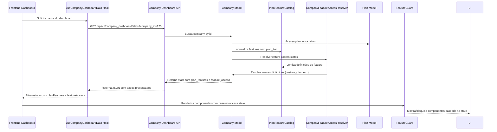

# DOC_CONTROLE_FUNCIONALIDADES_A_PLUS.md
# Estado da Arte em Mapeamento de Funcionalidades - AvaliaSolar Trust as a Service

## Visão Geral do Sistema de Tiers

O sistema de controle de funcionalidades da AvaliaSolar está estruturado em torno de três tiers principais: **Free**, **Pro** e **Enterprise**, definidos no `PlanFeatureCatalog`. Este sistema determina quais recursos estão disponíveis para cada empresa com base no plano contratado, permitindo uma graduação clara de valor entre os níveis de serviço.

### Hierarquia dos Tiers

1. **Free (Gratuito)**: Tier básico com funcionalidades essenciais para presença na plataforma
2. **Pro (Profissional)**: Tier intermediário que desbloqueia recursos de conversão, confiança e insights básicos
3. **Enterprise (Empresarial)**: Tier completo com acesso total a todas as funcionalidades, incluindo APIs avançadas e limites elevados

Este modelo permite que empresas comecem gratuitamente e évoluam conforme suas necessidades crescem, criando um caminho claro de valorização do produto.

## Tabela de Matriz de Controle

A seguir, uma matriz técnica comparando as funcionalidades-chave por cada tier, baseado nas definições do `PlanFeatureCatalog` e nos overrides padrão de cada tier:

| Funcionalidade | Grupo | Free | Pro | Enterprise | Descrição |
|----------------|-------|------|-----|------------|-----------|
| **Descrição do Produto/Serviço** | public_profile | ✓ Habilitado | ✓ Habilitado | ✓ Habilitado | Bloco de texto detalhado sobre a oferta da empresa |
| **Bloco de Características** | public_profile | ✓ Habilitado | ✓ Habilitado | ✓ Habilitado | Lista de diferenciais técnicos e especificações |
| **Perfil de Cliente Ideal** | public_profile | ✗ Bloqueado | ✓ Habilitado | ✓ Habilitado | Exibe para quem o serviço é mais indicado |
| **Banner Promocional** | conversion | ✗ Bloqueado | ✓ Habilitado | ✓ Habilitado | Permite exibir banner de oferta personalizada no topo |
| **Selo de Empresa Verificada** | trust | ✗ Bloqueado | ✓ Habilitado | ✓ Habilitado | Exibe selo de confiança que aumenta taxa de conversão |
| **Badges de Destaque** | trust | ✗ Bloqueado | ✓ Habilitado | ✓ Habilitado | Exibe medalhas de conquistas (Top 10, Empresa do Mês) |
| **Botões de Orçamento Customizados** | conversion | ✗ Bloqueado | ✓ Habilitado | ✓ Habilitado | Habilita botões personalizados para WhatsApp, Telefone ou Formulário |
| **Tabela de Preços/Planos** | conversion | ✗ Bloqueado | ✓ Habilitado | ✓ Habilitado | Exibe tabela comparativa de valores no perfil |
| **Oferta Especial Ativa** | conversion | ✗ Bloqueado | ✓ Habilitado | ✓ Habilitado | Bloco de destaque para promoções temporárias |
| **Conteúdo Patrocinado** | conversion | ✗ Bloqueado | ✓ Habilitado | ✓ Habilitado | Permite aparecer em resultados patrocinados no blog e busca |
| **Materiais para Download** | content | ✗ Bloqueado | ✓ Habilitado | ✓ Habilitado | Habilita envio de PDFs, manuais e catálogos |
| **Galeria de Mídia (Fotos/Vídeos)** | content | ✗ Bloqueado | ✓ Habilitado | ✓ Habilitado | Exibe fotos de instalações e vídeos de cases |
| **Upload Autônomo de Mídia** | content | ✗ Bloqueado | ✓ Habilitado | ✓ Habilitado | Permite empresa subir fotos/vídeos via painel admin |
| **Limite de Imagens por Produto** | content | ⚪ Ilimitado | ✓ 5 imagens | ✓ 10 imagens | Quantidade máxima de imagens por produto |
| **Bloco de Redes Sociais** | public_profile | ✓ Habilitado | ✓ Habilitado | ✓ Habilitado | Exibe links para Instagram, LinkedIn e site oficial |
| **Destaque no Fórum de Comunidade** | trust | ✗ Bloqueado | ✓ Habilitado | ✓ Habilitado | Prioriza respostas da empresa no fórum oficial |
| **Avaliação em Destaque** | trust | ✗ Bloqueado | ✓ Habilitado | ✓ Habilitado | Permite fixar melhor depoimento no topo |
| **Módulo de Prova Social** | trust | ✗ Bloqueado | ✓ Habilitado | ✓ Habilitado | Exibe contador de estrelas e fotos de clientes satisfeitos |
| **Bloco de Perguntas Frequentes** | public_profile | ✗ Bloqueado | ✓ Habilitado | ✓ Habilitado | Exibe sanfona de dúvidas frequentes (FAQs) |
| **Exibir Empresas Alternativas** | marketplace_behavior | ✓ Habilitado | ✗ Bloqueado | ✗ Bloqueado | Mostra competidores no final da página do perfil |
| **Banners de Concorrentes** | marketplace_behavior | ✓ Habilitado | ✗ Bloqueado | ✗ Bloqueado | Permite exibir anúncios de terceiros no perfil |
| **Dashboard de Analytics Avançado** | insights | ✗ Bloqueado | ✓ Habilitado | ✓ Habilitado | Métricas detalhadas de visualizações, cliques e conversões |
| **Acesso ao Marketplace de Leads** | insights | ✗ Bloqueado | ✗ Bloqueado | ✓ Habilitado | Permite receber e visualizar leads direto no painel |
| **Simulador de Financiamento** | insights | ✗ Bloqueado | ✓ Habilitado | ✓ Habilitado | Ferramenta de simulação de parcelas no perfil |
| **Integração via Webhooks (API)** | insights | ✗ Bloqueado | ✗ Bloqueado | ✓ Habilitado | Envio automático de leads para CRM da empresa |
| **Score de Intenção de Compra** | insights | ✗ Bloqueado | ✗ Bloqueado | ✓ Habilitado | IA para classificar leads com maior probabilidade de fechar |
| **Limite de Perguntas Setoriais** | insights | ⚪ 2 perguntas | ✓ 10 perguntas | ✓ 25 perguntas | Quantas perguntas empresa pode responder no benchmark |
| **Taxa de Setup (Implementação)** | operations | ✗ $0 | ✓ $499 | ✓ $1.499 | Valor cobrado uma única vez para ativação |
| **Setup Incluso no Plano** | operations | ✓ Sim | ✗ Não | ✗ Não | Se marcado, setup exibido como GRÁTIS/INCLUSO |
| **Sessão de Onboarding Assistida** | operations | ✗ Bloqueado | ✓ Habilitado | ✓ Habilitado | Treinamento inicial com time de CS para configuração |

**Legenda**: ✓ = Habilitado por padrão, ✗ = Bloqueado por padrão, ⚪ = Valor configurável (não boolean)

## Mapeamento de Fluxo (Mermaid)

O fluxo de dados para controle de funcionalidades segue o caminho desde a solicitação do dashboard até a normalização no backend:



### Detalhamento do Fluxo:

1. **Inicialização no Frontend**: O hook `useCompanyDashboardData` é chamado ao montar o EnterpriseDashboard
2. **Requisição API**: Faz GET para `/api/v1/company_dashboard/stats` com o company_id como parâmetro
3. **Processamento no Backend**: 
   - O controller busca a Company pelo ID
   - A Company acessa sua Plan associada
   - Chama `effective_plan_features` que normaliza as features usando PlanFeatureCatalog
   - Chama `feature_access` que usa CompanyFeatureAccessResolver para determinar estados
4. **Normalização de Features**: 
   - PlanFeatureCatalog.normalize() aplica defaults do tier e sobrescreve com valores explícitos
   - Trata aliases e converte tipos (boolean, integer)
5. **Resolução de Acesso**: 
   - CompanyFeatureAccessResolver determina o state (enabled/locked/hidden) para cada feature
   - Resolve valores dinâmicos através de métodos da Company (quote_feature_enabled?, can_use_webhooks?, etc.)
6. **Retorno ao Frontend**: 
   - API retorna JSON contendo stats, plan_features e feature_access
   - Hook atualiza seu estado com esses dados
   - Componentes como FeatureGuard consomem feature_access para decidir renderização

## User Stories (Formato Gherkin)

### 1. Upgrade de Plano com Desbloqueio Imediato de Funcionalidades
```
Sendo um usuário de empresa no plano Free
Quando eu faço upgrade para o plano Pro através do Active Admin
Então eu devo ver imediatamente as funcionalidades do Pro disponíveis no dashboard
E as abas "Analytics Avançado" e "Leads Marketplace" devem permanecer bloqueadas
E as funcionalidades como "Selo de Empresa Verificada" e "Badges de Destaque" devem ficar disponíveis
E o badge de status do plano deve mostrar "PRO"
E o valor do setup deve ser exibido como $499
```

### 2. Bloqueio de Aba Pro para Usuário Free
```
Sendo um usuário de empresa no plano Free
Quando eu acesso o dashboard na aba "Analytics Avançado"
Então eu devo ver uma mensagem de bloqueio informando que preciso fazer upgrade
E o banner de upsell deve mostrar "Disponível mediante upgrade para Dashboard de Analytics Avançado"
E eu não devo ver nenhum dado de analytics avançado
E o botão de tentativa deve me redirecionar para a página de planos
```

### 3. Visualização de Leads Enterprise para Usuário Enterprise
```
Sendo um usuário de empresa no plano Enterprise
Quando eu acesso o dashboard na aba "Leads Marketplace"
Então eu devo ver a lista completa de leads disponíveis
E eu devo poder filtrar leads por nível de intenção (hot, boiling, immediate)
E eu devo ver o botão "Tentar Novamente" apenas quando houver erro de carregamento
E o limite de perguntas setoriais deve ser 25
E eu devo ter acesso aos webhooks para integração com CRM
```

### 4. Ativação de Feature Flag via Admin com Persistência
```
Sendo um administrador no Active Admin
Quando eu edito o plano Pro e habilito o feature flag "Banner Promocional"
E salvo as alterações
Então todas as empresas vinculadas ao plano Pro devem ter o banner promocional habilitado imediatamente
E o campo deve aparecer como habilitado no formulário de edição do plano
E o valor deve ser persistido na coluna features_json da tabela plans
E as empresas devem ver o banner disponível em seus dashboards sem precisar recarregar
```

### 5. Fallback para Configuração Padrão quando Plan não Existe
```
Sendo uma empresa sem plano associado (plan_id nulo)
Quando eu acesso o dashboard
Então o sistema deve aplicar as configurações do tier free por padrão
E todas as features devem seguir os padrões do tier free
E nenhuma feature entitlement deve estar habilitada
E o limite de imagens por produto deve ser ilimitado (valor nulo tratado como ilimitado)
E o setup deve aparecer como incluso (setup_included: true)
```

## Detalhes de Implementação

### 1. Uso do Hook `useCompanyDashboardData` no Frontend

Localizado em: `AB0-1-front/app/dashboard/hooks/useCompanyDashboardData.ts`

Este hook é responsável por buscar e consolidar todos os dados necessários para o dashboard da empresa, incluindo:

- **Dados básicos da empresa** através de `companiesApi.getById()`
- **Estatísticas do dashboard** através do endpoint `/company_dashboard/stats`
- **Notificações** através do endpoint `/company_dashboard/notifications`
- **Integração em tempo real** via ActionCable (`subscribeCompanyDashboard`)

O ponto-chave para controle de funcionalidades está na chamada ao `fetchDashboardStats`:

```typescript
const fetchDashboardStats = useCallback(async () => {
  try {
    const data = await fetchApi<{
      stats: any;
      plan_features?: Record<string, any>;
      feature_access?: Record<string, FeatureAccessEntry>;
    }>('/company_dashboard/stats', {
      params: { company_id: companyId },
    });
    
    // Atualiza estado com os dados de feature access e plan features
    setPlanFeatures(data?.plan_features || {});
    setFeatureAccess(data?.feature_access || {});
  } catch (error) {
    // Tratamento de erro
  }
}, [companyId]);
```

### 2. Normalização de Flags no `PlanFeatureCatalog.rb`

Localizado em: `AB0-1-back/app/models/plan_feature_catalog.rb`

Este módulo é o coração do sistema de controle de funcionalidades, contendo:

#### Definições de Features (`FEATURE_DEFINITIONS`)
Cada feature possui:
- `label`: Nome amigável para exibição
- `description`: Explicação detalhada da funcionalidade
- `type`: Tipo de dado (`:boolean` ou `:integer`)
- `default`: Valor padrão quando não sobrescrito
- `access_behavior`: Como o acesso é determinado (`:toggle`, `:entitlement`, `:config`)
- `group`: Categoria funcional para organização no Admin
- `teaser`: Estado quando bloqueado (`:locked`, `:hidden`, `:teaser`)
- `aliases`: Nomes alternativos para a mesma feature

#### Overrides por Tier (`TIER_DEFAULT_OVERRIDES`)
Define valores padrão específicos para cada tier que sobrescrevem os `FEATURE_DEFINITIONS.defaults`:
- `free`: Valores básicos (ex: `setup_included: true`)
- `pro`: Recursos intermediários (ex: `promo_banner: true`, `verified_product: true`)
- `enterprise`: Recursos completos (ex: `leads_marketplace: true`, `webhooks: true`, `intent_scores: true`)

#### Método Normalize
O método `PlanFeatureCatalog.normalize(features, plan_tier: 'free', apply_defaults: true)` é responsável por:
1. Converter o hash de entrada para formato string-consistente
2. Aplicar defaults do tier especificado (quando `apply_defaults: true`)
3. Sobrescrever com valores explícitos fornecidos
4. Converter tipos adequadamente (booleanos para true/false, inteiros para valores válidos)
5. Preservar entradas desconhecidas para extensibilidade futura

### 3. Gerenciamento via Active Admin

Localizado em: `AB0-1-back/app/admin/plans.rb`

A interface do Active Admin para gerenciamento de planos implementa:

#### Configuração de Parâmetros Permitidos
```ruby
permit_params do
  permitted = [:name, :description, :price, :plan_tier_template]
  # Permite explicitamente todas as chaves conhecidas do PlanFeatureCatalog
  permitted << { features_json: PlanFeatureCatalog.known_keys }
  # Permite campos dinâmicos de features
  permitted << { plan_feature_fields: {} }
  permitted
end
```

#### Organização por Grupos
Features são organizadas em grupos lógicos para melhor usabilidade:
- `operations`: Setup e onboarding
- `public_profile`: Exibição para visitantes
- `conversion`: Conversão de visitantes em leads
- `trust`: Prova social e credibilidade
- `content`: Gestão de mídia e downloads
- `marketplace_behavior`: Interação com concorrentes
- `insights`: Analytics e inteligência de mercado

#### Visualização aprimorada
- Badges de status (enabled/disabled) com cores semantically meaningful
- Exibição do valor atual de cada feature
- Tooltips com explicações e comportamento de acesso
- Preview do resultado combinado baseado no template de tier selecionado
- Seção de "Dados Técnicos (JSON)" para desenvolvedores

#### Lógica de Coercion no Controller
Ao salvar, o controller converte os campos separados para o formato JSON armazenado:
```ruby
def coerce_plan_console_params
  raw_params = params[:plan]
  return unless raw_params.present?

  tier = raw_params[:plan_tier_template].presence || 'free'
  feature_fields = raw_params.delete(:plan_feature_fields)

  raw_features =
    if feature_fields.present?
      feature_fields.respond_to?(:to_unsafe_h) ? feature_fields.to_unsafe_h : feature_fields.to_h
    else
      raw_params[:features_json] || {}
    end

  normalized = PlanFeatureCatalog.normalize(raw_features, plan_tier: tier)
  raw_params[:features_json] = normalized
  raw_params[:features] = normalized.to_json if Plan.column_names.include?('features')
rescue StandardError => e
  Rails.logger.error "[PlansAdmin] Coercion failed: #{e.message}"
  raw_params[:features_json] = {}
end
```

## Melhores Práticas: Como Adicionar uma Nova Feature Flag

Seguindo o padrão atual do projeto, para adicionar uma nova feature flag:

### 1. Adicionar à `PlanFeatureCatalog.FEATURE_DEFINITIONS`
```ruby
'nova_feature' => {
  label: 'Nome Amigável da Feature',
  description: 'Descrição detalhada do que a feature faz',
  type: :boolean, # ou :integer para valores numéricos
  default: false, # ou true, ou valor inteiro padrão
  access_behavior: :toggle, # ou :entitlement, :config
  group: 'nome_do_grupo', # usar um dos existentes ou criar novo
  teaser: :locked, # ou :hidden, :teaser
  aliases: %w[alias1 alias2] # nomes alternativos para compatibilidade
}.freeze
```

### 2. Adicionar aos overrides de tier (se necessário)
```ruby
# Em TIER_DEFAULT_OVERRIDES
'pro' => {
  # ... existentes
  'nova_feature' => true # habilitar por padrão no pro
},
'enterprise' => {
  # ... existentes
  'nova_feature' => true # habilitar por padrão no enterprise
}
```

### 3. Adicionar ao grupo no Active Admin (se for novo grupo)
```ruby
# Em FEATURE_GROUP_LABELS
'novo_grupo' => 'Nome do Novo Grupo'

# Em FEATURE_GROUP_ORDER (na posição desejada)
FEATURE_GROUP_ORDER = %w[
  # ... existentes
  novo_grupo
  # ... existentes
].freeze

# Em FEATURE_GROUP_DESCRIPTIONS
FEATURE_GROUP_DESCRIPTIONS = {
  # ... existentes
  'novo_grupo' => 'Descrição do propósito deste grupo de features'
}.freeze
```

### 4. Implementar resolvedores dinâmicos (se necessário)
Se a feature precisar de lógica em tempo real além do valor armazenado:
```ruby
# Em CompanyFeatureAccessResolver.RUNTIME_VALUE_RESOLVERS
'nova_feature' => ->(company) { company.metodo_especifico? }
```

### 5. Verificar se o backend já suporta
- O endpoint `/company_dashboard/stats` já retorna `feature_access` e `plan_features`
- O hook `useCompanyDashboardData` já consome esses dados
- Componentes como `FeatureGuard` já consomem `featureAccess` para condicionais de renderização

### 6. Testar a implementação
- Verificar se aparece corretamente no Active Admin
- Confirmar que o estado é respeitado no dashboard
- Testar os diferentes tiers (free, pro, enterprise)
- Verificar o comportamento de teaser/locked/hidden conforme definido

## Tom de Voz e Organização

Este documento segue um tom **profissional, técnico e extremamente organizado**, utilizando conceitos estéticos do **AS-EDS (AvaliaSolar Enterprise Design System)** na descrição dos componentes:

- **Linguagem precisa**: Uso de termos técnicos corretos (entitlement, toggle, config, teaser)
- **Estrutura hierárquica**: Informação organizada de geral para específico
- **Consistência**: Padronização na formatação de tabelas, diagramas e user stories
- **Clareza visual**: Separação clara entre seções através de headers e espaçamento
- **Foco na ação**: User stories que descrevem comportamentos observáveis e testáveis
- **Documentação de implementação**: Detalhes técnicos que permitem reprodução fiel do sistema

## Conclusão

Este documento representa o **"Estado da Arte"** em mapeamento de funcionalidades para o sistema de controle de tiers da AvaliaSolar, fornecendo uma base sólida tanto para:

- **Time de Produto**: Compreender as regras de negócio dos planos, o valor diferencial de cada tier e como as features se relacionam com a proposta de valor da plataforma
- **Time de Desenvolvimento**: Consultar rotas específicas, modelos Rails, hooks React e pontos de extensão para implementação e manutenção

O sistema de controle de funcionalidades implementado na AvaliaSolar demonstra uma arquitetura bem pensada que separa claramente:
- **Definição do que existe** (PlanFeatureCatalog)
- **Armazenamento do que é específico para cada empresa** (Plan.features_json + Company overrides)
- **Determinação do que está disponível em tempo real** (Company.feature_access via resolvers)
- **Consumo no frontend** (useCompanyDashboardData hook e componentes condicionais)
- **Gerenciamento administrativo** (Active Admin com interface rica e intuitiva)

Esta separação de preocupações permite evolução independente de cada camada, facilitando manutenção, extensão e adaptação às necessidades do mercado.
