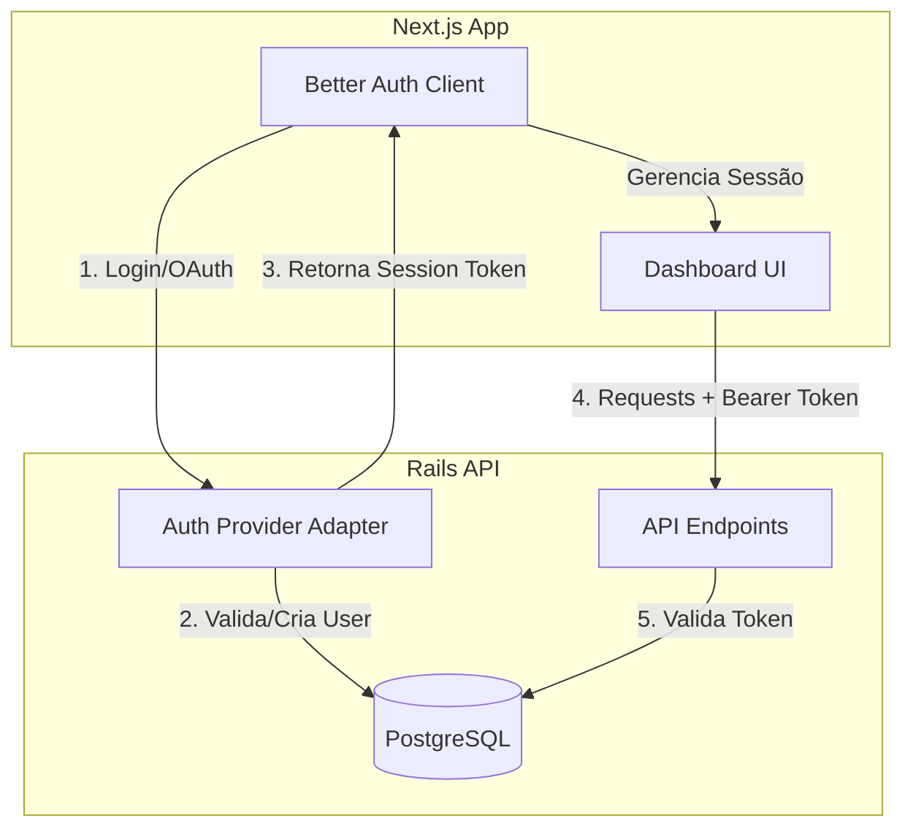

# Especificação Técnica de Arquitetura (Contexto MCP7)

Este documento define os requisitos técnicos e arquiteturais para o sistema, focando no Sistema de Revisões, Acesso Corporativo e Implementação do Better-Auth.

## 1. Sistema de Revisões (Pending Changes & Approval Flow)

O sistema de revisões centraliza todas as modificações sensíveis feitas por usuários corporativos, garantindo que o conteúdo público da plataforma mantenha padrões de qualidade e conformidade.

### 1.1 Fluxo de Aprovação (Workflow)

O fluxo segue o padrão **Solicitação -> Fila -> Análise -> Decisão -> Aplicação**.

1.  **Solicitação (Request)**:
    *   O usuário corporativo realiza uma alteração no dashboard (ex: upload de mídia, edição de perfil).
    *   O sistema intercepta a ação e cria um registro `PendingChange` com status `pending`.
    *   O dado original **não** é alterado imediatamente na tabela principal (`Company`, `Product`).
    *   **Feedback**: O usuário vê o status "Em análise" no frontend.

2.  **Fila de Moderação (Queue)**:
    *   Administradores visualizam uma lista unificada de pendências no Active Admin.
    *   Filtros disponíveis: Por Empresa, Tipo de Mudança (`media`, `company_info`), Data.

3.  **Análise e Decisão**:
    *   **Aprovação**: Admin aciona `approve!`. O sistema executa `apply_changes!`, persistindo os dados no modelo alvo (ex: anexa a imagem à `Company`). O status muda para `approved`.
    *   **Rejeição**: Admin aciona `reject!` com um motivo (`rejection_reason`). O status muda para `rejected`.

4.  **Notificação**:
    *   O usuário é notificado via dashboard/email sobre o resultado.

### 1.2 Níveis de Acesso e Permissões

| Perfil | Permissão | Ações Permitidas |
| :--- | :--- | :--- |
| **Company Owner** | `create_pending_change` | Submeter alterações de perfil, mídia, produtos. Visualizar status de suas solicitações. |
| **Company Editor** | `create_pending_change` | Submeter alterações (restrito a mídias/produtos). Não pode alterar dados fiscais. |
| **Admin (Moderador)** | `read_pending_change`, `review_pending_change` | Visualizar fila, aprovar/rejeitar solicitações. |
| **Admin (Super)** | `manage_all` | Configurar regras de automação de aprovação. |

### 1.3 Critérios de Avaliação e Métricas

**Critérios de Aprovação Automática (Sugestão):**
*   Alterações de texto simples sem palavras proibidas (blocklist).
*   Uploads de usuários "Trusted" (verificados há > 6 meses sem rejeições).

**Métricas de Desempenho (KPIs):**
*   **Tempo Médio de Aprovação (TMA)**: Tempo entre `created_at` e `approved_at/rejected_at`.
*   **Taxa de Rejeição**: % de solicitações rejeitadas por empresa (indica necessidade de educação).
*   **Volume de Backlog**: Quantidade de itens em status `pending` > 24h.

---

## 2. Acesso de Usuários Corporativos ao Dashboard

Estruturação do acesso multi-nível para contas corporativas, permitindo gestão de equipes.

### 2.1 Matriz de Perfis de Usuário (RBAC)

Atualmente o sistema possui `role: company`. A proposta expande para sub-roles dentro do contexto da empresa.

1.  **Account Owner (Dono)**:
    *   Acesso total.
    *   Gestão de usuários da equipe.
    *   Acesso a dados financeiros e billing.
    *   Configurações críticas (delete account).

2.  **Manager (Gerente)**:
    *   Edição de perfil, produtos e galeria.
    *   Resposta a Reviews de clientes.
    *   Visualização de Leads e Analytics.
    *   *Sem acesso*: Billing, Gestão de usuários.

3.  **Editor (Operacional)**:
    *   Upload de Mídia (Galeria).
    *   Cadastro de Produtos.
    *   *Sem acesso*: Resposta a reviews, Leads, Dados da empresa.

### 2.2 Políticas de Autenticação e Autorização

*   **Autenticação**: Via JWT (Bearer Token).
*   **Autorização**:
    *   **Nível 1 (App)**: `User#role` deve ser `company`.
    *   **Nível 2 (Status)**: `User#status` deve ser `active` e `approved_by_admin` true.
    *   **Nível 3 (Contexto)**: `User#company_id` deve corresponder ao recurso acessado.
    *   **Nível 4 (Feature)**: Plano da empresa deve permitir a funcionalidade (ex: `feature_enabled?(:video_gallery)`).

### 2.3 Visualizações por Perfil

*   **Dashboard Home**:
    *   *Todos*: Resumo de views e rating.
    *   *Owner/Manager*: Gráficos de conversão de leads, atalhos de pendências.
*   **Menu Lateral**:
    *   Itens "Financeiro" e "Equipe" ocultos para *Editor*.
    *   Item "Leads" oculto para *Editor* (opcional).

---

## 3. Implementação do Better-Auth

Integração de uma camada de autenticação moderna e unificada, substituindo a fragmentação atual (Devise vs Custom JWT).

### 3.1 Estratégia de Integração

Utilizar o padrão **Better Auth** (biblioteca para Next.js) no frontend, com o Rails atuando como provedor de dados e validador de sessão.



*   **Frontend (Next.js)**: Implementar `better-auth` para gerenciar sessões, social login e 2FA.
*   **Backend (Rails)**: Expor endpoints compatíveis ou adaptar o esquema de banco de dados para suportar as tabelas do Better Auth (`sessions`, `accounts`, `verifications`).

### 3.2 Fluxos de Autenticação

1.  **Email & Senha**:
    *   Front envia credenciais -> Rails valida -> Retorna Session Token (armazenado em Cookie HTTP-only seguro).
2.  **Social Login (Google/LinkedIn)**:
    *   Front inicia fluxo OAuth -> Callback processado pelo Better Auth -> Cria/Linka usuário no banco via API Rails.
3.  **Magic Link / Passwordless** (Novo):
    *   Usuário solicita link -> Sistema envia email -> Clique valida token e cria sessão.

### 3.3 Compatibilidade

*   **Legado**: Manter suporte a tokens JWT atuais por um período de transição (dual-stack) para não quebrar apps móveis ou integrações existentes.
*   **Unificação**: Migrar `AdminUser` (ActiveAdmin) para usar a mesma tabela `User` com flag `is_admin` ou manter separado mas integrado ao mesmo SSO.

---

## 4. Requisitos Técnicos Detalhados

### 4.1 Especificações de API

**Novos Endpoints (Sugestão para suporte a Better-Auth/Dashboard aprimorado):**

```http
# Gestão de Equipe (Owner apenas)
GET  /api/v1/company/members        # Lista membros
POST /api/v1/company/members/invite # Convida por email (cria user pending)
PUT  /api/v1/company/members/:id    # Altera role (Manager/Editor)
DEL  /api/v1/company/members/:id    # Remove acesso

# Pending Changes
GET  /api/v1/company/pending_changes # Lista histórico detalhado
GET  /api/v1/company/pending_changes/:id # Detalhes da rejeição
```

### 4.2 Modelos de Dados (Schema Changes)

**PendingChange (Atualização)**
```ruby
class PendingChange < ApplicationRecord
  # Adicionar suporte a workflow mais complexo se necessário
  # status: pending -> processing -> approved/rejected
  # approved_by: User (id)
end
```

**CompanyMember (Novo - para gestão de equipe)**
```ruby
class CompanyMember < ApplicationRecord
  belongs_to :company
  belongs_to :user
  enum role: { owner: 0, manager: 1, editor: 2 }
  # Substitui a relação direta user.company_id para permitir N:N no futuro ou apenas gestão de permissões
end
```

**Auth Tables (Better Auth Support)**
*   Necessário migrar ou adaptar tabelas `users` para incluir campos de `email_verified`, `image`, e criar tabelas `sessions`, `accounts` (para OAuth links).

### 4.3 Requisitos de Segurança

1.  **Sessão**: Cookies `Secure`, `HttpOnly`, `SameSite=Lax`.
2.  **CSRF**: Proteção obrigatória em todas as rotas de mutação (POST/PUT/DELETE) via Better Auth middleware.
3.  **Rate Limiting**: Aplicar regras estritas em rotas de auth (`/sign-in`, `/sign-up`) via Rack::Attack.
4.  **Audit Log**: Registrar IP e User Agent em todas as aprovações de `PendingChange`.

### 4.4 Métricas de Desempenho

*   **Auth Latency**: Login deve processar em < 200ms (p95).
*   **Dashboard Load**: Initial paint do dashboard corporativo < 1.5s.
*   **Pending Change Application**: Aplicação de mudanças aprovadas (ex: processar imagem) deve ser assíncrona (Sidekiq) se levar > 500ms.

---

## 5. Integrações Better-Auth (Detalhes MCP7)

Análise técnica detalhada para implementação de autenticação social com Google e LinkedIn via Better Auth.

### 5.1 Integração com Google

#### Requisitos GCP (Google Cloud Platform)
*   **Projeto**: Criar/Selecionar projeto no [Google Cloud Console](https://console.cloud.google.com/).
*   **API**: Ativar "Google People API" ou apenas configurar a "Tela de permissão OAuth".
*   **Credenciais**:
    *   Criar "ID do cliente OAuth 2.0".
    *   Tipo de aplicativo: "Aplicação da Web".
    *   **Origens JavaScript autorizadas**: URL do frontend (ex: `http://localhost:3000`, `https://seu-dominio.com`).
    *   **URIs de redirecionamento autorizados**: `<BASE_URL>/api/auth/callback/google` (Padrão Better Auth).

#### Parâmetros Técnicos
*   **Chaves Necessárias**: `GOOGLE_CLIENT_ID`, `GOOGLE_CLIENT_SECRET`.
*   **Escopos (Scopes)**:
    *   `openid` (Obrigatório para OIDC).
    *   `email` (Acesso ao email do usuário).
    *   `profile` (Acesso ao nome e foto).
*   **Fluxo OAuth**: Authorization Code Flow com PKCE (recomendado/padrão Better Auth).

### 5.2 Integração com LinkedIn

#### Requisitos LinkedIn Developer Portal
*   **App**: Criar aplicativo no [LinkedIn Developers](https://www.linkedin.com/developers/).
*   **Produto**: Solicitar acesso ao produto "Sign In with LinkedIn using OpenID Connect".
*   **Verificação**: Associar a uma LinkedIn Page existente (obrigatório para verificação da empresa).

#### Parâmetros Técnicos
*   **Chaves Necessárias**: `LINKEDIN_CLIENT_ID`, `LINKEDIN_CLIENT_SECRET`.
*   **Endpoints**:
    *   Auth: `https://www.linkedin.com/oauth/v2/authorization`
    *   Token: `https://www.linkedin.com/oauth/v2/accessToken`
    *   UserInfo: `https://api.linkedin.com/v2/userinfo` (OIDC compliant).
*   **Escopos (Scopes)**:
    *   `openid`, `profile`, `email`.
*   **Protocolo**: OAuth 2.0 (3-legged).

### 5.3 Documentação de Implementação

#### Dependências e Bibliotecas
*   **Core**: `better-auth` (Versão mínima: **1.2.7**).
*   **Plugins**: `@better-auth/cli` (para gestão de schema).
*   **Complementares**: `zod` (validação de schema no client).

#### Configuração de Ambiente (.env)
```env
# Better Auth Base
BETTER_AUTH_SECRET=seu_secret_super_seguro
BETTER_AUTH_URL=http://localhost:3000

# Google
GOOGLE_CLIENT_ID=xxx.apps.googleusercontent.com
GOOGLE_CLIENT_SECRET=GOCSPX-xxx

# LinkedIn
LINKEDIN_CLIENT_ID=xxx
LINKEDIN_CLIENT_SECRET=xxx
```

#### Passos de Configuração Detalhados
1.  **Instalação**: `npm install better-auth`
2.  **Schema Update**: Rodar migration para adicionar tabelas `account` e `user` com campos de suporte a social login.
3.  **Client Config**: Instanciar `createAuthClient` com os providers configurados.
4.  **Server Config**: Configurar `betterAuth` options com `socialProviders: { google: {...}, linkedin: {...} }`.

#### Parâmetros de Segurança
*   **State Parameter**: Obrigatório para prevenir CSRF durante o handshake OAuth.
*   **HTTPS**: Obrigatório em produção para todos os redirects.
*   **Secret Management**: Nunca commitar chaves no repositório; usar Vault ou Vercel Env Vars.

#### Testes de Integração Recomendados
*   **Sucesso**: Login bem-sucedido cria usuário no banco e redireciona para dashboard.
*   **Falha**: Cancelamento no provider deve redirecionar para login com erro legível.
*   **Duplicidade**: Tentar logar com Google usando email já cadastrado via senha deve linkar contas (se configurado) ou alertar.
*   **Token Refresh**: Verificar se a sessão persiste após expiração do token de acesso do provider (se aplicável).

### 5.4 Checklist de Verificação (Go-Live)

- [ ] **Google Console**: URIs de redirecionamento coincidem EXATAMENTE com a produção (`https://...`).
- [ ] **LinkedIn Developers**: Produto "Sign In with LinkedIn" está com status "Active".
- [ ] **Env Vars**: Todas as variáveis de ambiente (`CLIENT_ID`, `SECRET`) estão definidas no ambiente de deploy (Vercel/Railway/etc).
- [ ] **Database**: Migrations rodadas em produção (tabelas `account` e `session` existem).
- [ ] **Segurança**: `BETTER_AUTH_SECRET` gerado com alta entropia.
- [ ] **Fallback**: Página de erro de login customizada está funcional.
