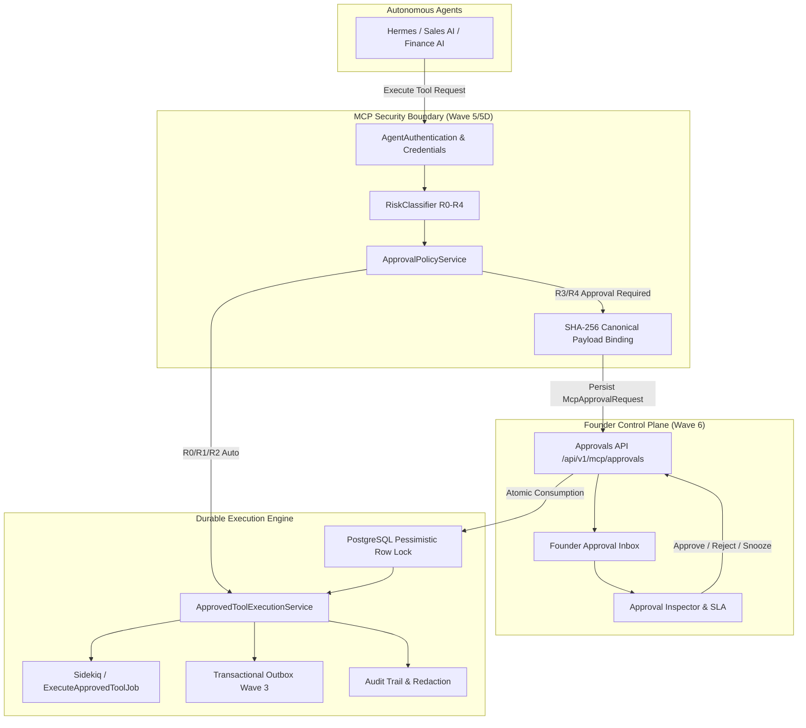
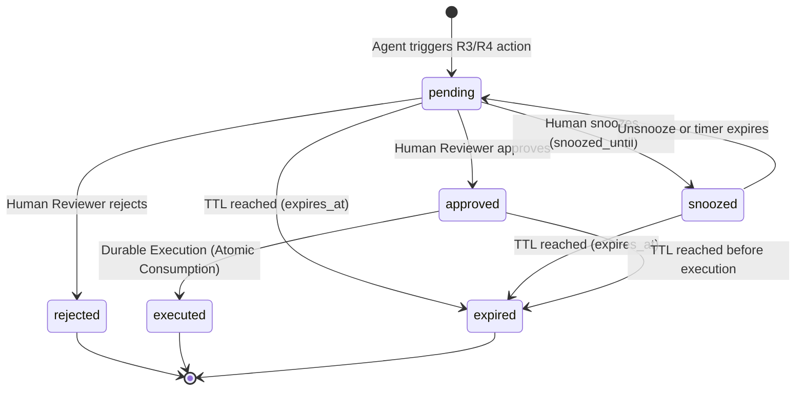

# Avalia Solar — AI Approval Control Plane (Wave 6)
**Data:** 18 de Setembro de 2026
**Status:** IMPLEMENTED & PROVEN (Targeted Waves 0–6: 105 examples, 0 failures)
**Boundary:** Internal Sales CRM (`crm.avaliasolar.com.br` / `/dashboard/sales/ai/*`)

---

## 1. Visão Geral Executiva

O **AI Approval Control Plane** é a camada operacional e de governança humana (Human-in-the-Loop — HITL) para inspeção, decisão e execução durável de ferramentas e ações autônomas disparadas por agentes de IA no Avalia Solar.

Construído como uma extensão nativa do **CRM Interno de Vendas**, ele conecta o motor de políticas de segurança validado nas Waves 0–5D à interface do fundador e da equipe de liderança, garantindo que mutações externas (R3) e ações críticas ou financeiras (R4) nunca sejam executadas sem aprovação humana atômica e auditável.



---

## 2. Invariantes de Segurança Fundacionais (Wave 5 Baseline Preservado)

A Wave 6 consome estritamente e preserva todas as garantias de segurança comprovadas:

1. **Autenticação & Anti-Spoofing de Agentes:**
   Toda requisição MCP valida o `agent_id` contra o `token_digest` em `mcp_agent_credentials`. Agentes revogados ou expirados são sumariamente bloqueados com `401 credential_revoked` ou `401 credential_expired`.
2. **Canonical Payload Binding (SHA-256):**
   O `payload_digest` é computado canonicamente via `CanonicalPayloadService.digest(agent_id, tool_name, tenant_id, parameters)`. Qualquer alteração nos parâmetros enviados invalida a assinatura (`403 approval_payload_mismatch`).
3. **Proteção Contra Auto-Aprovação (Self-Approval Forbidden):**
   Usuários solicitantes (`requested_by_user_id`) não podem aprovar suas próprias requisições (`403 self_approval_forbidden`), mesmo se forem administradores.
4. **Isolamento de Tenant:**
   Nenhuma aprovação pode ser consumida ou visualizada fora do escopo do `tenant_id` da empresa.
5. **Consumo Atômico de Aprovação (Anti-Replay / Anti-Concurrency):**
   Locks pessimistas no PostgreSQL (`with_lock` / `SELECT FOR UPDATE`) garantem que exatamente um operador ou thread consuma uma aprovação pendente ou execute uma ação aprovada.
6. **Redaction Estruturada de Segredos:**
   Credenciais, tokens JWT, senhas e chaves privadas nunca são exibidos na interface, gravados no banco ou transmitidos para jobs em background.

---

## 3. Arquitetura da Informação & Rotas no CRM

O Control Plane é integrado como seção de primeira classe na navegação do CRM Interno:

- `/dashboard/sales/ai/inbox` — Caixa de Entrada do Fundador com fila de aprovações ativas, alertas de SLA e painel inspetor lateral.
- `/dashboard/sales/ai/approvals` — Histórico completo de aprovações com filtros avançados por risco, status, agente e datas.
- `/dashboard/sales/ai/executions` — Monitor de execuções duráveis, status de jobs assíncronos e tracking de transações.
- `/dashboard/sales/ai/agents` — Catálogo de identidades de agentes, credenciais ativas, scopes e ferramentas autorizadas.
- `/dashboard/sales/ai/activity` — Trilha de auditoria operacional em tempo real.

---

## 4. Matriz de Classificação de Risco & Políticas

| Tier | Classificação | Comportamento Padrão | TTL de Aprovação | Nível de Aprovação Exigido |
|---|---|---|---|---|
| **R0** | Safe Read | Execução Imediata | N/A | Automático |
| **R1** | Analysis / Draft | Execução Imediata | N/A | Automático |
| **R2** | Low-Risk Internal Write | Controlado por Política (Auto/Review) | 24 horas | Operador / Staff |
| **R3** | External Mutation | **HITL Obrigatório** | 24 horas | Admin / Gerente de Vendas |
| **R4** | Critical / Financial / Destructive | **HITL Obrigatório + Confirmação Dupla** | 4 horas | Fundador / Super Admin |

---

## 5. Ciclo de Vida de Decisão & Execução



### Regras Críticas de Transição:
1. **Imutabilidade de Payload Aprovado:**
   É terminantemente proibido editar parâmetros de uma aprovação existente (`approval.parameters_payload.update(...)`). Caso parâmetros precisem ser modificados, uma **nova** solicitação de aprovação é criada com um novo `request_uuid` e novo `payload_digest`.
2. **Snooze Operacional vs. Security TTL:**
   O campo `snoozed_until` apenas oculta a solicitação da fila prioritária do inbox. Ele **não** prorroga `expires_at`. Se `snoozed_until > expires_at`, a solicitação expira normalmente no prazo de segurança.
3. **Consumo Atômico de Execução:**
   Ao executar uma ação aprovada via `POST /execute` ou via job assíncrono, a transação bloqueia a linha da aprovação, valida `status == 'approved'`, verifica se não está expirada (`expires_at > Time.current`) e atualiza para `status = 'executed'`, `executed_at = Time.current`, `execution_id = UUID`.

---

## 6. Telemetria e Observabilidade

O módulo integra-se ao `AuditLog` e ao endpoint de métricas operacionais `GET /api/v1/mcp/approvals/stats`:

```json
{
  "ok": true,
  "stats": {
    "total": 128,
    "pending": 7,
    "approved": 4,
    "rejected": 2,
    "expired": 1,
    "executed": 114,
    "high_risk_pending": 3,
    "expiring_soon": 2
  }
}
```

Métricas e logs estruturados emitem logs com prefixo `[MCP_AUDIT]` com correlação por `request_id`, `trace_id` e `execution_id`, com mascaramento estrito de PII e segredos.
