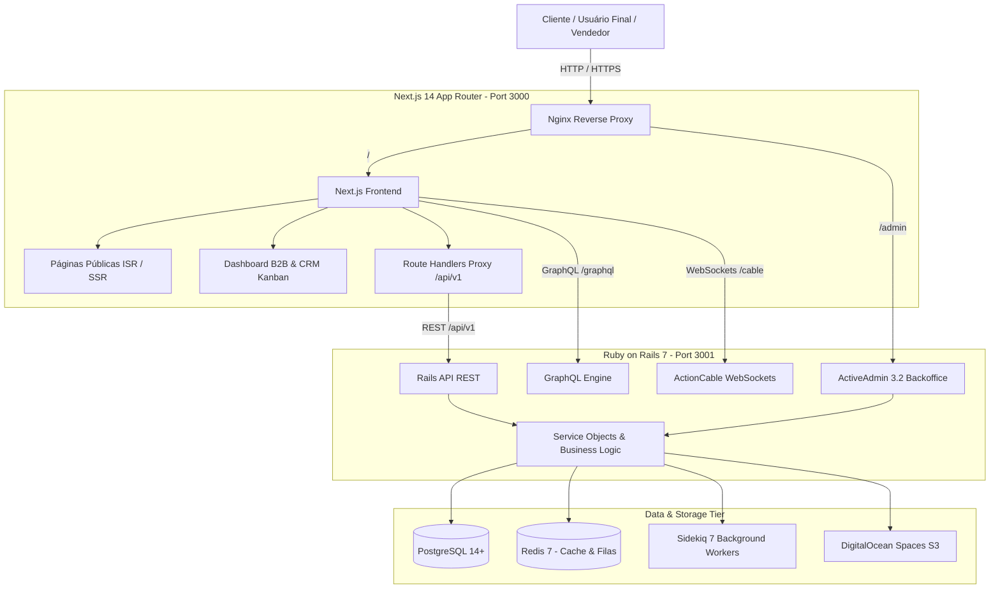
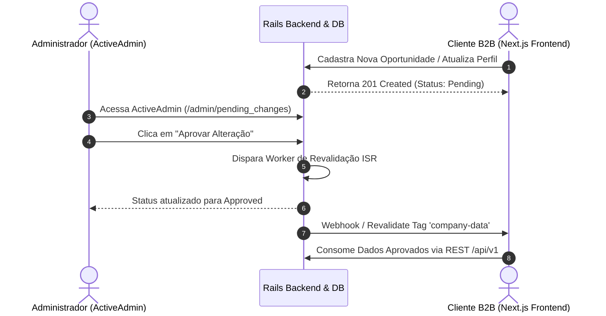

# Blueprint Geral de Arquitetura: Avalia Solar 2026
## Frontend (Next.js 14 App Router) + Backoffice (ActiveAdmin 3.2 / Rails 7)

> **Finalidade:** Documento mestre de arquitetura para replicação completa em um novo produto SaaS corporativo (B2B/B2C marketplace, diretório qualificado, CRM e plataforma de reputação).  
> **Escopo:** Especificação integral do Frontend (`AB0-1-front`), Backoffice Administrativo (`AB0-1-back/app/admin/`), camada de integração, contratos de dados e segurança.

---

## 1. Visão Geral da Topologia do Sistema

O Avalia Solar é um SaaS híbrido que une:
1. **Portal Público e Marketplace de Reputação (B2C/B2B Discovery):** Catálogo de empresas, busca geoespacial, cálculo solar, coleta de reviews verificados e páginas ricas para SEO/AEO/GEO.
2. **Área Autenticada B2B (Company Dashboard & CRM):** Workspace comercial de leads, Kanban de oportunidades dual-density, gestão de reputação, resposta a avaliações e catálogo de produtos.
3. **Backoffice Corporativo (ActiveAdmin):** Console administrativo central de operações, moderação editorial, aprovação de alterações cadastrais, faturamento, auditoria e inteligência comercial.



---

## 2. Arquitetura Frontend (`AB0-1-front`)

### 2.1 Stack Tecnológica
- **Framework Base:** Next.js 14.2 (App Router, Server Components e Client Components).
- **Linguagem:** TypeScript 5.2 (modo estrito com `tsc --noEmit`).
- **Estilização:** Tailwind CSS 3.3 com tokens AS-EDS (Avalia Solar Enterprise Design System), bordas suaves, claymorphism leve e dark mode nativo via classes `dark:`.
- **Componentes UI:** Radix UI primitives (`@radix-ui/react-*`), Lucide Icons, shadcn/ui design patterns (`components/ui/`).
- **Gerenciamento de Estado:**
  - Estado global leve: **Zustand 5**.
  - Cache de servidor e mutations: **TanStack Query 5**.
  - GraphQL: **Apollo Client 4** (com persistência de cache).
- **Data Fetching:** Next.js `fetch` estendido com tags de invalidação (`unstable_cache`, `revalidateTag`).

### 2.2 Estrutura de Diretórios do Frontend
```
AB0-1-front/
├── app/                                 # Next.js App Router
│   ├── layout.tsx                       # Root Layout (Fonts, Providers, Metadados)
│   ├── page.tsx                         # Landing Page Principal
│   ├── (auth)/                          # Rotas de Login, Registro, Recuperação de Senha
│   │   ├── login/page.tsx
│   │   └── register/page.tsx
│   ├── api/                             # Route Handlers
│   │   ├── auth/[...better-auth]/       # Auth Engine Handler
│   │   ├── v1/[...path]/route.ts        # Proxy seguro para backend Rails
│   │   └── revalidate/route.ts          # Webhook de revalidação ISR
│   ├── companies/                       # Catálogo público de empresas
│   │   ├── page.tsx                     # Listagem e busca com filtros
│   │   └── [slug]/page.tsx              # Perfil 360 da Empresa
│   ├── categories/                      # Páginas de categorias com Decision Chips
│   ├── locais/[state]/[city]/           # Páginas dinâmicas locais para SEO/GEO
│   └── dashboard/                       # Área Restrita B2B
│       ├── layout.tsx                   # Layout autenticado B2B
│       ├── page.tsx                     # Visão geral de métricas e reputação
│       ├── sales/                       # CRM & Workspace Comercial
│       │   ├── leads/page.tsx           # Workspace canônico de Leads
│       │   └── pipeline/page.tsx        # Redirecionamento para leads?view=kanban
│       ├── reviews/                     # Gestão e moderação de avaliações
│       ├── products/                    # Catálogo de produtos da empresa
│       └── settings/                    # Dados cadastrais e faturamento
├── components/                          # Componentização Reutilizável
│   ├── ui/                              # Primitivas (button, dialog, input, badge, dropdown)
│   ├── layout/                          # Navbar, Footer, MobileNav, Sidebar
│   ├── sales/                           # Componentes do CRM
│   │   ├── leads/                       # LeadsWorkspace, CreateLeadModal, LeadTable
│   │   └── pipeline/                    # PipelineBoard, PipelineColumn
│   │       └── OpportunityCard/         # OpportunityCard Dual-Density V4
│   ├── company/                         # Cards de empresa, avaliações, galeria
│   └── landing/                         # Hero, HowItWorks, FAQ, Features
├── lib/                                 # Clientes de API e Utilitários
│   ├── api/                             # Clients REST tipados (sales, company, auth)
│   ├── apollo-client.ts                 # GraphQL Client
│   ├── cache/                           # Caches server-side e SWR
│   └── utils.ts                         # Formatadores, helpers de Tailwind (cn)
├── contexts/                            # React Contexts (AuthContext, ThemeContext)
└── hooks/                               # Hooks customizados (useAuth, useToast, useDebounce)
```

### 2.3 Padrão Dual-Density no Kanban B2B
O card de oportunidade implementa o conceito **Dual-Density**:
- **`compact` (Default no Kanban):** ~74px de altura. Exibe estritamente os anchors operacionais: Checkbox, Empresa (truncate), Temperature Badge (`HOT`/`WARM`/`COLD`), Contato Principal, Valor, Probabilidade, Aging (`2d`), Botão Expandir (`ChevronDown`) e Menu (`...`).
- **`expanded` (Contexto Completo):** ~170px. Exibe ainda a última atividade registrada, próxima ação agendada, notas BANT/SPIN e tags.
- **Isolamento de Estado:** Mantido no container `PipelineColumn` através de `Set<number>` (`expandedCardIds`), sem requisitar backend e com `e.stopPropagation()` rigoroso em todas as ações aninhadas.

---

## 3. Arquitetura Backoffice ActiveAdmin (`AB0-1-back/app/admin/`)

O **ActiveAdmin** atua como o sistema nervoso operacional da plataforma. Ele utiliza uma arquitetura baseada em **Hubs Temáticos** e **Recursos de Domínio**, integrando segurança, auditoria e moderação de conteúdo em tempo real.

### 3.1 Stack Tecnológica do Backoffice
- **Linguagem & Framework:** Ruby 3.2.2 + Rails 7.0.8.
- **Engine de Admin:** ActiveAdmin 3.2 sobre Devise (`AdminUser`).
- **Autorização:** Pundit Policies (`app/policies/admin/`).
- **Auditoria & Versionamento:** PaperTrail (`versions.rb`).
- **Moderação de Mudanças:** Pattern `PendingChange` (aprovação antes da publicação pública).
- **Background Jobs:** Sidekiq Workers integrados aos callbacks de admin.

### 3.2 Mapa de Recursos do ActiveAdmin (Classificação por Domínio)

```
app/admin/
├── 1. Hubs & Consoles Executivos
│   ├── dashboard.rb                     # KPI Master (Leads, MRR, GMV, Reviews, Atividade)
│   ├── companies_hub.rb                 # Central de gestão de empresas e verificação
│   ├── plans_billing_hub.rb             # Painel financeiro de planos e assinaturas
│   ├── catalog_products_hub.rb          # Central de curadoria de produtos e marcas
│   ├── advertising_console.rb           # Gestão de visibilidade patrocinada e banners
│   ├── saas_leads_console.rb            # Monitoramento e distribuição de leads comerciais
│   ├── reviewer_overview.rb             # Gestão de revisores e embaixadores
│   └── ranking_preview.rb               # Simulador e pré-visualização de rankings de empresas
│
├── 2. Gestão de Empresas e Catálogo
│   ├── companies.rb                     # Recurso principal (Trust Score, CNPJ, status, SEO)
│   ├── company_access_requests.rb       # Solicitações de reivindicação de perfil
│   ├── products.rb                      # Produtos solares (Módulos, Inversores, Baterias)
│   ├── categories.rb                    # Taxonomia e categorias de mercado
│   ├── badges.rb                        # Selos de verificação e excelência
│   └── pending_changes.rb               # Fila de aprovação de alterações cadastrais
│
├── 3. Reputação e Moderação
│   ├── reviews.rb                       # Moderação de avaliações (aprovação, rejeição, flag)
│   ├── content_moderation_decisions.rb  # Histórico de decisões de moderação
│   └── reputacao.rb                     # Console de calibração do algoritmo de confiança
│
├── 4. Vendas, CRM & Leads
│   ├── leads.rb                         # Leads B2C distribuídos para integradores
│   ├── saas_leads.rb                    # Oportunidades enterprise do próprio SaaS
│   ├── sales_opportunities.rb           # Oportunidades do pipeline de vendas
│   ├── sales_accounts.rb                # Contas comerciais do CRM
│   └── sales_tasks.rb                   # Tarefas e atividades comerciais
│
├── 5. Monetização, Banners & Billing
│   ├── plans.rb                         # Planos de assinatura (Free, Pro, Enterprise)
│   ├── billing_company_subscriptions.rb # Assinaturas ativas no Stripe / MercadoPago
│   ├── banners.rb                       # Banners de marketing (Header, Sidebar, Categoria)
│   └── banner_audit_logs.rb             # Log de impressões e cliques auditados
│
└── 6. Segurança e Administração do Sistema
    ├── admin_users.rb                   # Operadores do sistema com RBAC
    ├── users.rb                         # Usuários finais e gestores de empresa
    ├── versions.rb                      # Trilha de auditoria PaperTrail (quem alterou o quê)
    └── sistema.rb                       # Configurações globais e flags de ambiente
```

### 3.3 Anatomia de um Recurso Enterprise no ActiveAdmin

Abaixo está o padrão arquitetural utilizado para criar qualquer recurso administrativo no ActiveAdmin:

```ruby
# app/admin/companies.rb
ActiveAdmin.register Company do
  # 1. Permissões de Parâmetros Seguros
  permit_params :name, :slug, :cnpj, :status, :plan_id, :trust_score,
                :verified, :featured, :state, :city, :phone, :website,
                category_ids: []

  # 2. Otimização de Consultas (Prevenção de N+1)
  includes :plan, :categories, :logo_attachment

  # 3. Scopes Rápidos na Barra Superior
  scope :all, default: true
  scope :verified, -> { where(verified: true) }
  scope :pending_approval, -> { where(status: 'pending') }
  scope :high_trust, -> { where('trust_score >= ?', 80) }

  # 4. Filtros Laterais Inteligentes
  filter :name
  filter :cnpj
  filter :status, as: :select, collection: -> { Company.statuses }
  filter :plan
  filter :categories
  filter :state
  filter :trust_score
  filter :created_at

  # 5. Listagem Principal (Index com Densidade Alta)
  index do
    selectable_column
    id_column
    column :logo do |company|
      if company.logo.attached?
        image_tag url_for(company.logo), class: 'admin-table-thumb'
      end
    end
    column :name do |c|
      link_to c.name, admin_company_path(c)
    end
    column :cnpj
    column :trust_score do |c|
      status_tag(c.trust_score, class: c.trust_score >= 80 ? 'ok' : 'warning')
    end
    column :status do |c|
      status_tag(c.status)
    end
    column :plan
    column :created_at
    actions defaults: true do |company|
      item 'Ver no Site', public_company_url(company.slug), target: '_blank', class: 'member_link'
    end
  end

  # 6. Ações em Lote (Batch Actions)
  batch_action :verify_selected, confirm: 'Deseja verificar as empresas selecionadas?' do |ids|
    batch_action_collection.find(ids).each(&:mark_as_verified!)
    redirect_to collection_path, notice: 'Empresas verificadas com sucesso.'
  end

  # 7. Ações Individuais (Member Actions)
  member_action :recalculate_trust, method: :post do
    resource.recalculate_trust_score!
    redirect_to admin_company_path(resource), notice: 'Trust score recalculado.'
  end

  # 8. Visão Detalhada (Show) em Painéis Semânticos
  show do
    attributes_table do
      row :id
      row :name
      row :cnpj
      row :status
      row :trust_score
      row :plan
      row :created_at
      row :updated_at
    end

    panel 'Últimas Avaliações Recebidas' do
      table_for company.reviews.order(created_at: :desc).limit(5) do
        column :rating
        column :title
        column :author_name
        column :status
        column :created_at
      end
    end
  end

  # 9. Formulário de Edição Estruturado
  form do |f|
    f.semantic_errors
    f.inputs 'Dados Cadastrais' do
      f.input :name
      f.input :cnpj
      f.input :phone
      f.input :website
    end
    f.inputs 'Classificação & Confiança' do
      f.input :status, as: :select, collection: Company.statuses.keys
      f.input :verified
      f.input :trust_score
      f.input :plan
      f.input :categories, as: :check_boxes
    end
    f.actions
  end
end
```

---

## 4. Camada de Integração e Contratos



### 4.1 Proxy Reverso Seguro no Frontend
Para evitar expor o backend Rails diretamente para a internet e eliminar problemas de CORS, o Next.js possui um Route Handler proxy:
- Rota: `AB0-1-front/app/api/v1/[...path]/route.ts`
- O frontend redireciona chamadas para `http://backend:3001/api/v1/...` injetando tokens JWT e headers de verificação de borda (`x-edge-signature`).

### 4.2 WebSockets com ActionCable
- Notificações de novos leads, atualizações de status de reviews e movimentações no pipeline de vendas são transmitidos via WebSockets na rota `/cable`.

---

## 5. Blueprint de Replicação para um Novo SaaS (Passo a Passo)

Para criar um novo produto SaaS do zero utilizando esta mesma arquitetura de sucesso:

### Passo 1: Inicializar o Monorepo
```bash
mkdir meu-novo-saas && cd meu-novo-saas
mkdir app-front app-back infra docs
git init
```

### Passo 2: Configurar o Frontend (Next.js 14)
1. Instalar Next.js com App Router, TypeScript e Tailwind CSS:
   ```bash
   npx create-next-app@latest app-front --typescript --tailwind --eslint --app --src-dir=false
   ```
2. Instalar dependências essenciais de UI:
   ```bash
   cd app-front
   npm i lucide-react @radix-ui/react-dialog @radix-ui/react-dropdown-menu clsx tailwind-merge zustand @tanstack/react-query
   ```
3. Copiar a estrutura do `OpportunityCard` Dual-Density em `components/pipeline/`.
4. Configurar o proxy em `app/api/v1/[...path]/route.ts`.

### Passo 3: Configurar o Backend (Rails 7 + ActiveAdmin)
1. Inicializar app Rails com PostgreSQL:
   ```bash
   cd ../app-back
   bundle init
   rails new . -d postgresql --api=false
   ```
2. Adicionar gems no `Gemfile`:
   ```ruby
   gem 'devise'
   gem 'activeadmin', '~> 3.2'
   gem 'pundit'
   gem 'paper_trail'
   gem 'sidekiq'
   gem 'redis'
   gem 'cors'
   gem 'active_model_serializers'
   gem 'jwt'
   ```
3. Rodar os instaladores:
   ```bash
   bundle install
   rails g devise:install
   rails g active_admin:install
   rails db:migrate
   ```
4. Criar os Hubs e consoles executivos espelhando os modelos do `app/admin/`.

### Passo 4: Orquestração Docker Compose de Produção
Configurar o `docker-compose.yml` na raiz:
```yaml
version: '3.8'

services:
  frontend:
    build:
      context: .
      dockerfile: Dockerfile.frontend
    ports:
      - "3000:3000"
    environment:
      - NEXT_PUBLIC_API_URL=http://backend:3001
    depends_on:
      - backend

  backend:
    build:
      context: .
      dockerfile: Dockerfile.backend
    ports:
      - "3001:3001"
    environment:
      - DATABASE_URL=postgres://user:pass@db:5432/saas_production
      - REDIS_URL=redis://redis:6379/0
    depends_on:
      - db
      - redis

  sidekiq:
    build:
      context: .
      dockerfile: Dockerfile.backend
    command: bundle exec sidekiq
    depends_on:
      - db
      - redis

  db:
    image: postgres:15-alpine
    volumes:
      - postgres_data:/var/lib/postgresql/data
    environment:
      - POSTGRES_USER=user
      - POSTGRES_PASSWORD=pass
      - POSTGRES_DB=saas_production

  redis:
    image: redis:7-alpine
    volumes:
      - redis_data:/data

volumes:
  postgres_data:
  redis_data:
```

---

## 6. Sumário de Diretrizes Técnicas

1. **Separação Rígida:** O ActiveAdmin é a autoridade administrativa interna; o Frontend Next.js é a autoridade de experiência do usuário.
2. **Sem Duplicação de Regras:** Cálculos de score, validações fiscais (CNPJ/CPF) e faturamento residem em `app/services/` no Rails, sendo chamados tanto pela API REST do frontend quanto pelas ações do ActiveAdmin.
3. **Auditoria Sempre Ativa:** Todas as ações manuais de administradores em empresas, leads ou pagamentos devem gerar registros no PaperTrail (`versions`) e registros em `AuditLog`.
