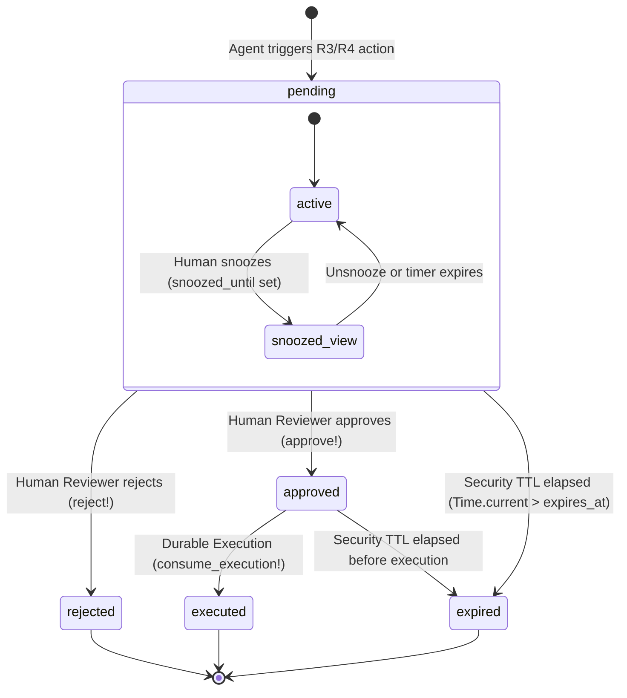

# Avalia Solar — MCP Approval State Machine (Wave 6)
**Data:** 18 de Setembro de 2026
**Status:** IMPLEMENTED & PROVEN
**Aggregate Root:** `McpApprovalRequest` (PostgreSQL `mcp_approval_requests`)

---

## 1. Visão Geral da Máquina de Estados

O ciclo de vida de uma solicitação de aprovação de IA (`McpApprovalRequest`) gerencia a transição segura e determinística entre o momento em que um agente autônomo dispara uma ferramenta de alto risco (R3/R4) até a decisão humana e execução final durável.



---

## 2. Tabela Canônica de Estados

| Estado | Significado de Segurança | Ações Permitidas | Gatilhos de Saída |
|---|---|---|---|
| `pending` | Solicitação aguardando decisão humana de operador autorizado | `approve!`, `reject!`, `snooze!`, `unsnooze!` | Aprovação, Rejeição ou Expirar |
| `approved` | Solicitação validada e assinada por operador autorizado | `consume_execution!` | Consumo atômico para execução ou Expirar |
| `rejected` | Solicitação recusada pelo operador com justificativa persistida | *Nenhuma* (Estado Terminal) | Finalizado |
| `executed` | Ação consumida atomicamente e despachada para execução durável | *Nenhuma* (Estado Terminal) | Finalizado |
| `expired` | Prazo de segurança (TTL) esgotado sem decisão ou consumo | *Nenhuma* (Estado Terminal) | Finalizado |

---

## 3. Invariantes e Regras Não-Negociáveis

### 3.1 Imutabilidade Criptográfica de Parâmetros
O `payload_digest` é gerado via `SHA-256` sobre a representação canônica dos argumentos no momento da criação. É terminantemente proibido mutar parâmetros de uma aprovação existente. Caso o operador deseje alterar os parâmetros ("Edit"), a solicitação anterior é invalidada ou mantida com seu status original e uma **nova** `McpApprovalRequest` é gerada com seu próprio digest e UUID.

### 3.2 Distinção entre UI Snooze e Security TTL
O estado de `snooze` é uma propriedade de experiência do usuário no Inbox:
- O campo `snoozed_until` remove a aprovação da fila prioritária do operador até a data/hora estipulada.
- O campo **NÃO** prorroga `expires_at`.
- Se `snoozed_until > expires_at`, a requisição transiciona normalmente para `expired` assim que `Time.current > expires_at`.

### 3.3 Atomicidade no PostgreSQL (`with_lock`)
Todas as transições de estado (`approve!`, `reject!`, `snooze!`, `unsnooze!`, `consume_execution!`) são executadas sob lock pessimista de linha (`SELECT ... FOR UPDATE`), garantindo que:
- Múltiplos aprovadores concorrentes nunca aprovem/rejeitem simultaneamente de forma inconsistente.
- Múltiplos workers de execução concorrentes nunca executem a mesma aprovação duas vezes (prevenção absoluta de replay).
- Tentativas de aprovação pelo próprio solicitante (`requested_by_user_id == approver_user_id`) resultem em `self_approval_forbidden`.

---

## 4. Métodos de Transição do Model `McpApprovalRequest`

```ruby
class McpApprovalRequest < ApplicationRecord
  # Aprovação humana por operador autorizado
  def approve!(user)
    with_lock do
      raise Mcp::Error::InvalidStateError, "Cannot approve non-pending request" unless pending?
      raise Mcp::Error::ExpiredApprovalError, "Approval request has expired" if expired?
      raise Mcp::Error::SelfApprovalForbiddenError, "Requester cannot approve their own request" if requested_by_user_id.present? && requested_by_user_id == user.id

      update!(
        status: 'approved',
        approved_by_user_id: user.id,
        approved_at: Time.current
      )
    end
  end

  # Rejeição com motivo saneado
  def reject!(user, reason: nil)
    with_lock do
      raise Mcp::Error::InvalidStateError, "Cannot reject non-pending request" unless pending?
      raise Mcp::Error::ExpiredApprovalError, "Approval request has expired" if expired?

      update!(
        status: 'rejected',
        approved_by_user_id: user.id,
        rejected_at: Time.current,
        reason: reason.to_s.strip[0..500].presence || self.reason
      )
    end
  end

  # Consumo atômico para execução
  def consume_execution!(execution_id)
    with_lock do
      raise Mcp::Error::InvalidStateError, "Only approved requests can be executed" unless approved?
      raise Mcp::Error::ExpiredApprovalError, "Approval request has expired" if expired?
      raise Mcp::Error::AlreadyConsumedError, "Approval has already been executed" if executed_at.present?

      update!(
        status: 'executed',
        executed_at: Time.current,
        execution_id: execution_id
      )
    end
  end
end
```
