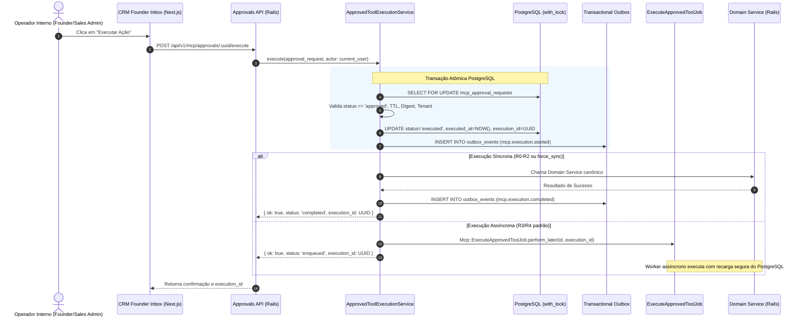

# Avalia Solar — MCP Durable Execution Engine (Wave 6)
**Data:** 18 de Setembro de 2026
**Status:** IMPLEMENTED & PROVEN
**Core Components:** `Mcp::ApprovedToolExecutionService`, `Mcp::ExecuteApprovedToolJob`, `TransactionalOutbox`

---

## 1. Visão Geral do Mecanismo de Execução Durável

O **Mecanismo de Execução Durável** da Wave 6 é o responsável pelo despacho atômico, resiliente e auditável de ferramentas de IA aprovadas por humanos.

Ele atua como a ponte entre o security boundary de aprovações (`McpApprovalRequest`) e os **Domain Services** do Rails, orquestrando:
1. Autenticação e autorização do agente e operador.
2. Verificação de integridade criptográfica do payload (SHA-256 binding).
3. Consumo atômico da aprovação via PostgreSQL row locks (`with_lock`).
4. Geração de `execution_id` único para rastreabilidade de ponta a ponta.
5. Integração com o Transactional Outbox (Wave 3) para publicação determinística de eventos de domínio.
6. Enfileiramento em background via Sidekiq (`Mcp::ExecuteApprovedToolJob`) para operações assíncronas de longa duração.
7. Trilha de auditoria estruturada com mascaramento de segredos (`[MCP_AUDIT]`).

---

## 2. Taxonomia de Efeitos Colaterais Externos & Idempotência

Não é possível prometer "exactly-once" universal para terceiros sem suporte a idempotência no parceiro remoto. O Avalia Solar adota uma classificação rigorosa e auditável:

| Categoria de Execução | Descrição | Semântica de Idempotência | Exemplos |
|---|---|---|---|
| **A) DATABASE_MUTATION** | Alteração estrita no banco PostgreSQL local dentro da transação | **EXACTLY_ONCE (Proven via ACID)** | Atualização de Lead, Mudança de Status |
| **B) OUTBOX_MUTATION** | Emissão de evento de domínio no Transactional Outbox (Wave 3) | **EXACTLY_ONCE (Proven via Outbox)** | `mcp.execution.completed`, Notificações |
| **C) IDEMPOTENT_EXTERNAL_MUTATION** | Chamada a API externa com chave de idempotência (`Idempotency-Key: execution_id`) | **EXACTLY_ONCE (Proven via Provider Idempotency)** | Cobranças Stripe, Webhooks assinados |
| **D) NON_IDEMPOTENT_EXTERNAL_MUTATION** | Chamada a serviço externo sem chave de idempotência | **AT_LEAST_ONCE / NOT_PROVEN** | Envio de SMS, WhatsApp legado |

---

## 3. Fluxo de Execução Durável Passo a Passo

---

## 4. Segurança no Enfileiramento de Jobs (Sidekiq)

É expressamente proibido trafegar segredos, credenciais ou tokens em parâmetros de jobs Sidekiq:

- **O job recebe apenas:** `approval_request_id` (inteiro) e `execution_id` (UUID).
- **O payload é recarregado do PostgreSQL:** O job nunca confia em parâmetros reenviados pelo cliente. Ele busca a aprovação no banco de dados e utiliza o `parameters_payload` gravado sob a assinatura canônica validada.
- **Nenhum segredo no Redis:** JWTs, tokens de acesso ou senhas nunca são serializados para a fila do Redis.
