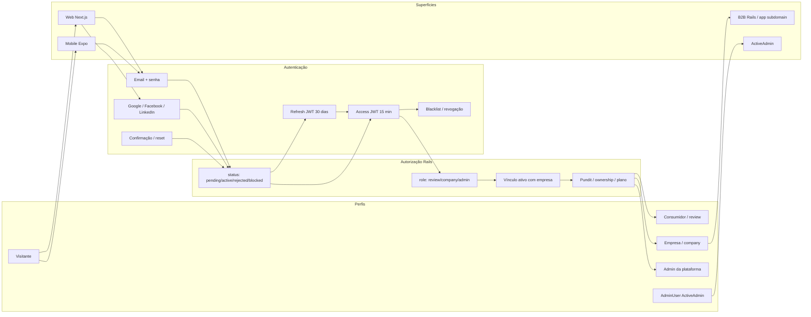
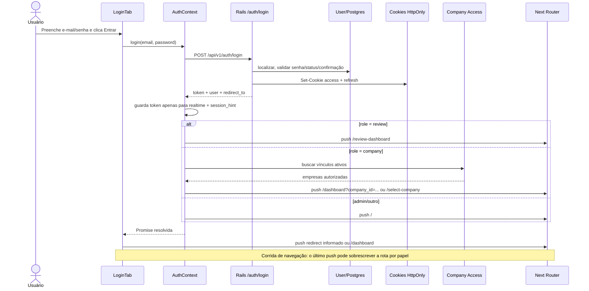
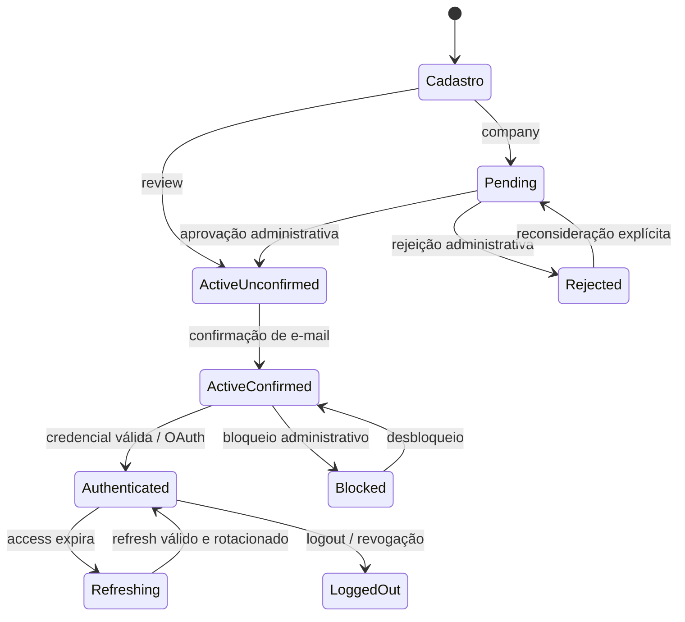

<!-- Hallmark · pre-emit critique: P5 H5 E5 S5 R4 V4 -->

# Auditoria E2E A++++ — autenticação, telas, comportamentos e autorização

**Projeto:** Avalia Solar 2026  
**Data-base:** 05/08/2026  
**Escopo:** Web Next.js, API Rails, Mobile Expo, OAuth, JWT, recuperação de senha, confirmação de e-mail, sessões Admin/B2B e autorização por papel.  
**Método:** análise estática rastreável do código e dos testes existentes. Esta versão não afirma validação visual em navegador/dispositivo nem execução contra produção.

## 1. Parecer executivo

O ecossistema possui uma base de autenticação madura no backend: JWT assinado, access token de 15 minutos, refresh token de 30 dias, cookies `HttpOnly`, rotação de refresh, blacklist, logout global, confirmação de e-mail, anti-enumeração e rate limiting. O controle de acesso sensível é majoritariamente revalidado no Rails por autenticação, papéis, vínculo ativo com empresa e policies Pundit.

O principal risco não está na ausência de mecanismos, mas na coexistência de implementações parcialmente divergentes:

1. A tela Web e o `AuthContext` disputam o redirecionamento pós-login; o segundo `push` pode mandar qualquer usuário para `/dashboard`, anulando a decisão por papel.
2. Existem duas rotas Web de redefinição com contratos diferentes: `/reset-password#token=...` é a versão segura e `/reset-password/[token]` expõe o segredo no caminho da URL.
3. O middleware Web apenas verifica a presença do cookie, não a validade do JWT nem o papel. A API é a barreira real, mas a UX pode exibir uma página protegida até a primeira chamada falhar.
4. A sessão Web depende de um `session_hint` em `localStorage` para sequer consultar `/auth/me`. Se o hint for removido e o cookie continuar válido/HttpOnly, a sessão pode ser tratada como inexistente no cliente.
5. No Mobile, logout remove somente o token local e não revoga a sessão no backend; recuperação de senha é simulada; cadastro não envia aceite de termos nem confirmação de senha; e o retorno de `/auth/me` está tipado de modo incompatível com o envelope Rails.
6. O fluxo de empresa comunica que enviou confirmação, mas o modelo impede confirmação enquanto não houver aprovação administrativa. A sequência correta precisa ser explicitada e testada.

**Classificação geral observada:** backend **B+**, Web **C+**, Mobile **D**, cobertura E2E integrada **D+**. A nota é qualitativa e reflete consistência ponta a ponta, não apenas presença de controles isolados.

## 2. Fontes de verdade e limites

As fontes primárias desta auditoria são:

- Web: `contexts/AuthContext.tsx`, `app/(auth)/components/*`, `app/auth/callback/page.tsx`, `app/forgot-password/page.tsx`, as duas rotas `reset-password`, `lib/api.ts` e `middleware.ts`.
- API: `auth_controller.rb`, `base_controller.rb`, `jwt_authenticatable.rb`, `user.rb`, callback OmniAuth, rotas e policies.
- Mobile: `src/app/profile.tsx`, `src/app/forgot-password.tsx`, `src/store/auth.ts`, `src/lib/api.ts`, `authStorage.ts` e Maestro.
- Evidência automatizada: specs de request/model/policy no Rails, testes da store e storage no Mobile e o fluxo Maestro existente.

Legenda de confiança:

- **Confirmado:** ação e efeito observados diretamente no código.
- **Parcial:** existe implementação, mas contrato, navegação ou cobertura não fecha E2E.
- **Simulado:** UI apresenta sucesso sem integração real.
- **Inferência:** consequência técnica derivada de dois ou mais trechos; deve ser confirmada em execução.

## 3. Mapa mestre do fluxo de informação

### 3.1 Sequência real do login Web por e-mail

## 4. Modelo de identidade, sessão e estados

### 4.1 Papéis principais

| Papel | Significado efetivo | Entrada esperada | Destino nominal |
|---|---|---|---|
| Visitante | Sem identidade validada | Páginas públicas | Continua no conteúdo público ou recebe gate |
| `review` | Consumidor/avaliador | Login, cadastro pessoal ou OAuth | `/review-dashboard` |
| `company` | Usuário de empresa | Cadastro empresarial + aprovação + vínculo ativo | `/dashboard?company_id=...` ou `/select-company` |
| `admin` | Usuário administrativo da API/produto | Provisionamento administrativo | `/` no `AuthContext`; acessa APIs admin por papel |
| `AdminUser` | Identidade separada do ActiveAdmin | `/admin/login` via Devise | `/admin` |

`AdminUser` e `User(role=admin)` são domínios de identidade diferentes. Não se deve assumir que autenticar em um autentica automaticamente no outro.

### 4.2 Estado de conta

Observação: no cadastro `review`, o controller cria `status=active`, mas o login de produção bloqueia até confirmação. Para `company`, cria `status=pending` e o model suprime o e-mail de confirmação antes da aprovação. Portanto, o fluxo empresarial efetivo é **cadastro → aprovação → envio/obtenção de confirmação → confirmação → login**, e não apenas “cadastro → aguardar ativação”.

### 4.3 Contrato de tokens

| Item | Implementação | Persistência | Observação |
|---|---|---|---|
| Access JWT | HS256, `user_id`, `typ=access`, `iat`, `jti`, `exp` | Cookie assinado `jwt_token`, HttpOnly; token também volta no JSON | Expira em 15 min |
| Refresh JWT | HS256, `typ=refresh` | Cookie assinado `refresh_token`, HttpOnly | Expira em 30 dias e rotaciona |
| Header Bearer | Aceito como fallback | Memória/SecureStore conforme cliente | Mobile depende dele |
| Revogação | `JwtBlacklistService` | Redis ou implementação equivalente | Logout atual e logout de todos os dispositivos |
| Hint Web | `avalia.auth.session_hint=1` | `localStorage` | Não é credencial, mas condiciona a verificação da sessão |
| Token realtime Web | resposta JSON de login | memória/utilitário realtime | Deve expirar junto com access token |
| Token Mobile | resposta JSON de login | SecureStore | Logout atual não chama revogação remota |

## 5. Inventário Web — tela por tela e clique por clique

### 5.1 `/login`

Container modal de tela cheia, fechado por botão, clique no backdrop ou `Escape`. Fechar anima por 300 ms e navega para `/`. As abas alteram também a URL via `router.replace`.

| Elemento/ação | Efeito confirmado | Estado/retorno | Risco/observação |
|---|---|---|---|
| `X`, backdrop ou `Escape` | Fecha e envia à Home | animação de saída | Não restaura `return_to`; modal não usa `<dialog>` nem focus trap/inert |
| Aba **Entrar** | Mostra `LoginTab`, URL `/login` | ativa visualmente | Correto |
| Aba **Criar conta** | Mostra cadastro, URL `/register` | ativa visualmente | `/register` não aparece no inventário App Router; rota canônica existente é `/signup` e `/register-user` |
| **Para Você** | Mostra cadastro pessoal | estado local | Sem alteração de URL específica |
| **Para Empresas** | Mostra cadastro empresarial | estado local | Sem deep link do subtipo |
| Google | Redireciona ao Rails `/users/auth/google_oauth2` | navegação total | Callback volta a `/auth/callback` |
| Facebook | Redireciona ao Rails `/users/auth/facebook` | navegação total | Idem |
| LinkedIn | Redireciona ao Rails `/users/auth/linkedin` | navegação total | Idem |
| E-mail | Alimenta credencial | `required`, type email | Label usa “Email”, restante do produto alterna “E-mail” |
| Senha | Alimenta credencial | `required` | Sem validação antecipada de política |
| Olho | Alterna texto/senha | visual | Botão não tem `aria-label`; foco customizado removido sem reposição local |
| **Lembrar-me** | Apenas alterna checkbox | visual | Não influencia validade/persistência: refresh já dura 30 dias sempre |
| **Esqueceu sua senha?** | Navega a `/forgot-password` | página separada | Correto |
| **Entrar** | Chama `AuthContext.login` | loading, erro, reenvio de confirmação | Há duplo redirect após sucesso |
| **Reenviar confirmação** | POST `/auth/resend_confirmation` | loading e mensagem neutra | Protege contra enumeração |
| **Criar conta** | Troca aba | visual/URL | Compartilha a inconsistência `/register` |

Estados tratados: idle, loading, credenciais inválidas, conta não confirmada, conta bloqueada/inativa, reenvio carregando, mensagem de reenvio e erro genérico. Faltam estado offline explícito, cooldown visível do 429, foco de erro e anúncio robusto do erro para leitores de tela.

### 5.2 Cadastro pessoal

Campos observados: avatar opcional, nome, e-mail, cidade, UF, telefone, senha, confirmação e aceite de termos/privacidade. O envio usa `multipart/form-data`, cria papel `review`, status ativo ainda não confirmado e dispara confirmação por e-mail.

| Clique/ação | Resultado |
|---|---|
| Avatar | Abre seletor de PNG/JPEG; preview local; limite comunicado de 2 MB |
| Remover avatar | Limpa preview/arquivo |
| UF | Abre select dos estados |
| Aceite | Alimenta `terms_accepted` |
| Criar conta | Valida formulário e POST `/auth/register` |
| Sucesso | Deve orientar confirmação de e-mail; login de produção só libera após confirmação |

Pontos de contrato: a UI anuncia 2 MB, enquanto o model aceita até 5 MB; a política da senha Web pessoal coincide parcialmente com o backend (8+, maiúscula, minúscula, número), mas erros não estão associados por `aria-describedby`.

### 5.3 Cadastro empresarial

Campos: nome, e-mail corporativo, telefone, senha, confirmação e aceite. O cliente bloqueia domínios públicos e envia `role=company`. O backend cria a conta como `pending`.

| Clique/ação | Resultado |
|---|---|
| E-mail corporativo | Validação Zod + verificação redundante no submit |
| Tipo/telefone/senha | Validação local |
| Aceite | Obrigatório |
| **Criar Conta de Empresa** | POST `/auth/register` com multipart |
| **Voltar para Home** no sucesso | Navega `/` |

Riscos: o schema Zod aceita senha com 6 caracteres, o registro do campo declara 8, mas o resolver governa o formulário; o backend exige complexidade completa de 8+. Isso permite submit que termina em erro do servidor. Além disso, o bloqueio de e-mail público existe no cliente, não no trecho auditado do backend: um cliente direto pode contorná-lo.

### 5.4 `/auth/callback`

Estados:

- `status=success`: grava o hint, chama `/auth/me`, então `review → /review-dashboard`, `company → /select-company`, outros → `/`.
- `pending_approval`: mostra espera e link de retorno ao login.
- `inactive`: mostra status recebido e orienta suporte.
- `error`: mostra mensagem recebida e botão **Tentar novamente**.
- parâmetro desconhecido/ausente: volta a `/login`.

O callback não preserva `return_to`. Empresa com vínculo ativo sempre vai primeiro a `/select-company`, diferente do login por senha.

### 5.5 `/forgot-password`

| Clique/ação | Resultado |
|---|---|
| **Enviar link** | POST `/auth/forgot_password` |
| Sucesso | Mensagem neutra “se existir” |
| **Voltar ao login** | `/login` |
| **Criar conta** | `/register` |

O backend evita enumeração. A rota `/register` usada aqui precisa ser confirmada, pois as entradas encontradas são `/signup` e `/register-user`.

### 5.6 Redefinição de senha — duas implementações

**Fluxo recomendado atual:** `/reset-password#token=...`

- rejeita token na query string;
- extrai do fragmento, apaga o fragmento imediatamente e envia o token em `Authorization: Bearer`;
- valida mínimo de 8 caracteres e igualdade;
- backend redefine, emite nova sessão e responde `auto_login=true`;
- UI envia `review` ao dashboard e os demais a `/select-company`.

**Fluxo concorrente:** `/reset-password/[token]`

- token fica no path e pode aparecer em histórico, telemetria, logs de proxy/referrer e screenshots;
- usa `authApi.resetPassword`, depois ignora o `auto_login` emitido pelo backend;
- informa sucesso e redireciona ao login em 1,5 s, embora cookies de sessão já tenham sido emitidos;
- valida apenas tamanho e igualdade, enquanto o backend exige também maiúscula, minúscula e número.

Decisão recomendada: manter um único fluxo com fragmento, remover/deprecar de forma segura o path dinâmico e padronizar os links dos mailers.

### 5.7 Sessão expirada e logout Web

- O cliente tenta refresh automaticamente em condições observadas no wrapper HTTP.
- Em `TOKEN_REVOKED` ou `SESSION_EXPIRED`, limpa dados locais, tenta apagar cookies acessíveis e navega para `/login?reason=session_expired`.
- Cookies HttpOnly não podem ser apagados por JavaScript; a fonte de verdade deve continuar sendo o endpoint Rails.
- `AuthContext.logout` chama o backend, limpa hint/token realtime, identidade analítica e estado do usuário.
- `logout_all` existe na API, mas não foi localizado como ação exposta na UI Web.

## 6. Inventário Mobile — tela por tela e clique por clique

### 6.1 `profile.tsx` deslogado

| Elemento | Efeito | Situação |
|---|---|---|
| Nome | Aparece apenas no cadastro | funcional |
| E-mail/senha | Alimentam login/cadastro | funcional |
| **Esqueceu sua senha?** | Abre `/forgot-password` | funcional, destino simulado |
| Consumidor/Empresa | Define `role` enviado ao cadastro | funcional no cliente |
| **Entrar** | POST `auth/login`, salva token no SecureStore | parcial |
| **Criar conta** | POST `auth/register`, salva token retornado | incompatível com confirmação/aprovação |
| Alternar login/cadastro | Troca formulário | funcional |

Problemas de contrato: o cadastro Mobile envia `{name,email,password,role}` na raiz, sem `terms_accepted`, sem `password_confirmation`, cidade ou aceite. O backend rejeita termos ausentes; logo o cadastro real tende a falhar com `TERMS_NOT_ACCEPTED`. Mesmo se criado, salvar token e tratar como autenticado conflita com a exigência de confirmação e, para empresas, aprovação.

### 6.2 `profile.tsx` logado

| Papel | Ações visíveis |
|---|---|
| `review` | **Minhas Negociações** → `/p2p_chat`; logout |
| `company` | **Dashboard da Empresa** → `/dashboard`; logout |
| `admin` | É exibido como “Consumidor”; sem destino administrativo específico |

O logout Mobile apenas remove o SecureStore. Não chama `/auth/logout`; portanto o JWT permanece utilizável até expirar e não entra na blacklist.

### 6.3 Inicialização da sessão Mobile

1. Lê token do SecureStore.
2. Se existir, chama GraphQL `me` com timeout de 5 s; depois REST como fallback.
3. Em qualquer erro, remove o token e desloga.

Riscos: uma indisponibilidade temporária de rede apaga uma sessão válida; não há refresh token persistido/rotacionado no cliente; e o fallback REST declara retorno `User`, mas Rails retorna `{user: ...}`, podendo armazenar o envelope como usuário.

### 6.4 Recuperação Mobile

Estado atual: **simulado**. O botão valida texto não vazio, espera 1,5 s e mostra sucesso local. Não chama `/auth/forgot_password`; promete WhatsApp/código embora o backend auditado suporte e-mail/link. Há ainda import duplicado de `Colors`, sinal de provável falha de TypeScript/empacotamento nesse arquivo.

### 6.5 Maestro

O único fluxo localizado abre o app, preenche credenciais fixas `test@example.com/password123`, toca **Entrar** e procura **Explorar**. Ele depende de dados/ambiente externos, não cria fixture, não testa erros, persistência, papéis, logout, confirmação, refresh, recuperação ou cadastro.

## 7. Admin e B2B Rails

- ActiveAdmin usa `AdminUser` e controller de sessão próprio; é uma autenticação separada.
- O subdomínio B2B possui sessão Rails/Devise e rotas `entrar`, `entre` e `sair`.
- A documentação e os testes E2E devem tratar essas superfícies como jornadas distintas, evitando misturar cookie/session de Devise com JWT da API.

## 8. Matriz “quem pode fazer o quê”

Legenda: ✅ permitido; ◐ condicionado; ❌ negado; — não aplicável/não exposto.

| Capacidade | Visitante | `review` | `company` sem vínculo ativo | `company` membro ativo | owner da empresa | `admin` | `AdminUser` |
|---|:---:|:---:|:---:|:---:|:---:|:---:|:---:|
| Navegar conteúdo público | ✅ | ✅ | ✅ | ✅ | ✅ | ✅ | ✅ |
| Login/cadastro/recuperação | ✅ | — | — | — | — | — | — |
| Dashboard de avaliador | ❌ | ✅ | ❌ | ❌ | ❌ | ✅ | — |
| Criar/editar próprias avaliações | ❌ | ◐ | ❌ | ❌ | ❌ | ✅ | — |
| Acessar seleção de empresa | ❌ | ❌ | ✅ | ✅ | ✅ | ✅ | — |
| Ver dashboard da empresa | ❌ | ❌ | ❌ | ✅ | ✅ | ✅ | — |
| Ver analytics básicos da empresa | ❌ | ❌ | ❌ | ✅ | ✅ | ✅ | — |
| Ver analytics premium/timeseries | ❌ | ❌ | ❌ | ◐ plano pago | ◐ plano pago | ✅ | — |
| Editar dados/categorias/CTAs/mídia | ❌ | ❌ | ❌ | ❌ em regra | ✅ | ✅ | — |
| Gerenciar membros | ❌ | ❌ | ❌ | ◐ policy/role | ✅ | ✅ | — |
| Checkout/portal/faturamento | ❌ | ❌ | ❌ | ◐ vínculo/policy | ◐ | ✅ | — |
| APIs administrativas | ❌ | ❌ | ❌ | ❌ | ❌ | ✅ | — |
| ActiveAdmin | ❌ | ❌ | ❌ | ❌ | ❌ | — | ✅ |
| Logout do dispositivo atual | — | ✅ Web / parcial Mobile | idem | idem | idem | idem | ✅ |
| Logout de todos os dispositivos | — | API apenas | API apenas | API apenas | API apenas | API apenas | — |

Notas:

- “Membro ativo” é vínculo `CompanyMember(status=active)`, não apenas `user.company_id`.
- A propriedade `role` abre a família de recursos; ownership, vínculo, status e plano fecham a autorização fina.
- O frontend não deve ser usado como fonte de autorização. Toda operação sensível precisa continuar negada no Rails.

## 9. Achados priorizados

### Críticos

#### C1 — Duplo redirecionamento pós-login viola a decisão por papel

- **Tell:** duas fontes concorrentes de navegação.
- **Onde:** `contexts/AuthContext.tsx` (`routeAfterLogin` e `login`) e `app/(auth)/components/LoginTab.tsx` (`handleSubmit`).
- **Impacto:** `review` pode terminar em `/dashboard`; `company` pode perder seleção/contexto; `return_to` pode sobrepor autorização de UX.
- **Correção:** fazer `login` retornar o usuário/um destino seguro e ter um único orquestrador de navegação; validar `return_to` também contra o papel.

#### C2 — Token de reset em path na rota dinâmica

- **Tell:** segredo em URL observável.
- **Onde:** `app/reset-password/[token]/page.tsx`.
- **Impacto:** vazamento em histórico, logs, analytics, observabilidade e compartilhamento acidental.
- **Correção:** consolidar em `/reset-password#token=...`; desativar o path dinâmico sem refletir o token e atualizar todos os mailers.

#### C3 — Cadastro Mobile não satisfaz o contrato do backend

- **Tell:** cliente e servidor discordam sobre payload obrigatório.
- **Onde:** `src/store/auth.ts`, `src/lib/api.ts` e `auth_controller.rb#register`.
- **Impacto:** cadastro falha por termos; se passar por mudança futura, cria sessão antes da confirmação/aprovação.
- **Correção:** contrato tipado compartilhado; enviar confirmação, termos, localização necessária e tratar estados `confirmation_required`/`pending_approval` sem autenticar.

#### C4 — Recuperação de senha Mobile é falsa

- **Tell:** sucesso fabricado por timer.
- **Onde:** `src/app/forgot-password.tsx`.
- **Impacto:** usuário acredita ter solicitado recuperação; nenhum e-mail é enviado.
- **Correção:** integrar exclusivamente ao endpoint real e alinhar copy a e-mail/link; remover WhatsApp/código até existir backend correspondente.

### Maiores

#### M1 — Logout Mobile não revoga token

- **Onde:** `src/store/auth.ts#logout`.
- **Correção:** chamar `/auth/logout` com Bearer antes de remover o SecureStore; limpar local mesmo se a rede falhar e registrar revogação pendente quando offline.

#### M2 — Middleware Web autentica por presença, não por validade/papel

- **Onde:** `middleware.ts`.
- **Correção:** tratar middleware apenas como gate otimista documentado ou validar assinatura/expiração no edge; páginas também devem aplicar guard por papel e APIs seguem como barreira definitiva.

#### M3 — Hint local pode esconder cookie HttpOnly válido

- **Onde:** `lib/api.ts#hasPossibleAuthSession` e `AuthContext#checkAuth`.
- **Correção:** não pular `/auth/me` apenas por ausência de hint; usar hint para otimização limitada, com verificação ao entrar em rota protegida.

#### M4 — “Lembrar-me” não faz nada

- **Onde:** `LoginTab.tsx`.
- **Correção:** implementar política distinta e consentida de persistência ou remover o controle. Hoje todas as sessões recebem refresh de 30 dias.

#### M5 — OAuth e senha divergem para empresas

- **Onde:** callback Web versus `routeAfterLogin`.
- **Correção:** um único resolvedor de destino pós-auth que considera papel, vínculos ativos e `return_to` seguro.

#### M6 — Política de senha inconsistente

- **Onde:** cadastro empresa, ambas as telas de reset e `User#password_complexity`.
- **Correção:** exportar regra única: 8+, uma maiúscula, uma minúscula e um número; mostrar checklist antes do submit.

#### M7 — Cadastro empresarial promete fluxo incompleto

- **Onde:** sucesso do `RegisterCompanyTab` versus overrides de confirmação em `User`.
- **Correção:** definir e comunicar sequência aprovação → confirmação → acesso; disparar confirmação quando aprovação ocorrer e cobrir com teste.

#### M8 — Inicialização Mobile apaga sessão em falha de rede

- **Onde:** `src/store/auth.ts#initialize`.
- **Correção:** distinguir 401/403 de timeout/offline; preservar token em erro transitório e exibir estado offline recuperável.

#### M9 — Contrato REST Mobile de `/auth/me` incompatível

- **Onde:** `src/lib/api.ts#getCurrentUser` versus resposta `{user: ...}`.
- **Correção:** desembrulhar `response.user` e testar GraphQL indisponível + REST válido.

#### M10 — Rotas de cadastro inconsistentes

- **Onde:** AuthModal e forgot password usam `/register`; App Router auditado contém `/signup` e `/register-user`.
- **Correção:** escolher uma rota canônica e criar redirects permanentes das legadas.

### Menores / qualidade

#### Q1 — Modal não possui contrato completo de acessibilidade

- **Onde:** `AuthModal.tsx`.
- **Correção:** usar `<dialog>` ou implementar `role=dialog`, `aria-modal`, nome acessível, focus trap, foco inicial e restauração do foco.

#### Q2 — Controles de revelar senha sem nome acessível/foco visível

- **Onde:** Login e resets.
- **Correção:** `aria-label` dinâmico, alvo mínimo 44×44 e `focus-visible` explícito.

#### Q3 — Erros de campo não associados semanticamente

- **Onde:** cadastros e resets.
- **Correção:** `aria-invalid`, `aria-describedby`, região estável de helper/erro e foco no primeiro erro.

#### Q4 — Copy e acentuação inconsistentes

- **Onde:** mensagens `sessao`, `Voce`, `confirmacao`, além de respostas mojibake no backend.
- **Correção:** UTF-8 uniforme e glossário: “E-mail”, “Entrar”, “Criar conta”, “Redefinir senha”.

#### Q5 — Mobile usa placeholder como label

- **Onde:** `profile.tsx` e `forgot-password.tsx`.
- **Correção:** labels persistentes, `accessibilityLabel`, `textContentType`, `autoComplete` e retorno de teclado apropriado.

#### Q6 — Arquivo Mobile de recuperação possui import duplicado

- **Onde:** `src/app/forgot-password.tsx`.
- **Correção:** remover import duplicado e validar `npm run typecheck`.

**Contagem Hallmark:** 4 críticos · 10 maiores · 6 menores.

## 10. Segurança — controles presentes e lacunas

### Controles positivos confirmados

- Cookies HttpOnly, Secure em produção e SameSite=Lax.
- Access token curto e refresh separado.
- Rotação de refresh e revogação do anterior.
- Blacklist do token atual e revogação por usuário.
- Confirmação obrigatória fora de desenvolvimento.
- Estados pending/rejected/blocked negados antes de emissão.
- Respostas neutras para recuperação e reenvio de confirmação.
- Token de reset/confirm em header ou body; query string rejeitada.
- Rate limit específico de login coberto por spec.
- OAuth cria/associa conta, confirma identidade social e ainda verifica status/aprovação.
- Pundit e vínculo ativo protegem recursos empresariais no servidor.

### Pontos que exigem validação dinâmica

- Domínio efetivo dos cookies entre `www`, API e subdomínio B2B.
- CORS com credenciais em produção e preflight dos três provedores.
- Comportamento quando Redis/blacklist está indisponível.
- Proteção contra replay e concorrência durante rotação de refresh.
- Invalidação de sessões após troca de senha; o trecho auditado emite nova sessão, mas não revoga explicitamente todas as anteriores.
- Logs/telemetria que podem capturar o token da rota dinâmica de reset.
- Headers CSP, Referrer-Policy e cache-control nas telas de callback/reset.
- OAuth `state`/PKCE conforme middleware OmniAuth e configuração do provider.

## 11. Cobertura de testes — o que existe e o que falta

### Existente

- Rails: credenciais inválidas, campos ausentes, e-mail não confirmado, usuário bloqueado e 429.
- Rails: cadastro, aprovação/rejeição e confirmação de e-mail.
- Rails: logout, blacklist, logout global e nova autenticação.
- Rails: rotas/associação OAuth e casos de acesso de empresa.
- Mobile: testes unitários de store, storage, Apollo 401 e `LoginGate`.
- Maestro: um happy path de login.

### Matriz mínima de E2E necessária

| ID | Jornada | Resultado esperado |
|---|---|---|
| AUTH-001 | Visitante abre `/dashboard?x=1` | `/login?redirect=...`; após login compatível, retorno preservado |
| AUTH-002 | `review` login válido | apenas `/review-dashboard`, sem flash de `/dashboard` |
| AUTH-003 | empresa com 1 vínculo | empresa selecionada e dashboard correto |
| AUTH-004 | empresa sem vínculo | `/select-company` |
| AUTH-005 | admin API | destino e menus administrativos definidos |
| AUTH-006 | senha inválida | erro neutro, foco no alerta, sem mudança de rota |
| AUTH-007 | não confirmado | ação de reenvio, resposta neutra, cooldown 429 |
| AUTH-008 | pending/rejected/blocked | mensagem distinta e nenhuma sessão emitida |
| AUTH-009 | access expirado + refresh válido | refresh rotacionado sem perda de contexto |
| AUTH-010 | refresh revogado | logout local + login com motivo de expiração |
| AUTH-011 | logout | token atual recusado no próximo request |
| AUTH-012 | logout global | dois dispositivos recusados; novo login funciona |
| AUTH-013 | reset via fragmento | URL limpa, senha muda, sessões antigas revogadas conforme decisão |
| AUTH-014 | token de reset em query/path | rejeitado e nunca registrado |
| AUTH-015 | Google/Facebook/LinkedIn | sucesso, cancelamento, erro, pending e conta existente |
| AUTH-016 | cadastro `review` | aceite, confirmação, ativação e primeiro login |
| AUTH-017 | cadastro `company` | pending, aprovação, confirmação, vínculo e primeiro acesso |
| AUTH-018 | Mobile offline ao iniciar | sessão preservada, estado offline e retry |
| AUTH-019 | Mobile logout | revogação remota comprovada |
| AUTH-020 | Mobile recuperação | e-mail real, resposta anti-enumeração |
| AUTH-021 | acessibilidade teclado/leitor | foco contido, labels, anúncios e escape corretos |
| AUTH-022 | open redirect | `//evil`, URL absoluta e papel incompatível recusados |

## 12. Plano de remediação

### P0 — antes de considerar o fluxo confiável

1. Eliminar o duplo redirect e criar `resolvePostAuthDestination(user, returnTo, companyContext)` como única fonte Web.
2. Consolidar reset no fluxo por fragmento e desativar a rota com token no path.
3. Integrar ou retirar recuperação Mobile simulada.
4. Corrigir o payload e a máquina de estados do cadastro Mobile.
5. Fazer logout Mobile chamar a revogação remota.

Critério de saída: AUTH-001–004, 006, 009–014, 016–020 verdes em CI.

### P1 — consistência e segurança operacional

1. Unificar regras de senha e rotas de cadastro.
2. Resolver semântica real de “Lembrar-me”.
3. Corrigir `session_hint`, envelope `/auth/me` Mobile e tratamento offline.
4. Definir revogação de sessões antigas após reset/troca de senha.
5. Unificar destino OAuth/senha e documentar empresa pending → aprovada → confirmada.

### P2 — excelência de UX e acessibilidade

1. Modal com focus trap, nomes acessíveis e retorno de foco.
2. Oito estados de cada controle: default, hover, focus, active, disabled, loading, error e success.
3. Mensagens UTF-8 e terminologia única.
4. Labels persistentes no Mobile e erros semanticamente associados no Web.
5. Testes Playwright/Maestro por papel, viewport e falha de rede.

## 13. Critérios de aceite A++++

O fluxo só deve ser classificado como A++++ quando:

- existe uma única máquina de navegação pós-auth por canal;
- nenhuma tela decide autorização apenas por cookie/papel local;
- todos os segredos ficam fora de path/query/logs;
- confirmação, aprovação, vínculo e papel são estados explícitos, não erros genéricos;
- Web e Mobile compartilham o mesmo contrato de payload/erro;
- logout local, remoto e global possuem testes de revogação;
- falha offline não apaga sessão válida;
- cada interação documentada tem testes de sucesso, erro e loading;
- os três OAuth possuem happy path, cancelamento e conta inativa/pending testados;
- teclado, leitor de tela, reduced motion e alvos de toque passam auditoria;
- o conjunto AUTH-001–022 roda em CI com fixtures determinísticas e sem credenciais fixas de produção.

## 14. Índice rápido de rastreabilidade

- Orquestração Web: `AB0-1-front/contexts/AuthContext.tsx`
- Tela/abas: `AB0-1-front/app/(auth)/components/AuthModal.tsx`
- Login: `AB0-1-front/app/(auth)/components/LoginTab.tsx`
- Cadastros: `RegisterUserTab.tsx` e `RegisterCompanyTab.tsx`
- Callback: `AB0-1-front/app/auth/callback/page.tsx`
- Reset seguro: `AB0-1-front/app/reset-password/page.tsx`
- Reset concorrente: `AB0-1-front/app/reset-password/[token]/page.tsx`
- Gate Edge: `AB0-1-front/middleware.ts`
- Cliente de sessão: `AB0-1-front/lib/api.ts`
- API Rails: `AB0-1-back/app/controllers/api/v1/auth_controller.rb`
- JWT/revogação: `AB0-1-back/app/controllers/concerns/jwt_authenticatable.rb`
- Identidade/estado: `AB0-1-back/app/models/user.rb`
- OAuth Rails: `AB0-1-back/app/controllers/users/omniauth_callbacks_controller.rb`
- Policies: `AB0-1-back/app/policies/`
- Mobile: `AB0-1-mobile/src/app/profile.tsx`, `src/store/auth.ts`, `src/lib/api.ts`
- Recuperação Mobile: `AB0-1-mobile/src/app/forgot-password.tsx`
- Maestro: `AB0-1-mobile/.maestro/login.yaml`

---

**Conclusão:** o backend oferece mecanismos sólidos, mas a garantia A++++ é quebrada nas costuras entre canais. O caminho mais seguro é reduzir fontes de verdade: um contrato de autenticação, uma política de senha, uma rota de reset, um resolvedor de destino e uma máquina de estado compartilhada por Web/Mobile. Somente depois disso a ampliação da suíte E2E produzirá confiança real, em vez de automatizar comportamentos divergentes.
