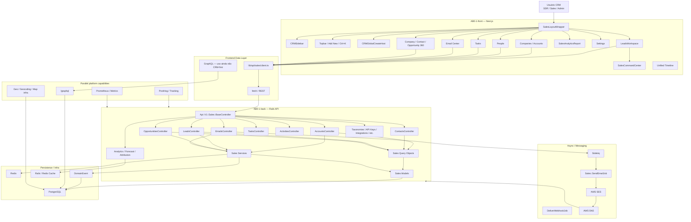
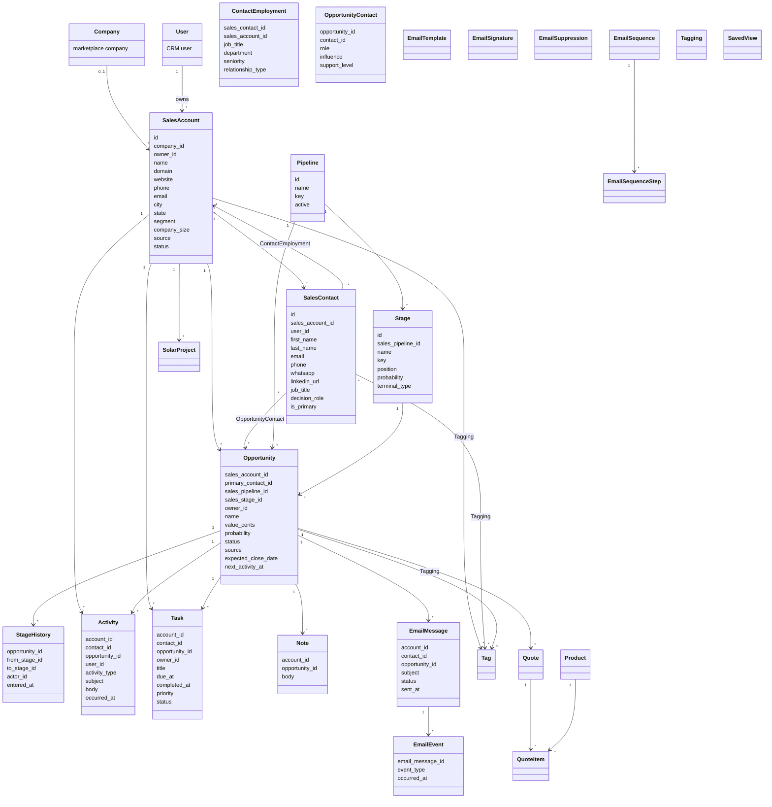
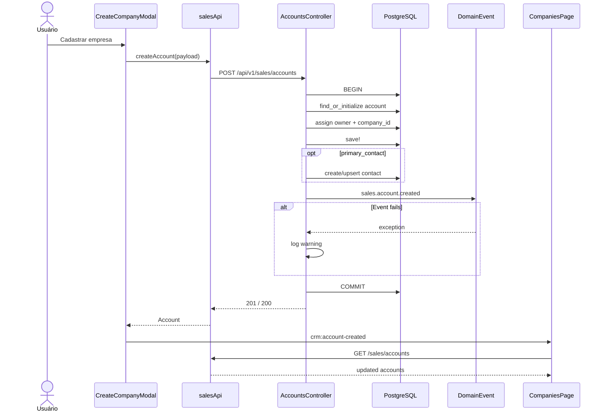
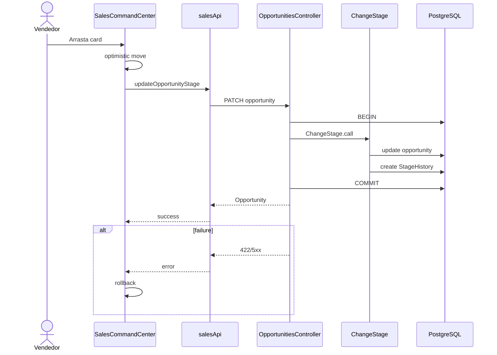
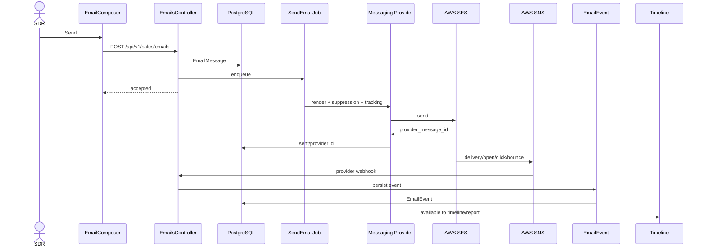
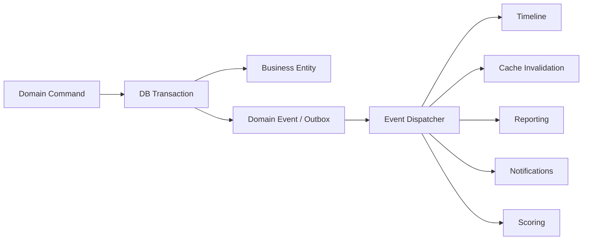

# Mapa Mestre do CRM Avalia Solar — AS-IS → TO-BE

Fiz o levantamento considerando o **código atual da `main`**, e não os relatórios antigos como fonte absoluta. O snapshot que estou usando é o **HEAD `c2785208267107c45f0609267816d0f65c6b7c0d`**, cujo commit mais recente corrige o erro 500 no POST de empresas ligado ao `DomainEvent`.

Isso é importante porque o projeto avançou depois do `7473f5df`: entrou também um `TimelineBuilder` canônico, `last_contact_at` baseado em atividade real e mudanças de proteção/rate limiting para a API Sales.

Vou tratar três categorias daqui para frente:

- **AS-IS CONFIRMADO** = está no código atual.
- **GAP** = existe parcialmente, está inconsistente ou não está operacional.
- **TO-BE** = arquitetura premium que queremos alcançar. O alvo que definimos anteriormente inclui Shell Next.js, DataGrid, Kanban, 360 Views, REST para commands, GraphQL para reads complexos e domínios de Campaigns, Geography, Reporting e Intelligence.

---

# 1. Visão executiva do estado atual

Hoje o Avalia Solar **não é mais um CRUD simples**. Ele já possui boa parte dos blocos de um CRM avançado:

```text
Accounts
Contacts
Contact Employments
Opportunities / Leads
Pipelines
Stages
Stage Histories
Tasks
Activities
Notes
Tags
Saved Views
Products
Quotes
Quote Items
Custom Fields
API Keys
RBAC structures
Integrations
Webhooks
Forms
Tracking
Attribution
Forecast
Emails
Templates
Signatures
Sequences
Suppressions
SES
SNS
Audit Logs
Domain Events
Fit Score
Engagement Score
Next Best Action
360 Views
Buying Committee Map
GraphQL
Redis
Sidekiq
PostgreSQL
```

O próprio namespace de models já contém, entre outros, `Account`, `Activity`, `ApiKey`, `AuditLog`, `Campaign`, `Competitor`, `Consent`, `Contact`, `ContactEmployment`, `CustomFieldDefinition` e `CustomFieldValue`.

O problema é que a evolução aconteceu em várias frentes ao mesmo tempo. Hoje temos **bons subsistemas**, mas eles ainda não formam uma arquitetura completamente coerente.

A maior oportunidade do refactor é:

> **parar de adicionar sistemas paralelos e transformar o que já existe em uma única arquitetura Sales consistente.**

---

# 2. UML — arquitetura física atual

Este é o mapa AS-IS que melhor representa o repositório atual.



O Rails já possui `/graphql`, health endpoints, Prometheus e a API Sales convivendo no mesmo backend. O comentário no próprio `routes.rb` deixa explícito que GraphQL é uma camada paralela ao REST, e não substituta da `/api/v1`.

---

# 3. O padrão arquitetural atual

O projeto não é MVC clássico.

Na prática ele já está mais próximo de:

```text
NEXT.JS PRESENTATION
        │
        ▼
API CLIENT
        │
        ▼
RAILS CONTROLLER
        │
   ┌────┴────┐
   │         │
 QUERY    SERVICE
   │         │
   └────┬────┘
        ▼
   ACTIVE RECORD
        │
        ▼
   POSTGRESQL
```

Portanto:

### View

```text
Next.js
React
Tailwind
shadcn-like components
Recharts
```

### Controller

```text
Api::V1::Sales::*Controller
```

### Model

```text
Sales::*
ActiveRecord
```

### Application layer emergente

```text
app/queries/sales/
app/services/sales/
app/jobs/sales/
```

Isso é positivo.

O refactor não deve voltar para um Rails controller gigantesco. Deve continuar evoluindo para:

```text
Controller
   ↓
Application Service / Query
   ↓
Domain
   ↓
Repository/ActiveRecord
```

---

# 4. Diretórios que se tornam o mapa oficial do CRM

## Frontend

```text
AB0-1-front/
│
├── app/dashboard/sales/
│   ├── accounts/
│   ├── companies/
│   ├── emails/
│   ├── import/
│   ├── leads/
│   ├── people/
│   ├── pipeline/
│   ├── prospects/
│   ├── quotes/
│   ├── reports/
│   ├── settings/
│   ├── tasks/
│   ├── today/
│   ├── not-found.tsx
│   └── page.tsx
│
├── components/sales/
│   ├── AccountList.tsx
│   ├── BuyingCommitteeMap.tsx
│   ├── CRMCommandPalette.tsx
│   ├── CallLoggerModal.tsx
│   ├── Company360View.tsx
│   ├── Contact360View.tsx
│   ├── EmailCenter.tsx
│   ├── EmailComposerModal.tsx
│   ├── NotesPanel.tsx
│   ├── Opportunity360View.tsx
│   ├── PeopleList.tsx
│   ├── SalesCommandCenter.tsx
│   │
│   ├── companies/
│   ├── leads/
│   ├── opportunities/
│   ├── filters/
│   ├── layout/
│   ├── email/
│   ├── ui/
│   └── ...
│
└── lib/api/sales/
    ├── client.ts
    └── types.ts
```

A existência dos componentes principais — `BuyingCommitteeMap`, `CRMCommandPalette`, `CallLoggerModal`, `Company360View`, `Contact360View`, `EmailCenter`, `EmailComposerModal`, `Opportunity360View` — é confirmada diretamente pela árvore atual.

---

# 5. Backend oficial

```text
AB0-1-back/
│
├── app/controllers/api/v1/sales/
├── app/models/sales/
├── app/queries/sales/
├── app/services/sales/
├── app/jobs/sales/
├── app/policies/
├── app/graphql/
├── config/routes.rb
└── db/migrate/
```

---

# 6. Controllers atuais — inventário funcional

O `/api/v1/sales` já é muito maior do que o CRM visual sugere. As rotas atuais expõem taxonomias, custom fields, notes, API keys, integrations, webhooks, products, quotes, forms, tracking, RBAC, consents, saved views, tags, emails, templates, sequences, suppressions, signatures, pipelines, accounts, contacts, opportunities, leads, tasks e activities.

Organizando por bounded context:

| Contexto       | Controllers / API atuais                                                | Estado                                |
| -------------- | ----------------------------------------------------------------------- | ------------------------------------- |
| Accounts       | `AccountsController`, `AccountLinksController`                          | forte                                 |
| Contacts       | `ContactsController`, `ContactEmploymentsController`                    | forte, mas segurança precisa correção |
| Opportunities  | `OpportunitiesController`, `OpportunityContactsController`              | forte                                 |
| Pipeline       | `PipelinesController`, `QualificationsController`, `ClosuresController` | forte                                 |
| Leads          | `LeadsController`                                                       | funcional parcialmente, há gaps P0    |
| Activity       | `ActivitiesController`                                                  | existente                             |
| Tasks          | `TasksController`                                                       | existente                             |
| Notes          | `NotesController`                                                       | existente                             |
| Tags           | `TagsController`                                                        | existente                             |
| Saved Views    | `SavedViewsController`                                                  | existente                             |
| Email          | `EmailsController`                                                      | existente                             |
| Templates      | `EmailTemplatesController`                                              | existente                             |
| Signatures     | `EmailSignaturesController`                                             | existente                             |
| Sequences      | `EmailSequencesController`                                              | CRUD apenas                           |
| Suppression    | `EmailSuppressionsController`                                           | existente                             |
| Tracking email | `EmailEventsController` / SES                                           | existente                             |
| Products       | `ProductsController`                                                    | existente                             |
| Quotes         | `QuotesController`, `QuoteItemsController`, `QuoteDocumentsController`  | existente                             |
| Reporting      | `AnalyticsController`, `ForecastController`, `AttributionController`    | existe, precisa refactor              |
| Forms          | `FormsController`                                                       | existente                             |
| Tracking       | `TrackingEvents`, `TrackingSessions`, `TrackingIdentity`                | existente                             |
| Consent        | `ConsentsController`, `ConsentRevocationsController`                    | existente                             |
| Integrations   | `IntegrationsController`, `WebhooksController`                          | existente                             |
| Security       | `ApiKeysController`, `RbacController`, `UserRolesController`            | existente                             |
| Custom Fields  | `CustomFieldDefinitionsController`                                      | existente                             |
| Settings       | `TaxonomiesController`                                                  | existente                             |

O diretório de controllers confirma também `AccountsController`, `ActivitiesController`, `AnalyticsController`, `ApiKeysController`, `AttributionController`, `ClosuresController`, `CompetitorsController`, `ConsentsController` e outros.

---

# 7. Contrato HTTP atual

## Core CRM

```text
GET    /api/v1/sales/today
GET    /api/v1/sales/search
GET    /api/v1/sales/analytics
GET    /api/v1/sales/summary

GET    /api/v1/sales/accounts
POST   /api/v1/sales/accounts
GET    /api/v1/sales/accounts/:id
PATCH  /api/v1/sales/accounts/:id

GET    /api/v1/sales/contacts
POST   /api/v1/sales/contacts
GET    /api/v1/sales/contacts/:id
PATCH  /api/v1/sales/contacts/:id

GET    /api/v1/sales/opportunities
POST   /api/v1/sales/opportunities
GET    /api/v1/sales/opportunities/:id
PATCH  /api/v1/sales/opportunities/:id

POST   /api/v1/sales/opportunities/bulk

GET    /api/v1/sales/leads
POST   /api/v1/sales/leads
GET    /api/v1/sales/leads/:id
PATCH  /api/v1/sales/leads/:id

POST   /api/v1/sales/leads/bulk

GET    /api/v1/sales/tasks
POST   /api/v1/sales/tasks
PATCH  /api/v1/sales/tasks/:id
```

O contrato básico de Accounts, Contacts, Opportunities, Tasks e Analytics também aparece na matriz do próprio projeto.

---

# 8. Pipeline

```text
GET  /api/v1/sales/pipelines
GET  /api/v1/sales/pipelines/:id

GET  /api/v1/sales/opportunities/:id/qualification
PUT  /api/v1/sales/opportunities/:id/qualification

POST /api/v1/sales/opportunities/:id/won
POST /api/v1/sales/opportunities/:id/lost

GET  /api/v1/sales/opportunities/:id/timeline
```

---

# 9. Email

```text
GET   /api/v1/sales/emails
POST  /api/v1/sales/emails
GET   /api/v1/sales/emails/:id

GET    /api/v1/sales/email_templates
GET    /api/v1/sales/email_templates/:id
POST   /api/v1/sales/email_templates
PATCH  /api/v1/sales/email_templates/:id
DELETE /api/v1/sales/email_templates/:id
POST   /api/v1/sales/email_templates/:id/preview

GET/POST/PATCH/DELETE
/api/v1/sales/email_signatures

GET/POST/DELETE
/api/v1/sales/email_suppressions

POST
/api/v1/sales/email_events/provider
```

---

# 10. Sequences — situação real

As rotas atuais possuem apenas:

```text
GET
POST
GET :id
PATCH :id
DELETE :id

/api/v1/sales/email_sequences
```

O controller cria e edita a Sequence e seus `steps_attributes`, mas **não contém enrollment, runner, pause de contato ou scheduler de steps**.

Isso é importante porque documentos mais antigos já chegaram a mencionar enrollment, mas o código atual não comprova essa capacidade.

### Estado

```text
Sequence Definition       ✅
Sequence Steps            ✅
Sequence CRUD             ✅

Enrollment                ❌
Enrollment state machine  ❌
next_run_at               ❌
runner                    ❌
pause per contact         ❌
auto-stop on reply        ❌
```

---

# 11. Settings e administração

A estrutura alvo já não precisa ser criada do zero.

Hoje existem:

```text
/dashboard/sales/settings
/settings/access
/settings/activity-types
/settings/api-keys
/settings/company-types
/settings/custom-fields
/settings/email
/settings/email/templates
/settings/industries
/settings/integrations
/settings/markets
/settings/tags
/settings/territories
```

A matriz atual registra essas rotas e APIs correspondentes.

Portanto o problema de Settings deixou de ser “rota inexistente”.

Agora o trabalho é:

> **certificar CRUD + RBAC + persistência + UX uniforme.**

---

# 12. UML — modelo de domínio atual

Este ERD resume o núcleo efetivamente existente.



O próprio documento de schema real confirma como núcleo persistente `sales_accounts`, `sales_contacts`, `sales_opportunities`, `sales_pipelines`, `sales_stages`, `sales_tasks`, `sales_activities`, `sales_quotes`, `sales_quote_items` e `sales_stage_histories`.

---

# 13. Account — estado atual

`Sales::Account` já possui relações fortes:

```text
Company
Owner
Tags
Contacts
Opportunities
Activities
Tasks
SolarProjects
ContactEmployments
EmployedContacts
```

### Hoje

```text
Account
 ├ People
 ├ Opportunities
 ├ Activities
 ├ Tasks
 ├ Tags
 └ Solar Projects
```

Isso já é uma entidade 360 real.

---

# 14. Fluxo atual — criar empresa



O HEAD atual explicitamente passou a fornecer `status: pending` ao DomainEvent e captura falhas na emissão para evitar que isso derrube a criação da Account.

---

# 15. GAP nessa criação

Hoje:

```ruby
Sales::Account
  .where(owner: current_user)
  .find_or_initialize_by(name: ...)
```

O target deveria ser:

```text
tenant
+
normalized domain
+
CNPJ
+
normalized company name
```

O owner não deveria definir a identidade da empresa.

Caso contrário:

```text
Vendedor A → Solar Prime
Vendedor B → Solar Prime
```

pode produzir duplicidade dentro da mesma organização.

---

# 16. Account list — performance atual

O controller atual faz:

```text
includes:
company
owner
contacts
opportunities
```

e depois, para cada Account:

```text
primary contact
open opportunities
sum pipeline
tags
last_contact
```

Isso evita alguns N+1, mas ainda transforma a listagem em um **read model Ruby pesado**.

### Target

Criar:

```text
Sales::AccountsQuery
```

com agregados SQL:

```sql
COUNT(contacts)
COUNT(open_opportunities)
SUM(open opportunity value)
MAX(activity occurred_at)
```

A tabela deve receber um read model já pronto.

---

# 17. Contacts — existe uma falha arquitetural P0

Este é um dos achados mais importantes do scan.

O `ContactsController#index` chama:

```ruby
Sales::ContactsQuery.new(params).call
```

e `ContactsQuery` tem como scope padrão:

```ruby
Sales::Contact.all
```

Mais crítico:

```ruby
def show
  Sales::Contact.find(params[:id])
end

def update
  Sales::Contact.find(params[:id])
end
```

sem tenant scope visível.

### Classificação

**P0 — multitenancy / IDOR risk**

Target:

```text
scoped_contacts
    ↓
Sales::ContactsQuery.new(params, scope: scoped_contacts)
```

E todo:

```text
show
update
timeline
engagement
```

deve iniciar do mesmo scope.

---

# 18. Segundo problema no ContactsController

Os métodos:

```ruby
engagement
timeline
```

executam:

```ruby
scoped_contacts.find(...)
```

mas não há um `scoped_contacts` definido no arquivo mostrado, e o `Sales::BaseController` também não define esse método.

No scan, uma implementação de `scoped_contacts` aparece no `EmailsController`, não como método compartilhado herdado.

Isso significa que:

```text
GET /contacts/:id/timeline
GET /contacts/:id/engagement
```

precisam de teste imediatamente.

**P0.**

---

# 19. Leads — modelo real

Um detalhe essencial:

> **Lead não é hoje uma entidade ActiveRecord separada.**

Na prática, o CRM usa:

```text
Sales::Opportunity
```

como Lead/Opportunity.

`LeadsController` serializa `Sales::Opportunity`, e `LeadsQuery` parte de `Sales::Opportunity.all`.

Isso pode continuar.

Não vejo razão para criar uma tabela `sales_leads` agora.

Melhor:

```text
Opportunity
status/lifecycle
+
pipeline stage
```

---

# 20. Leads — P0 multitenancy

`LeadsController#index`:

```ruby
Sales::LeadsQuery.call(params)
```

e:

```ruby
Sales::LeadsQuery
default scope = Sales::Opportunity.all
```

Além disso:

```ruby
Sales::Opportunity.find(params[:id])
```

é usado em `show` e `update`.

Isso deve ser tratado como:

**P0 SECURITY.**

---

# 21. Leads — P0 contrato quebrado

A rota existe:

```text
POST /api/v1/sales/leads/bulk
```

Mas o `LeadsController` atual mostrado possui:

```text
index
create
show
update
```

e não apresenta `bulk`.

Portanto temos:

```text
ROUTE
  ↓
controller action inexistente
```

Isso é exatamente o tipo de erro que um teste “rota não retorna 404” não detecta.

### P0

Criar ou remover o contrato.

Como já existe bulk robusto em Opportunities:

```text
POST /sales/opportunities/bulk
```

minha recomendação é:

> usar Opportunity bulk como domínio canônico e fazer Leads delegar para ele, ou remover a duplicação.

---

# 22. Opportunities — parte mais madura

Aqui o código está muito melhor.

`OpportunitiesController#index` faz:

```text
scoped_opportunities
    +
OpportunitiesQuery
```

e o tenant é filtrado pelo Account:

```ruby
joins(:account)
.where(sales_accounts: { company_id: current_user.company_id })
```

Bulk update possui:

- transaction;
- lock;
- máximo 100;
- stage;
- status;
- owner;
- tags;
- remove tags.

O movimento de estágio usa:

```text
Sales::Opportunities::ChangeStage
```

Isso é exatamente o padrão que deve ser aplicado às outras entidades.

---

# 23. Kanban — UML atual



O `SalesCommandCenter` já possui cards draggable, `DealCard`, dados reais e carregamento de Opportunities.

---

# 24. Problema de UX no Kanban atual

O componente mantém:

```text
DEFAULT_STAGES
```

e, se o backend falha ao carregar o pipeline:

```text
setStages(DEFAULT_STAGES)
```

Isso é conveniente para desenvolvimento.

Mas em produção pode fazer um backend quebrado parecer funcional.

### Target

Diferenciar:

```text
Pipeline real carregado        ✅
Pipeline vazio                 Empty state
Network failure                Error state
Initial pipeline not created   Setup CTA
```

Nunca mascarar erro de rede com estrutura hardcoded.

---

# 25. Leads Workspace — problema estrutural de UI

O `LeadsWorkspace` hoje busca:

```typescript
salesApi.getLeads({ q: search });
```

e guarda:

```text
leads[]
```

mas a visualização principal de list/kanban é:

```tsx
<SalesCommandCenter hideLayout pipelineOnly />
```

que faz outra consulta, de Opportunities.

Portanto há:

```text
GET leads
        ↓
state leads

MAS

main UI
        ↓
SalesCommandCenter
        ↓
GET opportunities
```

### Problema

Duplicação de requests e duas fontes de truth.

---

# 26. Quick filters de Leads hoje

Os botões:

```text
Todos
Meus Leads
Leads Quentes
Fechando esta Semana
Sem Responsável
```

mudam:

```text
activeFilter
```

mas `fetchLeads()` não envia `activeFilter` à API.

Ou seja:

> **o botão muda visualmente, mas não muda a consulta.**

Isso é P1 funcional, e deveria ser corrigido antes de considerar o workspace premium.

---

# 27. Map e Analytics dentro de Leads

Hoje:

```text
view=map
```

renderiza uma caixa explicativa.

E:

```text
view=analytics
```

também é apenas uma caixa explicativa.

Logo:

```text
Kanban       real
Table        parcialmente real
Map          placeholder
Analytics    placeholder
```

Isso deve ficar explícito no PDR.

---

# 28. Timeline — estado atual

Há uma melhoria recente muito importante.

Existe agora:

```text
AB0-1-back/app/services/sales/timeline_builder.rb
```

com:

```ruby
for_account
for_contact
for_opportunity
```

Ele agrega hoje:

```text
Activities
Tasks
Opportunities
Creation event
```

---

# 29. Porém existem três timelines

Atualmente encontramos:

### 1

```text
Sales::TimelineBuilder
```

### 2

```text
Sales::Contacts::TimelineBuilder
```

### 3

`OpportunitiesController#timeline` monta manualmente:

```text
StageHistories
Activities
Tasks
Notes
EmailMessages
Quotes
Opportunity Created
```

Portanto o sistema possui:

> **três conceitos concorrentes de Timeline.**

---

# 30. Target Timeline

Deve existir somente:

```text
Sales::Timeline::Query
```

ou:

```text
Sales::TimelineBuilder
```

com adapters:

```text
StageHistoryAdapter
ActivityAdapter
TaskAdapter
NoteAdapter
EmailAdapter
QuoteAdapter
DomainEventAdapter
SequenceAdapter
CampaignAdapter
```

E todas as telas usam o mesmo contrato.

---

# 31. Outro bug de contrato — Account timeline

O `AccountsController` tem:

```ruby
def timeline
```

mas as rotas atuais de `accounts` são:

```ruby
resources :accounts,
  only: %i[index create show update]
```

sem member timeline.

Ou seja:

```text
Controller action existe
API route não existe
```

### Fix

Adicionar:

```ruby
get :timeline, on: :member
```

ou eliminar a action se Company360 for receber timeline pelo read model GraphQL.

---

# 32. Reporting — estado real

Hoje a árvore frontend de Reports possui essencialmente:

```text
/dashboard/sales/reports
/dashboard/sales/reports/forecast
/dashboard/sales/reports/attribution
```

O target já definido é muito maior: Overview, Sales, Losses, New Leads, Attribution, Forecast, Products, Activity, Email, Tasks, Snapshots, Funnel, Engagement e Campaigns.

---

# 33. Analytics atual

`SalesAnalyticsReport` já possui:

```text
Pipeline Total
Pipeline Ponderado
Receita Fechada
Taxa de Conversão
Ticket Médio
Ciclo Médio
Perdidos
Email metrics
Revenue chart
Funnel
Win/Loss
```

e usa Recharts.

Portanto não deve ser descartado.

Ele deve virar:

```text
Reports / Overview
```

---

# 34. P0 crítico — Analytics tenant scope

O atual `AnalyticsController` começa por:

```ruby
Sales::Opportunity.all
Sales::Opportunity.open
```

e depois cria funnel e revenue usando novamente `Sales::Opportunity`.

Somente os `EmailEvent` recebem explicitamente:

```ruby
company_id: current_user.company_id
```

para não-admin.

Portanto:

> o isolamento de tenant das métricas comerciais não está demonstrado no controller atual.

Classificação:

**P0 Security / Data Integrity**

---

# 35. Problema temporal em Reports

Negócios ganhos usam:

```ruby
updated_at: date_range
```

e ciclo médio:

```text
updated_at - created_at
```

Isso é conceitualmente incorreto.

Precisamos de:

```text
closed_at
won_at
lost_at
```

e/ou `StageHistory`.

---

# 36. Problema de query

O funnel atual:

```ruby
stages.map
    ↓
Opportunity.where(stage)
    ↓
count
    ↓
sum
```

Isso cria múltiplas queries.

Target:

```sql
SELECT
    sales_stage_id,
    COUNT(*),
    SUM(value_cents)
FROM sales_opportunities
WHERE company...
GROUP BY sales_stage_id
```

Uma consulta.

---

# 37. Forecast atual

O controller faz:

```ruby
Sales::Opportunity.open
.where(expected_close_date: Date.current..)
```

e agrupa os objetos em Ruby por mês.

Problemas:

```text
tenant scope não explícito
group_by em Ruby
carrega objetos
não possui quota
não possui confidence categories
não possui delta
```

Target: `GROUP BY date_trunc('month', expected_close_date)`.

---

# 38. Attribution atual

Hoje:

```ruby
TrackingSession
.where(started_at >= ...)
.group(:utm_source, :utm_medium, :utm_campaign)
.count
```

Isso é uma boa semente.

Mas ainda responde apenas:

```text
sessions
```

Target:

```text
Sessions
Leads
Opportunities
Won
Revenue
Conversion
Revenue/session
Revenue/lead
```

---

# 39. Email / Messaging — arquitetura já existente

Backend hoje já possui:

```text
Sales::Messaging::Renderer
Sales::Messaging::VariableResolver
Sales::Messaging::TrackingRewriter
Sales::Messaging::SuppressionChecker
Sales::Messaging::SnsMessageVerifier
```

E providers:

```text
Base
Google
Microsoft
SES
```

Jobs Sales:

```text
SendEmailJob
DeliverWebhookJob
ExpireQuotesJob
```

Isso é uma base bastante boa.

---

# 40. UML atual de envio de e-mail



---

# 41. Campaigns — situação atual

Já existe:

```text
Sales::Campaign
sales_campaigns
```

mas o model atual é mínimo:

```ruby
belongs_to :company
validates :name, :campaign_key
```

E não há uma API operacional de campanhas no namespace Sales equivalente ao target completo.

Então:

```text
Campaign model seed/foundation   ✅
Campaign Workspace              ❌
Campaign recipients             ❌
Audience snapshot               ❌
Bulk dispatch engine            ❌
Campaign analytics              ❌
Campaign preflight              ❌
```

O modelo completo de Campaign/Audience/Segment definido no nosso alvo continua sendo TO-BE.

---

# 42. GraphQL — estado real

GraphQL já existe.

```text
POST /graphql
```

e há:

```text
GraphqlController
AvaliaSolarSchema
Types
Dataloader/APQ tests
```

O schema principal é real.

Mas **não identifiquei um conjunto de CRM read models específico** equivalente a:

```text
crmAccount360
crmPerson360
crmOpportunity360
crmKanbanBoard
crmMap
crmRelationshipGraph
```

Esses são parte do TO-BE definido anteriormente.

---

# 43. Não migrar tudo para GraphQL

Target correto:

```text
COMMAND
REST

QUERY
REST optimized / GraphQL
```

Exemplo:

```text
POST Account      REST
PATCH Opportunity REST
POST Email        REST
DnD               REST

Company360        GraphQL candidate
Person360         GraphQL candidate
Relationship Map  GraphQL candidate
Map               GraphQL candidate
Dashboard read    GraphQL candidate
```

---

# 44. Redis — estado real

O projeto já possui infraestrutura Redis:

```text
config/initializers/01_redis.rb
config/initializers/redis_cache.rb
config/initializers/00_redis_disable.rb
config/initializers/99_rack_attack_redis.rb
```

Porém houve uma alteração recente importante:

`Rack::Attack` foi mudado especificamente para `MemoryStore`, e `/api/v1/sales/` foi excluído do throttle geral após problemas operacionais.

Portanto:

> Redis existe, mas a estratégia de cache/rate limiting do CRM ainda precisa ser consolidada.

---

# 45. Geography — AS-IS

A infraestrutura geral do Avalia Solar já possui:

```text
latitude
longitude
GeocodeCompanyJob
HaversineCalculator
MapProvider
GraphQL MapCompanyType
```

`GeocodeCompanyJob` já utiliza latitude/geocoding.

`HaversineCalculator` também já existe.

Mas o CRM Sales ainda não está usando isso como um `AccountMap`.

---

# 46. Target Geography

```text
Accounts

[Tabela] [Mapa]

Mapa:
Owner
Territory
State
City
Radius
Pipeline
Stage
Last Contact

Pin:
Company
Contact
Pipeline
Stage
Next Action
```

Não criar nova infraestrutura GIS antes de reutilizar a existente.

---

# 47. UI Component Architecture atual

O projeto já documenta os componentes canônicos:

```text
SalesLayoutWrapper
CRMSidebar
CRMGlobalCreateHost
CRMCommandPalette
Opportunity360View
UnifiedTimeline
Company360View
Contact360View
CRMModal
```

Excelente base.

O problema agora é consistência.

---

# 48. Modais

Há também especificação já consolidada:

| Modal          |  Width |
| -------------- | -----: |
| Opportunity    |  680px |
| Call Logger    |  620px |
| Contact 360    |  880px |
| Company 360    | 1000px |
| Task           |  580px |
| Quote          |  720px |
| Create Company |  600px |
| Create Person  |  600px |

com `p-6`, scroll interno e footer canônico.

Não precisamos redesenhar o sistema de Modal.

Precisamos obrigar todos a usar:

```text
CRMModal
CRMFormField
CRMFormRow
```

---

# 49. Arquitetura AS-IS resumida

```text
                    CURRENT AVALIA SOLAR CRM

                            USER
                              │
                              ▼
                  NEXT.JS SALES SHELL
                              │
       ┌──────────────────────┼────────────────────┐
       │                      │                    │
    Accounts                Leads               People
       │                      │                    │
    Company360          SalesCommandCenter     Contact360
       │                   Kanban/Table           │
       └──────────────────────┼────────────────────┘
                              │
                         salesApi
                              │
                              ▼
                    /api/v1/sales/*
                              │
                       BaseController
                              │
        ┌─────────────────────┼────────────────────┐
        │                     │                    │
   Controllers              Queries             Services
        │                     │                    │
        └─────────────────────┼────────────────────┘
                              │
                          Sales::*
                              │
                         PostgreSQL
                              │
              ┌───────────────┼───────────────┐
              │               │               │
           Redis           Sidekiq       DomainEvent
                              │
                           Messaging
                              │
                      SES / Google / MS
```

---

# 50. Arquitetura TO-BE

O target que definimos expande o CRM para 11 bounded contexts: Accounts, Contacts, Opportunities, Pipeline, Activities, Tasks, Messaging, Campaigns, Geography, Reporting e Intelligence.

```text
                AVALIA SOLAR SALES OPERATING SYSTEM

                          NEXT.JS
                             │
       ┌─────────────────────┼──────────────────────┐
       │                     │                      │
    DataGrid               Kanban               360 Read Models
       │                     │                      │
       └─────────────────────┼──────────────────────┘
                             │
                    APPLICATION API
                   REST commands
                  GraphQL rich reads
                             │
                             ▼
                    SALES APPLICATION
                             │
 ┌───────────────────────────────────────────────────────────────┐
 │ Accounts      Contacts          Opportunities        Pipeline │
 │ Activities    Tasks             Timeline             Notes    │
 │ Messaging     Sequences         Campaigns            Consent  │
 │ Products      Quotes            Geography            Search   │
 │ Reporting     Attribution       Intelligence         Audit    │
 └───────────────────────────────────────────────────────────────┘
                             │
           ┌─────────────────┼──────────────────┐
           │                 │                  │
       PostgreSQL          Redis             Sidekiq
      source truth      cache / locks        async
           │                                    │
           │                              SES/SNS/Webhooks
           │                                    │
           └─────────────────┬──────────────────┘
                             │
                        Domain Events
                             │
          ┌──────────────────┼──────────────────┐
          │                  │                  │
      Timeline            Reporting          Insights
                                                │
                                          Next Best Action
```

---

# 51. Matriz AS-IS × TO-BE

| Área                | Estado atual                  | Estado alvo                        | Gap                | Prioridade |
| ------------------- | ----------------------------- | ---------------------------------- | ------------------ | ---------: |
| Shell               | existe                        | único, consistente                 | baixo              |         P1 |
| Accounts            | real                          | premium + map + advanced grid      | médio              |      P0/P1 |
| Contacts            | real                          | tenant-safe + rich 360             | **alto segurança** |     **P0** |
| Leads               | Opportunity-based             | unified lifecycle                  | alto               |     **P0** |
| Kanban              | real                          | rich read model + no fake fallback | médio              |         P0 |
| Stage History       | existe                        | canonical audit                    | baixo/médio        |         P1 |
| Tasks               | existe                        | follow-up engine                   | médio              |         P0 |
| Activities          | existe                        | canonical interaction model        | médio              |         P1 |
| Timeline            | 3 implementações              | 1 canonical query                  | alto               |         P1 |
| Calls               | Activity/CallLogger           | dedicated semantics                | médio              |         P1 |
| Email               | bastante avançado             | production messaging               | médio              |         P0 |
| SES/SNS             | existe                        | observable/idempotent              | médio              |         P0 |
| Templates           | existe                        | template workspace                 | baixo              |         P1 |
| Sequences           | CRUD                          | actual automation engine           | alto               |         P2 |
| Campaign            | model mínimo                  | mass campaign engine               | muito alto         |         P2 |
| Suppression         | existe                        | centralized consent gate           | baixo              |         P0 |
| Saved views         | existe                        | universal grid views               | médio              |         P1 |
| Tags                | existe                        | universal taxonomy                 | baixo              |         P1 |
| Custom fields       | existe                        | resource extensibility             | médio              |         P1 |
| Settings            | amplo                         | unified settings shell             | médio              |         P1 |
| Reports             | overview+forecast+attribution | full reporting suite               | alto               |         P1 |
| Analytics isolation | parcial                       | tenant-safe                        | **crítico**        |     **P0** |
| Forecast            | Ruby aggregation              | SQL query object                   | alto               |         P1 |
| Attribution         | sessions only                 | revenue attribution                | alto               |         P2 |
| Map                 | generic infra                 | CRM map                            | alto               |         P2 |
| GraphQL             | platform exists               | CRM read models                    | médio              |         P2 |
| Redis               | exists                        | standardized cache                 | médio              |         P1 |
| Search              | exists                        | global entity search               | médio              |         P1 |
| RBAC                | structures exist              | universal enforcement              | alto               |         P0 |
| Audit               | exists                        | all sensitive operations           | médio              |         P1 |
| Observability       | platform exists               | CRM SLOs                           | médio              |         P0 |
| E2E                 | exists                        | full journey gate                  | médio              |         P0 |

---

# 52. Principais achados P0 do scan

## P0-01 — Contacts tenant isolation

Arquivos:

```text
AB0-1-back/app/controllers/api/v1/sales/contacts_controller.rb
AB0-1-back/app/queries/sales/contacts_query.rb
```

Problemas:

```text
default Sales::Contact.all
unscoped show
unscoped update
create without canonical tenant scope
```

---

## P0-02 — Contacts timeline/engagement

Arquivo:

```text
AB0-1-back/app/controllers/api/v1/sales/contacts_controller.rb
```

`scoped_contacts` é chamado mas não está definido no controller/BaseController auditado.

---

## P0-03 — Leads tenant isolation

```text
AB0-1-back/app/controllers/api/v1/sales/leads_controller.rb
AB0-1-back/app/queries/sales/leads_query.rb
```

Problemas:

```text
Sales::Opportunity.all
find(id)
```

sem tenant scope.

---

## P0-04 — Leads bulk contract

```text
config/routes.rb:
POST /sales/leads/bulk
```

mas:

```text
LeadsController#bulk
```

não existe no arquivo atual.

---

## P0-05 — Analytics multitenancy

```text
AB0-1-back/app/controllers/api/v1/sales/analytics_controller.rb
```

Opportunity metrics não demonstram tenant scope.

---

## P0-06 — Reporting semantics

```text
updated_at
```

está sendo utilizado como fechamento.

Criar:

```text
closed_at
won_at
lost_at
```

ou derivação canônica por StageHistory.

---

# 53. P1 estrutural

## P1-01 — Timeline duplication

Unificar:

```text
Sales::TimelineBuilder
Sales::Contacts::TimelineBuilder
OpportunitiesController#timeline
```

---

## P1-02 — Accounts timeline route

Adicionar contrato ou remover method morto.

---

## P1-03 — Leads duplicate fetch

Eliminar:

```text
LeadsWorkspace.getLeads
+
SalesCommandCenter.getOpportunities
```

Escolher uma query única.

---

## P1-04 — Quick filters fake

Fazer:

```text
my_leads
hot
closing_this_week
unassigned
```

virarem filtros server-side reais.

---

## P1-05 — Map placeholder

Só mostrar `Map` quando o workspace existir de verdade.

---

## P1-06 — Analytics placeholder em Leads

Redirecionar para Reports ou implementar.

---

# 54. Design System alvo — UI/UX

A interface premium não precisa ser mais “bonita”; precisa ser **mais operacional**.

## Shell

```text
240px sidebar expanded
64px collapsed

Topbar 52–56px
```

---

# 55. DataGrid universal

Criar um engine:

```text
CRMDataGrid
CRMGridHeader
CRMColumnManager
CRMFilterBuilder
CRMFilterChip
CRMSearch
CRMPagination
CRMBulkToolbar
CRMSavedViews
```

Usado por:

```text
Accounts
People
Leads
Tasks
Emails
Campaign recipients
```

---

# 56. Densidade

```text
table header: 34–36 px
row:          38–42 px

primary font: 12–13 px
secondary:    11–12 px
```

Não usar cards gigantes para listagem operacional.

---

# 57. Grid behavior

Cada grid:

```text
Search
Filters
Columns
Saved views
Sort
Pagination
Bulk select
Export
```

A URL deve manter o state:

```text
?view=
&q=
&owner=
&stage=
&tags=
&sort=
&direction=
&page=
```

F5 preserva a consulta.

---

# 58. Kanban premium

Card:

```text
┌─────────────────────────────┐
│ Solar Prime                 │
│ Implantação comercial       │
│                             │
│ R$ 42.000              70%  │
│                             │
│ João • Diretor              │
│ Cuiabá, MT                  │
│                             │
│ Último contato: 2d          │
│ Próxima ação: amanhã        │
└─────────────────────────────┘
```

Não inventar nenhuma informação.

---

# 59. 360 View padrão

Todas:

```text
Header
│
├ Summary
├ Relationships
├ Opportunities
├ Activities
├ Tasks
├ Emails
├ Notes
└ Timeline
```

### Company 360

```text
Company
Contacts
Buying Committee
Deals
Projects
Map
Activity
```

### Person 360

```text
Person
Company/Employments
Decision role
Opportunities
Engagement
Timeline
```

### Opportunity 360

```text
Deal
Pipeline
Stakeholders
Qualification
Quote
Activities
Timeline
```

---

# 60. Reports UX target

```text
CRM Sidebar
     │
Reports Sidebar
     │
Report Header
     │
Filter Bar
     │
Metric / Segment / Period
     │
Chart
     │
KPI Strip
     │
Details Table
```

Reports:

```text
Overview

LEADS
 Sales
 Losses
 New Leads
 Attribution
 Forecast
 Products

EFFORT
 Activity
 Email
 Tasks

OTHER
 Snapshots
 Funnel
 Engagement
 Campaigns
```

---

# 61. Query architecture alvo

Criar:

```text
AB0-1-back/app/queries/sales/
│
├ accounts_query.rb
├ contacts_query.rb
├ leads_query.rb
├ opportunities_query.rb
│
└ reporting/
    ├ overview_query.rb
    ├ sales_query.rb
    ├ losses_query.rb
    ├ new_leads_query.rb
    ├ attribution_query.rb
    ├ forecast_query.rb
    ├ funnel_query.rb
    ├ activity_query.rb
    ├ email_query.rb
    └ tasks_query.rb
```

Regra fundamental:

```ruby
Query.new(scope: tenant_scope)
```

Nunca:

```ruby
Query
  default scope = Model.all
```

para dados privados.

---

# 62. TenantScope

Criar:

```text
AB0-1-back/app/services/sales/tenant_scope.rb
```

Conceito:

```ruby
Sales::TenantScope
  .for(current_user)
  .accounts

Sales::TenantScope
  .for(current_user)
  .contacts

Sales::TenantScope
  .for(current_user)
  .opportunities
```

Isso elimina implementações diferentes em cada controller.

---

# 63. Controller target

Hoje:

```text
Controller
  query
  filter
  serialize
  calculate
  domain
```

Target:

```text
Controller

authenticate
authorize
parse params
invoke
render
```

Idealmente 20–50 linhas por endpoint lógico.

---

# 64. Serialization

Hoje há bastante hash manual em controllers.

Target:

```text
Serializers / Presenters / Read Models
```

Exemplo:

```text
Sales::Accounts::ListPresenter
Sales::Accounts::DetailPresenter

Sales::Opportunities::CardPresenter
Sales::Opportunities::DetailPresenter
```

---

# 65. PostgreSQL target

Para grids:

```text
PostgreSQL
↓
Query object
↓
SELECT somente colunas necessárias
↓
aggregate
↓
pagination
↓
JSON
```

Evitar:

```text
load full model
load all associations
calculate in Ruby
```

---

# 66. Redis target

Cachear apenas reads caros.

```text
crm:v1:tenant:12:pipeline:7
crm:v1:tenant:12:funnel:hash
crm:v1:tenant:12:forecast:hash
crm:v1:tenant:12:taxonomies
crm:v1:tenant:12:report:overview:hash
```

Não cachear:

```text
create
update
DnD
email send
```

---

# 67. Event architecture target

Hoje já há `DomainEvent`.

O target deve evoluir para Transactional Outbox.



Hoje Account creation explicitamente permite que o DomainEvent falhe sem invalidar a transação. Isso melhorou disponibilidade, mas o target deve garantir eventual consistency sem perder eventos.

---

# 68. PDR MASTER — Epics

| Epic    | Entrega                        | Prioridade |
| ------- | ------------------------------ | ---------: |
| CRM-001 | Tenant Safety                  |     **P0** |
| CRM-002 | API Contract Integrity         |     **P0** |
| CRM-003 | Account Certification          |     **P0** |
| CRM-004 | Contact Certification          |     **P0** |
| CRM-005 | Lead/Opportunity consolidation |     **P0** |
| CRM-006 | Kanban production-grade        |     **P0** |
| CRM-007 | Messaging certification        |     **P0** |
| CRM-008 | Timeline unification           |         P1 |
| CRM-009 | Shared DataGrid                |         P1 |
| CRM-010 | Accounts Nutshell-level UX     |         P1 |
| CRM-011 | People Workspace               |         P1 |
| CRM-012 | Reports architecture           |         P1 |
| CRM-013 | Report query optimization      |         P1 |
| CRM-014 | Settings certification         |         P1 |
| CRM-015 | Redis/cache strategy           |         P1 |
| CRM-016 | GraphQL CRM read models        |         P2 |
| CRM-017 | Geography workspace            |         P2 |
| CRM-018 | Sequence automation            |         P2 |
| CRM-019 | Campaign engine                |         P2 |
| CRM-020 | Revenue Intelligence           |         P3 |

---

# 69. CRM-001 — Tenant Safety

### Arquivos

```text
AB0-1-back/app/controllers/api/v1/sales/base_controller.rb
AB0-1-back/app/controllers/api/v1/sales/accounts_controller.rb
AB0-1-back/app/controllers/api/v1/sales/contacts_controller.rb
AB0-1-back/app/controllers/api/v1/sales/leads_controller.rb
AB0-1-back/app/controllers/api/v1/sales/opportunities_controller.rb
AB0-1-back/app/controllers/api/v1/sales/analytics_controller.rb

AB0-1-back/app/queries/sales/*
```

### Tasks

```text
[ ] Criar TenantScope
[ ] Contacts index scoped
[ ] Contacts show scoped
[ ] Contacts update scoped
[ ] Contacts create account validation
[ ] Leads index scoped
[ ] Leads show scoped
[ ] Leads update scoped
[ ] Analytics scoped
[ ] Forecast scoped
[ ] Attribution scoped
```

### Aceite

Tenant A nunca acessa Tenant B.

---

# 70. CRM-002 — API Contract Integrity

Verificar cada:

```text
Route
→ Controller
→ Action
→ Query/Service
→ Model
→ response
→ frontend consumer
```

Especialmente:

```text
leads/bulk
accounts/:id/timeline
email sequences enrollment docs
```

Gerar:

```text
docs/crm/master/API_ROUTE_ACTION_MATRIX.md
```

---

# 71. CRM-003 — Account

### Paths

```text
AB0-1-front/app/dashboard/sales/accounts/
AB0-1-front/components/sales/companies/
AB0-1-front/components/sales/create/CreateCompanyModal.tsx
AB0-1-front/components/sales/Company360View.tsx

AB0-1-back/app/controllers/api/v1/sales/accounts_controller.rb
AB0-1-back/app/models/sales/account.rb
```

Tasks:

```text
tenant dedupe
normalized domain
CNPJ support
DB aggregation
timeline route
map link
CRUD tests
F5 persistence
```

---

# 72. CRM-004 — People

```text
AB0-1-front/app/dashboard/sales/people/
AB0-1-front/components/sales/Contact360View.tsx
AB0-1-front/components/sales/BuyingCommitteeMap.tsx

AB0-1-back/app/controllers/api/v1/sales/contacts_controller.rb
AB0-1-back/app/queries/sales/contacts_query.rb
AB0-1-back/app/services/sales/contacts/
```

Tasks:

```text
fix tenant
fix scoped_contacts
company relationships
last contact
next action
engagement
timeline
employments
buying roles
```

---

# 73. CRM-005 — Leads

```text
AB0-1-front/components/sales/leads/LeadsWorkspace.tsx
AB0-1-front/components/sales/SalesCommandCenter.tsx

AB0-1-back/app/controllers/api/v1/sales/leads_controller.rb
AB0-1-back/app/controllers/api/v1/sales/opportunities_controller.rb

AB0-1-back/app/queries/sales/leads_query.rb
AB0-1-back/app/queries/sales/opportunities_query.rb

AB0-1-back/app/services/sales/leads/
AB0-1-back/app/services/sales/opportunities/
```

Tasks:

```text
one source of truth
one data fetch
real quick filters
real table
real Kanban
tenant-safe
bulk actions
saved views
columns
URL filters
```

---

# 74. CRM-006 — Kanban

```text
[ ] remove silent stage fallback
[ ] improve card read model
[ ] last contact
[ ] next action
[ ] owner
[ ] location
[ ] tags
[ ] stage aging
[ ] DnD optimistic
[ ] rollback
[ ] history
[ ] performance tests
```

---

# 75. CRM-007 — Messaging

```text
AB0-1-front/components/sales/EmailCenter.tsx
AB0-1-front/components/sales/EmailComposerModal.tsx

AB0-1-back/app/controllers/api/v1/sales/emails_controller.rb
AB0-1-back/app/services/sales/messaging/
AB0-1-back/app/jobs/sales/send_email_job.rb
```

Certificar:

```text
compose
send
delivery
open
click
bounce
complaint
suppression
attachments
template
signature
timeline
```

---

# 76. CRM-008 — Timeline

Substituir:

```text
Sales::Contacts::TimelineBuilder
Opportunity manual timeline
Sales::TimelineBuilder
```

por uma implementação canônica.

Contratos:

```text
GET account timeline
GET contact timeline
GET opportunity timeline
```

mesmo schema:

```json
{
  "id": "...",
  "type": "email",
  "title": "...",
  "description": "...",
  "occurred_at": "...",
  "actor": {},
  "entity": {},
  "metadata": {}
}
```

---

# 77. CRM-009 — DataGrid

Criar shared package:

```text
components/sales/grid/

CRMDataGrid.tsx
CRMGridToolbar.tsx
CRMFilterBuilder.tsx
CRMColumnManager.tsx
CRMSavedViews.tsx
CRMBulkToolbar.tsx
CRMGridPagination.tsx
```

Não manter implementations divergentes entre Accounts/People/Leads.

---

# 78. CRM-012 — Reports

Backend novo:

```text
app/queries/sales/reporting/
```

Frontend:

```text
components/sales/reports/

ReportsWorkspaceLayout
ReportsSidebar
ReportToolbar
ReportFilterBar
ReportKpiStrip
ReportChart
ReportDetailsTable
```

---

# 79. CRM-013 — Report query targets

### Sales

```text
Revenue
Won
Ticket
Win Rate
Cycle
```

### Funnel

```text
Entered
Advanced
Remaining
Lost
Conversion
Avg time
```

### Forecast

```text
Pipeline
Weighted
Projected
Won
Quota
```

### Email

```text
Sent
Delivery
Open
CTR
Reply
Bounce
Complaint
```

### Activity

```text
Calls
Meetings
Tasks
Activities
Activities per win
```

---

# 80. CRM-014 — Settings

Não criar novos menus.

Certificar os que já existem.

Para cada:

```text
page
API
controller
model
read
create
update
delete/archive
RBAC
tenant
loading
empty
error
F5
```

---

# 81. CRM-015 — Performance

Targets:

```text
Search p95             < 300ms
Grid p95               < 500ms
Kanban p95             < 500ms
360 read p95           < 700ms
Cached report p95      < 300ms
```

Não otimizar no escuro.

Executar:

```text
EXPLAIN ANALYZE
query count
payload size
React render count
network waterfall
```

---

# 82. CRM-016 — GraphQL

Somente depois do core estabilizado.

Criar:

```text
crmAccount360
crmContact360
crmOpportunity360
crmKanbanBoard
crmRelationshipGraph
crmMap
```

Usar Dataloader.

REST continua commands.

---

# 83. CRM-017 — Geography

Reutilizar:

```text
GeocodeCompanyJob
HaversineCalculator
MapProvider
MapCompanyType
```

Criar ponte:

```text
Sales Account
      │
      ├ marketplace Company geo
      │
      └ own geo override
```

---

# 84. CRM-018 — Sequences

Precisamos adicionar o que hoje falta:

```text
Sequence
Steps
Enrollment
Execution
Pause
Resume
Stop
next_run_at
Stop on reply
Suppression
```

Schema adicional:

```text
sales_sequence_enrollments
```

---

# 85. CRM-019 — Campaigns

Evoluir o model atual mínimo.

Target já definido anteriormente:

```text
Campaign
Audience
Segment
Recipient Snapshot
Template
Schedule
Tracking
Metrics
```

A audiência precisa ser materializada antes do envio, como já definimos no target.

---

# 86. Release Gate

O CRM só pode ser classificado como **Premium Production** quando:

```text
P0 tenant leaks                  0
Route/action mismatch            0
Dead visible routes              0
Dead buttons                     0
Mock business data               0

5xx core flow                    0
Unhandled Promise Rejection      0

Account CRUD PASS
Contact CRUD PASS
Lead CRUD PASS
Opportunity CRUD PASS
Kanban DnD PASS
Task CRUD PASS
Email send PASS

Post-F5 persistence PASS

Tenant isolation PASS
Analytics isolation PASS

TypeScript errors                0
Rails critical specs failing     0
Playwright critical failing      0
Zeitwerk errors                  0
Pending migrations               0
```

---

# 87. Ordem de execução

Eu faria exatamente nesta ordem:

```text
SPRINT 0
SECURITY + CONTRACT

1. Contacts tenant
2. Leads tenant
3. Analytics tenant
4. scoped_contacts
5. leads/bulk
6. account timeline route
7. API contract tests


SPRINT 1
CORE SALES

8. Leads one-source-of-truth
9. real filters
10. Kanban
11. Accounts
12. People
13. Tasks
14. Messaging


SPRINT 2
DATA EXPERIENCE

15. Shared DataGrid
16. Saved views
17. Columns
18. Bulk actions
19. Search
20. Timeline canonical


SPRINT 3
REPORTING

21. query objects
22. tenant-safe analytics
23. closed_at semantics
24. sales
25. funnel
26. forecast
27. losses
28. email
29. activity


SPRINT 4
INTELLIGENCE

30. Map
31. GraphQL read models
32. scoring
33. next best action


SPRINT 5
ENGAGEMENT

34. sequence execution
35. campaign engine
36. audience
37. attribution
38. campaign reporting
```

---

# 88. Documento-mãe que eu criaria no repositório

Toda essa investigação deveria virar uma pasta nova e substituir gradualmente os documentos conflitantes:

```text
docs/crm/master/
│
├── 00_CRM_CURRENT_STATE.md
├── 01_CRM_C4_ARCHITECTURE.md
├── 02_CRM_UML_DOMAIN_MODEL.md
├── 03_CRM_DATABASE_ERD.md
├── 04_CRM_FRONTEND_MAP.md
├── 05_CRM_CONTROLLER_MAP.md
├── 06_CRM_API_CONTRACT.md
├── 07_CRM_DATA_FLOW.md
├── 08_CRM_SECURITY_SCOPE.md
├── 09_CRM_TIMELINE_ARCHITECTURE.md
├── 10_CRM_MESSAGING_ARCHITECTURE.md
├── 11_CRM_REPORTING_ARCHITECTURE.md
├── 12_CRM_CACHE_PERFORMANCE.md
├── 13_CRM_GRAPHQL_PLAN.md
├── 14_CRM_GEO_ARCHITECTURE.md
├── 15_CRM_UI_UX_DESIGN_SYSTEM.md
├── 16_CRM_GAP_MATRIX.md
├── 17_CRM_PDR_MASTER.md
├── 18_CRM_TEST_MATRIX.md
└── 19_CRM_RELEASE_GATE.md
```

E o cabeçalho sempre deveria conter:

```text
AUDITED HEAD:
c2785208267107c45f0609267816d0f65c6b7c0d

SOURCE OF TRUTH:
current main code
current routes.rb
current models
current migrations/schema

DOCUMENTATION:
reference only
```

---

# Conclusão do mapa

O CRM atual está **muito mais avançado do que uma reconstrução justificaria**. Temos Accounts/Contacts/Opportunities reais, Query Objects, Service Objects, Kanban, StageHistory, Tasks, Activities, Quotes, Tags, Saved Views, custom fields, RBAC structures, Emails, SES/SNS, Sequences, suppression, scoring, Next Best Action, GraphQL, Redis/Sidekiq e infraestrutura geográfica.

O principal gap não é quantidade de features. É **coerência arquitetural**.

Hoje o maior risco está em quatro pontos: **isolamento multi-tenant inconsistente**, contratos Route→Action divergentes, múltiplas implementações do mesmo conceito — especialmente Timeline/Leads — e Analytics ainda monolítico e semanticamente frágil. Accounts e Opportunities mostram o padrão melhor que devemos replicar; Contacts, Leads e Reporting são as primeiras áreas que precisam convergir.

O target que definimos continua correto: transformar tudo isso em **CRM operacional + Sales Engagement + Campaign Engine + Revenue Intelligence**, mas o passo imediatamente anterior é consolidar o domínio atual.

**Minha classificação do estado atual auditado:** fundação técnica **A-**, cobertura funcional **B+**, consistência arquitetural **B-**, segurança de tenant **C até corrigirmos os P0**, UI/UX **B**, Reporting **C+**. Depois das Sprints 0–3 acima, a base já pode chegar a um **CRM A/A+ de produção sem precisar reescrever o sistema**.
