# AVALIASOLAR - DOCUMENTAÇÃO TÉCNICA COMPLETA

| Campo | Valor |
|---|---|
| Plataforma | www.avaliasolar.com.br |
| Produto | Marketplace de energia solar e mobilidade elétrica |
| Versão | 1.0.0 |
| Data | 2026-05-19 |
| Autor | Codex + Equipe AvaliaSolar |
| Status | Draft para revisão |
| Formato principal | Markdown com Mermaid.js |
| Público-alvo | Produto, engenharia, growth, atendimento, operações e stakeholders |

## Sumário Executivo

Este documento consolida, em um único arquivo, os principais diagramas enterprise da plataforma AvaliaSolar. Ele descreve a jornada dos clientes finais, a jornada das empresas, os processos de negócio, a arquitetura de sistemas, os fluxos de dados, APIs, integrações, infraestrutura, segurança, compliance LGPD, monitoramento e analytics.

A documentação usa Mermaid.js sempre que possível. Para BPMN 2.0, Mermaid não possui notação BPMN nativa; portanto, os processos foram modelados em `flowchart` com pools, lanes, eventos, tarefas e gateways nomeados com convenções BPMN. Para Sankey, foi usado `sankey-beta`, disponível em renderizadores Mermaid recentes.

## Índice Remissivo

- [0. Padrões Visuais e Convenções](#0-padrões-visuais-e-convenções)
- [1. Jornada do Usuário](#1-jornada-do-usuário-uxcx)
- [1.1 Customer Journey Map - Cliente Final](#11-customer-journey-map---cliente-final)
- [1.2 User Flow Diagram - Fluxo Principal](#12-user-flow-diagram---fluxo-principal)
- [1.3 Sankey Diagram - Analytics de Conversão](#13-sankey-diagram---analytics-de-conversão)
- [2. Processos de Negócio](#2-processos-de-negócio)
- [2.1 BPMN - Solicitação de Orçamento](#21-bpmn---processo-de-solicitação-de-orçamento)
- [2.2 BPMN - Onboarding de Empresas](#22-bpmn---onboarding-de-empresas)
- [2.3 Decision Tree - Matchmaking](#23-decision-tree---sistema-de-matchmaking)
- [2.4 State Diagram - Ciclo de Vida do Projeto](#24-state-diagram---ciclo-de-vida-do-projeto)
- [3. Arquitetura de Sistemas](#3-arquitetura-de-sistemas)
- [3.1 C4 Context](#31-c4-model---nível-1-contexto)
- [3.2 C4 Containers](#32-c4-model---nível-2-containers)
- [3.3 C4 Components](#33-c4-model---nível-3-components)
- [3.4 Sequence - Busca e Orçamento](#34-sequence-diagram---fluxo-de-busca-e-orçamento)
- [3.5 Sequence - Pagamento](#35-sequence-diagram---processo-de-pagamento)
- [4. Modelagem de Dados](#4-modelagem-de-dados)
- [4.1 ERD - Entidades Principais](#41-erd---entidades-principais)
- [4.2 DFD - Processo de Lead](#42-data-flow-diagram-dfd---processo-de-lead)
- [5. API e Integrações](#5-api-e-integrações)
- [5.1 API Flow - Endpoints Principais](#51-api-flow-diagram---endpoints-principais)
- [5.2 Integration Diagram - Serviços Externos](#52-integration-diagram---serviços-externos)
- [6. Infraestrutura e Deploy](#6-infraestrutura-e-deploy)
- [6.1 Infrastructure Diagram](#61-infrastructure-diagram---cloud-e-produção)
- [6.2 Deployment Pipeline](#62-deployment-pipeline---cicd)
- [7. Segurança e Compliance](#7-segurança-e-compliance)
- [7.1 Security Flow](#71-security-flow-diagram---autenticação-e-autorização)
- [7.2 Compliance LGPD](#72-compliance-flow---lgpd)
- [8. Monitoramento e Analytics](#8-monitoramento-e-analytics)
- [8.1 Analytics Dashboard](#81-analytics-dashboard---métricas-principais)
- [8.2 Alerting Flow](#82-alerting-flow---monitoramento-proativo)
- [Apêndices](#apêndice-a-glossário)

---

## 0. Padrões Visuais e Convenções

### 0.1 Paleta Padronizada

| Tipo | Cor | Uso |
|---|---:|---|
| Cliente | `#3498DB` | Pessoa física/jurídica buscando solução |
| Empresa | `#2ECC71` | Instaladores, fabricantes, bancos e provedores |
| Admin | `#9B59B6` | Backoffice, moderação e operação |
| Sistema/Plataforma | `#E74C3C` | AvaliaSolar e serviços internos |
| Externo/API | `#F39C12` | Gateways, APIs e provedores terceiros |
| Processo/Ação | `#ECF0F1` | Tarefas e processos gerais |
| Decisão | `#FADBD8` | Gateways, escolhas e validações |
| Dados/DB | `#D6EAF8` | Bancos, caches e dados persistidos |
| Documento | `#FCF3CF` | Arquivos, certificados, propostas |
| Conector | `#82E0AA` | Filas, eventos, integrações assíncronas |

### 0.2 Convenções de Nomenclatura

| Item | Convenção | Exemplo |
|---|---|---|
| IDs | `snake_case` | `user_id`, `company_id` |
| Entidades | `PascalCase` | `User`, `Company`, `Lead` |
| Endpoints | `kebab-case` + versão | `/api/v1/company-profiles` |
| Variáveis JS/TS | `camelCase` | `createdAt`, `updatedAt` |
| Estados | `UPPERCASE` | `PUBLISHED`, `PENDING`, `APPROVED` |
| Eventos analytics | `snake_case` | `quote_request_submitted` |

### 0.3 Legenda Mermaid Base

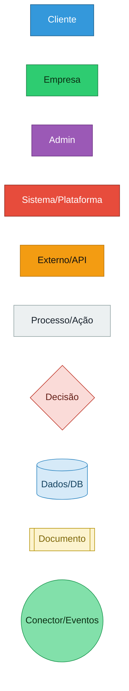

### 0.4 Símbolos por Notação

| Notação | Símbolos usados | Observação |
|---|---|---|
| BPMN-like | Evento inicial/final, tarefa, gateway, timer, message, error | Mermaid não renderiza BPMN 2.0 nativo; pools/lanes foram simulados com `subgraph` |
| UML Sequence | Participantes, mensagens síncronas, `alt`, `opt`, ativações | Usado para busca/orçamento e pagamento |
| State Machine | Estados, transições, final state | Usado no ciclo de vida do projeto |
| ERD | Entidades, atributos, cardinalidade Crow's Foot | Usado na modelagem de dados |
| C4 | Person, System, Container, Component, Rel | Pode exigir renderizador Mermaid com suporte C4 |

---

## 1. Jornada do Usuário (UX/CX)

### 1.1 Customer Journey Map - Cliente Final

Descrição textual: este mapa organiza a experiência do cliente por fase, conectando ações, pensamentos, emoções, touchpoints, dores, oportunidades e métricas. Ele contempla clientes residenciais, comerciais/industriais, rurais e usuários interessados em carregadores veiculares.

Referências cruzadas: o envio de orçamento desta jornada detalha-se em [2.1](#21-bpmn---processo-de-solicitação-de-orçamento), o matching em [2.3](#23-decision-tree---sistema-de-matchmaking) e o fluxo técnico em [3.4](#34-sequence-diagram---fluxo-de-busca-e-orçamento).

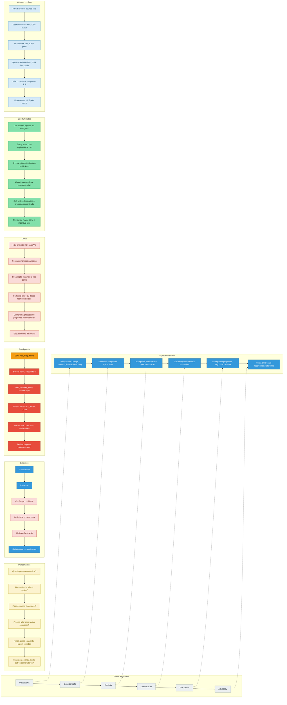

### 1.2 User Flow Diagram - Fluxo Principal

Descrição textual: o fluxo principal cobre entradas orgânicas, diretas, pagas e por conteúdo. Ele mapeia decisões críticas como login vs convidado, orçamento único vs múltiplo, continuar buscando vs escolher empresa e formulário completo vs parcial.

```mermaid
flowchart TD
  START((Entrada do usuário)):::cliente
  EP{Entry point?}:::decisao
  SEO["Busca orgânica Google"]:::externo
  DIRECT["Acesso direto"]:::externo
  REF["Indicação"]:::externo
  ADS["Google Ads / redes sociais"]:::externo
  BLOG["Blog / conteúdo educativo"]:::externo

  HOME["Home AvaliaSolar"]:::sistema
  INTENT{Intenção inicial?}:::decisao
  SEARCH["Busca por categoria e localização"]:::cliente
  CALC["Calculadora de economia"]:::cliente
  PROFILE_ENTRY["Acesso direto ao perfil da empresa"]:::cliente
  CONTENT["Consumo de guia comparativo"]:::cliente

  FILTERS["Aplicar filtros: cidade, estado, solução, score, selo"]:::cliente
  HAS_RESULTS{Há resultados?}:::decisao
  EMPTY["Sem resultado: ampliar raio, capturar demanda, suporte WhatsApp"]:::decisao
  LIST["Listagem ranqueada de empresas"]:::sistema
  CARD["Card de empresa: nota, cidade, selo, CTA"]:::sistema
  PROFILE["Perfil completo: cases, reviews, selos, CTAs"]:::sistema
  TRUST{Confiança suficiente?}:::decisao
  FAV["Salvar favorito"]:::cliente
  COMPARE_DECISION{Comparar empresas?}:::decisao
  COMPARE["Comparação 2-4 empresas"]:::cliente
  CONTINUE["Continuar pesquisando"]:::cliente

  QUOTE_DECISION{Solicitar orçamento?}:::decisao
  AUTH{Está autenticado?}:::decisao
  GATE["Gate de conta: email, Google, LinkedIn, Facebook"]:::sistema
  ACCOUNT_DECISION{Conta completa ou convidado?}:::decisao
  FULL_ACCOUNT["Conta completa: favoritos, histórico, projetos"]:::cliente
  GUEST["Convidado: contato + consentimento LGPD"]:::cliente
  FORM["Wizard de orçamento: categoria, imóvel, consumo, prazo, endereço"]:::cliente
  COMPLETE{Dados mínimos completos?}:::decisao
  DRAFT["Salvar rascunho + recuperação por email/WhatsApp"]:::conector
  SINGLE_MULTI{1 ou múltiplos orçamentos?}:::decisao
  SINGLE["Enviar para 1 empresa"]:::cliente
  MULTI["Enviar para múltiplas empresas"]:::cliente
  LEAD["Criar lead e projeto"]:::sistema
  MATCH["Matchmaking e distribuição"]:::sistema
  CONFIRM["Confirmação + dashboard do cliente"]:::cliente
  COMPANY_NOTIFY["Notificar empresas elegíveis"]:::empresa
  PROPOSALS["Receber propostas"]:::cliente
  HIRE_DECISION{Contratar?}:::decisao
  HIRE["Contrato fechado"]:::cliente
  ABANDON["Abandono: preço, timing, confiança ou demora"]:::decisao
  RECOVERY["Recuperação: novo matching, financiamento, consultoria"]:::conector
  REVIEW_DECISION{Avaliar empresa?}:::decisao
  REVIEW["Review público + score atualizado"]:::cliente
  END((Retenção / advocacy)):::cliente

  START --> EP
  EP --> SEO --> HOME
  EP --> DIRECT --> HOME
  EP --> REF --> HOME
  EP --> ADS --> HOME
  EP --> BLOG --> CONTENT
  CONTENT --> HOME

  HOME --> INTENT
  INTENT -- "buscar" --> SEARCH
  INTENT -- "calcular" --> CALC
  INTENT -- "perfil" --> PROFILE_ENTRY
  INTENT -- "educar" --> CONTENT
  CALC --> FORM
  PROFILE_ENTRY --> PROFILE
  SEARCH --> FILTERS --> HAS_RESULTS
  HAS_RESULTS -- "sim" --> LIST --> CARD --> PROFILE
  HAS_RESULTS -- "não" --> EMPTY --> SEARCH
  PROFILE --> TRUST
  TRUST -- "sim" --> QUOTE_DECISION
  TRUST -- "não" --> FAV --> COMPARE_DECISION
  COMPARE_DECISION -- "sim" --> COMPARE --> QUOTE_DECISION
  COMPARE_DECISION -- "não" --> CONTINUE --> SEARCH
  QUOTE_DECISION -- "sim" --> AUTH
  QUOTE_DECISION -- "não" --> FAV
  AUTH -- "sim" --> FORM
  AUTH -- "não" --> GATE --> ACCOUNT_DECISION
  ACCOUNT_DECISION -- "conta" --> FULL_ACCOUNT --> FORM
  ACCOUNT_DECISION -- "convidado" --> GUEST --> FORM
  FORM --> COMPLETE
  COMPLETE -- "sim" --> SINGLE_MULTI
  COMPLETE -- "não" --> DRAFT --> FORM
  SINGLE_MULTI -- "1 empresa" --> SINGLE --> LEAD
  SINGLE_MULTI -- "múltiplas" --> MULTI --> LEAD
  LEAD --> MATCH --> CONFIRM
  MATCH --> COMPANY_NOTIFY
  COMPANY_NOTIFY --> PROPOSALS
  CONFIRM --> PROPOSALS --> HIRE_DECISION
  HIRE_DECISION -- "sim" --> HIRE --> REVIEW_DECISION
  HIRE_DECISION -- "não" --> ABANDON --> RECOVERY --> SEARCH
  REVIEW_DECISION -- "sim" --> REVIEW --> END
  REVIEW_DECISION -- "não" --> END

  classDef cliente fill:#3498DB,stroke:#1F618D,color:#fff;
  classDef empresa fill:#2ECC71,stroke:#1D8348,color:#0B2E13;
  classDef sistema fill:#E74C3C,stroke:#922B21,color:#fff;
  classDef externo fill:#F39C12,stroke:#B9770E,color:#111;
  classDef decisao fill:#FADBD8,stroke:#C0392B,color:#641E16;
  classDef conector fill:#82E0AA,stroke:#229954,color:#0B2E13;
```

### 1.3 Sankey Diagram - Analytics de Conversão

Descrição textual: este Sankey usa volumes ilustrativos para orientar o desenho do funil. Os valores devem ser substituídos por dados reais do PostHog/GA4/analytics interno. Ele diferencia caminhos diretos e indiretos, além de abandono por etapa.

```mermaid
sankey-beta
  Página inicial,Busca/filtros,620
  Página inicial,Calculadora,180
  Página inicial,Blog/conteúdo,120
  Página inicial,Rejeição home,80
  Blog/conteúdo,Busca/filtros,70
  Blog/conteúdo,Calculadora,35
  Blog/conteúdo,Abandono conteúdo,15
  Calculadora,Formulário orçamento,115
  Calculadora,Abandono calculadora,100
  Busca/filtros,Perfil de empresa,420
  Busca/filtros,Abandono busca,270
  Perfil de empresa,Comparação,145
  Perfil de empresa,Formulário orçamento,160
  Perfil de empresa,Abandono perfil,185
  Comparação,Formulário orçamento,95
  Comparação,Continuar buscando,35
  Comparação,Abandono comparação,15
  Formulário orçamento,Confirmação,245
  Formulário orçamento,Abandono formulário,125
  Confirmação,Propostas recebidas,210
  Confirmação,Sem resposta empresa,35
  Propostas recebidas,Contratação,58
  Propostas recebidas,Abandono decisão,152
  Contratação,Avaliação pós-serviço,24
  Contratação,Sem avaliação,34
```

---

## 2. Processos de Negócio

### 2.1 BPMN - Processo de Solicitação de Orçamento

Descrição textual: processo completo de geração e tratamento de lead, com pools para cliente, plataforma, empresa e eventos de erro/timer. Os gateways representam decisões binárias ou múltiplas. O fluxo de dados relacionado está em [4.2](#42-data-flow-diagram-dfd---processo-de-lead).

```mermaid
flowchart LR
  subgraph pool_cliente["Pool Cliente"]
    C_START((Start: acessa plataforma)):::cliente
    C_BUSCA["Task: buscar solução"]:::cliente
    C_EMPRESAS["Task: visualizar empresas"]:::cliente
    C_FORM["Task: preencher formulário"]:::cliente
    C_ENVIA["Message: enviar solicitação"]:::cliente
    C_RECEBE["Message: receber propostas"]:::cliente
    C_DECIDE{Gateway: proposta aceita?}:::decisao
    C_CONTRATA["Task: contratar"]:::cliente
    C_ABANDONA["End: abandono/retorno futuro"]:::decisao
  end

  subgraph pool_plataforma["Pool Plataforma AvaliaSolar"]
    P_VALIDA["Task: validar dados"]:::sistema
    P_VALIDO{Gateway: lead qualificado?}:::decisao
    P_ENRIQUECE["Task: enriquecer com geo/categoria"]:::sistema
    P_MATCH["Task: executar matchmaking"]:::sistema
    P_EMPRESA{Gateway: empresa disponível?}:::decisao
    P_DISTRIBUI["Task: distribuir lead"]:::sistema
    P_NOTIFICA["Message: notificar partes"]:::conector
    P_TIMER(("Timer: timeout resposta")):::conector
    P_FOLLOW["Task: follow-up e redistribuição"]:::sistema
    P_MEDIA["Task: mediação/suporte"]:::sistema
    P_ERROR(("Error: falha envio/notificação")):::decisao
  end

  subgraph pool_empresa["Pool Empresa"]
    E_RECEBE["Message: receber notificação"]:::empresa
    E_QUALIFICA["Task: qualificar lead"]:::empresa
    E_QUALIFICADO{Gateway: atende critérios?}:::decisao
    E_PREPARA["Task: preparar proposta"]:::empresa
    E_ENVIA["Message: enviar orçamento"]:::empresa
    E_NEGOCIA["Task: negociar"]:::empresa
    E_FECHA{Gateway: fechamento?}:::decisao
    E_GANHO["End: ganho"]:::empresa
    E_PERDIDO["End: perdido"]:::decisao
  end

  C_START --> C_BUSCA --> C_EMPRESAS --> C_FORM --> C_ENVIA
  C_ENVIA --> P_VALIDA --> P_VALIDO
  P_VALIDO -- "não" --> P_MEDIA --> C_FORM
  P_VALIDO -- "sim" --> P_ENRIQUECE --> P_MATCH --> P_EMPRESA
  P_EMPRESA -- "não" --> P_FOLLOW --> P_MATCH
  P_EMPRESA -- "sim" --> P_DISTRIBUI --> P_NOTIFICA
  P_NOTIFICA --> E_RECEBE
  P_NOTIFICA --> C_RECEBE
  E_RECEBE --> E_QUALIFICA --> E_QUALIFICADO
  E_QUALIFICADO -- "não" --> E_PERDIDO --> P_FOLLOW
  E_QUALIFICADO -- "sim" --> E_PREPARA --> E_ENVIA --> C_RECEBE
  E_ENVIA --> E_NEGOCIA
  C_RECEBE --> C_DECIDE
  C_DECIDE -- "sim" --> C_CONTRATA --> E_FECHA
  C_DECIDE -- "não" --> C_ABANDONA
  E_FECHA -- "sim" --> E_GANHO
  E_FECHA -- "não" --> E_PERDIDO
  P_TIMER --> P_FOLLOW
  P_ERROR --> P_NOTIFICA

  classDef cliente fill:#3498DB,stroke:#1F618D,color:#fff;
  classDef empresa fill:#2ECC71,stroke:#1D8348,color:#0B2E13;
  classDef sistema fill:#E74C3C,stroke:#922B21,color:#fff;
  classDef decisao fill:#FADBD8,stroke:#C0392B,color:#641E16;
  classDef conector fill:#82E0AA,stroke:#229954,color:#0B2E13;
```

### 2.2 BPMN - Onboarding de Empresas

Descrição textual: processo de cadastro, validação e ativação das empresas prestadoras. O fluxo contempla reivindicação de perfil existente, pendências documentais, aprovação/rejeição, configuração de perfil e treinamento.

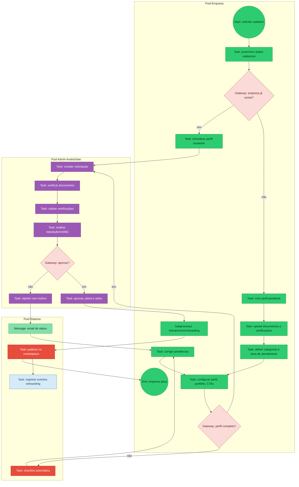

### 2.3 Decision Tree - Sistema de Matchmaking

Descrição textual: árvore de decisão para selecionar empresas elegíveis e ranquear matches por proximidade, categoria, reputação, disponibilidade, plano e resposta histórica.

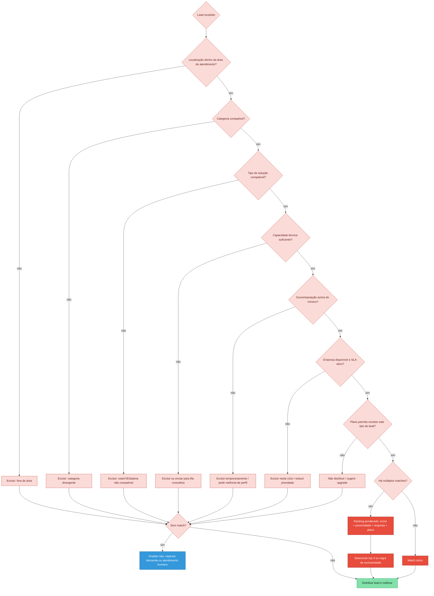

### 2.4 State Diagram - Ciclo de Vida do Projeto

Descrição textual: estados de um projeto/orçamento desde rascunho até conclusão, cancelamento ou abandono. O modelo também cobre timeout e reabertura.

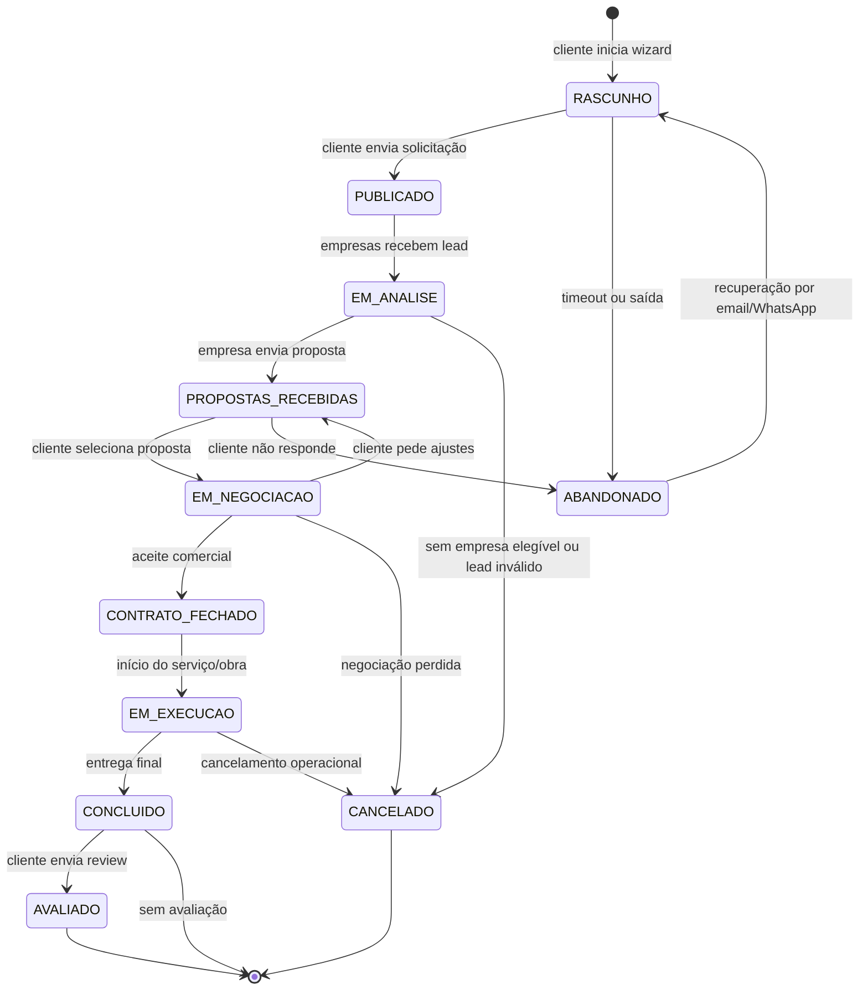

---

## 3. Arquitetura de Sistemas

### 3.1 C4 Model - Nível 1: Contexto

Descrição textual: visão macro da plataforma e atores externos. A arquitetura reflete o contexto atual do repositório: frontend Next.js, backend Rails/API, ActiveAdmin, Sidekiq, PostgreSQL, Redis e integrações de analytics/notificações/pagamento.

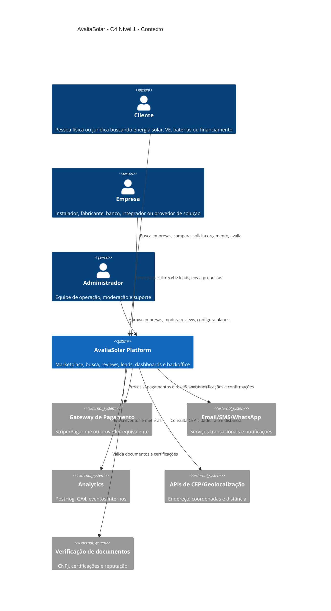

### 3.2 C4 Model - Nível 2: Containers

Descrição textual: containers principais da plataforma. Onde a solicitação menciona serviços como API Gateway, Search Service e Lead Service, eles são representados como módulos/containers lógicos dentro do backend Rails/API, alinhados à implementação atual.

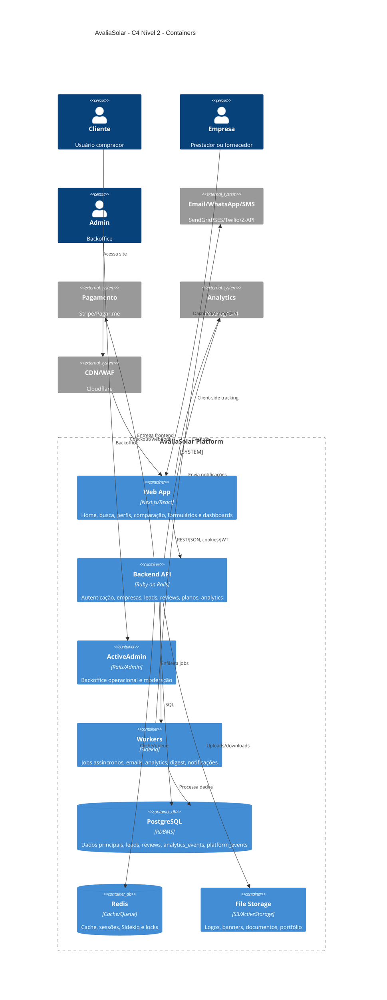

### 3.3 C4 Model - Nível 3: Components

#### 3.3.1 Components - Search Service

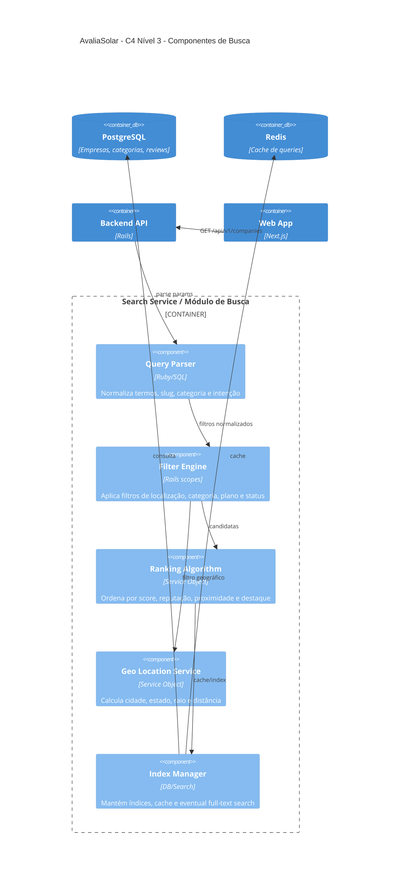

#### 3.3.2 Components - Lead Service

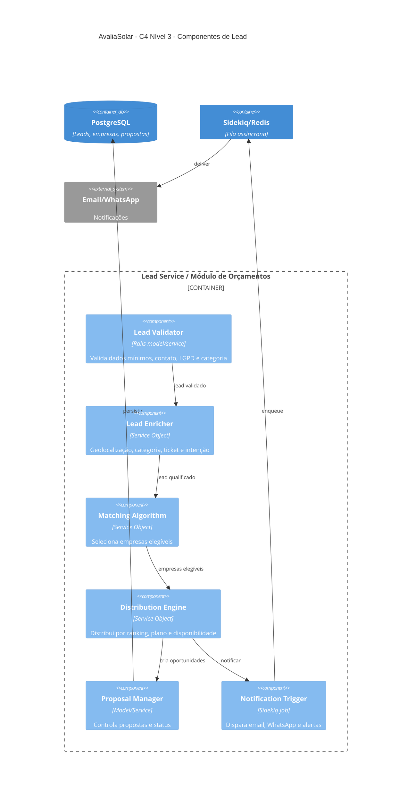

### 3.4 Sequence Diagram - Fluxo de Busca e Orçamento

Descrição textual: sequência principal quando um cliente busca empresas, seleciona uma ou mais e solicita orçamento.

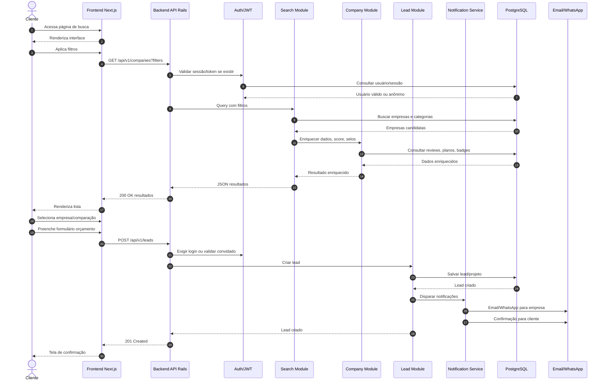

### 3.5 Sequence Diagram - Processo de Pagamento

Descrição textual: fluxo para assinatura, destaque premium ou serviço pago por empresa. O pagamento final de instalação pode ocorrer fora da plataforma, mas o modelo suporta gateway e webhooks.

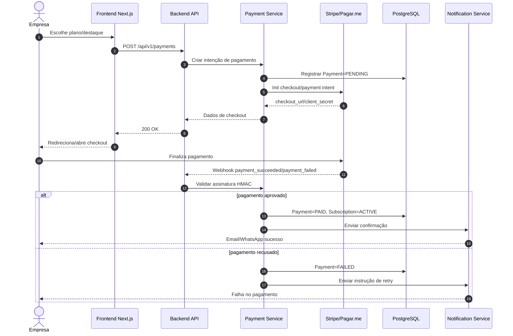

---

## 4. Modelagem de Dados

### 4.1 ERD - Entidades Principais

Descrição textual: modelo conceitual principal. Alguns nomes podem ser adaptados aos modelos reais do backend, mas a estrutura representa o domínio funcional da plataforma.

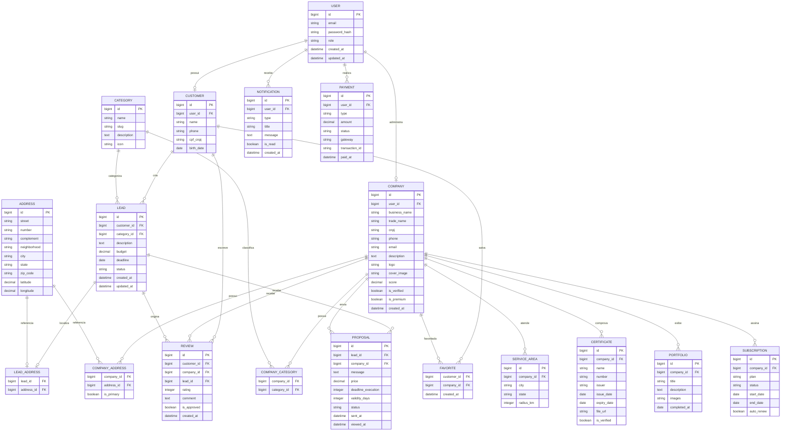

### 4.2 Data Flow Diagram (DFD) - Processo de Lead

Descrição textual: fluxo de dados da captura ao matching e notificações.

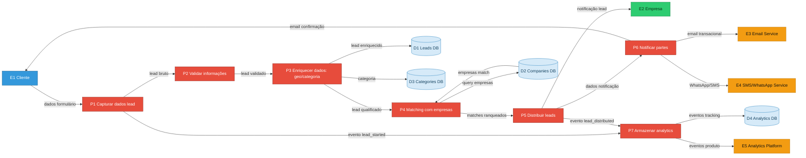

---

## 5. API e Integrações

### 5.1 API Flow Diagram - Endpoints Principais

Descrição textual: visão dos recursos API, autenticação JWT/cookies, rate limiting e principais status codes.

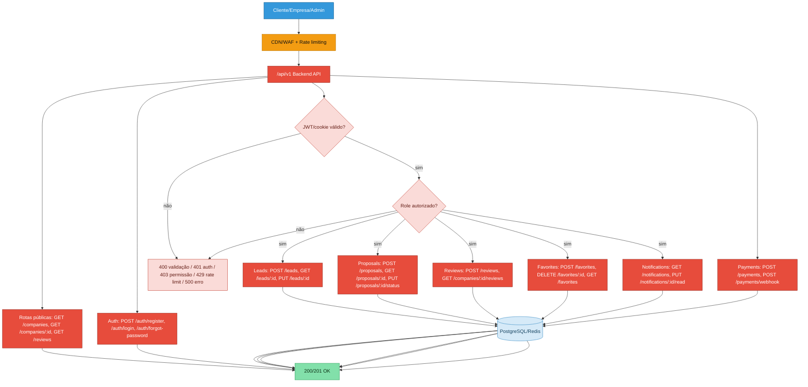

### 5.2 Integration Diagram - Serviços Externos

Descrição textual: integrações previstas/atuais e protocolos.

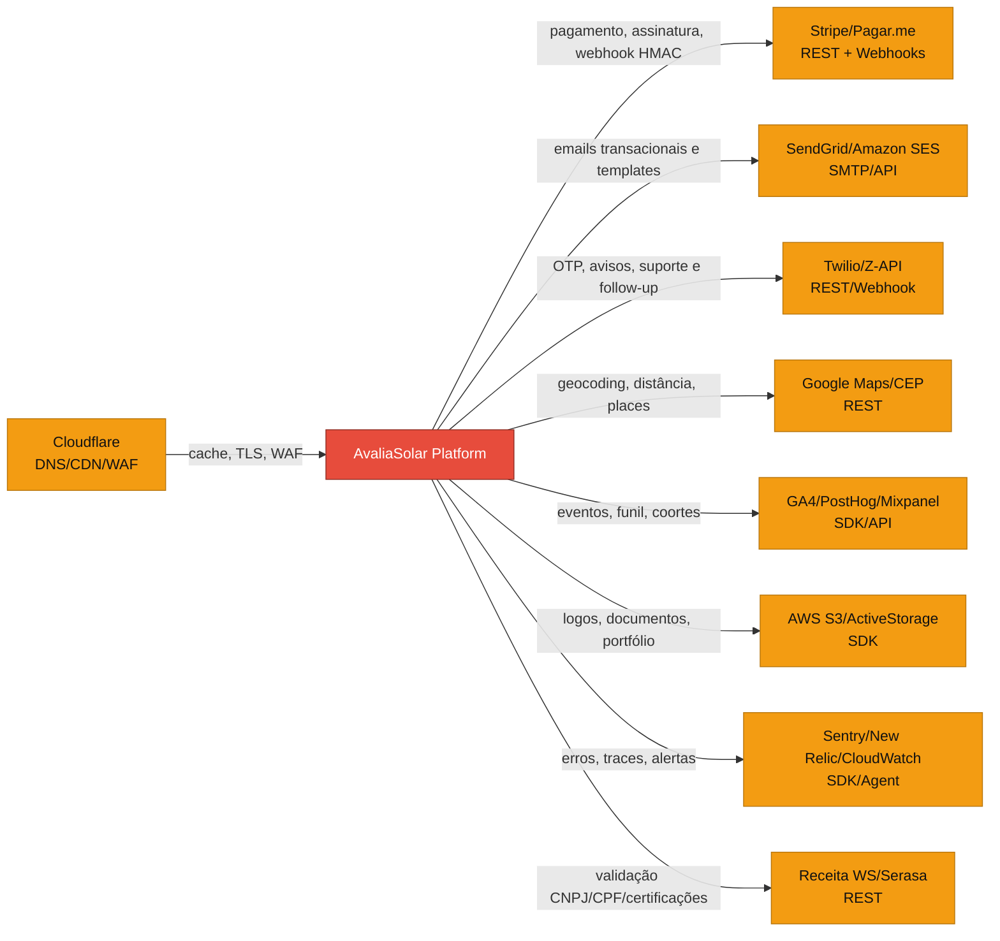

---

## 6. Infraestrutura e Deploy

### 6.1 Infrastructure Diagram - Cloud e Produção

Descrição textual: arquitetura de referência para produção. O repositório atual usa containers Docker; o diagrama abaixo apresenta equivalentes cloud e responsabilidades.

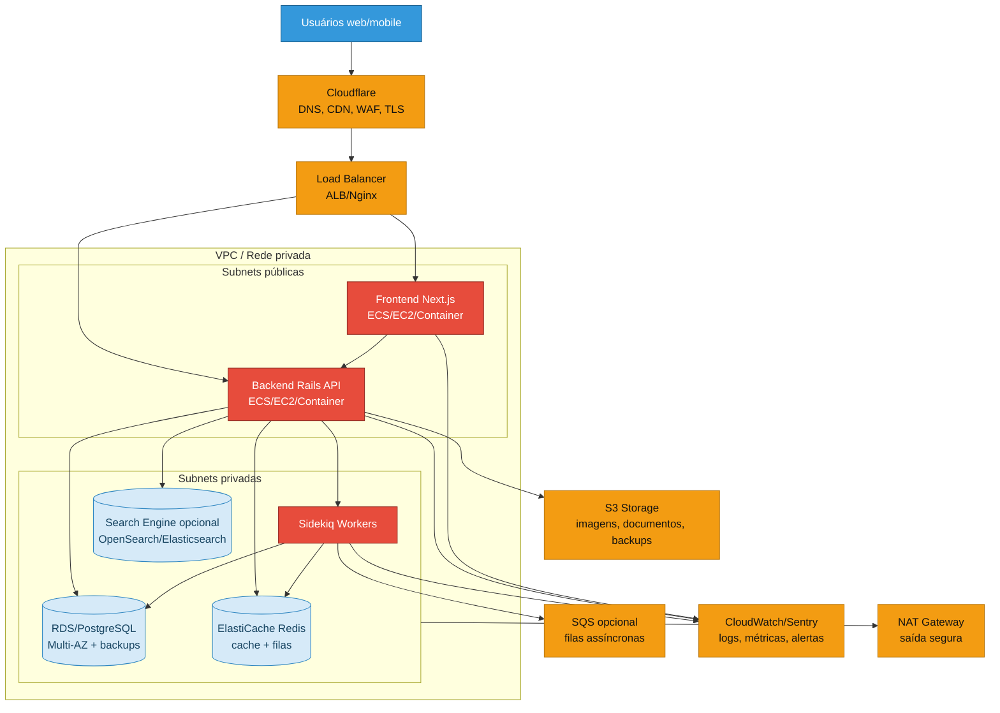

### 6.2 Deployment Pipeline - CI/CD

Descrição textual: fluxo de deploy com gates de qualidade, staging e produção blue-green.

```mermaid
flowchart LR
  DEV["Development<br/>branch/feature"]:::processo
  COMMIT["Commit + Push GitHub"]:::processo
  CI["GitHub Actions<br/>lint, typecheck, tests"]:::sistema
  BUILD["Build Docker images"]:::sistema
  REG["Push image registry/ECR"]:::externo
  DEV_DEPLOY["Deploy Dev"]:::sistema
  DEV_SMOKE["Smoke tests Dev"]:::processo
  MERGE_DEV{Merge develop?}:::decisao
  STAGE["Deploy Staging"]:::sistema
  INT["Integration + performance tests"]:::processo
  UAT{UAT aprovado?}:::decisao
  MERGE_MAIN{Merge main?}:::decisao
  PROD_BUILD["Build produção"]:::sistema
  MIG["Run migrations"]:::sistema
  BLUE_GREEN["Blue-green deploy"]:::sistema
  HEALTH{Health checks OK?}:::decisao
  PROMOTE["Promote green"]:::conector
  ROLLBACK["Rollback automático/manual"]:::decisao
  MON["Monitoramento pós-deploy"]:::externo

  DEV --> COMMIT --> CI --> BUILD --> REG --> DEV_DEPLOY --> DEV_SMOKE --> MERGE_DEV
  MERGE_DEV -- "sim" --> STAGE --> INT --> UAT
  UAT -- "sim" --> MERGE_MAIN --> PROD_BUILD --> MIG --> BLUE_GREEN --> HEALTH
  HEALTH -- "sim" --> PROMOTE --> MON
  HEALTH -- "não" --> ROLLBACK --> MON
  MERGE_DEV -- "não" --> DEV
  UAT -- "não" --> DEV

  classDef sistema fill:#E74C3C,stroke:#922B21,color:#fff;
  classDef externo fill:#F39C12,stroke:#B9770E,color:#111;
  classDef processo fill:#ECF0F1,stroke:#95A5A6,color:#17202A;
  classDef decisao fill:#FADBD8,stroke:#C0392B,color:#641E16;
  classDef conector fill:#82E0AA,stroke:#229954,color:#0B2E13;
```

---

## 7. Segurança e Compliance

### 7.1 Security Flow Diagram - Autenticação e Autorização

Descrição textual: camadas de segurança para registro, login, recuperação, 2FA opcional, autorização RBAC e proteção de dados.

```mermaid
flowchart TD
  USER["Usuário"]:::cliente
  TLS["HTTPS / TLS 1.3"]:::externo
  REGISTER["Registro: email/social login"]:::sistema
  VALIDATE["Validação input + anti-abuso"]:::sistema
  HASH["Hash de senha / OAuth identity"]:::dados
  JWT["Emitir JWT/cookie seguro + refresh"]:::sistema
  LOGIN["Login: credentials/OAuth"]:::sistema
  RECOVERY["Password recovery: token + email"]:::sistema
  TWOFA{"2FA habilitado?"}:::decisao
  TOTP["TOTP/QR Code/Verify"]:::sistema
  RBAC{"RBAC permite acesso?"}:::decisao
  RESOURCE["Recurso protegido"]:::sistema
  DENY["403/401 + auditoria"]:::decisao
  AUDIT["Audit log + analytics segurança"]:::dados
  ENCRYPT["Criptografia em trânsito e repouso"]:::dados

  USER --> TLS
  TLS --> REGISTER --> VALIDATE --> HASH --> JWT
  TLS --> LOGIN --> VALIDATE --> TWOFA
  TLS --> RECOVERY --> VALIDATE --> JWT
  TWOFA -- "sim" --> TOTP --> JWT
  TWOFA -- "não" --> JWT
  JWT --> RBAC
  RBAC -- "sim" --> RESOURCE --> AUDIT
  RBAC -- "não" --> DENY --> AUDIT
  HASH --> ENCRYPT
  RESOURCE --> ENCRYPT

  classDef cliente fill:#3498DB,stroke:#1F618D,color:#fff;
  classDef sistema fill:#E74C3C,stroke:#922B21,color:#fff;
  classDef externo fill:#F39C12,stroke:#B9770E,color:#111;
  classDef decisao fill:#FADBD8,stroke:#C0392B,color:#641E16;
  classDef dados fill:#D6EAF8,stroke:#2E86C1,color:#154360;
```

### 7.2 Compliance Flow - LGPD

Descrição textual: fluxo de consentimento, direitos do titular, retenção e resposta a incidentes.

```mermaid
flowchart TD
  DATA_START((Dado pessoal coletado)):::dados
  CONSENT{Base legal/consentimento registrado?}:::decisao
  BLOCK["Bloquear uso não essencial"]:::decisao
  STORE["Armazenar com finalidade, timestamp, IP/user agent"]:::dados
  USE["Uso limitado à finalidade: lead, conta, suporte, analytics permitido"]:::sistema
  RIGHTS{Titular solicita direito?}:::decisao
  ACCESS["Acesso/portabilidade"]:::cliente
  RECTIFY["Retificação"]:::cliente
  DELETE["Exclusão/anomização"]:::cliente
  RETENTION["Política de retenção e cleanup automático"]:::sistema
  DPIA["DPIA para fluxos sensíveis"]:::admin
  BREACH{Incidente de segurança?}:::decisao
  NOTIFY["Notificar responsáveis/ANPD/titulares conforme severidade"]:::admin
  AUDIT["Registro de auditoria LGPD"]:::dados

  DATA_START --> CONSENT
  CONSENT -- "não" --> BLOCK --> AUDIT
  CONSENT -- "sim" --> STORE --> USE --> RIGHTS
  RIGHTS -- "acesso" --> ACCESS --> AUDIT
  RIGHTS -- "retificação" --> RECTIFY --> AUDIT
  RIGHTS -- "exclusão" --> DELETE --> AUDIT
  USE --> RETENTION --> AUDIT
  USE --> DPIA
  USE --> BREACH
  BREACH -- "sim" --> NOTIFY --> AUDIT
  BREACH -- "não" --> AUDIT

  classDef cliente fill:#3498DB,stroke:#1F618D,color:#fff;
  classDef admin fill:#9B59B6,stroke:#6C3483,color:#fff;
  classDef sistema fill:#E74C3C,stroke:#922B21,color:#fff;
  classDef decisao fill:#FADBD8,stroke:#C0392B,color:#641E16;
  classDef dados fill:#D6EAF8,stroke:#2E86C1,color:#154360;
```

---

## 8. Monitoramento e Analytics

### 8.1 Analytics Dashboard - Métricas Principais

Descrição textual: mockup lógico de dashboard com métricas de negócio, produto e tecnologia.

```mermaid
flowchart TD
  DASH["Analytics Dashboard AvaliaSolar"]:::sistema
  BIZ["Métricas de negócio"]:::processo
  PROD["Métricas de produto"]:::processo
  TECH["Métricas técnicas"]:::processo
  FUNNEL["Funil: busca → perfil → orçamento → proposta → contratação"]:::dados
  LEADS["Leads gerados dia/mês/ano"]:::dados
  CONV["Conversão lead → proposta → fechamento"]:::dados
  TICKET["Ticket médio, CAC, LTV, churn"]:::dados
  NPS["NPS, CSAT, CES"]:::dados
  DAU["DAU/MAU, sessão, bounce"]:::dados
  FEATURE["Feature adoption: calculadora, comparação, favoritos"]:::dados
  PERF["API p50/p95/p99, uptime, error rate"]:::dados
  DB["DB query performance, cache hit rate, filas"]:::dados
  ALERT["Alertas e anomalias"]:::decisao

  DASH --> BIZ
  DASH --> PROD
  DASH --> TECH
  BIZ --> LEADS
  BIZ --> CONV
  BIZ --> TICKET
  BIZ --> NPS
  PROD --> FUNNEL
  PROD --> DAU
  PROD --> FEATURE
  TECH --> PERF
  TECH --> DB
  PERF --> ALERT
  CONV --> ALERT
  DB --> ALERT

  classDef sistema fill:#E74C3C,stroke:#922B21,color:#fff;
  classDef processo fill:#ECF0F1,stroke:#95A5A6,color:#17202A;
  classDef dados fill:#D6EAF8,stroke:#2E86C1,color:#154360;
  classDef decisao fill:#FADBD8,stroke:#C0392B,color:#641E16;
```

### 8.2 Alerting Flow - Monitoramento Proativo

Descrição textual: árvore de decisão para alertas técnicos e de negócio, com escalonamento.

```mermaid
flowchart TD
  METRIC["Métrica recebida"]:::dados
  TYPE{Tipo de alerta?}:::decisao
  INFRA["Infra: CPU > 80%, memória > 85%, disco > 90%"]:::externo
  APP["Aplicação: error rate > 5%, response time > 2s"]:::sistema
  BIZ["Negócio: leads drop > 50%, conversão abaixo do limite"]:::processo
  SEV{Severidade?}:::decisao
  L1["Level 1: Email/Slack para dev team"]:::conector
  L2["Level 2: SMS/Phone para tech lead"]:::conector
  L3["Level 3: War room CTO + time"]:::admin
  RUNBOOK["Executar runbook"]:::processo
  FIXED{Resolvido?}:::decisao
  POST["Postmortem + ação preventiva"]:::documento
  ESCALATE["Escalar próximo nível"]:::decisao

  METRIC --> TYPE
  TYPE -- "infra" --> INFRA --> SEV
  TYPE -- "app" --> APP --> SEV
  TYPE -- "business" --> BIZ --> SEV
  SEV -- "baixa" --> L1
  SEV -- "média" --> L2
  SEV -- "crítica" --> L3
  L1 --> RUNBOOK
  L2 --> RUNBOOK
  L3 --> RUNBOOK
  RUNBOOK --> FIXED
  FIXED -- "sim" --> POST
  FIXED -- "não" --> ESCALATE --> SEV

  classDef admin fill:#9B59B6,stroke:#6C3483,color:#fff;
  classDef sistema fill:#E74C3C,stroke:#922B21,color:#fff;
  classDef externo fill:#F39C12,stroke:#B9770E,color:#111;
  classDef processo fill:#ECF0F1,stroke:#95A5A6,color:#17202A;
  classDef decisao fill:#FADBD8,stroke:#C0392B,color:#641E16;
  classDef dados fill:#D6EAF8,stroke:#2E86C1,color:#154360;
  classDef conector fill:#82E0AA,stroke:#229954,color:#0B2E13;
  classDef documento fill:#FCF3CF,stroke:#B7950B,color:#7D6608;
```

---

## Apêndice A: Glossário

| Termo | Definição |
|---|---|
| Cliente | Usuário final que busca soluções solares, VE, baterias ou financiamento |
| Empresa | Prestador, fabricante, banco, integrador ou fornecedor cadastrado na plataforma |
| Lead | Solicitação de orçamento/projeto criada por um cliente |
| Proposal/Proposta | Resposta comercial enviada por uma empresa para um lead |
| Matchmaking | Processo de seleção e ranqueamento de empresas elegíveis para um lead |
| Score | Métrica composta de reputação, avaliações, resposta, completude e regras de negócio |
| Premium | Plano/condição comercial que pode habilitar destaque, CTAs e recursos avançados |
| LGPD | Lei Geral de Proteção de Dados |
| NPS | Net Promoter Score |
| CSAT | Customer Satisfaction Score |
| CES | Customer Effort Score |
| SLA | Service Level Agreement |

## Apêndice B: Referências

| Padrão | Uso |
|---|---|
| Mermaid.js | Diagramas renderizáveis em Markdown |
| C4 Model | Contexto, containers e componentes |
| BPMN 2.0 | Referência conceitual de processo, simulada em flowchart |
| UML Sequence | Interações temporais entre atores e sistemas |
| ERD Crow's Foot | Cardinalidade e modelagem relacional |
| DFD | Fluxo de dados entre processos e stores |
| LGPD | Conformidade com dados pessoais no Brasil |

## Apêndice C: Checklist de Validação

| Item | Status |
|---|---|
| Todos os 8 grupos de diagramas estão presentes | OK |
| Mínimo de 50 nós/etapas no total | OK |
| Cores padronizadas aplicadas nos flowcharts | OK |
| Legendas completas incluídas | OK |
| Cross-references entre diagramas | OK |
| Nomenclatura consistente | OK |
| Descrições textuais para cada diagrama | OK |
| Metadados de versão, data, autor e status | OK |
| Índice/sumário funcional em Markdown | OK |
| Mermaid validável em renderizadores compatíveis | OK estrutural; validar render visual no ambiente alvo para C4 e Sankey |

## Apêndice D: Changelog

| Versão | Data | Autor | Alteração |
|---|---|---|---|
| 1.0.0 | 2026-05-19 | Codex + Equipe AvaliaSolar | Criação inicial da documentação técnica completa |
