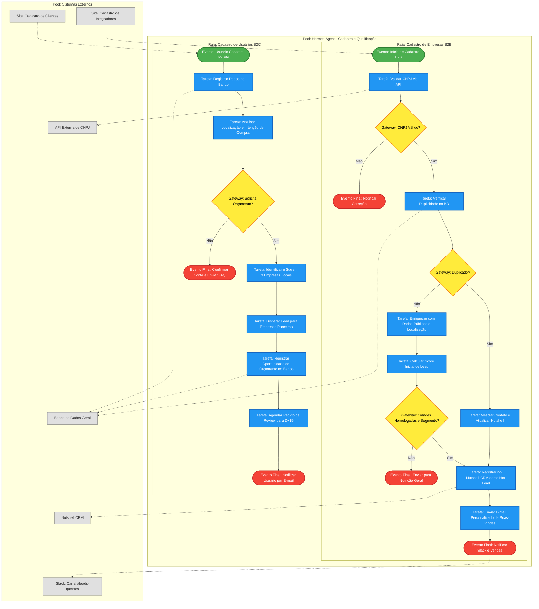
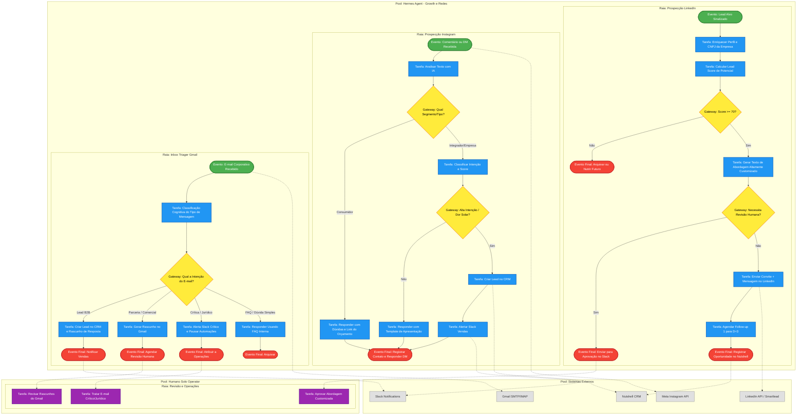
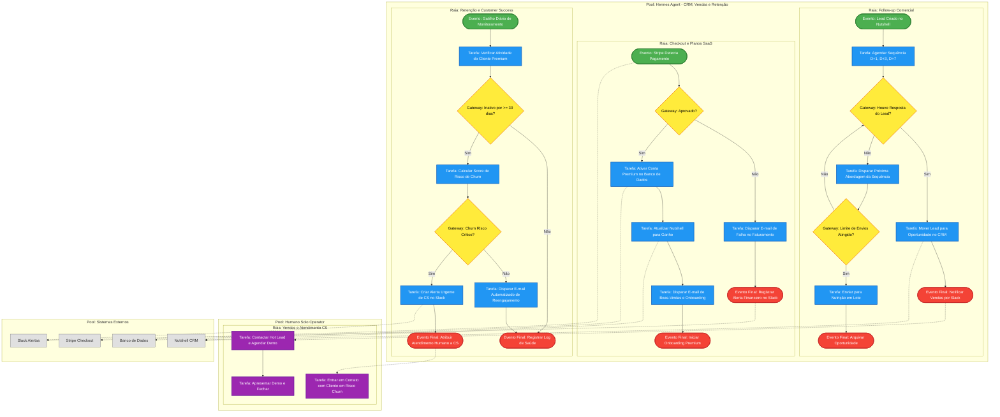

# 🗺️ Mapa Operacional Mestre de Processos: Avalia Solar & Mobilidade Elétrica

Este documento estabelece o **Mapeamento de Processos Operacionais Ponta a Ponta** do Avalia Solar. Toda a operação está dividida em três pools estruturais que se integram de forma assíncrona e orientada a eventos: **Hermes Agent (IA)**, **Humano (Solo Operator / Equipe)** e **Sistemas Externos**.

---

## 👥 Visão Geral dos Pools

### 🤖 1. Pool: Hermes Agent (IA)
Orquestrador de automações cognitivas, classificação de mensagens, enriquecimento de dados cadastrais, roteamento inteligente de leads, verificação de conformidade, cálculo de scores, disparo de follow-ups e monitoramento de entregabilidade.

### 🧑‍💼 2. Pool: Humano (Solo Operator)
Operator ou equipe responsável por tarefas que demandam sensibilidade comercial, validação estratégica, atendimento consultivo, autorizações de risco e fechamento de vendas complexas.

### 💻 3. Pool: Sistemas Externos
Infraestrutura tecnológica de suporte, incluindo o portal web/app do Avalia Solar, bancos de dados relatórios, Nutshell CRM, Stripe, Slack, APIs de enriquecimento, provedor SMTP e ferramentas de SEO.

---

## 🗺️ Fluxos Detalhados por Blocos Operacionais

Para garantir a máxima legibilidade de toda a operação, o fluxo foi segmentado em blocos lógicos estruturados.

---

### 📦 Bloco 1: Cadastro e Qualificação (B2B & B2C)

Este fluxo cobre o cadastro automatizado de empresas de Energia Solar e de Mobilidade Elétrica (B2B), bem como o ingresso de usuários finais (B2C) interessados em avaliações e orçamentos.



*   **Processos Automatizados**: Validação e saneamento do CNPJ através de APIs de dados cadastrais; enriquecimento automático de leads para as 34 cidades brasileiras com mais de 500 mil habitantes; deduplicação automática no banco de dados e Nutshell CRM.
*   **Decisões do Hermes (Gateways)**: O CNPJ é válido? O lead já está cadastrado no sistema? O lead está localizado nas cidades prioritárias e atua em Energia Solar ou Mobilidade Elétrica? O cliente solicitou orçamento de forma explícita?

---

### 👥 Bloco 2: Growth e Social Selling (LinkedIn, Instagram & Gmail)

Foco em outbound B2B e inbound de atração usando canais sociais e triagem cognitiva de emails corporativos.



*   **Processos Automatizados**: Monitoramento de DMs/comentários e classificação de sentimento de forma contínua; enriquecimento de leads frios via Prospeo/LinkedIn; criação automática de rascunhos de e-mails em resposta a contatos de entrada.
*   **Portões de Governança Humana (Aprovações)**: O Hermes Agent nunca envia mensagens de alta complexidade no LinkedIn sem que o Humano revise se a personalização está adequada; e-mails classificados como "Jurídico" ou "Críticos" travam as sequências e acionam um alerta imediato no Slack.

---

### 💳 Bloco 3: Comercial, Financeiro e Retenção

Faturamento de assinaturas SaaS, gestão de funil comercial Nutshell e manutenção de clientes ativos para mitigar Churn.



*   **Processos Automatizados**: Gestão de checkout e processamento financeiro integrados via Stripe; follow-up automático nos leads B2B que não responderam às primeiras abordagens comerciais; monitoramento diário da inatividade de clientes.
*   **Gatilhos de Transição**: Pagamento negado pelo Stripe direciona para fluxo automático de recuperação de crédito; risco crítico de Churn aciona o time de Customer Success com urgência.

---

### ✍️ Bloco 4: Reputação, Conteúdo e SEO

Mapeamento do motor de reputação por reviews dos consumidores B2C e geração de tráfego orgânico localizado (SEO) para Energia Solar e Mobilidade Elétrica.

```mermaid
flowchart TB
    classDef startEvent fill:#4CAF50,stroke:#2E7D32,stroke-width:2px,color:#fff;
    classDef endEvent fill:#F44336,stroke:#C62828,stroke-width:2px,color:#fff;
    classDef gateway fill:#FFEB3B,stroke:#F57F17,stroke-width:2px,color:#000;
    classDef hermesTask fill:#2196F3,stroke:#1565C0,stroke-width:2px,color:#fff;
    classDef humanTask fill:#9C27B0,stroke:#6A1B9A,stroke-width:2px,color:#fff;
    classDef systemNode fill:#E0E0E0,stroke:#757575,stroke-width:1px,color:#333;

    subgraph Pool_Hermes_Bloco4 [Pool: Hermes Agent - Reputação e SEO]
        direction TB

        subgraph Lane_RV [Raia: Reviews e Prova Social]
            RV1([Evento: Review Enviado pelo Consumidor]) --> RV2[Tarefa: Classificar Sentimento do Review com IA]
            RV2 --> RV3{Gateway: Sentimento do Review?}
            
            RV3 -- Positivo [4 ou 5 estrelas] --> RV4[Tarefa: Publicar Review no Site]
            RV4 --> RV5[Tarefa: Gerar Postagem Social Sugerida para a Empresa]
            RV5 --> RV6[Tarefa: Atualizar Score e Ranking da Empresa no BD]
            RV6 --> RV7([Evento Final: Notificar Empresa Premium])
            
            RV3 -- Negativo [1 a 3 estrelas] --> RV8[Tarefa: Pausar Respostas Automáticas]
            RV8 --> RV9[Tarefa: Notificar CS Slack com Alerta Crítico]
            RV9 --> RV10([Evento Final: Encaminhar para Humano CS])
        end

        subgraph Lane_SEO [Raia: Conteúdo e SEO]
            SEO1([Evento: Gatilho Semanal de Conteúdo]) --> SEO2[Tarefa: Analisar Google Search Console e CRM para Tendências]
            SEO2 --> SEO3[Tarefa: Identificar Cidades Prioritárias (>500k)]
            SEO3 --> SEO4[Tarefa: Redigir Rascunho de Artigo Customizado Localizado]
            
            SEO4 --> SEO5{Gateway: Conteúdo Requer Aprovação Humana?}
            SEO5 -- Não --> SEO6[Tarefa: Publicar Diretamente no CMS WordPress]
            SEO5 -- Sim --> SEO7[Tarefa: Alertar Editor Humano via Slack]
            
            SEO7 --> SEO8([Evento Final: Aguardar Aprovação Humana])
            SEO6 --> SEO9[Tarefa: Distribuir Postagem Automatizada nas Redes]
            SEO9 --> SEO10([Evento Final: Logar Métricas e Concluir Pauta])
        end
    end

    subgraph Pool_Humano_Bloco4 [Pool: Humano Solo Operator]
        direction TB
        subgraph Lane_Humano_Marketing [Raia: Marketing e SEO]
            H_RevReview[Tarefa: Auditar Review Negativo e Negociar Trégua]
            H_ApprovePost[Tarefa: Revisar, Editar e Aprovar Artigo de SEO]
        end
    end

    subgraph Pool_Sistemas_Bloco4 [Pool: Sistemas Externos]
        SYS_WordPress[CMS WordPress / Blog]
        SYS_GSC[Google Search Console API]
        SYS_Social[APIs LinkedIn e Instagram]
        SYS_Slack4[Slack Alertas]
    end

    %% Conexões
    SEO2 -.-> SYS_GSC
    SEO6 -.-> SYS_WordPress
    SEO9 -.-> SYS_Social
    RV10 -.-> H_RevReview
    SEO8 -.-> H_ApprovePost
    H_ApprovePost -- Aprovado -.-> SEO6
    RV9 -.-> SYS_Slack4
    SEO7 -.-> SYS_Slack4

    class RV1,SEO1 startEvent;
    class RV7,RV10,SEO8,SEO10 endEvent;
    class RV3,SEO5 gateway;
    class RV2,RV4,RV5,RV6,RV8,RV9,SEO2,SEO3,SEO4,SEO6,SEO7,SEO9 hermesTask;
    class H_RevReview,H_ApprovePost humanTask;
    class SYS_WordPress,SYS_GSC,SYS_Social,SYS_Slack4 systemNode;
```

*   **Processos Automatizados**: Classificação semântica de avaliações de consumidores utilizando modelos de processamento de linguagem natural; atualização em tempo real de rankings de competitividade locais; coleta e análise programática de keywords de alta performance do Google Search Console.
*   **Ações Críticas de Reputação**: Interrupção total de respostas automatizadas para feedbacks abaixo de 4 estrelas para preservar a marca da plataforma e garantir que o atendimento de contenção de danos seja exclusivamente humano.

---

### 🛡️ Bloco 5: Governança, Dados e Infraestrutura

Políticas de segurança de dados (LGPD), consistência do banco de dados, alertas de infraestrutura SMTP, validação de DNS e orquestração de logs de auditoria técnica.

```mermaid
flowchart TB
    classDef startEvent fill:#4CAF50,stroke:#2E7D32,stroke-width:2px,color:#fff;
    classDef endEvent fill:#F44336,stroke:#C62828,stroke-width:2px,color:#fff;
    classDef gateway fill:#FFEB3B,stroke:#F57F17,stroke-width:2px,color:#000;
    classDef hermesTask fill:#2196F3,stroke:#1565C0,stroke-width:2px,color:#fff;
    classDef humanTask fill:#9C27B0,stroke:#6A1B9A,stroke-width:2px,color:#fff;
    classDef systemNode fill:#E0E0E0,stroke:#757575,stroke-width:1px,color:#333;

    subgraph Pool_Hermes_Bloco5 [Pool: Hermes Agent - Governança e Infraestrutura]
        direction TB

        subgraph Lane_DA [Raia: Dados, Auditoria e LGPD]
            DA1([Evento: Dado Ingerido no Sistema]) --> DA2[Tarefa: Validar JSON Schema do Evento]
            DA2 --> DA3{Gateway: Dados Consistentes?}
            
            DA3 -- Não --> DA4[Tarefa: Registrar Erro e Alertar Dev Slack]
            DA4 --> DA5([Evento Final: Pausar e Rejeitar Transação])
            
            DA3 -- Sim --> DA6{Gateway: Solicitação de Opt-Out ou LGPD?}
            DA6 -- Sim --> DA7[Tarefa: Executar Limpeza e Anonimizar no BD/Nutshell]
            DA7 --> DA8([Evento Final: Logar Transação Compliance])
            
            DA6 -- Não --> DA9[Tarefa: Atualizar Data Lake e Dashboard RevOps]
            DA9 --> DA10[Tarefa: Gerar Relatório de Auditoria Operacional]
            DA10 --> DA11([Evento Final: Enviar Relatório Diário / Semanal])
        end

        subgraph Lane_AP [Raia: Autorizações e Aprovações]
            AP1([Evento: Hermes Identifica Ação Sensível]) --> AP2[Tarefa: Montar Card de Aprovação e Payload]
            AP2 --> AP3[Tarefa: Postar no Slack #solicita-aprovacao]
            AP3 --> AP4{Gateway: Humano Aprovou?}
            
            AP4 -- Sim --> AP5[Tarefa: Executar Ação Sensível com Sucesso]
            AP5 --> AP6([Evento Final: Gravar Log de Ação Executada])
            
            AP4 -- Não --> AP7[Tarefa: Gravar Motivo e Ajustar Regras de Decisão]
            AP7 --> AP8([Evento Final: Cancelar e Notificar Encerramento])
        end

        subgraph Lane_Infra_E [Raia: Deliverability e DNS]
            I1([Evento: Gatilho Diário de Infraestrutura]) --> I2[Tarefa: Auditar SPF, DKIM e DMARC]
            I2 --> I3[Tarefa: Verificar Bounce Rate das Campanhas]
            I3 --> I4{Gateway: Problema SPF/DKIM ou Bounce > 2%?}
            
            I4 -- Sim --> I5[Tarefa: Pausar Imediatamente Campanhas de Envio]
            I5 --> I6[Tarefa: Alertar Dev Slack com Dados da Falha]
            I6 --> I7([Evento Final: Encaminhar Ticket para Humano])
            
            I4 -- Não --> I8[Tarefa: Registrar Log Técnico de Infra OK]
            I8 --> I9([Evento Final: Manter Operações Ativas])
        end
    end

    subgraph Pool_Humano_Bloco5 [Pool: Humano Solo Operator]
        direction TB
        subgraph Lane_Humano_Ops [Raia: Operações de TI e Compliance]
            H_OpsAprove[Tarefa: Analisar Card e Aprovar Ação Sensível no Slack]
            H_OpsRepair[Tarefa: Ajustar Configurações de DNS e SMTP]
        end
    end

    subgraph Pool_Sistemas_Bloco5 [Pool: Sistemas Externos]
        SYS_DB5[Banco de Dados / Data Lake]
        SYS_Slack5[Slack Solicitações/Alertas]
        SYS_Nutshell5[Nutshell CRM]
        SYS_AuditLogs[Sistema de Logs de Auditoria]
    end

    %% Conexões
    DA7 -.-> SYS_DB5
    DA7 -.-> SYS_Nutshell5
    DA10 -.-> SYS_AuditLogs
    AP3 -.-> SYS_Slack5
    SYS_Slack5 -.-> H_OpsAprove
    H_OpsAprove -- Ação Aprovada -.-> AP4
    I7 -.-> H_OpsRepair
    H_OpsRepair -- DNS Corrigido -.-> I1
    I6 -.-> SYS_Slack5

    class DA1,AP1,I1 startEvent;
    class DA5,DA8,DA11,AP6,AP8,I7,I9 endEvent;
    class DA3,DA6,AP4,I4 gateway;
    class DA2,DA4,DA6,DA7,DA9,DA10,AP2,AP3,AP5,AP7,I2,I3,I5,I6,I8 hermesTask;
    class H_OpsAprove,H_OpsRepair humanTask;
    class SYS_DB5,SYS_Slack5,SYS_Nutshell5,SYS_AuditLogs systemNode;
```

*   **Processos Automatizados**: Validação sintática estruturada (JSON schema) de eventos; anonimização em cascata no Nutshell CRM e Banco de Dados em resposta a solicitações de Opt-Out; monitoramento preventivo diário de reputação DNS e entregabilidade SMTP.
*   **Compliance de Ação Crítica**: Bloqueio completo de campanhas e disparos ao primeiro sinal de alteração nos registros DMARC/SPF ou quando o Bounce Rate ultrapassa 2%, ativando o modo de segurança preventivo.

---

## 🔒 Regras de Compliance, Segurança e Tratamento de Exceções

Para assegurar a máxima confiabilidade operacional e evitar riscos regulatórios ou de marca, as seguintes diretrizes são implementadas pelo Hermes Agent em todo o ecossistema:

1.  **Opt-Out em Tempo Real**: Qualquer e-mail ou mensagem recebida contendo expressões de recusa ("descadastrar", "remover", "sair da lista", "opt-out", "não tenho interesse") é imediatamente classificada pelo processador cognitivo de e-mail e dispara a anonimização e exclusão do contato em todas as réplicas ativas de bancos de dados e CRM.
2.  **Tratamento de Críticas Públicas e Reclamações**: Menções negativas nas redes ou críticas diretas recebidas em canais de entrada suspendem qualquer automação de resposta programada. O fluxo do Hermes Agent gera um rascunho de posicionamento e cria uma tarefa de alta prioridade com notificação urgente no Slack para o atendimento humano.
3.  **Controle de SPF / DKIM / DMARC e Bounces**: Visando blindar a entregabilidade dos domínios da plataforma, o monitor diário de DNS analisa logs do servidor de e-mail. Se qualquer um dos registros SPF, DKIM ou DMARC apresentar inconsistência ou o índice de bounce ultrapassar 2%, a fila de saídas é congelada até que o administrador aprove manualmente o reestabelecimento.
4.  **Enriquecimento Qualificado e Cidades Homologadas**: Para respeitar o direcionamento de negócio do Avalia Solar, os leads coletados são cruzados com uma base de dados das 34 cidades brasileiras cadastradas com população superior a 500 mil habitantes. Leads fora dessas praças não seguem para prospecção personalizada e entram na esteira de nutrição estática.
5.  **Deduplicação de Contatos no Nutshell**: Antes de registrar qualquer nova oportunidade ou contato comercial, o Hermes realiza uma checagem de concorrência por CNPJ e e-mail corporativo. Se um registro existente for localizado, o lead é atualizado mantendo o histórico de interações unificado para evitar interações duplicadas com o mesmo decisor.
