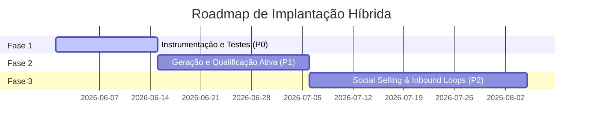

# Roadmap de Automações: Avalia Solar + Mobilidade Elétrica

Este documento descreve as fases de priorização, KPIs e metas para a implantação do motor de outbound e social selling híbrido (Energia Solar & Mobilidade Elétrica) utilizando o **Hermes Agent**.

---

## 📅 Resumo Visual do Roadmap

---

## 🛠️ Detalhamento das Fases

### Fase 1 — Instrumentação e Testes de Conexão (P0)
* **Objetivo**: Garantir que toda a infraestrutura técnica esteja conectada de forma estável, sem riscos de bloqueios, e validando rigidamente o filtro geográfico de cidades com ≥ 500k habitantes.
* **Automações Incluídas**:
  - `verify-credentials-avaliasolar.ts` (Validador de conectores).
  - `nutshell-lead-enrichment.ts` (Sincronização de campos customizados corporativos).
  - `abandoned-checkout-recovery.ts` (Recuperação de faturamento SaaS).
* **Pré-requisitos**:
  - Chaves de API configuradas no `.env` para Smartlead/Instantly, Nutshell, ReceitaWS e OpenAI.
  - Registro de domínios alternativos e aquecimento de caixas de e-mail (Warmup).
* **KPIs de Sucesso**:
  - 100% de consistência na filtragem de cidades (0 leads fora das 34 cidades permitidas importados ao CRM).
  - Redução de abandono de checkout no Stripe para menos de 30% em 14 dias de teste.

---

### Fase 2 — Geração e Qualificação Ativa (P1)
* **Objetivo**: Tracionar e escalar a captação de leads B2B frios nos dois segmentos alvo através do LinkedIn e de bases qualificadas de contatos.
* **Automações Incluídas**:
  - `prospeo-lead-export.ts` (Filtro por segmento e cidades).
  - `linkedin-regional-prospector.ts` (Abordagem por cargo e segmentação local).
  - `gmail-classifier.ts` (Classificação de respostas e agendamentos assistidos).
* **Pré-requisitos**:
  - Fase 1 validada e rodando há mais de 10 dias.
  - SDRs treinados no painel do Nutshell para lidar com tarefas de "Agendamento Pendente".
* **KPIs de Sucesso**:
  - 150 novos tomadores de decisão qualificados importados semanalmente.
  - Taxa de resposta de prospecção via e-mail/LinkedIn superior a 15%.

---

### Fase 3 — Social Selling & Inbound Loops (P2)
* **Objetivo**: Integrar os canais sociais e tráfego inbound do portal com o Hermes Agent para fechamentos instantâneos.
* **Automações Incluídas**:
  - `instagram-keyword-reply.ts` (Filtros de resposta automática para as palavras-chave "SOLAR" e "ELÉTRICO").
  - Criação de audiências de remarketing automatizadas via webhooks de navegação em `/pricing`.
* **Pré-requisitos**:
  - CRM limpo e rotinas de acompanhamento consolidadas no Slack.
* **KPIs de Sucesso**:
  - SLA de resposta em direct messages de Instagram abaixo de 2 minutos.
  - Aumento na geração de leads orgânicos vindos do Instagram em 45%.

---

## 🛡️ Diretrizes de Governança de Domínio
1. **Regra de E-mail Único**: Não disparar mais de 30 e-mails por inbox diariamente.
2. **Autenticação Rigorosa**: Validar registros de DNS (SPF, DKIM, DMARC e MX) semanalmente usando a ferramenta de auditoria automática.
3. **Revisão Humana de Copys**: Mensagens geradas por IA para leads Enterprise obrigatoriamente passam por aprovação de 1 clique no Slack antes do envio final.
