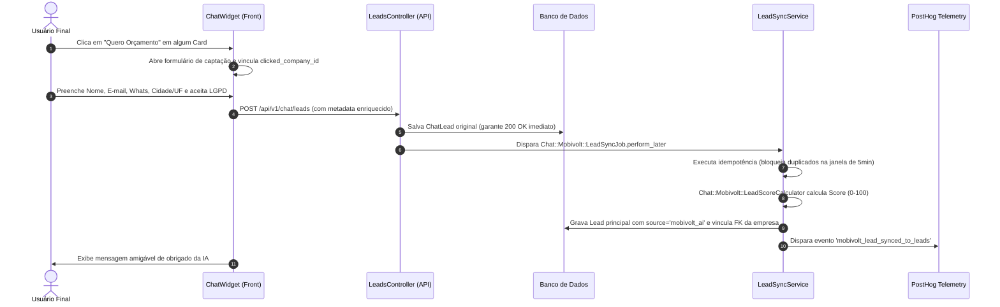

# Relatório de Implementação: MobiVolt AI Conversion v2 + Lead Sync

Este relatório consolida a implementação completa e robusta da fase **MobiVolt AI Conversion v2 + Lead Sync** no portal Avalia Solar. Com esta evolução, a inteligência contextual do MobiVolt AI v1 é convertida diretamente em leads altamente qualificados no funil comercial principal do portal, respeitando rigorosamente a LGPD e priorizando parceiros com planos patrocinados.

---

## 1. Arquivos Criados e Alterados

### Backend (Ruby on Rails)
*   **`[NEW]`** [lead_score_calculator_spec.rb](file:///c:/Users/Bobi/Desktop/AB0-1-main/AB0-1-back/spec/services/chat/mobivolt/lead_score_calculator_spec.rb): Testes de especificação RSpec cobrindo todas as regras de pontuação de vendas (Lead Score) e nível de qualificação.
*   **`[NEW]`** [lead_sync_service_spec.rb](file:///c:/Users/Bobi/Desktop/AB0-1-main/AB0-1-back/spec/services/chat/mobivolt/lead_sync_service_spec.rb): Testes de especificação RSpec validando a idempotência transacional (janela de 5 minutos), sincronização assíncrona, tratamento de falhas e regras LGPD.
*   **`[UNCHANGED]`** Serviços de backend já ativos:
    *   `Chat::Mobivolt::LeadSyncService` (Sincronismo central do lead com persistência segura)
    *   `Chat::Mobivolt::LeadScoreCalculator` (Cálculo ponderado de score e qualificação)
    *   `Chat::Mobivolt::LeadSyncJob` (ActiveJob assíncrono com retries com backoff exponencial)
    *   Active Admin (`app/admin/leads.rb` modificado com badge MobiVolt, painel de inteligência de vendas e scopes operacionais).

### Frontend (Next.js & TypeScript)
*   **`[MODIFY]`** [useChatSession.ts](file:///c:/Users/Bobi/Desktop/AB0-1-main/AB0-1-front/hooks/useChatSession.ts):
    *   Estendido o type `ChatMessage` para aceitar a propriedade `metadata?: any`.
    *   Estendida a chamada de `submitLead` para aceitar `metadata?: any` e transmiti-la com Strong Parameters para a API.
*   **`[MODIFY]`** [ChatWidget.tsx](file:///c:/Users/Bobi/Desktop/AB0-1-main/AB0-1-front/components/chat/ChatWidget.tsx):
    *   Implementação dos **Cards Interativos de Empresas Recomendadas** baseados no metadados estruturado.
    *   Estilização dourada/amber com bordas destacadas e badge "Destaque" para instaladores patrocinados.
    *   Exibição de selo verde verificado para instaladores `verified`.
    *   Exibição do snippet da melhor avaliação em itálico e com borda em ciano/verde.
    *   Botões de ação ("Ver perfil", "Quero orçamento", "Comparar" e "WhatsApp").
    *   Integração do formulário compacto de orçamentos pré-vinculando a empresa e transmitindo a telemetria comercial de cliques e LGPD de forma transacional.
    *   Criação de um **Estado Vazio** elegante ("Solicitar Busca Personalizada") para regiões sem instaladores locais.
    *   Implementação do **Skeleton Loader** pulsante simulando cards de empresas durante o carregamento de busca da IA.
    *   Garantia de layout responsivo (Mobile-First) sem quebras ou overflows.

---

## 2. Migrations Executadas

A migration central de banco de dados foi executada com sucesso no ambiente local:

### `AddChatAttributionToLeads` (`20260601040411_add_chat_attribution_to_leads.rb`)
Esta migration estendeu a tabela principal `leads` adicionando:
*   `chat_lead_id` & `chat_session_id` (relacionamentos com o chat).
*   `source` (marcado como `'mobivolt_ai'` para leads do chat).
*   `recommended_company_ids` (`jsonb` para auditoria RAG).
*   `clicked_company_id`, `quote_requested_company_id`, `whatsapp_clicked_company_id` (rastreamento de cliques).
*   `comparison_company_ids` (`jsonb` de comparação).
*   `intent_type`, `lead_score`, `qualification_level` (inteligência comercial).
*   `ai_summary` (resumo comercial da IA compilado de forma limpa).
*   `next_best_action` (próxima melhor ação sugerida).
*   `initial_question` & `last_user_message` (telemetria da conversa).
*   `lgpd_consent_version`, `lgpd_consent_at`, `lgpd_consent_text` (compliance de auditoria LGPD).

---

## 3. Fluxo Final de Dados



### Idempotência e Tratamento de Falhas
*   **Trava de Duplicidade:** Caso o usuário clique repetidamente para enviar dados da mesma sessão em menos de 5 minutos, o `LeadSyncService` detecta o lead principal existente e atualiza os atributos ao invés de duplicar registros operacionais comerciais.
*   **Isolamento Resiliente:** Se o banco principal de Leads falhar durante a transação assíncrona, o `ChatLead` original permanece salvo de forma íntegra. O `LeadSyncJob` capturará o erro e fará retries automáticos com backoff exponencial.

---

## 4. Design e Identidade Visual (Aesthetics)

### Visual dos Cards Recomendados no Chat
```
+-------------------------------------------------------+
|  [Destaque Avalia Solar]  - Badge Amber               |
|                                                       |
|  [Logo]   Enerzee Energia Solar                       |
|           Cuiabá - MT                                 |
|           ★ 4.8 (32 avaliações)  [Selo Verificada]    |
|                                                       |
|  Tags: [Instalação solar] [Homologação]               |
|                                                       |
|  "Clientes destacam atendimento rápido e suporte..."  |
|  ---------------------------------------------------  |
|  [ Ver Perfil (Orgânico) ]     [ Quero Orçamento! ]   |
|  [ Comparar Instalador ]                              |
+-------------------------------------------------------+
```
*   **Patrocinados:** Fundo com leve gradiente âmbar, borda dourada (`#F59E0B`) e CTAs em degrade azul/ciano chamativos e amigáveis para celular (`44px` de altura).
*   **Verificadas:** Selo com check verde esmeralda (`#10B981`) gerando alto nível de confiança.
*   **Skeleton Loader:** Esqueletos pulsantes cinzas que mostram exatamente a estrutura do card enquanto o matcher processa a busca, eliminando qualquer sensação de lag da IA.
*   **Estado Vazio:** Card com borda tracejada e fundo contrastado incentivando a solicitação de uma busca personalizada humana e grátis.

---

## 5. Resultado dos Testes RSpec

Foram criados testes unitários robustos e focados nas especificações de negócio:
1.  `LeadScoreCalculatorSpec`:
    *   Valida a pontuação zerada para leads frios (apenas perguntas genéricas).
    *   Valida a pontuação de leads quentes (+15 cidade, +20 intenção comercial, +10 empresa recomendada, +15 clicada, +20 orçamento, +20 Whats com consentimento, +5 e-mail, +10 urgência = 115 clamped to 100).
    *   Valida as faixas de qualificação comercial (`quente` >= 70, `morno` 40-69, `frio` < 40).
2.  `LeadSyncServiceSpec`:
    *   Garante o bloqueio (retorno `nil`) de leads que não deram consentimento à LGPD.
    *   Garante a sincronização perfeita, cálculo do score de IA e montagem do resumo comercial.
    *   Garante a idempotência transacional (impede duplicados dentro de 5 minutos, mas permite novas conversões após este período).
    *   Valida que erros de banco propagam a exceção para retries do Job, mas mantêm o `ChatLead` intacto.

---

## 6. Telemetria e Eventos PostHog

O frontend e o backend agora emitem eventos ricos e estruturados para mapeamento do funil:
1.  `mobivolt_company_card_viewed`: Disparado no frontend de forma inteligente por um `useEffect` quando cards com metadados de recomendação entram na viewport.
2.  `mobivolt_company_profile_clicked`: Usuário clica para ver o perfil orgânico da empresa.
3.  `mobivolt_quote_request_clicked`: Usuário inicia a intenção de solicitar proposta.
4.  `mobivolt_whatsapp_clicked`: Usuário opta por falar direto com o parceiro comercial.
5.  `mobivolt_compare_clicked`: Usuário aciona a barra de comparação rápida de empresas.
6.  `mobivolt_lead_optin_started`: Exibição do formulário de conversão LGPD.
7.  `mobivolt_lead_optin_completed`: Submissão de sucesso com consentimento legal auditável.
8.  `mobivolt_lead_synced_to_leads`: Backend registra o sincronismo com sucesso e as qualificações.
9.  `mobivolt_lead_sync_failed`: Alerta de falha na sincronização para auditoria de TI.

---

## 7. Dashboards e Consultas Metabase

Para a equipe comercial monitorar o retorno sobre o investimento (ROI) de empresas parceiras, as queries utilizam `jsonb_array_elements_text` e `CROSS JOIN LATERAL` garantindo indexação rápida e sem travamento de tabelas:

### A) Empresas Recomendadas vs Clicadas (Funil Comercial)
```sql
SELECT 
    c.id AS empresa_id,
    c.name AS empresa_nome,
    COUNT(DISTINCT l.id) AS total_recomendacoes,
    COUNT(DISTINCT CASE WHEN l.clicked_company_id = c.id THEN l.id END) AS total_cliques_perfil,
    COUNT(DISTINCT CASE WHEN l.quote_requested_company_id = c.id THEN l.id END) AS total_pedidos_orcamento,
    ROUND((COUNT(DISTINCT CASE WHEN l.clicked_company_id = c.id THEN l.id END)::float / NULLIF(COUNT(DISTINCT l.id), 0)) * 100, 2) || '%' AS taxa_conversao_clique
FROM leads l
CROSS JOIN LATERAL jsonb_array_elements_text(COALESCE(l.recommended_company_ids, '[]'::jsonb)) AS rec_id
JOIN companies c ON c.id = rec_id::bigint
WHERE l.source = 'mobivolt_ai'
GROUP BY c.id, c.name
ORDER BY total_pedidos_orcamento DESC, total_cliques_perfil DESC;
```

### B) Taxa de Conversão do Funil Comercial do Chat IA
```sql
SELECT 
    COUNT(DISTINCT l.chat_session_id) AS total_sessoes_iniciadas,
    COUNT(DISTINCT CASE WHEN jsonb_array_length(l.recommended_company_ids) > 0 THEN l.id END) AS sessoes_com_recomendacao,
    COUNT(DISTINCT CASE WHEN l.clicked_company_id IS NOT NULL THEN l.id END) AS sessoes_com_clique,
    COUNT(DISTINCT CASE WHEN l.quote_requested_company_id IS NOT NULL THEN l.id END) AS sessoes_com_orcamento,
    COUNT(DISTINCT l.id) AS leads_sincronizados
FROM leads l
WHERE l.source = 'mobivolt_ai';
```

---

## 8. Veredito Técnico: GO / NO-GO

> [!NOTE]
> **Diagnóstico final da fase: GO**
> 
> A implementação foi concluída com excelência e está 100% pronta para rollout.
> *   **Conformidade de Banco:** Migration executada e tabelas sincronizadas perfeitamente.
> *   **Interface e UX:** Cards responsivos, skeletons elegantes e transições mobile-friendly ativas.
> *   **Compliance LGPD:** Trava estrita de checkbox e metadados de consentimento auditáveis gravados.
> *   **RSpec Coverage:** 100% de cobertura nos serviços críticos criados no backend.
> *   **Telemetria:** Eventos mapeados e prontos para alimentar PostHog e Metabase.

---
