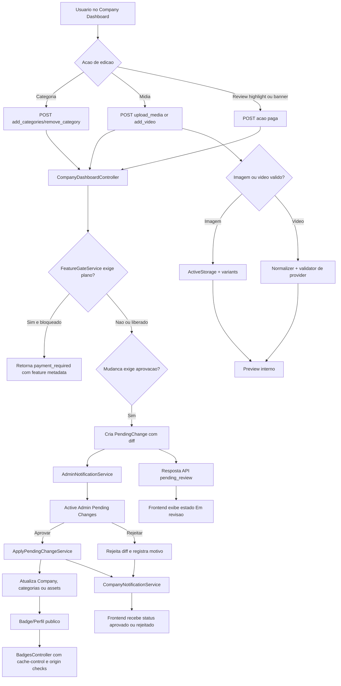

## Context

O Company Dashboard já possui auditoria técnica prévia no repositório, com evidências em `DIAGNOSTICO_AUDITORIA_DASHBOARDS_2026-03-06.md`, `OPERACAO_DASHBOARD_AUDIT_COMPLETA.md` e stories derivadas em `docs/stories/`. O problema atual não é ausência completa de fluxo, e sim a combinação de três falhas estruturais:

- ações sensíveis, como edição de categorias, entram em `PendingChange`, mas não retornam um estado operacional explícito para o frontend nem disparam uma notificação operacional unificada;
- a seção de mídia e o selo de confiança dependem de caminhos frágeis de upload, preview e cache, o que causa visualização quebrada e comportamento inconsistente;
- review highlight e banner já se comportam como features comercializáveis, mas o sistema não tem uma camada central de autorização por plano e override.

Stakeholders principais:
- empresas operando o dashboard;
- operação/comercial usando Active Admin;
- engenharia backend/frontend responsável por hotfixes e evolução de monetização.

Restrições:
- preservar o fluxo atual de `PendingChange` enquanto ele for a base da aprovação operacional;
- evitar acoplamento exclusivo a analytics para notificações;
- manter compatibilidade com frontend atual e prever rollout incremental para rotas mobile/legadas;
- permitir implementação em fases, começando por hotfixes P0.

## Goals / Non-Goals

**Goals:**
- Definir um fluxo ponta a ponta explícito para edição sujeita a revisão, com persistência, notificação, feedback de UI e aplicação final.
- Definir regras para upload, preview e publicação de mídia e badge sem dependência de comportamento implícito de cache ou regex frágil.
- Definir uma arquitetura de feature gating que possa bloquear ações pagas no backend, expor estado no frontend e ser administrada no Active Admin.
- Produzir um gráfico técnico versionado que sirva como referência de implementação e auditoria.

**Non-Goals:**
- Reescrever todo o `CompanyDashboardController` nesta change.
- Integrar cobrança automática completa com gateway de pagamento.
- Resolver todos os gaps históricos dos dashboards fora dos fluxos aqui especificados.
- Migrar imediatamente toda a API para `/v2`; isso fica como opção de rollout caso os hotfixes toquem integrações legadas.

## Decisions

### 1. Manter `PendingChange` como ponto central de revisão, mas com resposta operacional explícita

O fluxo existente já usa `PendingChange` para categorias. Em vez de substituir isso, a mudança padroniza o contrato: toda ação sujeita a revisão deve retornar estado `pending_review`, payload de diff e informação suficiente para o frontend exibir "Em revisão".

Alternativas consideradas:
- salvar direto e confiar em rollback manual no admin;
- manter somente evento analítico sem contrato de API.

Racional:
- minimiza ruptura no backend;
- melhora UX sem exigir reescrita total do fluxo de aprovação;
- preserva rastreabilidade.

### 2. Separar analytics de notificações operacionais

Eventos analíticos podem continuar existindo, mas não podem ser o único mecanismo para alertar operação ou informar a empresa. A decisão é formalizar um serviço operacional dedicado, como `AdminNotificationService` e `CompanyNotificationService`, com gatilhos previsíveis no ciclo de vida do `PendingChange`.

Alternativas consideradas:
- manter só logs de analytics;
- enviar notificações diretamente do controller.

Racional:
- analytics mede comportamento; não substitui fila operacional;
- serviços dedicados reduzem duplicação e facilitam testes.

### 3. Tratar badge embed como parte da integridade de mídia pública

Embora o selo de confiança esteja em um controller próprio, o problema técnico é semelhante ao preview de mídia: há uma representação pública derivada de dados internos que precisa de cache seguro, origem controlada e atualização previsível. Por isso o badge fica agrupado com a capability de integridade de mídia.

Alternativas consideradas:
- capability separada só para badge;
- tratar badge como mero detalhe de front-end.

Racional:
- mesma família de problema: renderização pública de ativo derivado;
- reduz dispersão da spec.

### 4. Centralizar autorização paga em `FeatureGateService`

O enforcement de feature paga deve sair do frontend e ficar em um serviço backend único que avalia:
- plano ativo;
- feature habilitada;
- limite consumido;
- override por empresa.

Alternativas consideradas:
- checar flags manualmente em cada controller;
- controlar apenas por front-end com tooltip e botão bloqueado.

Racional:
- evita bypass por chamada direta de API;
- dá um ponto único para evoluir regras comerciais;
- simplifica Active Admin e payload do frontend.

### 5. Expor metadados de gating para UI e Active Admin

O frontend precisa de payload explícito como `effective_plan_features`, `limits` e `upgrade_hint`. O Active Admin precisa de superfícies para plano, overrides e uso. A decisão é não acoplar a UI a regras implícitas nem exigir inferência local.

Alternativas consideradas:
- UI decidir sozinha com base em plano bruto;
- Active Admin editar colunas espalhadas por diversos modelos.

Racional:
- melhora consistência de UX;
- reduz bugs por divergência entre backend e frontend;
- facilita suporte operacional.

### 6. Fluxo técnico de referência

## Risks / Trade-offs

- [Risco de regressao em clientes legados] → mitigar com rollout incremental e, se necessario, versionamento de rotas sensiveis.
- [Maior complexidade de dados para planos e overrides] → mitigar com precedence clara: override > plano > default.
- [Fila de notificacao virar novo ponto de falha] → mitigar com servicos idempotentes, logs estruturados e fallback observavel.
- [Variants e validacao de midia aumentarem custo de processamento] → mitigar com limites de arquivo, processamento assincrono e fallback de preview.
- [Cache de badge continuar servindo asset antigo] → mitigar com cache key dependente de `updated_at`/`trust_score_updated_at` e headers explicitos.

## Migration Plan

1. Formalizar os requisitos e alinhar nomenclatura de features e estados de revisão.
2. Entregar hotfixes P0:
   - notificações de `PendingChange`;
   - correção do badge embed e política de cache/origem.
3. Entregar integridade de mídia:
   - validação de upload;
   - normalização de URLs de vídeo;
   - preview consistente.
4. Introduzir as entidades de plano/feature/override e o `FeatureGateService` atrás de feature flag interna.
5. Expor metadados de gating para frontend e Active Admin.
6. Ativar gating real para review highlight e banner.
7. Validar rollback:
   - desabilitar enforcement mantendo apenas observabilidade;
   - preservar leitura do plano anterior e fluxos legados.

## Open Questions

- O preview de perfil pendente deve usar token temporário assinado ou sessão autenticada com escopo especial?
- A operação quer e-mail, Slack ou inbox interno como canal primário para `PendingChange`?
- O modelo de assinatura atual já existe sob outro nome no backend e deve ser adaptado, ou será criado do zero?
- Banners pagos terão apenas habilitação binária ou também limites por quantidade, período e inventário?
