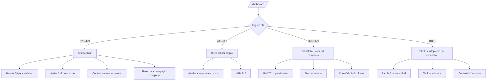
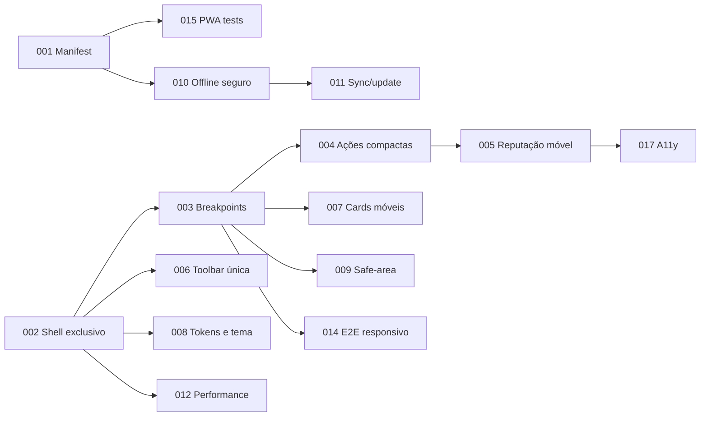

/* Hallmark · pre-emit critique: P5 H5 E5 S5 R4 V4 */

# Diagnóstico + PDR A++++ — Dashboard PWA em celulares e tablets

**Data:** 6 de agosto de 2026  
**Escopo:** dashboard empresarial Web/PWA (`/dashboard`)  
**Referência:** imagem fornecida pelo produto, com rail lateral, cabeçalho compacto, ações prioritárias e reputação  
**Método:** auditoria estática da implementação Next.js, PWA, responsividade, acessibilidade, desempenho e testes. Nenhum arquivo de produção foi alterado.

## 1. Veredito executivo

O dashboard já possui partes importantes da referência: menu operacional, seletor de empresa, busca de comandos, métricas, reputação, navegação por abas e drawer móvel. Porém, ele ainda não se comporta como um produto PWA coeso em celulares e tablets.

**Nota atual estimada: 48/100 — nível C.**  
**Potencial após P0/P1: 85–90/100.**

Os bloqueios principais são estruturais:

1. `layout.tsx` aponta para `/manifest.webmanifest`, mas esse arquivo não existe. A experiência não pode ser considerada PWA instalável de produção.
2. `/dashboard` recebe Navbar, padding e bottom navigation globais, além do menu próprio do dashboard. Isso cria duas arquiteturas de navegação concorrentes.
3. O service worker não oferece suporte offline ao dashboard e fica desabilitado por padrão.
4. Em telas abaixo de `lg` (1024 px), o rail desaparece completamente. Isso impede que tablets de 768–1023 px se aproximem da referência.
5. A área “Ações prioritárias” é alta e repetitiva: até cinco cards de 140 px precedem o conteúdo real, duplicando métricas do overview.
6. Tabelas e gráficos foram comprimidos ou envolvidos em scroll horizontal, mas não redesenhados para interação móvel.

### Decisão recomendada

Não tentar copiar os pixels da imagem. Adotar seu DNA funcional:

- **celular:** cabeçalho interno + ações compactas + navegação em sheet/bottom dock contextual;
- **tablet:** rail compacto persistente + conteúdo em uma coluna larga;
- **desktop:** rail expansível + conteúdo em duas colunas;
- **mesma hierarquia e mesmos dados** em todos os tamanhos.

## 2. DNA da referência

A imagem propõe uma interface operacional, não uma landing page:

- rail vertical escuro com ícone, rótulo, estado ativo e recolhimento;
- cabeçalho claro com marca, empresa ativa, busca e avatar;
- painel escuro “Ações prioritárias” acima da dobra;
- busca global dentro do contexto do dashboard;
- quatro indicadores compactos em grade 2×2;
- ação de confiança em linha inteira;
- bloco de reputação imediatamente abaixo;
- CTA principal visível;
- lista de destinos analíticos com linhas simples, não cards pesados;
- hierarquia baseada em contraste, não em sombras ou gradientes decorativos.

### O que deve ser preservado

- marca Avalia Solar e tokens atuais;
- Lucide como biblioteca única de ícones;
- navegação e permissões provenientes de `config/navigation.ts`;
- URLs com `?tab=` para deep-link e histórico;
- drawer acessível em celular;
- carregamento dinâmico dos módulos pesados;
- viewport com `viewport-fit=cover` e variáveis de safe-area.

### O que não deve ser copiado literalmente

- rail lateral largo em celulares de 320–414 px;
- densidade extrema ou texto menor que 12 px para informação essencial;
- valores negativos sem explicação (“-1 avaliações”);
- dependência de hover;
- moldura/chrome do sistema operacional exibida na captura.

## 3. Estado atual por dimensão

| Dimensão | Nota | Estado |
|---|---:|---|
| Instalabilidade PWA | 2/10 | Manifest declarado, porém ausente |
| Arquitetura responsiva | 5/10 | Mobile e desktop existem; tablet não possui modo próprio |
| Hierarquia visual | 6/10 | Bloco prioritário existe, mas compete com toolbar e overview |
| Navegação | 4/10 | Chrome global e dashboard concorrem |
| Safe-area | 5/10 | Tokens globais existem; dashboard não os aplica sistematicamente |
| Touch e acessibilidade | 6/10 | Base global de 48 px ajuda; estados e semântica ainda incompletos |
| Performance | 6/10 | Code splitting existe; dashboard segue client-heavy e gráficos custosos |
| Offline/resiliência | 3/10 | Infraestrutura existe, mas não cobre rotas privadas do dashboard |
| Consistência visual | 5/10 | Tokens convivem com hex, gradientes e dark mode parcial |
| Testes | 2/10 | E2E atual não autentica nem testa breakpoints reais |

## 4. Achados Hallmark priorizados

### 4.1 Críticos

#### C1 — PWA declarada sem manifest entregue

- **Tell:** contrato visual/técnico quebrado.
- **Onde:** `app/layout.tsx:33`; ausência de `public/manifest.webmanifest` ou `app/manifest.ts`.
- **Impacto:** instalação, ícones, nome, `start_url`, `display`, shortcuts e auditoria Lighthouse falham.
- **Correção:** criar manifest versionado com `id`, `name`, `short_name`, `start_url`, `scope`, `display: standalone`, cores e ícones maskable 192/512.

#### C2 — Duas arquiteturas de navegação na mesma tela

- **Tell:** card/chrome layering sem propriedade estrutural.
- **Onde:** `app/layout.tsx:173-176`, `components/Navbar.tsx:102-105`, `components/navigation/MobileBottomNav.tsx:17-32`, `EnterpriseDashboard.tsx:413-439`.
- **Impacto:** Navbar pública, bottom nav pública, toolbar e sidebar empresarial podem aparecer juntas.
- **Correção:** criar layout interno do dashboard e suprimir Navbar, footer, bottom nav e padding público nas rotas `/dashboard/**`.

#### C3 — Tablet tratado como celular grande

- **Tell:** breakpoint cliff.
- **Onde:** `EnterpriseSidebar.tsx`, rail com `hidden ... lg:block`; `EnterpriseDashboard.tsx:426` aplica offset somente em `lg`.
- **Impacto:** entre 768 e 1023 px o usuário perde o rail visto na referência e depende de sheet.
- **Correção:** rail compacto de 72–80 px a partir de 768 px; rail expandido apenas em 1180/1280 px.

#### C4 — Dashboard fora do contrato offline

- **Tell:** PWA nominal, não funcional no job principal.
- **Onde:** `public/sw.js:10-11`; `lib/offline/config.ts:11-17`; feature flag desabilitada por padrão em `config.ts:75-83`.
- **Impacto:** abrir o dashboard instalado sem rede leva a erro/fallback público; estado crítico não é preservado.
- **Correção:** adicionar uma estratégia privada segura: app shell e último snapshot não sensível; nunca cachear respostas autenticadas indiscriminadamente.

#### C5 — Estrutura móvel duplica informação antes da dobra

- **Tell:** card-in-card e icon-tile repetition.
- **Onde:** `MobileDashboardQuickAccess.tsx:84-170` seguido por toolbar e `OverviewTab.tsx:345-380`.
- **Impacto:** ações de 140 px × até cinco itens repetem visitas, leads, avaliações e conversão antes dos KPIs reais.
- **Correção:** quatro KPIs compactos 2×2 + uma linha de confiança; ações secundárias no sheet.

### 4.2 Maiores

#### M1 — Ordem visual diferente da prioridade operacional

- **Tell:** hierarchy inversion.
- **Onde:** quick access aparece antes de `DashboardToolbar` em `EnterpriseDashboard.tsx:428-444`.
- **Correção:** cabeçalho interno primeiro; ações prioritárias depois; conteúdo ativo em seguida.

#### M2 — Token improvisation

- **Tell:** mid-render token improvisation.
- **Onde:** `MobileDashboardQuickAccess.tsx:86` usa `#002B4D`; `OverviewTab` e `ReviewsManagement` possuem vários hex inline em charts.
- **Correção:** migrar todas as cores do dashboard para tokens semânticos (`dashboard-ink`, `dashboard-panel`, `metric-positive`, `chart-*`).

#### M3 — Dark mode parcial e contraditório

- **Tell:** theme drift.
- **Onde:** `EnterpriseDashboard.tsx` inicia modo escuro, mas raiz usa `bg-slate-50`; componentes misturam `dark:*` com superfícies fixas brancas.
- **Correção:** uma fonte de verdade para tema; tokens controlam raiz, rail, toolbar, charts e overlays.

#### M4 — Tabela desktop dentro de scroll móvel

- **Tell:** desktop table shrink.
- **Onde:** `OverviewTab.tsx:426-433`, tabela com `min-w-[760px]` e `overflow-x-auto`.
- **Correção:** renderizar cards operacionais no mobile e tabela somente a partir do tablet largo/desktop.

#### M5 — Ações prioritárias excessivamente altas

- **Tell:** icon-tile feature card.
- **Onde:** `MobileDashboardQuickAccess.tsx:114-170`, `min-h-[140px]`.
- **Correção:** altura 88–104 px no celular; ícone inline, número dominante e rótulo curto.

#### M6 — Linguagem interna e inconsistente

- **Tell:** generic/product-internal copy.
- **Onde:** “Mobile access” e badge “Active” em `MobileDashboardQuickAccess.tsx:89-90,145-148`.
- **Correção:** remover eyebrow decorativo; usar português funcional e `aria-current` para estado ativo.

#### M7 — Busca duplicada e sem prioridade clara

- **Tell:** duplicate command surface.
- **Onde:** `MobileDashboardQuickAccess`, `DashboardToolbar` e Navbar pública possuem busca.
- **Correção:** uma busca de dashboard por viewport; busca global pública não aparece no shell empresarial.

#### M8 — Métricas sem disciplina tabular consistente

- **Tell:** tabular data without tabular-nums.
- **Onde:** quick access e alguns cards; partes de reputação usam `tabular-nums`, outras não.
- **Correção:** aplicar token/utilitário numérico a todos os KPIs, percentuais, NPS e datas.

#### M9 — Service worker desatualizado e experiência offline fora do design system

- **Tell:** design-system drift.
- **Onde:** `public/sw.js:1,41-149`; versão antiga, HTML/CSS inline, Inter e cores fora dos tokens.
- **Correção:** fallback versionado gerado a partir do shell real e sem linguagem de sprint.

#### M10 — E2E atual não representa o fluxo

- **Tell:** false confidence.
- **Onde:** `tests/e2e/dashboard.spec.ts` abre `/dashboard` sem autenticação e procura “Atividades Recentes”, texto que não prova o dashboard empresarial atual.
- **Correção:** autenticação por fixture/API, empresa ativa, screenshots e assertions por viewport.

### 4.3 Menores

- emoji no título “Olá” mistura voz de ícones do sistema;
- animação de entrada do rail não agrega informação;
- `transition-all` aparece em controles, ampliando custo e inconsistência;
- `getDescription` é calculável, mas não aparece nos cards rápidos;
- toolbar usa logo textual por iniciais, enquanto referência usa identidade/empresa;
- ausência de indicador visível de offline, sincronizando e atualização disponível;
- busca por comandos exibe atalho `⌘K`, pouco relevante no celular;
- alguns botões dependem de `title`, insuficiente como ajuda acessível no touch.

**Contagem Hallmark:** 5 críticos · 10 maiores · 8 menores.

## 5. Arquitetura responsiva alvo

### 5.1 Matriz de viewport

| Largura | Navegação | Ações prioritárias | Conteúdo | Padding |
|---:|---|---|---|---:|
| 320 | botão Menu + sheet | 2×2, 88–96 px | 1 coluna | 12 px + safe-area |
| 375 | botão Menu + sheet | 2×2, 96 px | 1 coluna | 16 px + safe-area |
| 414 | botão Menu + sheet | 2×2 ou faixa horizontal sem scroll-jump | 1 coluna | 16 px |
| 768 | rail compacto 72–80 px | 4 colunas compactas | 1–2 colunas | 20 px |
| 1024 | rail compacto/expandível | 4 colunas | 2 colunas | 24 px |
| 1280+ | rail 240 px | 4 colunas | grid operacional | 24–32 px |

### 5.2 Hierarquia móvel desejada

1. safe-area superior;
2. cabeçalho: marca compacta, empresa ativa, busca/alertas/avatar;
3. ações prioritárias: visitas, avaliações, leads, conversão;
4. linha de confiança/verificação;
5. reputação resumida;
6. CTA “Coletar avaliações”;
7. atalhos analíticos em lista/accordion;
8. conteúdo detalhado sob demanda;
9. navegação contextual respeitando safe-area inferior.

## 6. PDR

### 6.1 Problema

Usuários empresariais acessam um dashboard rico, porém com arquitetura desktop-first, chrome duplicado e suporte PWA incompleto. Em celular, a informação prioritária ocupa espaço excessivo; em tablet, o layout perde o rail e se comporta como mobile ampliado.

### 6.2 Objetivo

Entregar uma experiência empresarial instalável, responsiva e consistente, próxima ao DNA da referência, sem criar uma segunda implementação do dashboard.

### 6.3 Resultados mensuráveis

- manifest válido e PWA instalável em Android/Chrome e iOS/Safari;
- zero scroll horizontal em 320, 375, 414 e 768 px;
- conteúdo prioritário e CTA principal visíveis até 900 px de altura;
- apenas uma arquitetura de navegação por viewport;
- targets interativos ≥44×44 px, preferencialmente 48×48;
- Lighthouse mobile: performance ≥0,80; acessibilidade, best practices e PWA ≥0,90;
- CLS ≤0,10; INP ≤200 ms; LCP ≤2,5 s no p75;
- navegação de tabs preserva URL, back/forward e foco;
- snapshot seguro do dashboard exibe estado útil offline sem vazar dados entre contas.

### 6.4 Fora do escopo

- reescrever regras de negócio ou endpoints;
- copiar exatamente a interface da captura;
- substituir Next.js por Expo;
- disponibilizar mutações sensíveis offline sem política de conflito;
- redesenhar todos os módulos internos na primeira entrega.

### 6.5 Requisitos funcionais

- `PWA-RF-001`: manifest completo, ícones e modo standalone;
- `PWA-RF-002`: shell exclusivo para `/dashboard/**`;
- `PWA-RF-003`: rail compacto persistente em tablet;
- `PWA-RF-004`: sheet acessível no celular;
- `PWA-RF-005`: quatro KPIs compactos e linha de confiança;
- `PWA-RF-006`: reputação progressivamente revelada;
- `PWA-RF-007`: tema único e persistente sem flash;
- `PWA-RF-008`: indicador offline/sync/update;
- `PWA-RF-009`: cards mobile substituem tabelas largas;
- `PWA-RF-010`: rotas/tabs restauráveis por URL e histórico;
- `PWA-RF-011`: safe-area em todos os elementos fixos;
- `PWA-RF-012`: loading, empty, error, locked e offline equivalentes em todos os breakpoints.

## 7. Tasklist A++++

### Épico P0 — Corrigir o contrato PWA e o shell

#### PWA-TASK-001 — Criar manifest instalável

- **Prioridade:** P0 · **Estimativa:** 3 pontos
- Criar `app/manifest.ts` ou `public/manifest.webmanifest`.
- Incluir ícones 192, 512 e maskable; `id`, `scope`, `start_url`, `display` e shortcuts.
- Validar MIME, HTTP 200 e Lighthouse.
- **Aceite:** instalação disponível; abertura standalone inicia na rota correta.

#### PWA-TASK-002 — Criar layout exclusivo do dashboard

- **Prioridade:** P0 · **Estimativa:** 8 pontos
- Isolar Navbar, footer, bottom nav e padding público.
- Usar route group/layout sem duplicar providers globais.
- **Aceite:** exatamente um header e uma navegação principal em cada viewport.

#### PWA-TASK-003 — Implantar matriz celular/tablet/desktop

- **Prioridade:** P0 · **Estimativa:** 8 pontos
- Mobile até 767; rail compacto 768–1179; rail expandido em 1180+.
- Persistir colapso somente onde fizer sentido.
- **Aceite:** sem breakpoint cliff e sem scroll horizontal nas quatro larguras obrigatórias.

#### PWA-TASK-004 — Compactar ações prioritárias

- **Prioridade:** P0 · **Estimativa:** 5 pontos
- Quatro KPIs 2×2, números tabulares e confiança em linha inteira.
- Remover “Mobile access”, “Active” e cards redundantes.
- **Aceite:** bloco ≤360 px em 375 px; CTA/reputação aparece na primeira rolagem curta.

### Épico P1 — Reputação e navegação operacional

#### PWA-TASK-005 — Criar resumo móvel de reputação

- **Prioridade:** P1 · **Estimativa:** 8 pontos
- Rating, avaliações, NPS e resposta em faixa compacta.
- CTA primário e linhas expansíveis para evolução, distribuição, recebidas e sentimento.
- **Aceite:** mesma informação do desktop, com progressive disclosure.

#### PWA-TASK-006 — Consolidar toolbar e busca

- **Prioridade:** P1 · **Estimativa:** 5 pontos
- Cabeçalho interno antes do conteúdo; empresa ativa, busca, alertas e conta.
- Um único CommandMenu por viewport.
- **Aceite:** busca abre por toque, teclado e leitor de tela; foco retorna ao gatilho.

#### PWA-TASK-007 — Converter tabelas em cards móveis

- **Prioridade:** P1 · **Estimativa:** 8 pontos
- Oportunidades e avaliações usam cards com ações essenciais.
- Tabela permanece no desktop.
- **Aceite:** nenhuma tabela exige pan horizontal em celular.

#### PWA-TASK-008 — Unificar tokens e tema

- **Prioridade:** P1 · **Estimativa:** 5 pontos
- Remover hex/gradientes improvisados e mapear charts.
- Resolver defaultTheme versus dashboard-theme.
- **Aceite:** zero flash de tema e contraste AA nos dois modos.

#### PWA-TASK-009 — Safe-area e viewport dinâmica

- **Prioridade:** P1 · **Estimativa:** 3 pontos
- Aplicar `env(safe-area-inset-*)` a header, rail, sheet e dock.
- Usar `dvh`, nunca `100vh`, em shells móveis.
- **Aceite:** nenhum controle sob notch, Dynamic Island ou barra gestual.

### Épico P2 — Resiliência e performance

#### PWA-TASK-010 — Offline seguro para dashboard

- **Prioridade:** P1 · **Estimativa:** 8 pontos
- Cachear somente app shell e snapshot mínimo por usuário/tenant.
- Limpar cache em logout/troca de empresa.
- Não persistir leads, mensagens ou PII sem criptografia/política explícita.
- **Aceite:** offline mostra última atualização e não mistura contas.

#### PWA-TASK-011 — Estados de sync e atualização

- **Prioridade:** P2 · **Estimativa:** 3 pontos
- Banner discreto para offline, sincronizando, falha e nova versão.
- **Aceite:** usuário entende o estado e consegue tentar novamente.

#### PWA-TASK-012 — Orçamento de JavaScript por aba

- **Prioridade:** P1 · **Estimativa:** 5 pontos
- Medir chunks, Recharts e imports da aba inicial.
- Carregar charts abaixo da dobra por interação/intersection.
- **Aceite:** bundle inicial do dashboard dentro do orçamento definido pelo time; INP ≤200 ms.

#### PWA-TASK-013 — Skeletons com geometria real

- **Prioridade:** P2 · **Estimativa:** 3 pontos
- Skeleton específico para 320/375/768, sem grid desktop artificial.
- **Aceite:** CLS ≤0,10.

### Épico P3 — Qualidade e observabilidade

#### PWA-TASK-014 — Suíte Playwright responsiva autenticada

- **Prioridade:** P0 · **Estimativa:** 8 pontos
- Fixture de company owner aprovado e empresa ativa.
- Projetos Chromium mobile/tablet/desktop.
- Screenshots, axe, navegação, foco, back/forward e overflow.

#### PWA-TASK-015 — Testes PWA e offline

- **Prioridade:** P0 · **Estimativa:** 5 pontos
- Manifest, SW, standalone, update, offline e logout/cache purge.
- **Aceite:** testes determinísticos em CI HTTPS/local secure context.

#### PWA-TASK-016 — Web Vitals segmentados

- **Prioridade:** P2 · **Estimativa:** 3 pontos
- PostHog/Sentry por viewport, standalone/browser, tab e plano.
- **Aceite:** dashboard próprio no painel de LCP, CLS, INP e erros.

#### PWA-TASK-017 — Auditoria visual e acessível

- **Prioridade:** P1 · **Estimativa:** 5 pontos
- axe, contraste, zoom 200%, fonte ampliada, teclado e TalkBack/VoiceOver.
- **Aceite:** WCAG 2.2 AA sem violações críticas/sérias.

## 8. Suíte de testes proposta

### 8.1 Playwright

| ID | Cenário | Viewports |
|---|---|---|
| PWA-E2E-001 | login company → dashboard → empresa correta | todas |
| PWA-E2E-002 | apenas um chrome de navegação | todas |
| PWA-E2E-003 | zero overflow horizontal | 320/375/414/768 |
| PWA-E2E-004 | sheet abre, prende foco, fecha por Escape e restaura foco | celular |
| PWA-E2E-005 | rail compacto seleciona aba e expõe tooltip acessível | tablet |
| PWA-E2E-006 | URL `?tab=reviews` restaura Reputação | todas |
| PWA-E2E-007 | back/forward restaura aba sem request duplicado | todas |
| PWA-E2E-008 | KPIs não quebram com valores grandes/negativos/nulos | todas |
| PWA-E2E-009 | tabela vira cards e mantém ações | celular |
| PWA-E2E-010 | safe-area não encobre header/dock | dispositivos com notch |
| PWA-E2E-011 | tema não pisca e persiste | todas |
| PWA-E2E-012 | plano bloqueado mantém explicação e upgrade | todas |

### 8.2 PWA/offline

| ID | Cenário | Resultado |
|---|---|---|
| PWA-001 | GET manifest | 200, MIME correto, campos e ícones válidos |
| PWA-002 | registrar SW | ativo e controlando a página |
| PWA-003 | abrir instalado | `display-mode: standalone` e start URL correta |
| PWA-004 | offline após primeira visita | shell + snapshot permitido |
| PWA-005 | logout | caches/IndexedDB privados removidos |
| PWA-006 | trocar empresa | snapshot anterior não reaparece |
| PWA-007 | nova versão | update seguro sem loop/reload destrutivo |
| PWA-008 | mutação offline não permitida | bloqueio claro, sem perda silenciosa |

### 8.3 Acessibilidade

- landmarks únicos (`header`, `nav`, `main`);
- `aria-current` no item ativo;
- nomes acessíveis em ícones e botões;
- foco visível ≥3:1;
- target mínimo 44×44;
- ordem de foco igual à ordem visual;
- mensagens offline/loading via região `status`;
- gráficos com resumo textual/tabela alternativa;
- zoom 200% sem perda de conteúdo;
- labels clicáveis em uma linha.

## 9. Ordem de implementação

### Sprints recomendadas

1. **Sprint 1 — fundação:** 001, 002, 003, 014 e 015.
2. **Sprint 2 — paridade visual:** 004, 005, 006, 008 e 009.
3. **Sprint 3 — conteúdo móvel:** 007, 012, 013 e 017.
4. **Sprint 4 — PWA resiliente:** 010, 011 e 016.

## 10. Definition of Done

- manifest e ícones válidos;
- dashboard abre standalone e não exibe chrome público;
- layouts aprovados em 320, 375, 414, 768, 1024 e 1280 px;
- sem overflow horizontal;
- safe-area validada em iOS e Android;
- navegação, URL, histórico e foco testados;
- offline não expõe nem mistura dados de tenants;
- todos os estados cobertos: loading, vazio, erro, bloqueado, offline e stale;
- Lighthouse e Web Vitals dentro das metas;
- Playwright, axe, typecheck e build verdes;
- screenshots de baseline aprovadas pelo produto.

## 11. Gate de aceite A++++

O projeto estará próximo da referência quando:

1. a arquitetura visual for reconhecível como dashboard empresarial em todos os tamanhos;
2. celular não for apenas desktop empilhado;
3. tablet possuir rail próprio e densidade intermediária;
4. KPIs e reputação dominarem a primeira dobra;
5. navegação pública não competir com navegação empresarial;
6. instalação, offline e atualização forem funções reais, não apenas metadados;
7. acessibilidade e desempenho forem gates automatizados, não inspeções ocasionais.

**Recomendação final:** iniciar por manifest + shell exclusivo + breakpoint tablet. Esses três itens removem os maiores riscos e criam a base para aproximar visualmente o dashboard da referência sem duplicar componentes ou introduzir um “dashboard mobile” separado.
