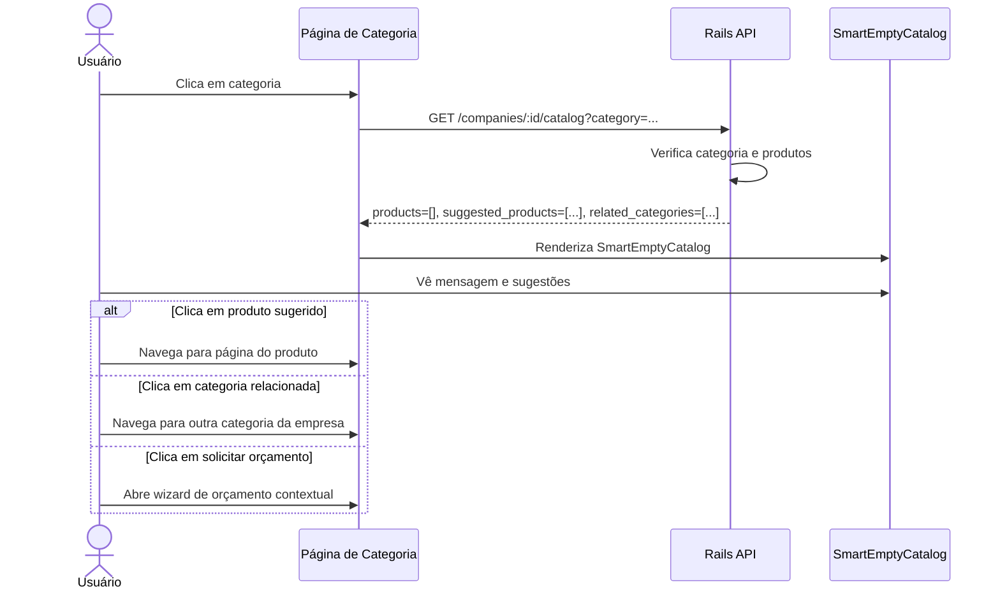
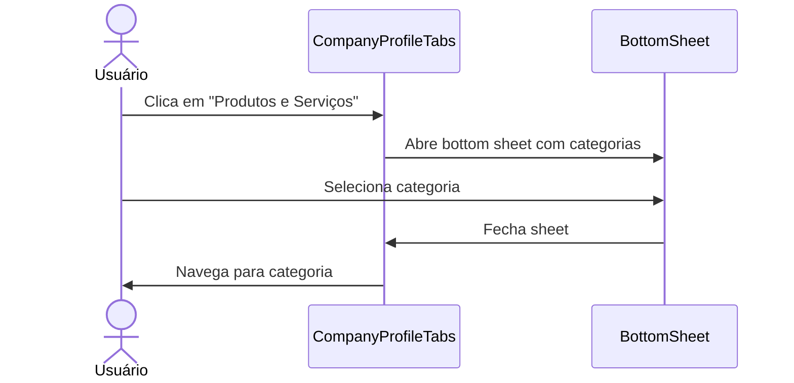
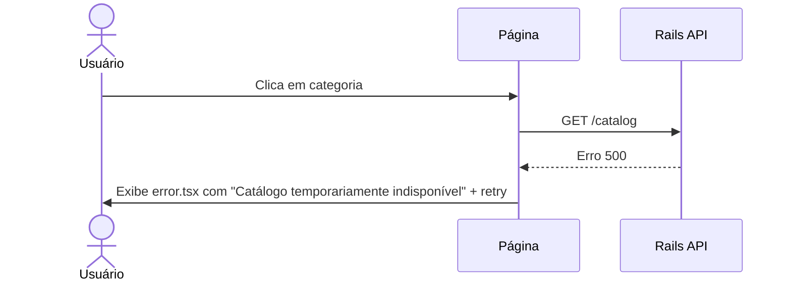

# PDR — Comportamento Global da Página de Categoria da Empresa (Nível A+++ Marketplace)

**Status:** Rascunho para revisão de produto  
**Versão:** 1.0  
**Data:** 5 de agosto de 2026  
**Autor:** Agente de Engenharia — Avalia Solar  
**Escopo:** Aplicação global em todas as páginas `/companies/:slug/categories/:categorySlug` (frontend Next.js) e endpoint correspondente `/api/v1/companies/:id/catalog` (backend Rails).  
**Público-alvo:** PMs, designers, frontend engineers, backend engineers, QA.

---

## 1. Visão geral

### 1.1. Problema

Atualmente, quando um usuário navega de uma empresa para uma categoria específica, ele pode encontrar uma página com **0 produtos** e uma mensagem genérica de "Catálogo em atualização". Isso cria um **dead end de navegação**, frustra o usuário e perde oportunidades de conversão.

### 1.2. Objetivo

Transformar a página de categoria da empresa em uma **experiência de descoberta inteligente e sem dead ends**, equivalente a marketplaces de referência (Amazon, Mercado Livre, Google Shopping), adaptada ao contexto B2B2C de energia solar.

### 1.3. Declaração de valor

> "Quando um usuário demonstra interesse por uma categoria específica de uma empresa, o marketplace deve sempre oferecer um próximo passo relevante: produtos similares, outras categorias da mesma empresa, um orçamento contextual ou alternativas de mercado."

### 1.4. Princípios orientadores

| Princípio | Descrição |
|-----------|-----------|
| **Zero dead ends** | Nenhuma categoria vazia pode terminar sem próxima ação relevante. |
| **Contexto preservado** | A categoria clicada direciona sugestões, CTAs e mensagens. |
| **Transparência** | Quando não há produtos, explicar o motivo de forma honesta. |
| **Privacidade do seller** | Nunca mostrar concorrentes sem respeitar regras de plano/assinatura. |
| **Mobile-first** | A experiência deve ser primariamente projetada para mobile. |
| **Performance** | Carregamento percebido < 1,5s; TTFB < 200ms. |
| **Acessibilidade AA** | Todo fluxo funciona com teclado e leitor de tela. |

---

## 2. Escopo

### 2.1. Incluído (in-scope)

- Página de categoria da empresa (`/companies/:slug/categories/:categorySlug`).
- Dropdown de categorias no perfil da empresa.
- Componente `CatalogClient` e sua refatoração.
- Novo componente `SmartEmptyCatalog`.
- Novo endpoint ou evolução do endpoint `/api/v1/companies/:id/catalog`.
- Novo endpoint `/api/v1/companies/:id/similar_catalog` (opcional).
- Testes E2E com Playwright.
- Testes unitários com Jest/React Testing Library.
- Testes de backend com RSpec.
- Métricas de analytics para empty state e cross-sell.

### 2.2. Não incluído (out-of-scope)

- Cadastro de produtos pelas empresas.
- Sistema de recomendação com ML.
- Checkout ou pagamento online.
- Alteração do modelo de negócio de planos.

### 2.3. Entidades envolvidas

| Entidade | Tabelas principais | Relações |
|----------|-------------------|----------|
| Empresa | `companies` | `categories_companies` (HABTM), `products`, `company_products`, `company_services` |
| Categoria | `categories` | `categories_products` (HABTM), `categories_companies` (HABTM) |
| Produto | `products` | `company`, `brand`, `categories`, `company_products`, `images` |
| Serviço | `company_services` | `company`, `category` |

---

## 3. Personas e cenários

### 3.1. Persona primária — Consumidor solar

**João, 42 anos, dono de casa, pesquisando carregador de carro elétrico.**

> João entra no perfil da WEG, vê "Carregadores Residenciais / Wallbox", clica e espera ver opções. Se não houver, ele quer saber: "A WEG vende isso? Quanto custa? Quem vende?"

### 3.2. Persona secundária — Empresa premium

**Maria, responsável de marketing da WEG.**

> Maria quer que o perfil da WEG converta mesmo quando um produto ainda não foi cadastrado. Ela quer capturar leads de orçamento para categorias futuras.

### 3.3. Persona terciária — Marketplace ops

**Carlos, analista de dados.**

> Carlos precisa saber quais categorias estão vazias, quantas vezes recebem visitas e se as sugestões geram conversão.

### 3.4. Cenários principais

| ID | Cenário | Prioridade |
|----|---------|------------|
| C1 | Categoria com produtos e serviços | Alta |
| C2 | Categoria vazia, mas empresa tem produtos em outras categorias | Alta |
| C3 | Categoria vazia e empresa não tem nenhum produto publicado | Alta |
| C4 | Empresa premium com exclusividade — não mostrar concorrentes | Alta |
| C5 | Empresa com plano gratuito — pode mostrar concorrentes | Média |
| C6 | Usuário mobile clicando no dropdown | Alta |
| C7 | Usuário com busca dentro da categoria | Média |
| C8 | Usuário favorita produto sugerido | Média |

---

## 4. Requisitos funcionais detalhados

### RF-01 — Página de categoria deve renderizar SSR/ISR

**Descrição:** A página `/companies/:slug/categories/:categorySlug` deve continuar sendo Server-Side Rendered com ISR.

**Critérios de aceitação:**
- [ ] HTML inicial contém metatags, breadcrumb, JSON-LD e estrutura da página.
- [ ] ISR de 900 segundos mantido.
- [ ] Em caso de erro, renderiza página de erro customizada.

### RF-02 — SmartEmptyCatalog deve ser exibido quando categoria está vazia

**Descrição:** Quando `products.length === 0 && services.length === 0`, o frontend deve renderizar o componente `SmartEmptyCatalog`.

**Critérios de aceitação:**
- [ ] Detecta estado vazio no client e server.
- [ ] Exibe mensagem contextual com nome da categoria e nome da empresa.
- [ ] Não exibe grid vazio, placeholder de loading ou mensagem genérica.
- [ ] Componente é reutilizável em outras páginas de catálogo.

### RF-03 — CTA de orçamento contextual

**Descrição:** O CTA principal no empty state deve mencionar a categoria específica.

**Critérios de aceitação:**
- [ ] Texto do botão: `"Solicitar orçamento para {category.name}"`.
- [ ] Ao clicar, o wizard de orçamento deve receber:
  - `source: 'company-category-empty-catalog'`
  - `company_id`
  - `category_id`
  - `category_name`
  - `company_name`
- [ ] Botão é sticky no mobile.

### RF-04 — Sugestão de produtos da mesma empresa

**Descrição:** Mostrar até 4 produtos da mesma empresa em outras categorias, ordenados por relevância.

**Critérios de aceitação:**
- [ ] Lista só é exibida se empresa tiver produtos publicados em outras categorias.
- [ ] Ordenação: produtos em categorias semanticamente próximas primeiro; depois destaque, avaliação, preço.
- [ ] Cada card funciona como `ProductCardEnhanced`.
- [ ] Título da seção: `"Outros produtos da {empresa}"`.
- [ ] Ver todos leva ao perfil da empresa na aba "Produtos e Serviços".

### RF-05 — Sugestão de categorias relacionadas da mesma empresa

**Descrição:** Exibir chips com categorias da empresa que possuem produtos.

**Critérios de aceitação:**
- [ ] Só exibe categorias com pelo menos 1 produto ou serviço publicado.
- [ ] Categoria atual não é exibida.
- [ ] Ordenação: número de produtos decrescente, depois nome.
- [ ] Clique leva para `/companies/:slug/categories/:categorySlug`.
- [ ] No mobile, exibe como carrossel horizontal scrollável.

### RF-06 — Sugestão de empresas concorrentes (uso criterioso)

**Descrição:** Quando permitido, mostrar até 3 empresas concorrentes com produtos na categoria vazia.

**Critérios de aceitação:**
- [ ] Não exibe para empresas premium/plano com flag `hide_competitors: true`.
- [ ] Não exibe se a empresa atual tiver produtos na categoria (óbvio).
- [ ] Empresas ordenadas por: verificação, nota, número de produtos.
- [ ] Título da seção: `"Outras empresas com {category.name}"`.
- [ ] Cada card leva para o perfil da empresa concorrente.

### RF-07 — Explicação transparente

**Descrição:** A mensagem de empty state deve explicar o motivo.

**Critérios de aceitação:**
- [ ] Mensagem: `"A {empresa} ainda não publicou produtos ou serviços em {category.name}. Enquanto isso, confira outras opções abaixo."`
- [ ] Não usar termos como "erro", "falha" ou "catálogo indisponível".

### RF-08 — Breadcrumb estruturado e visual

**Descrição:** A página deve ter breadcrumb visual e JSON-LD.

**Critérios de aceitação:**
- [ ] Breadcrumb visual: `Início > Empresas > {Categoria global} > {Empresa} > {Categoria da empresa}` (quando possível).
- [ ] JSON-LD `BreadcrumbList` gerado server-side.
- [ ] Cada item do breadcrumb é clicável, exceto o último.

### RF-09 — SEO para páginas vazias

**Descrição:** Páginas de categoria sem produtos e sem serviços devem ter `noindex`.

**Critérios de aceitação:**
- [ ] `robots: { index: false, follow: true }` quando vazio.
- [ ] Não gerar `ItemList` JSON-LD vazio.
- [ ] Título ainda deve ser informativo: `"{category.name} da {empresa} | Avalia Solar"`.

### RF-10 — Filtro de busca com fallback

**Descrição:** O campo de busca deve se adaptar ao estado da categoria.

**Critérios de aceitação:**
- [ ] Quando categoria vazia, placeholder muda para `"Buscar em todas as categorias da {empresa}"`.
- [ ] Busca retorna produtos da empresa em qualquer categoria.
- [ ] Debounce de 250ms.

### RF-11 — Favoritos persistentes

**Descrição:** Favoritar um produto sugerido deve persistir.

**Critérios de aceitação:**
- [ ] Persistência em `localStorage` (mínimo).
- [ ] Se usuário logado, sincronizar com backend futuramente.
- [ ] Indicador visual mantido ao recarregar.

### RF-12 — Mobile bottom sheet para categorias

**Descrição:** No mobile, o dropdown de categorias deve ser um bottom sheet.

**Critérios de aceitação:**
- [ ] Clicar em "Produtos e Serviços" abre bottom sheet.
- [ ] Lista de categorias com scroll.
- [ ] Fechar ao selecionar ou ao arrastar para baixo.
- [ ] Foco gerenciado corretamente.

### RF-13 — Loading state

**Descrição:** Exibir skeleton que reflete a estrutura final.

**Critérios de aceitação:**
- [ ] Skeleton do header.
- [ ] Skeleton da barra de busca.
- [ ] Skeleton de 6 cards de produto.
- [ ] Transição suave para conteúdo real.

### RF-14 — Analytics

**Descrição:** Rastrear eventos de interação no empty state.

**Critérios de aceitação:**
- [ ] Evento `company_category_empty_viewed` com `company_id`, `category_id`, `category_has_products_elsewhere`.
- [ ] Evento `company_category_suggestion_clicked` com tipo: `product`, `category`, `competitor`, `quote`.
- [ ] Evento `company_category_quote_started` com contexto.

### RF-15 — Backend: endpoint enriquecido

**Descrição:** O endpoint `/api/v1/companies/:id/catalog` deve retornar dados suficientes para o frontend decidir o que renderizar.

**Critérios de aceitação:**
- [ ] Retorna `products`, `services`, `category`, `company`.
- [ ] Retorna `suggested_products`: produtos da mesma empresa em outras categorias (máx. 8).
- [ ] Retorna `related_categories`: categorias da empresa com produtos, excluindo a atual.
- [ ] Retorna `similar_companies`: empresas concorrentes com produtos na categoria, respeitando regras de plano (máx. 3).
- [ ] Cache de 5 minutos.

### RF-16 — Backend: regras de similaridade

**Descrição:** Definir regras para categorias semanticamente próximas.

**Critérios de aceitação:**
- [ ] Similaridade baseada em `parent_id` da tabela `categories`.
- [ ] Fallback por palavras-chave no nome da categoria.
- [ ] Ordenação por proximidade na árvore de categorias.

---

## 5. Requisitos não-funcionais

### RNF-01 — Performance

- TTFB da página: < 200 ms.
- LCP: < 2,5 s.
- CLS: < 0,1.
- Endpoint `/catalog`: p95 < 300 ms.

### RNF-02 — Acessibilidade

- Navegação completa por teclado.
- Dropdown segue padrão ARIA Disclosure Navigation.
- Contraste mínimo 4,5:1.
- Foco visível em todos os elementos interativos.

### RNF-03 — SEO

- Páginas vazias com `noindex`.
- Canonical único e consistente.
- JSON-LD válido e sem listas vazias.

### RNF-04 — Segurança

- Nunca expor dados internos de plano/assinatura na API pública.
- Validação de permissão para exibir concorrentes.

### RNF-05 — Observabilidade

- Logs de eventos de empty state.
- Métricas de conversão por sugestão.
- Alerta se % de empty states > 30%.

---

## 6. Especificação de componentes

### 6.1. SmartEmptyCatalog

**Props:**

```typescript
interface SmartEmptyCatalogProps {
  company: Company;
  category: Category;
  suggestedProducts: Product[];
  relatedCategories: Category[];
  similarCompanies?: Company[];
  quoteSource: string;
}
```

**Estrutura visual:**

```text
SmartEmptyCatalog
├─ HeaderSection
│  ├─ CategoryIcon (tamanho lg)
│  ├─ Title: "{category.name}"
│  └─ Subtitle: "Produtos e serviços da {company.name}"
├─ ExplanationCard
│  ├─ Message: "A {company.name} ainda não publicou produtos em {category.name}."
│  └─ PrimaryCTA: "Solicitar orçamento para {category.name}"
├─ SuggestedProductsSection (se sugestões > 0)
│  ├─ Title: "Outros produtos da {company.name}"
│  ├─ Grid/Carrossel de ProductCardEnhanced
│  └─ Link: "Ver todos os produtos da {company.name}"
├─ RelatedCategoriesSection (se relacionadas > 0)
│  ├─ Title: "Explore outras categorias da {company.name}"
│  └─ Chips/Carrossel de CategoryChip
├─ SimilarCompaniesSection (se permitido e houver dados)
│  ├─ Title: "Outras empresas com {category.name}"
│  └─ Cards de CompanyMiniCard
└─ SecondaryActions
   ├─ "Voltar para o perfil da {company.name}"
   └─ "Buscar em todas as categorias"
```

**Comportamento:**
- Se `suggestedProducts.length === 0 && relatedCategories.length === 0 && !similarCompanies`: mostra mensagem mínima + CTA.
- Seção de sugestões só renderiza se houver sugestões.
- Seção de concorrentes só renderiza se `company.allows_competitor_suggestions !== false`.

### 6.2. CategorySuggestionChip

**Props:**

```typescript
interface CategorySuggestionChipProps {
  category: Category;
  companySlug: string;
  productCount?: number;
}
```

**Comportamento:**
- Exibe nome da categoria e, se disponível, contador de produtos.
- Link para `/companies/:slug/categories/:categorySlug`.
- Estado hover: elevação + cor de destaque.

### 6.3. CompanyMiniCard

**Props:**

```typescript
interface CompanyMiniCardProps {
  company: Pick<Company, 'id' | 'name' | 'slug' | 'logo_url' | 'rating_avg' | 'city' | 'state' | 'verified'>;
}
```

**Comportamento:**
- Card compacto com logo, nome, nota, cidade/estado e badge de verificado.
- Link para perfil da empresa.
- Não exibe preços (concorrentes podem ter produtos com preços diferentes).

### 6.4. CategoryDropdown (refatorado)

**Comportamento desktop:**
- Botão "Produtos e Serviços" com `aria-expanded`.
- Menu dropdown abre com hover/focus/Enter.
- Fecha com Esc ou clique fora.
- Foco vai para o primeiro item ao abrir.

**Comportamento mobile:**
- Clicar abre bottom sheet.
- Sheet tem handle de arrasto.
- Foco fica preso dentro do sheet.

### 6.5. CatalogSearch (refatorado)

**Comportamento:**
- Placeholder adaptativo.
- Debounce 250ms.
- Quando categoria vazia, busca em `suggestedProducts`.
- Indicador de resultados: `"X produtos encontrados"`.
- Botão de limpar busca.

---

## 7. APIs e contratos

### 7.1. GET /api/v1/companies/:id/catalog (evoluído)

**Parâmetros:**

```
GET /api/v1/companies/:id/catalog?category=carregadores-residenciais
```

**Resposta 200 (categoria vazia, mas empresa tem produtos em outras categorias):**

```json
{
  "company": {
    "id": 123,
    "name": "WEG",
    "slug": "weg",
    "logo_url": "...",
    "rating_avg": 5.0,
    "city": "Jaraguá do Sul",
    "state": "SC",
    "verified": true,
    "allows_competitor_suggestions": false
  },
  "category": {
    "id": 45,
    "name": "Carregadores Residenciais / Wallbox",
    "seo_url": "carregadores-residenciais",
    "description": "...",
    "parent_id": 10
  },
  "products": [],
  "services": [],
  "suggested_products": [
    {
      "id": 789,
      "name": "Weg Inversor",
      "category": { "name": "Inversores" },
      "price": 2000.00,
      "image_url": "...",
      "rating_avg": 5.0,
      "company": { "name": "WEG" }
    }
  ],
  "related_categories": [
    { "id": 12, "name": "Inversores", "seo_url": "inversores", "product_count": 3 },
    { "id": 15, "name": "Energia Solar", "seo_url": "energia-solar", "product_count": 5 }
  ],
  "similar_companies": []
}
```

**Resposta 200 (categoria vazia e empresa sem produtos, mas concorrentes permitidos):**

```json
{
  "company": { ... },
  "category": { ... },
  "products": [],
  "services": [],
  "suggested_products": [],
  "related_categories": [],
  "similar_companies": [
    {
      "id": 456,
      "name": "Empresa Concorrente",
      "slug": "empresa-concorrente",
      "logo_url": "...",
      "rating_avg": 4.5,
      "city": "São Paulo",
      "state": "SP",
      "verified": true,
      "product_count": 8
    }
  ]
}
```

**Resposta 404:** categoria não pertence à empresa.

### 7.2. GET /api/v1/companies/:id/products (já existe)

Usado como fallback para buscar todos os produtos da empresa no client, caso o backend evoluído não esteja pronto.

### 7.3. Novo endpoint (opcional): GET /api/v1/categories/:id/similar

**Descrição:** Retorna categorias similares com base em `parent_id`.

**Uso:** Ordenar `suggested_products` e `related_categories` por proximidade.

---

## 8. Regras de negócio

### RN-01 — Quando exibir SmartEmptyCatalog

```
IF products.length === 0 AND services.length === 0
THEN render SmartEmptyCatalog
ELSE render Catalogo normal
```

### RN-02 — Quando exibir concorrentes

```
IF company.plan_tier IN ('premium', 'exclusive', 'diamond')
   OR company.feature_access.hide_competitors === true
THEN similar_companies = []
ELSE similar_companies = top 3 empresas ativas com produtos na categoria, ordenadas por verificação, nota, número de produtos
```

### RN-03 — Ordenação de suggested_products

```
1. Produtos em categorias com mesmo parent_id da categoria atual
2. Produtos featured
3. Maior rating_avg
4. Menor preço
5. Nome
LIMIT 8
```

### RN-04 — Ordenação de related_categories

```
1. Mesmo parent_id da categoria atual
2. Maior product_count
3. Nome
LIMIT 8
```

### RN-05 — Textos por contexto

| Contexto | Título | Mensagem |
|----------|--------|----------|
| Vazio com sugestões | `{category.name}` | `A {empresa} ainda não publicou produtos em {category.name}. Veja outras opções:` |
| Vazio sem sugestões | `{category.name}` | `A {empresa} ainda não publicou produtos em {category.name}. Solicite um orçamento personalizado.` |
| Vazio com concorrentes | `{category.name}` | `A {empresa} ainda não publicou produtos em {category.name}. Veja outras empresas:` |

### RN-06 — Noindex

```
IF products.length === 0 AND services.length === 0 AND suggested_products.length === 0 AND similar_companies.length === 0
THEN robots = { index: false, follow: true }
```

> Nota: se houver sugestões ou concorrentes, a página ainda tem valor, então pode ser indexada.

---

## 9. Fluxos de usuário

### 9.1. Fluxo principal — Categoria vazia com sugestões



### 9.2. Fluxo mobile — Bottom sheet



### 9.3. Fluxo de erro



---

## 10. Entregáveis e tasks

### 10.1. Entregáveis

| ID | Entregável | Responsável | Formato |
|----|-----------|-------------|---------|
| E1 | PDR aprovado | Produto | Markdown |
| E2 | Protótipos de UI (mobile + desktop) | Design | Figma |
| E3 | Componente SmartEmptyCatalog | Frontend | TSX + testes |
| E4 | Refatoração de CatalogClient | Frontend | TSX + testes |
| E5 | Refatoração de CompanyProfileTabs dropdown | Frontend | TSX + testes |
| E6 | Evolução endpoint /catalog | Backend | Ruby + RSpec |
| E7 | Testes E2E Playwright | QA | `.spec.ts` |
| E8 | Métricas e dashboard | Analytics | Mixpanel/PostHog |
| E9 | Documentação de comportamento | Tech Writing | Markdown |

### 10.2. Tasks detalhadas

#### Backend

| ID | Task | Descrição | Critério de aceitação |
|----|------|-----------|----------------------|
| B-01 | Criar query de sugestões | Query para produtos da empresa em outras categorias | Retorna até 8 produtos ordenados por similaridade |
| B-02 | Criar query de categorias relacionadas | Categorias da empresa com produtos, excluindo atual | Retorna até 8 categorias ordenadas por proximidade |
| B-03 | Criar query de empresas similares | Empresas concorrentes com produtos na categoria | Respeita regras de plano; limita a 3 |
| B-04 | Evoluir serializer do catalog | Incluir suggested_products, related_categories, similar_companies | Contrato de API validado |
| B-05 | Adicionar cache | Cache Rails de 5 minutos para catalog | Testes de cache passam |
| B-06 | Otimizar query principal | Substituir pluck + WHERE IN por JOIN único | Query plan melhorado; p95 < 300ms |
| B-07 | RSpec | Testes de controller e service | Cobertura > 80% |

#### Frontend

| ID | Task | Descrição | Critério de aceitação |
|----|------|-----------|----------------------|
| F-01 | Criar SmartEmptyCatalog | Componente de empty state inteligente | Renderiza conforme PDR; testes passam |
| F-02 | Criar CategorySuggestionChip | Chip de categoria com contador | Navegação correta; testes passam |
| F-03 | Criar CompanyMiniCard | Card compacto de empresa | Navegação correta; testes passam |
| F-04 | Refatorar CatalogClient | Integrar SmartEmptyCatalog e busca adaptativa | Sem regressões; testes passam |
| F-05 | Refatorar dropdown de categorias | ARIA + mobile bottom sheet | Testes de acessibilidade passam |
| F-06 | Ajustar metadata | noindex para vazio; breadcrumb JSON-LD | Validação com Google Rich Results |
| F-07 | Analytics | Eventos de empty state e sugestões | Eventos visíveis no PostHog/Mixpanel |
| F-08 | Jest + RTL | Testes unitários dos componentes | Cobertura > 75% |

#### QA / E2E

| ID | Task | Descrição | Critério de aceitação |
|----|------|-----------|----------------------|
| Q-01 | E2E categoria com produtos | Navegação e renderização de produtos | Passa em CI |
| Q-02 | E2E categoria vazia com sugestões | Empty state + clique em sugestão | Passa em CI |
| Q-03 | E2E categoria vazia sem sugestões | CTA de orçamento contextual | Passa em CI |
| Q-04 | E2E mobile bottom sheet | Abrir/fechar/selecionar categoria | Passa em CI |
| Q-05 | E2E acessibilidade | Navegação por teclado + leitor de tela | Passa em CI |
| Q-06 | Lighthouse | Performance e acessibilidade | Performance ≥ 0,75; Acessibilidade ≥ 0,9 |

---

## 11. Testes

### 11.1. Testes unitários (Jest + RTL)

```ts
// SmartEmptyCatalog.test.tsx
import { render, screen } from '@testing-library/react';
import SmartEmptyCatalog from './SmartEmptyCatalog';

describe('SmartEmptyCatalog', () => {
  it('renders contextual quote CTA', () => {
    render(<SmartEmptyCatalog {...mockProps} />);
    expect(screen.getByRole('button', { name: /solicitar orçamento para carregadores residenciais/i })).toBeInTheDocument();
  });

  it('renders suggested products section when suggestions exist', () => {
    render(<SmartEmptyCatalog {...mockPropsWithSuggestions} />);
    expect(screen.getByText(/outros produtos da weg/i)).toBeInTheDocument();
  });

  it('does not render similar companies when company disallows it', () => {
    render(<SmartEmptyCatalog {...mockPropsPremium} />);
    expect(screen.queryByText(/outras empresas/i)).not.toBeInTheDocument();
  });
});
```

### 11.2. Testes de backend (RSpec)

```ruby
# spec/requests/api/v1/companies/catalog_spec.rb
RSpec.describe 'GET /api/v1/companies/:id/catalog' do
  let(:company) { create(:company, :with_categories) }

  context 'when category is empty but company has products elsewhere' do
    it 'returns suggested_products and related_categories' do
      get catalog_api_v1_company_path(company, category: category.seo_url)
      expect(json[:products]).to be_empty
      expect(json[:suggested_products]).not_to be_empty
      expect(json[:related_categories]).not_to be_empty
    end
  end

  context 'when company is premium' do
    it 'does not return similar_companies' do
      get catalog_api_v1_company_path(premium_company, category: category.seo_url)
      expect(json[:similar_companies]).to be_empty
    end
  end
end
```

### 11.3. Testes E2E (Playwright)

```ts
// tests/e2e/company-category-empty-state.spec.ts
import { test, expect } from '@playwright/test';

test.describe('Empty state categoria da empresa', () => {
  test('mostra sugestões quando categoria está vazia', async ({ page }) => {
    await page.goto('/companies/weg/categories/carregadores-residenciais');
    await expect(page.getByText(/a WEG ainda não publicou produtos em Carregadores Residenciais/i)).toBeVisible();
    await expect(page.getByText(/Outros produtos da WEG/i)).toBeVisible();
  });

  test('CTA de orçamento é contextual', async ({ page }) => {
    await page.goto('/companies/weg/categories/carregadores-residenciais');
    await page.getByRole('button', { name: /solicitar orçamento para carregadores residenciais/i }).click();
    await expect(page.getByText(/Solicitar orçamento/i)).toBeVisible();
  });

  test('mobile: abre bottom sheet de categorias', async ({ page }) => {
    await page.setViewportSize({ width: 375, height: 667 });
    await page.goto('/companies/weg');
    await page.getByRole('button', { name: /produtos e serviços/i }).click();
    await expect(page.getByRole('dialog', { name: /categorias da empresa/i })).toBeVisible();
  });
});
```

---

## 12. Cronograma sugerido

| Semana | Backend | Frontend | QA / Design |
|--------|---------|----------|-------------|
| 1 | B-01, B-02, B-03, B-04 | Protótipos Figma | Validação de UX |
| 2 | B-05, B-06, B-07 | F-01, F-02, F-03 | Revisão de componentes |
| 3 | Integração | F-04, F-05, F-06 | Q-01, Q-02, Q-03 |
| 4 | Monitoramento | F-07, F-08 | Q-04, Q-05, Q-06 |

**Total estimado:** 4 semanas para time de 2 devs full-time + 1 QA + 1 designer.

---

## 13. Métricas de sucesso

### 13.1. Métricas de negócio

| Métrica | Baseline | Meta |
|---------|----------|------|
| Taxa de rejeição em categoria vazia | ~70% | < 40% |
| Conversão de orçamento a partir de categoria vazia | 0% | > 3% |
| Cliques em sugestões | 0% | > 15% |
| Tempo médio na página | 10s | > 45s |

### 13.2. Métricas técnicas

| Métrica | Meta |
|---------|------|
| LCP | < 2,5s |
| CLS | < 0,1 |
| TTFB endpoint /catalog | < 200ms |
| Cobertura de testes | > 75% |
| Acessibilidade Lighthouse | ≥ 0,9 |

---

## 14. Riscos e mitigações

| Risco | Impacto | Mitigação |
|-------|---------|-----------|
| Empresas premium reclamarem de concorrentes exibidos | Alto | RN-02 rigorosa; validação legal de planos |
| Performance piorar com joins adicionais | Médio | Índices, cache, paginação |
| Complexidade do dropdown aumentar | Médio | Componentizar e testar isoladamente |
| Dados de sugestão inconsistentes | Médio | Fallback para produtos da empresa sem ordenação complexa |
| Mudança de URL quebrar links indexados | Alto | Não alterar URL nesta fase; apenas canonical |

---

## 15. Decisões pendentes

| ID | Decisão | Opções | Responsável |
|----|---------|--------|-------------|
| D-01 | Mostrar concorrentes para empresas free? | Sim / Não / Somente se sem sugestões | Produto + Legal |
| D-02 | Persistir favoritos apenas local ou backend? | localStorage / API / ambos | Backend |
| D-03 | Mudar URL da página? | Manter / Migrar com 301 | SEO |
| D-04 | Limitar sugestões a quantos produtos? | 4 / 8 / 12 | UX |
| D-05 | Usar cache de 5 min ou 15 min? | 5 / 15 / 60 | Backend |

---

## 16. Glossário

| Termo | Definição |
|-------|-----------|
| HABTM | Has And Belongs To Many — relação muitos-para-muitos sem model intermediário. |
| ISR | Incremental Static Regeneration — revalidação periódica de páginas estáticas no Next.js. |
| LCP | Largest Contentful Paint — métrica de carregamento percebido. |
| CLS | Cumulative Layout Shift — métrica de estabilidade visual. |
| TTFB | Time To First Byte — tempo até o primeiro byte da resposta. |
| dead end | Página ou estado que não oferece próxima ação clara ao usuário. |

---

## 17. Anexos

### A. Contrato de API completo

Ver seção 7.

### B. Exemplo de wireframe textual

```text
[Header da empresa]
  WEG ★ 5.0  Jaraguá do Sul, SC

[Breadcrumb]
  Início > Empresas > Energia Solar > WEG > Carregadores Residenciais / Wallbox

[Hero da categoria]
  [Ícone]  Carregadores Residenciais / Wallbox
             Produtos e serviços da WEG

[Card explicativo]
  A WEG ainda não publicou produtos ou serviços nesta categoria.
  [Solicitar orçamento para Carregadores Residenciais / Wallbox]

[Outros produtos da WEG]
  [Weg Inversor] [Weg String Box] [...]

[Explore outras categorias da WEG]
  [Inversores 3] [Energia Solar 5] [Painéis Solares 2]

[Voltar para o perfil da WEG]
```

### C. Checklist de revisão de produto

- [ ] PDR revisado e aprovado.
- [ ] Protótipos de UI aprovados.
- [ ] Regras de negócio validadas com Legal/Comercial.
- [ ] API contrato validado com frontend.
- [ ] Testes E2E escritos antes da implementação (ATDD).
- [ ] Métricas de analytics mapeadas.
- [ ] Plano de rollback definido.
