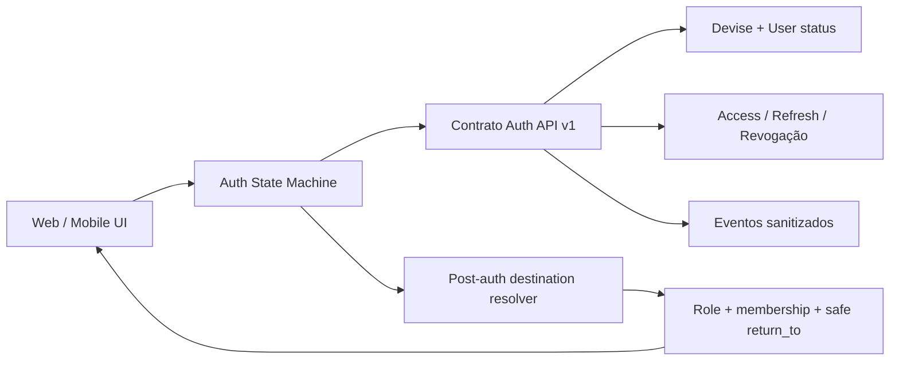
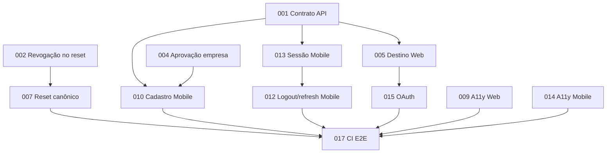

# PDR + Tasks + Suíte de Testes — Autenticação E2E A++++

**Status:** Pronto para refinamento e implementação  
**Versão:** 1.0  
**Data:** 5 de agosto de 2026  
**Origem:** `docs/audits/AUDITORIA_E2E_AUTENTICACAO_A++++_2026-08-05.md`  
**Escopo:** API Rails, Web Next.js, Mobile Expo, OAuth, autorização e CI  
**Público:** Produto, Engenharia, Segurança, QA, Design e SRE

---

# Parte I — PDR

## 1. Visão geral

### 1.1 Problema

O Avalia Solar possui controles sólidos no backend, porém os clientes Web e Mobile implementam contratos e máquinas de estado divergentes. Isso gera redirecionamento incorreto por papel, dois fluxos incompatíveis de reset, cadastro Mobile inválido, recuperação Mobile simulada, logout Mobile sem revogação e cobertura E2E insuficiente.

### 1.2 Objetivo

Entregar um fluxo único, seguro, acessível e testável de autenticação em todos os canais, no qual:

- o backend seja a fonte de verdade de identidade, sessão e autorização;
- Web e Mobile compartilhem o mesmo contrato de estados e erros;
- cada canal possua um único orquestrador pós-autenticação;
- tokens nunca apareçam em path, query, analytics ou logs;
- cadastro, aprovação, confirmação e vínculo sejam estados explícitos;
- logout e troca de senha revoguem sessões conforme política definida;
- as jornadas críticas sejam verificadas automaticamente no CI.

### 1.3 Métricas de sucesso

| Métrica | Meta de aceite |
|---|---:|
| Cenários críticos automatizados | 22/22 verdes |
| Redirecionamentos pós-login por ação | exatamente 1 |
| Contratos de autenticação por canal | 1 contrato compartilhado |
| Fluxos Web de redefinição | 1 rota canônica |
| Recuperações Mobile simuladas | 0 |
| Logouts Mobile com revogação remota | 100% quando online |
| Violações críticas de acessibilidade nas telas auth | 0 |
| Tokens em URL/log/telemetria | 0 |
| Flakiness permitida na suíte crítica | < 1% em 30 execuções |

Métricas de negócio como conversão ou abandono devem ser medidas após o baseline; este PDR não inventa metas sem dados históricos.

## 2. Princípios

1. **Servidor decide acesso:** gates de frontend melhoram UX, nunca substituem Rails/Pundit.
2. **Uma máquina de estado:** `anonymous`, `authenticating`, `confirmation_required`, `pending_approval`, `authenticated`, `refreshing`, `offline`, `expired`, `blocked`.
3. **Uma navegação pós-auth:** nenhuma tela e nenhum contexto navegam simultaneamente.
4. **Segredo fora da URL:** reset e confirmação usam fragmento apenas para transporte inicial e header/body para API.
5. **Erro transitório não encerra sessão:** timeout/offline difere de 401/403.
6. **Anti-enumeração:** recuperação e reenvio nunca confirmam existência de conta.
7. **Observabilidade sem credenciais:** IDs de correlação, códigos e duração; nunca token/senha.
8. **Acessibilidade por contrato:** labels, foco, anúncios, teclado e alvos de toque fazem parte do pronto.

## 3. Escopo

### 3.1 Incluído

- Login por e-mail/senha Web e Mobile.
- Google, Facebook e LinkedIn na Web.
- Cadastro `review` e `company` Web/Mobile.
- Confirmação e reenvio de e-mail.
- Aprovação, rejeição, bloqueio e vínculo empresarial.
- Recuperação e redefinição de senha.
- Access/refresh, rotação, expiração, revogação e logout global.
- Destino pós-login e `return_to` seguro.
- Guards por papel e estado.
- Acessibilidade das telas de autenticação.
- Testes RSpec, Jest/RTL, Playwright, Jest Expo e Maestro.
- Eventos operacionais e analytics sem PII sensível.

### 3.2 Fora do escopo

- MFA/passkeys.
- Login social nativo no Mobile.
- Troca do Devise/JWT por Better Auth.
- Unificação de `AdminUser` com `User(role=admin)`.
- Redesenho visual amplo das telas.
- WhatsApp como canal de recuperação.

## 4. Personas e jornadas

| Persona | Necessidade | Destino esperado |
|---|---|---|
| Visitante | autenticar e voltar ao contexto original | `return_to` autorizado |
| Consumidor `review` | avaliar, negociar e gerenciar perfil | `/review-dashboard` |
| Empresa sem vínculo | solicitar/selecionar acesso | `/select-company` |
| Empresa com vínculo | gerenciar a empresa ativa | `/dashboard?company_id=:id` |
| Admin API | acessar capacidades administrativas permitidas | rota administrativa definida |
| AdminUser | usar ActiveAdmin | `/admin` via sessão própria |

## 5. Arquitetura-alvo



### 5.1 Contrato de resposta

Todas as ações devem responder no formato:

```json
{
  "code": "AUTHENTICATED",
  "message": "Sessão iniciada.",
  "state": "authenticated",
  "user": {},
  "next_action": "open_review_dashboard",
  "context": {
    "active_company_id": null,
    "memberships": []
  }
}
```

Erros usam HTTP adequado e o mesmo envelope, sem detalhes internos. O token no JSON deve permanecer apenas enquanto necessário ao Mobile/realtime; Web usa cookies HttpOnly.

### 5.2 Estados e ações seguintes

| Estado | Código | Próxima ação permitida |
|---|---|---|
| Não autenticado | `NOT_AUTHENTICATED` | login/cadastro/reset |
| Confirmação necessária | `EMAIL_NOT_CONFIRMED` | reenviar confirmação |
| Aguardando aprovação | `USER_NOT_APPROVED` | informar espera/suporte |
| Rejeitado | `USER_REJECTED` | suporte/reconsideração |
| Bloqueado | `USER_BLOCKED` | suporte |
| Autenticado review | `AUTHENTICATED` | dashboard review/return seguro |
| Empresa sem vínculo | `COMPANY_ACCESS_REQUIRED` | selecionar/solicitar empresa |
| Empresa com vínculo | `AUTHENTICATED` | dashboard da empresa |
| Sessão expirada | `SESSION_EXPIRED` | login preservando contexto seguro |
| Offline com sessão local | `OFFLINE_SESSION` | UI limitada + tentar novamente |

## 6. Requisitos funcionais

### AUTH-RF-001 — Orquestrador único pós-login

- `login()` autentica e retorna resultado; não navega internamente.
- Um único resolver escolhe destino usando papel, vínculos e `return_to` relativo.
- `return_to` absoluto, `//host`, auth route, rota incompatível ou loop é rejeitado.
- Há exatamente uma chamada de navegação por sucesso.

### AUTH-RF-002 — Destino por papel

- `review` → `return_to` compatível ou `/review-dashboard`.
- `company` com vínculo → empresa ativa e dashboard correspondente.
- `company` sem vínculo → `/select-company`.
- `admin` → destino explicitamente definido, nunca fallback acidental.

### AUTH-RF-003 — Sessão Web confiável

- Ausência de `session_hint` não invalida cookie HttpOnly.
- Rota protegida força validação real da sessão.
- Middleware é gate otimista; API continua a barreira definitiva.
- 401/refresh inválido limpa sessão; timeout/offline não.

### AUTH-RF-004 — Refresh e rotação

- Access expira em 15 minutos e refresh em 30 dias, salvo ADR posterior.
- Refresh rotaciona uma única vez sob concorrência controlada.
- Falha definitiva produz `SESSION_EXPIRED`; falha transitória é recuperável.

### AUTH-RF-005 — Logout atual e global

- Web e Mobile chamam `/auth/logout` antes da limpeza local quando online.
- Limpeza local ocorre mesmo se a chamada remota falhar.
- `logout_all` fica disponível na gestão de sessão.
- Tokens revogados são recusados imediatamente.

### AUTH-RF-006 — Redefinição canônica

- Única rota Web: `/reset-password#token=...`.
- Token é removido da barra antes de chamadas externas.
- API recebe token por Bearer/body.
- Rota dinâmica e query string não processam segredo.
- Sucesso adota uma decisão única: auto-login ou voltar ao login. Este PDR recomenda auto-login com revogação das sessões antigas.

### AUTH-RF-007 — Política única de senha

- Mínimo 8 caracteres, uma maiúscula, uma minúscula e um número.
- Mesma validação em Rails, Web e Mobile.
- Checklist é apresentado antes do submit.
- Erro nunca informa se outra conta usa senha semelhante.

### AUTH-RF-008 — Cadastro `review`

- Payload contém nome, e-mail, senha/confirmação, cidade quando exigida e aceite versionado dos termos.
- Sucesso retorna `confirmation_required`, sem sessão utilizável.
- Confirmação ativa a conta e segue política de auto-login.

### AUTH-RF-009 — Cadastro `company`

- E-mail corporativo é validado no backend, não apenas no cliente.
- Cadastro retorna `pending_approval`, sem sessão utilizável.
- Aprovação dispara confirmação quando aplicável.
- Após confirmação, vínculo/seleção de empresa é obrigatório.

### AUTH-RF-010 — Recuperação Mobile real

- Mobile chama `/auth/forgot_password` com e-mail.
- Remove promessa de WhatsApp/código.
- Resposta é neutra e idêntica para e-mail existente/inexistente.
- Funciona com loading, sucesso, offline, 422 e 429.

### AUTH-RF-011 — Contrato `/auth/me`

- Web e Mobile desembrulham o mesmo envelope `{user}`.
- GraphQL e REST retornam campos equivalentes.
- Fallback REST é testado com GraphQL indisponível.

### AUTH-RF-012 — OAuth consistente

- Google/Facebook/LinkedIn usam a mesma resolução de destino do login por senha.
- Preservação de contexto usa estado assinado/servidor, sem open redirect.
- Cancelamento, erro, pending, inactive e conta existente têm telas definidas.

### AUTH-RF-013 — Rotas canônicas

- Cadastro canônico: `/signup` ou `/register`; produto deve escolher um.
- Rotas antigas redirecionam sem perder parâmetros seguros.
- Links de login, recuperação e mailers usam somente rotas canônicas.

### AUTH-RF-014 — Acessibilidade

- Modal usa `dialog` ou contrato equivalente com foco contido e restaurado.
- Inputs têm labels persistentes e erros associados.
- Botões de senha têm nome acessível e alvo mínimo de 44 px.
- Loading, erro e sucesso são anunciados.
- Fluxo inteiro funciona por teclado e leitor de tela.

### AUTH-RF-015 — Observabilidade segura

- Eventos: tentativa, sucesso, falha por código, refresh, logout e etapa de cadastro.
- Nunca registrar senha, JWT, refresh, reset/confirmation token ou e-mail integral.
- Logs incluem request ID, canal, método, código, duração e papel após autenticação.
- Alertas distinguem aumento de 401, 403, 429, refresh failure e OAuth failure.

## 7. Requisitos não funcionais

- **Segurança:** OWASP ASVS nível 2 para sessão/autenticação aplicável.
- **Performance:** submit responde visualmente em até 100 ms; timeout explícito; sem retry de POST de login.
- **Resiliência:** rede offline não apaga token válido no Mobile.
- **Privacidade:** nenhum segredo em URL, analytics, Sentry ou console.
- **Compatibilidade:** Chrome, Safari, Firefox e Edge atuais; Android/iOS suportados pelo Expo SDK 56.
- **Qualidade:** TypeScript, ESLint, RuboCop e Brakeman verdes nas áreas alteradas.

## 8. Analytics

Eventos permitidos:

- `auth_login_started`, `auth_login_completed`, `auth_login_failed`.
- `auth_refresh_completed`, `auth_refresh_failed`.
- `auth_logout_completed`, `auth_logout_all_completed`.
- `auth_registration_started`, `auth_registration_submitted`.
- `auth_confirmation_resent`, `auth_password_reset_requested/completed`.

Propriedades: `channel`, `method`, `role`, `state`, `error_code`, `duration_bucket`, `request_id`. Não enviar e-mail, token, senha ou mensagem livre do provedor.

## 9. Rollout

1. Contrato e testes backend atrás de compatibilidade temporária.
2. Resolver Web e reset canônico.
3. Fluxos Mobile reais.
4. OAuth e rotas canônicas.
5. Acessibilidade/observabilidade.
6. Remover contratos/rotas legadas após telemetria sem uso.

Feature flags sugeridas: `auth_unified_destination`, `auth_canonical_reset`, `mobile_auth_v2`. Nenhuma flag pode reduzir a autorização no backend.

---

# Parte II — Backlog de implementação

## 10. Épicos e tasks

### Épico E1 — Contrato e segurança backend

#### AUTH-TASK-001 — Padronizar envelopes e estados da API

- **Prioridade:** P0 · **Estimativa:** 5 pontos · **Dependência:** nenhuma
- Alterar `AuthController` e serializers para `state`, `next_action` e contexto consistente.
- Manter compatibilidade de `user`/`token` durante migração.
- Specs de contrato para login, register, me, refresh, reset e confirmação.
- **Pronto quando:** Web/Mobile consomem tipos gerados/compartilhados e specs passam.

#### AUTH-TASK-002 — Revogar sessões antigas após reset

- **Prioridade:** P0 · **Estimativa:** 3 pontos
- Definir timestamp de revogação antes de emitir a nova sessão.
- Garantir que a sessão recém-emitida tenha `iat` posterior.
- Testar dois dispositivos e concorrência.

#### AUTH-TASK-003 — Validar e-mail corporativo no Rails

- **Prioridade:** P1 · **Estimativa:** 3 pontos
- Aplicar regra apenas ao cadastro `company`.
- Código de erro estável `CORPORATE_EMAIL_REQUIRED`.
- Testar domínios públicos, corporativos e normalização.

#### AUTH-TASK-004 — Formalizar aprovação → confirmação de empresa

- **Prioridade:** P0 · **Estimativa:** 5 pontos
- Service object transacional para aprovação.
- Disparar confirmação após aprovação se ainda não confirmada.
- Idempotência: aprovar duas vezes não envia sequência duplicada.

### Épico E2 — Web unificado

#### AUTH-TASK-005 — Resolver único de destino

- **Prioridade:** P0 · **Estimativa:** 5 pontos
- Extrair função pura `resolvePostAuthDestination`.
- Remover `router.push` de `AuthContext.login` ou da tela; manter apenas um dono.
- Incorporar vínculo ativo, papel e `return_to` seguro.

#### AUTH-TASK-006 — Corrigir validação de sessão/hint

- **Prioridade:** P0 · **Estimativa:** 3 pontos
- Hint vira otimização, não pré-condição.
- Rota protegida valida `/auth/me`/refresh.
- Diferenciar offline, expirado e anônimo.

#### AUTH-TASK-007 — Consolidar reset de senha

- **Prioridade:** P0 · **Estimativa:** 5 pontos
- Manter fragmento + Bearer.
- Desativar `[token]` sem logar/refletir segredo.
- Atualizar mailers, links e testes.

#### AUTH-TASK-008 — Unificar política de senha e rotas

- **Prioridade:** P1 · **Estimativa:** 3 pontos
- Checklist reutilizável e rota canônica de cadastro.
- Redirects das rotas legadas.
- Remover ou implementar “Lembrar-me”. Decisão recomendada: remover até existir política distinta.

#### AUTH-TASK-009 — Acessibilidade Web auth

- **Prioridade:** P1 · **Estimativa:** 5 pontos
- Dialog/focus trap, retorno de foco, `aria-live`, `aria-invalid`, `aria-describedby`.
- Botões de senha com nome e alvo adequados.
- Testes axe + teclado.

### Épico E3 — Mobile real

#### AUTH-TASK-010 — Corrigir cadastro Mobile

- **Prioridade:** P0 · **Estimativa:** 8 pontos
- Formulário completo, termos, confirmação e política de senha.
- Estados `confirmation_required` e `pending_approval`.
- Não salvar sessão antes de autenticação válida.

#### AUTH-TASK-011 — Recuperação Mobile integrada

- **Prioridade:** P0 · **Estimativa:** 3 pontos
- Remover timer e WhatsApp.
- Integrar API com estados offline/429/erro/sucesso.
- Corrigir import duplicado.

#### AUTH-TASK-012 — Logout e refresh Mobile

- **Prioridade:** P0 · **Estimativa:** 8 pontos
- Logout remoto best-effort + limpeza local.
- Refresh seguro com single-flight.
- Persistir somente material necessário em SecureStore.

#### AUTH-TASK-013 — Inicialização resiliente e `/auth/me`

- **Prioridade:** P0 · **Estimativa:** 5 pontos
- Desembrulhar `{user}`.
- Não apagar sessão em timeout/offline.
- Estado de retry e fallback GraphQL → REST.

#### AUTH-TASK-014 — Acessibilidade Mobile

- **Prioridade:** P1 · **Estimativa:** 5 pontos
- Labels, `accessibilityRole`, `accessibilityState`, autofill e foco em erros.
- Teclado, safe area e touch targets.

### Épico E4 — OAuth, observabilidade e CI

#### AUTH-TASK-015 — Unificar callback OAuth

- **Prioridade:** P1 · **Estimativa:** 5 pontos
- Mesmo resolver pós-auth.
- Estados pending/inactive/error/cancelamento.
- Contexto assinado e proteção contra open redirect.

#### AUTH-TASK-016 — Telemetria sanitizada

- **Prioridade:** P1 · **Estimativa:** 3 pontos
- Schema de eventos e redaction testada.
- Remover consoles que exibam payloads de auth.
- Dashboard/alertas operacionais.

#### AUTH-TASK-017 — Suíte crítica no CI

- **Prioridade:** P0 · **Estimativa:** 8 pontos
- Fixtures determinísticas e projetos Playwright/Maestro.
- Shards sem dependência de ordem.
- Artefatos sanitizados em falha.

#### AUTH-TASK-018 — Runbook e rollout

- **Prioridade:** P1 · **Estimativa:** 3 pontos
- Runbook de incidentes de login/OAuth/refresh.
- Plano de flags, rollback e remoção de legado.

## 11. Ordem recomendada



## 12. Definition of Done global

- Critérios da task cobertos por testes automatizados.
- Nenhum teste existente alterado apenas para aceitar comportamento incorreto.
- RSpec/RuboCop/Brakeman verdes para backend alterado.
- ESLint/typecheck/Jest verdes no Web/Mobile alterado.
- Playwright/Maestro das jornadas impactadas verdes.
- Sem token/senha em logs, snapshots, traces, vídeos ou screenshots.
- Documentação de contrato e runbook atualizados.
- PR descreve migração, rollback e compatibilidade.

---

# Parte III — Especificação da suíte de testes

## 13. Estratégia

```text
                    E2E Web/Mobile (22 jornadas)
                 Integração API + contratos + OAuth
              Componentes, stores, policies e services
           Funções puras: destino, senha, URL e estados
```

- Funções puras recebem maior cobertura e execução rápida.
- Request specs provam segurança e contrato no servidor.
- Component/integration tests provam estado e acessibilidade.
- E2E cobre somente jornadas e integrações que as camadas inferiores não garantem.

## 14. Ambientes e dados

### 14.1 Fixtures mínimas

| Fixture | Papel/estado | Vínculo |
|---|---|---|
| `review_confirmed` | review/active/confirmed | nenhum |
| `review_unconfirmed` | review/active/unconfirmed | nenhum |
| `company_pending` | company/pending | nenhum |
| `company_active_no_membership` | company/active/confirmed | nenhum |
| `company_member` | company/active/confirmed | member active |
| `company_owner` | company/active/confirmed | owner active |
| `user_blocked` | review/blocked | nenhum |
| `user_rejected` | company/rejected | nenhum |
| `api_admin` | admin/active/confirmed | n/a |
| `admin_user` | AdminUser ativo | n/a |

Factories devem gerar e-mails únicos por worker. Senhas ficam apenas no ambiente de teste e nunca em artefatos.

### 14.2 Matriz de execução

- Web desktop: Chromium obrigatório; Firefox/WebKit em smoke crítico.
- Web mobile: 375×812 e 320×568 para layout/foco.
- Mobile: Android obrigatório no PR; iOS em merge/nightly conforme capacidade.
- Backend: PostgreSQL + Redis reais no CI de autenticação.
- Relógio congelável para access/refresh/reset expiration.

## 15. Testes unitários Web

Arquivo sugerido: `AB0-1-front/__tests__/auth/post-auth-destination.test.ts`.

| ID | Caso |
|---|---|
| WEB-U-001 | review sem retorno → `/review-dashboard` |
| WEB-U-002 | company com vínculo → dashboard da empresa |
| WEB-U-003 | company sem vínculo → `/select-company` |
| WEB-U-004 | retorno relativo compatível é preservado |
| WEB-U-005 | URL absoluta, `//host`, auth loop e papel incompatível são recusados |
| WEB-U-006 | admin tem destino explícito |
| WEB-U-007 | resolver é puro e não chama router |

Outros unitários:

- policy de senha compartilhada;
- parser seguro de fragmento;
- redaction de tokens/PII;
- mapeamento de códigos API para estados de UI;
- `hasPossibleAuthSession` não decide autenticação sozinho.

## 16. Componentes Web — Jest/RTL

| ID | Componente/caso |
|---|---|
| WEB-C-001 | Login idle → loading → success; uma navegação |
| WEB-C-002 | 401 mostra credenciais inválidas sem enumerar usuário |
| WEB-C-003 | 403 confirmado/pending/blocked gera mensagem/ação correta |
| WEB-C-004 | reenvio de confirmação cobre sucesso e 429 |
| WEB-C-005 | dialog contém foco, Escape fecha e foco retorna |
| WEB-C-006 | revelar senha tem nome acessível e estado |
| WEB-C-007 | erros usam `aria-invalid`/`aria-describedby` |
| WEB-C-008 | forgot password mantém resposta neutra |
| WEB-C-009 | reset limpa fragmento antes do request |
| WEB-C-010 | token em query/path é recusado |
| WEB-C-011 | cadastro review retorna confirmação necessária |
| WEB-C-012 | cadastro company retorna aprovação pendente |

Executar `jest-axe` em login, cadastro, recuperação, reset e callback.

## 17. Request/service specs Rails

Arquivos sugeridos:

- `spec/requests/api/v1/auth_contract_spec.rb`
- `spec/requests/api/v1/auth_refresh_spec.rb`
- `spec/requests/api/v1/auth_password_reset_spec.rb`
- `spec/services/auth/post_auth_state_service_spec.rb`
- `spec/services/users/approve_company_user_spec.rb`

| ID | Caso esperado |
|---|---|
| API-001 | login válido emite access 15 min + refresh 30 dias |
| API-002 | access possui `typ`, `iat`, `jti`, `exp` |
| API-003 | credencial inválida e e-mail inexistente têm resposta indistinguível |
| API-004 | pending/rejected/blocked/unconfirmed não recebem sessão |
| API-005 | refresh válido rotaciona e revoga anterior |
| API-006 | dois refresh concorrentes não geram duas cadeias válidas |
| API-007 | refresh expirado/revogado retorna código estável |
| API-008 | logout revoga access e refresh e limpa cookies |
| API-009 | logout_all invalida dois dispositivos |
| API-010 | reset em header funciona; query é rejeitada |
| API-011 | reset revoga sessões anteriores e preserva a nova |
| API-012 | forgot/resend não enumeram conta |
| API-013 | cadastro review exige termos e confirmação |
| API-014 | cadastro company exige corporativo e fica pending |
| API-015 | aprovação company dispara confirmação idempotente |
| API-016 | `/auth/me` retorna envelope único |
| API-017 | 429 contém `Retry-After` e código estável |
| API-018 | token adulterado/algoritmo inválido é recusado |
| API-019 | token revogado é recusado em endpoint protegido |
| API-020 | policy impede acesso a empresa de outro tenant |

## 18. Testes Mobile — Jest Expo

| ID | Caso |
|---|---|
| MOB-U-001 | login salva token somente após sucesso autenticado |
| MOB-U-002 | cadastro confirmation/pending não salva token |
| MOB-U-003 | logout chama API e sempre limpa SecureStore |
| MOB-U-004 | offline no logout limpa local e não trava |
| MOB-U-005 | initialize 401 remove token |
| MOB-U-006 | initialize timeout/offline preserva token e expõe retry |
| MOB-U-007 | GraphQL falha e REST `{user}` é desembrulhado |
| MOB-U-008 | refresh single-flight evita tempestade de requests |
| MOB-U-009 | forgot chama API real e copy não promete WhatsApp |
| MOB-U-010 | 429 apresenta orientação recuperável |
| MOB-U-011 | labels e accessibility states estão presentes |
| MOB-U-012 | role admin não é rotulado como consumidor |

## 19. E2E Web — Playwright

Arquivos sugeridos:

- `tests/e2e/auth/login.spec.ts`
- `tests/e2e/auth/registration.spec.ts`
- `tests/e2e/auth/password-reset.spec.ts`
- `tests/e2e/auth/session.spec.ts`
- `tests/e2e/auth/oauth.spec.ts`
- `tests/e2e/auth/accessibility.spec.ts`

| ID | Jornada | Asserções principais |
|---|---|---|
| AUTH-001 | rota protegida → login → retorno | parâmetro seguro, uma navegação, contexto preservado |
| AUTH-002 | review login | termina apenas em review dashboard |
| AUTH-003 | company com vínculo | empresa ativa correta e sem acesso cruzado |
| AUTH-004 | company sem vínculo | select-company |
| AUTH-005 | admin API | destino/menu definidos |
| AUTH-006 | senha inválida | alerta acessível e sem navegação |
| AUTH-007 | não confirmado | reenvio + resposta neutra + 429 |
| AUTH-008 | pending/rejected/blocked | estado correto e nenhum cookie de sessão |
| AUTH-009 | access expirado | refresh transparente e rotacionado |
| AUTH-010 | refresh revogado | login com motivo session_expired |
| AUTH-011 | logout | endpoint seguinte retorna 401 |
| AUTH-012 | logout global | dois contextos perdem acesso; novo login funciona |
| AUTH-013 | reset fragmento | URL limpa, nova senha, auto-login |
| AUTH-014 | reset query/path | recusado e sem request contendo segredo em URL |
| AUTH-015 | OAuth providers | sucesso/cancelamento/erro/pending/inactive via stub controlado |
| AUTH-016 | cadastro review | confirmação e primeiro login |
| AUTH-017 | cadastro company | aprovação, confirmação, vínculo e primeiro acesso |
| AUTH-021 | acessibilidade | teclado, foco, axe e reduced motion |
| AUTH-022 | open redirect | entradas maliciosas recusadas |

OAuth E2E não deve depender de contas Google/Facebook/LinkedIn reais no PR. Usar provider fake em test ou stub no callback; smoke real fica manual/ambiente seguro.

## 20. E2E Mobile — Maestro

Flows sugeridos:

- `.maestro/auth-login-review.yaml`
- `.maestro/auth-login-company.yaml`
- `.maestro/auth-register-review.yaml`
- `.maestro/auth-register-company.yaml`
- `.maestro/auth-forgot-password.yaml`
- `.maestro/auth-session-persistence.yaml`
- `.maestro/auth-logout.yaml`
- `.maestro/auth-offline.yaml`

| ID | Jornada |
|---|---|
| AUTH-018 | abrir offline com sessão válida → estado offline + retry; token preservado |
| AUTH-019 | logout Mobile → SecureStore limpo e token recusado pela API |
| AUTH-020 | recuperação Mobile → request real e resposta neutra |

Adicionar ainda login por papel, cadastro confirmation/pending, persistência após relaunch e expiração. Cada flow deve criar/receber fixture determinística; remover credencial fixa `test@example.com/password123`.

## 21. Testes de segurança

- Open redirect com esquemas, backslashes, encoding duplo e `//`.
- JWT adulterado, expirado, algoritmo inesperado e `typ` incorreto.
- Replay de refresh rotacionado.
- Reset/confirmation token em query/path/referrer/log.
- Enumeração por status, corpo, tempo e rate limit.
- Fixação de sessão antes/depois do login.
- CSRF em endpoints autenticados por cookie conforme arquitetura API.
- IDOR entre empresas e memberships inativos.
- Redaction de Sentry, PostHog, Rails logs, Playwright trace e Maestro artifacts.

Executar Brakeman e testes de request; pentest manual fica como gate de release, não substitui automação.

## 22. Pipeline CI

### Pull request

1. Backend auth specs + RuboCop + Brakeman.
2. Web lint/typecheck/Jest auth.
3. Mobile lint/typecheck/Jest auth + `ui-audit`.
4. Playwright Chromium: AUTH-001–014, 016–017, 021–022.
5. Maestro Android smoke: login, recuperação e logout.

### Merge/main

- Matriz Playwright Chromium/Firefox/WebKit.
- Maestro Android completo.
- Testes Redis/Postgres reais de refresh/revogação.

### Nightly

- iOS Maestro.
- Repetição 10× da suíte de concorrência/refresh para detectar flakiness.
- Lighthouse/a11y das telas públicas de autenticação.

## 23. Gate de aprovação

O pacote só pode ser encerrado quando:

- AUTH-TASK-001–017 concluídas ou explicitamente replanejadas com risco aceito;
- AUTH-001–022 verdes;
- nenhuma credencial aparece nos artefatos do CI;
- os fluxos antigos de reset/cadastro não recebem tráfego ou possuem redirect seguro;
- Produto, Segurança e QA aprovam a máquina de estados;
- rollback foi ensaiado em staging;
- documentação operacional e contrato da API estão publicados.

## 24. Rastreabilidade auditoria → requisito → task → teste

| Achado da auditoria | Requisito | Tasks | Testes |
|---|---|---|---|
| C1 duplo redirect | RF-001/002 | 005 | WEB-U-001–007, AUTH-001–005 |
| C2 token em path | RF-006 | 002/007 | API-010/011, AUTH-013/014 |
| C3 cadastro Mobile | RF-008/009 | 001/004/010 | MOB-U-002, AUTH-016/017 |
| C4 recuperação simulada | RF-010 | 011 | MOB-U-009/010, AUTH-020 |
| M1 logout Mobile | RF-005 | 012 | MOB-U-003/004, AUTH-019 |
| M2 middleware otimista | RF-003 | 006 | AUTH-001/009/010 |
| M3 session hint | RF-003 | 006 | unitários hint + AUTH-009 |
| M5 OAuth divergente | RF-012 | 005/015 | AUTH-015 |
| M6 senha inconsistente | RF-007 | 008/010 | unitários senha + API-013/014 |
| M7 aprovação company | RF-009 | 004 | API-015, AUTH-017 |
| M8 offline apaga sessão | RF-003/011 | 013 | MOB-U-005/006, AUTH-018 |
| M9 envelope `/me` | RF-011 | 001/013 | API-016, MOB-U-007 |
| Acessibilidade | RF-014 | 009/014 | WEB-C-005–007, AUTH-021 |

---

**Decisão recomendada:** iniciar pelas tasks 001, 002, 004 e 005. Elas estabilizam o contrato, a segurança do reset, o estado empresarial e a navegação; implementar Mobile ou ampliar E2E antes disso automatizaria contratos que ainda divergem.
